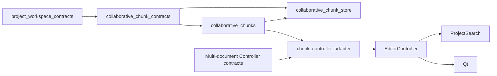

# 协作 Chunk 设计

## 概述

本设计在已完成 C2 的 `ProjectWorkspace` 之上增加一个可选协作视图。工作区仍是 Project/Document/Segment、source/target/confirmed、dirty、reconciliation 和 ProjectPackage 的唯一权威；Chunk 只保存对 exact segment identity 的引用，并在这些引用上定义分工拓扑、assignment、permission 和 progress。

本设计不将 Document 投影为 chunk，不复制 ProjectPackage manifest，不把 source/target 正文放入 chunk metadata，也不把未来 sync provider 设为 membership/permission authority。连续选区只是创建命令的 UI/Application 输入；一旦发布，membership 只由 exact Segment_Ref 集合表达。

语义权威关系为：

```text
ProjectWorkspace / ProjectPackage
  project/document/segment identity, content, reconciliation, save
                 │ frozen workspace snapshot + revision + identities
                 ▼
Collaborative Chunk Domain
  plan/chunk identity, membership, split/merge, assignment,
  permission, progress, rebase, audit/undo
                 │ frozen projections / issued capabilities
        ┌────────┼────────┐
        ▼                        ▼
Controller/Search              Local Chunk Metadata Store
        │                        │ exact namespaced snapshot
        ▼                        └────> future Sync transport
Qt                                   (opaque transfer only)
```

### 设计目标

- 冻结不依赖 Document 名、顺序、物理路径或正文的 chunk identity/membership。
- 以不重叠 partial partition 表达 v1 协作分工，显式保留 Unallocated。
- 将 create/split/merge/move/dissolve/rebase 建模为 exact revision-bound 原子变更。
- 分离“外部身份验证”与“chunk 领域权限决策”，不在 metadata 中保存凭据。
- 使越出 current chunk 的项目内容仍可导航/搜索，但所有变更入口实际 fail closed。
- 从 current workspace 派生 chunk progress，不持久可漂移计数。
- 以独立 namespaced metadata、digest chain、receipt 和 current-head undo 建立本地可审计闭环。
- 为未来 sync 提供可验证的 opaque snapshot/apply seam，但不提前决定 provider 或 ProjectPackage extension。

### 非目标

- 不创建、修改、重铸或删除 Project/Document/Segment identity。
- 不解析 source origin、Parser terminal、format metadata、ProjectPackage ZIP/manifest 或 `codec_private_member`。
- 不保存或传输 ProjectPackage，不将 chunk metadata 写入封闭的 ProjectPackage v1。
- 不实现账号系统、凭据库、组织目录、provider、远端锁、实时 presence、OT/CRDT 或聊天。
- 不实现同一 segment 的重叠多写者、审校角色工作流、QA、TM/Fuzzy 或计费。
- 不替换多文档 C3/C4；Chunk C3/C4 只在上游 API 获批后做增量集成。

## Boundary Commitments（边界承诺）

### 本规格拥有

- `chunk_plan_id` / `chunk_id` 的签发、验证、退役和 lineage receipt。
- exact Segment_Ref membership、Unallocated 和不重叠不变量。
- create/rename/reorder/split/merge/move/dissolve/rebase 的领域语义。
- assignee 关系、current-chunk edit decision、越界只读 reason。
- chunk progress 的派生投影。
- namespaced chunk metadata logical schema、本地原子发布、审计 receipt、divergence 与 current-head undo。
- 明选 active chunk 的最小 `ChunkScopeProjection`，只签发 exact membership 与 stale binding，不携带正文、导出或 carrier 语义。
- `current_chunk` 的新版 search scope 语义和 Qt 协作投影。

### 保留在既有或未来 owner

| Owner | 保留权威 |
|---|---|
| `multi-document-project-workspace` | Project/Document/Segment identity、workspace revision、source presence/reconciliation、content/progress、dirty/save/recovery、ProjectPackage |
| Parser / Codec | 单输入 grammar、source snapshot、writer capability、opaque private payload |
| Identity/Auth owner | principal 创建、认证、credential、actor session issuance 的根信任 |
| `cross-device-sync-plugin` | provider、remote listing/conditional transfer、credential/encryption、远端传输冲突编排 |
| TM/术语资源层 | managed resource identity、canonical records/snapshot 与匹配 |
| `tmx-context-interchange` | TMX payload grammar、inclusion/loss、resource/project/chunk adaptation 与 direct `.tmx` publication |
| `language-resource-portability` | 单 managed-resource ResourcePackage carrier、preview/apply/receipt/cold reopen；不包装 project/chunk scope |
| Integration TM surface | CONTEXT 与“上下文一致”标签 |
| Future collaboration review | reviewer/QA/重叠 scope/实时活动 |

### 禁止进入 chunk metadata

- source、target、speaker、TM suggestion/evidence、term hit 或 QA payload；
- Document display name/source_ref 作为身份的副本；
- ProjectPackage artifact path/ZIP member/manifest raw JSON；
- codec identity 的 private payload、writer token 或 source binding；
- 绝对路径、provider URL、credential、cookie、device key 或 Fuzzy qualification；
- 不可验证的 display-only assignee 作为权限主体。

## Governance Impact（治理影响）

- **Applicable Steering**：`product.md`、`structure.md`、`tech.md`、`roadmap.md`、`spec-ownership.md`。本轮只读调研，不在本 spec-only 提升中改写 Steering。
- **Applicable ADRs**：ADR-018 冻结 ProjectPackage/Chunk 分权与完整 C2 启动门；ADR-019 冻结 ProjectPackage v1 物理闭集，Chunk 不得直接读写该 ZIP。
- **ADR disposition**：当前设计均在 Chunk 领域内，不新建 ADR。若改为写入 ProjectPackage v1、重叠多写者或跨端自动语义 merge，则必须先有后继 ADR。
- **Steering sync**：spec ownership/border 记录长期责任边界；`structure.md`/`tech.md` 在真实 runtime 文件落地后同步。

## Critical Path 与验证锚点

```text
Multi-Document C2A + C2B + C2C complete
  → Chunk C0 R/D/T + boundary baseline
    → Chunk C1 identity/membership/topology/local metadata
      → Chunk C2 assignment/permission/progress/rebase

Multi-Document C3 complete ─────────┐
                                        ├→ Chunk C3 Controller/search/conflict/undo
Chunk C1/C2 complete ─────────────┘

Multi-Document C4 complete + Chunk C3 complete
  → Chunk C4 Qt/current-source acceptance
```

隐性依赖：

1. Split/merge 验收不只依赖 ID type，还依赖 C2A 已冻结 removed/detached/stale semantics；否则 membership 无法安全 rebase。
2. Chunk metadata 冷重开需要 C2C 的真实 ProjectPackage 先冷开并建立 current Segment Universe；不能用自建扁平 fixture 代替。
3. `current_chunk` 搜索必须消费 Multi-Document C3 的 composite hit identity 和 matcher seam，不得对当前单 `EditorProject` search 另建并行权威。
4. Qt 只读验收必须证明 Controller 的 mutation API 也拒绝越界写；只看到 disabled widget 不算通过。

| Cluster | 验证目标 | 必要前置能力 |
|---|---|---|
| C0 | R/D/T/research 与 C2/ADR-018/019 一致，production/tests/Steering 零 diff | 完整 Multi-Document C2 |
| C1 | 真实双 Document package 冷开后，跨文档连续/离散 membership 经 rename/reorder/reopen 不变，split/merge 失败零部分发布 | C2 workspace identity/package |
| C2 | 只有 assigned actor + active current chunk 可改 target/confirmed，detached/outside 只读，progress 只统计 exact members | C1 plan/revision/store，C2A reconciliation facts |
| C3 | `current_chunk` 复用同一 matcher，entire-project hit 携带权限，stale/diverged/undo 不改 workspace | Multi-Document C3 + Chunk C2 |
| C4 | 真实 Qt journey 可创建/分配/切换/只读/撤销，无账号/provider越界 | Multi-Document C4 + Chunk C3 |

## 架构

### 分层与依赖方向



- `collaborative_chunk_contracts.py` 可以导入 workspace 的 exact `SegmentIdentity`/`SourcePresence` 叶值，不导入 `project_package.py`、Parser、Controller、Qt、TM 或 provider。
- `collaborative_chunks.py` 只消费 caller-provided frozen workspace projection，拥有 topology/rebase/permission/progress 和 private single-use plans，不打开项目文件或 metadata target。
- `collaborative_chunk_store.py` 拥有 chunk metadata canonical codec、rooted local publication/LKG/readback 和 audit chain，不拥有项目包保存或远端传输。
- `chunk_controller_adapter.py` 是 Multi-Document Controller 与 chunk domain 的唯一组合边界；它不重新计算 membership/permission。
- `project_search.py` 只在 Multi-Document C3 已批准的 versioned scope 上增加 `current_chunk`，仍把文本匹配交给同一 Core matcher。
- Qt 只消费 Controller frozen projections/capabilities，不导入 contracts store 或解析 metadata JSON。

### 文件结构计划

| 文件 | 单一责任 | 首次落地 |
|---|---|---|
| `collaborative_chunk_contracts.py` | frozen plan/chunk/member/assignee/preview/receipt/progress/permission contracts 与 stable codes | C1 |
| `collaborative_chunks.py` | identity issuance、invariants、topology mutation、rebase、permission/progress 领域服务 | C1/C2 |
| `collaborative_chunk_store.py` | namespaced metadata canonical codec、local candidate/LKG/publication/readback/audit | C1 |
| `chunk_controller_adapter.py` | actor/current-chunk issued capability、Controller command/projection adapter | C3 |
| `project_search.py` | 在获批 Multi-Document scope contract 上消费 exact chunk membership | C3 |
| `editor_controller.py` | 组合 workspace/chunk session，所有 target/confirmed mutation 的 permission gate | C3 |
| `qt_editor_window.py` / 经批准 Qt view modules | chunk selector/manager/progress/read-only/conflict/undo 反馈 | C4 |

文件名属于 Design 级所有权。实施可在不改变 authority/import 方向的前提下合并纯 helper，但不得把 chunk grammar 放进 `project_package.py`或让 Qt 解码 metadata。

## C1：身份、Membership 与 Topology

### 核心合同

```python
@dataclass(frozen=True, slots=True)
class AssigneeRef:
    authority_id: str
    subject_id: str

@dataclass(frozen=True, slots=True)
class ChunkSegmentRef:
    project_id: str
    identity: SegmentIdentity

@dataclass(frozen=True, slots=True)
class CollaborativeChunk:
    chunk_id: str
    name: str
    order: int
    members: tuple[ChunkSegmentRef, ...]
    assignee: AssigneeRef | None

@dataclass(frozen=True, slots=True)
class ChunkPlanSnapshot:
    schema_version: int
    namespace: str
    chunk_plan_id: str
    project_id: str
    revision: int
    segment_universe_digest: str
    chunks: tuple[CollaborativeChunk, ...]
    audit_head_digest: str

@dataclass(frozen=True, slots=True)
class ChunkScopeProjection:
    project_id: str
    chunk_plan_id: str
    plan_revision: int
    plan_digest: str
    segment_universe_digest: str
    chunk_id: str
    members: tuple[ChunkSegmentRef, ...]

@dataclass(frozen=True, slots=True)
class ChunkPlanBinding:
    project_id: str
    chunk_plan_id: str
    plan_revision: int
    plan_digest: str
    segment_universe_digest: str

class ChunkManagerCapability:
    # opaque, service-issued, single-use; topology/metadata only
    ...

class ChunkScopeProjectionService:
    def issue_scope_projection(
        self,
        explicit_chunk_id: str,
        expected_plan_binding: ChunkPlanBinding,
    ) -> ChunkScopeProjection: ...

    def revalidate_scope_projection(
        self,
        projection: ChunkScopeProjection,
    ) -> ChunkScopeProjection: ...
```

`ChunkScopeProjection` 是给后置消费者的唯一中立 membership seam。它必须包含明选 active chunk 的完整 exact members，包括 rebase 后仍保留的 detached refs；它不包含 source/target/speaker、workspace presence/order、assignee、permission、TMX/profile/carrier、destination、loss report 或 receipt。Workspace 用当前 project/session/revision join presence/content/navigation order；后续 payload owner 再决定 inclusion。Chunk 不签发 attached-only 导出集合，也不允许消费者从 `ChunkPlanSnapshot`、metadata store、search hits 或隐式 `current_chunk` UI state 重建范围。

`ChunkScopeProjectionService` 仍是 Chunk membership authority 的只读调用面，不是 export service。`issue_scope_projection()` 只接受用户/Controller 明选的 active chunk 与 expected project/plan/revision/digest/universe binding；`revalidate_scope_projection()` 在后续 publication 前由同一 owner 复验 active/non-retired chunk、完整 members 与全部 binding，成功时返回 exact current projection 供调用方比较。任一 stale/retired/foreign/membership drift 都 body-safe fail closed；调用方不因此取得 plan/store/metadata reader，也不能把 revalidate 结果当作 payload 或 destination authorization。

v1 exact namespace 候选为 `localcat.collaboration.chunks.v1`。`ChunkSegmentRef.project_id` 与 plan project id 必须 exact equality；它使可移植 metadata 的每个引用自包含项目边界，但不形成第二种 Segment identity。领域比较仍使用上游 exact `SegmentIdentity`。

`AssigneeRef` 与 `CollaborativeChunk.assignee` 在 C1 只冻结 future-compatible shape，不激活 assignment 语义。C1 的阶段不变量是：

1. create、strict decode、preview/candidate、persist、cold readback/cold reopen 得到的每个 active chunk 都必须 `assignee=None`；
2. C1 的所有 public preview/receipt/audit assignment counts 都必须为 `0`；
3. 任一 non-null assignee、任一 assignment count `> 0`，以及 assign/reassign/unassign command，必须在创建 private candidate 或到达任何 publication point **之前** fail closed：非法状态使用 `CHUNK.CONTRACT_INVALID`，C1 assignment command 使用 `CHUNK.ASSIGNMENT_UNAVAILABLE`；plan、store、LKG、audit、workspace 均零 mutation；
4. C1 split children 与 merge result 一律强制 `assignee=None`。parent assignee 预填、child/result assignee 选择和任何 inheritance policy 只从 C2 assignment preview 起生效，不得由 C1 UI/Application/Core 偷跑。

不变量：

1. `chunk_plan_id = "cpl-" + 64 lowercase hex`；`chunk_id = "chk-" + 64 lowercase hex`。生产使用密码学随机因子加 domain-separated SHA-256，tests 可注入 deterministic issuer。
2. plan revision 从 1 开始严格单调；撤销也创建新 revision，不回退。
3. chunks 的 `order` 为 `0..n-1`，只影响视图，不参与身份。
4. 每个 active chunk 至少一个 member，members 为 exact tuple，按 `(document_id UTF-8 bytes, length-prefixed local_segment_id UTF-8 bytes)` 的 canonical order 持久，不依赖 workspace display order。
5. 同一 plan 的 active member refs 全局唯一，且都存在于当前 compatible Segment Universe；Unallocated 是 universe 减集的查询结果，不持久为特殊 chunk。
6. split/merge 退役旧 chunk IDs 并签发新 IDs，退役记录只在 audit lineage 中保留，不能被旧 capability 重新激活。
7. rename/reorder/assignment 不改 chunk ID；move-members 可修改既有 chunk membership，但必须换 plan revision，使所有旧 edit capabilities stale。

### Segment Universe Digest

`segment_universe_digest` 只绑定会影响 membership 可解析性的事实：

```text
SHA256(
  "localcat.chunk.segment-universe.v1\0" ||
  length_prefixed(project_id) ||
  canonical_sort(
    length_prefixed(document_id) ||
    length_prefixed(local_segment_id) ||
    source_presence_tag
  )
)
```

它不包含 source/target/speaker/confirmed、Document order/display name、workspace revision、ProjectPackage artifact/content digest 或绝对路径。因此：

- target/confirmed 编辑和 rename/reorder 不触发 rebase；
- `source_changed` 只要 exact identity/presence 不变就保留 membership；
- new/removed 或 attached↔detached 会改变 universe digest，要求 Chunk rebase。

command 仍额外绑定当前 workspace session/revision，用于防止用户预览期间任何状态切换。持久 compatibility 使用 universe digest，避免每次 target keystroke 都使整个 plan 无效。

### C1 最小 Management Capability Substrate

C1 的 topology 两阶段事务不能在没有授权边界时先行实施，因此 C1 同步落地一个最小的 private management handle 组合与 service-issued `ChunkManagerCapability`。它只绑定 project/workspace session、plan id/revision/digest、operation class 与 single-use nonce，仅允许 create/rename/reorder/split/merge/move/release/dissolve 及 metadata publication。

这不是 account/auth 系统：C1 current-source harness 只能使用诚实标记的 local/reference manager handle，不持久 credential/display label，不签发 assignment 或 target/confirmed edit capability。C2 再把外部 authenticated actor port、assignee 与 edit capability 组合到该基座上；manager 始终不因拥有 topology capability 而获得项目编辑权。

### Topology mutation 两阶段事务

所有 topology 变更使用同一个模式：

```text
current workspace projection + current ChunkPlanSnapshot
    + service-issued topology manager capability + exact command
      → validate identities/limits/union/disjoint/base bindings
      → private candidate + body-safe ChunkMutationPreview
      → revalidate workspace/session/plan/manager capability
      → atomically publish metadata candidate
      → cold readback + ChunkOperationReceipt
```

public preview 只含 operation/action、project/plan/revision/digests、affected chunk IDs、member/assignment 数量、safe warnings/blockers，不包含正文。Private plan 由 service 实例保存且一次消费；伪造 public dataclass 不授权 apply。

在 C1，上一段所述 assignment 数量只能是 `0`。decoder、domain validation 与 store publication 必须分别执行该阶段约束，不能依赖某一层已清洗输入；拒绝必须早于 private candidate、journal/LKG、atomic replace 或 audit append。

#### Create

- requested members 必须全部 attached、存在且 Unallocated；
- 连续选区由 Application 在当前 workspace flat view 上先解析为 exact tuple，domain 不接受持久 index range；
- 成功一次签发 chunk ID、密集 order 和 new revision。

#### Split

- 输入为一个 active chunk 和至少两个显式 child member sets；
- children 都非空、两两不交叉、exact union 等于 parent；
- parent 退役，children 获得新 ID，从 parent order 位置连续插入；
- C1 children 全部强制 `assignee=None`，preview 的 child assignment counts 为 `0`；non-null child assignee 在 candidate/publication 前零 mutation 拒绝。

#### Merge

- 输入至少两个 active chunk IDs，结果 membership 是 exact union；
- 结果 order 使用源 chunks 最小 order 位置，其他顺序稳定压缩；
- 所有源 IDs 退役，结果获得新 ID；
- C1 result 强制 `assignee=None`，preview 的 result assignment count 为 `0`；任何 result assignee 选择输入在 candidate/publication 前零 mutation 拒绝。

#### Move / Release / Dissolve

- move 在一个 revision 内从源 chunk 取出 exact members 并放入目标 chunk 或 Unallocated；源留空时必须显式退役它，不保留空 active chunk。
- dissolve chunk 只退役协作对象并释放 members；dissolve plan 停用 chunk gate 并恢复既有个人编辑行为，但保留 audit receipt。
- 任何操作都不调用 workspace mutation/save/package API。

## Chunk Metadata v1 与本地发布

### Logical artifacts 与单一 store envelope

active-plan metadata 的 canonical UTF-8 JSON exact shape 为：

```json
{
  "schema": "localcat-collaborative-chunk-metadata-v1",
  "namespace": "localcat.collaboration.chunks.v1",
  "project_id": "prj-...",
  "chunk_plan_id": "cpl-...",
  "revision": 12,
  "segment_universe_digest": "...",
  "chunks": [
    {
      "chunk_id": "chk-...",
      "name": "Batch 1",
      "order": 0,
      "members": [
        {"document_id": "doc-...", "local_segment_id": "s1"}
      ],
      "assignee": null
    }
  ],
  "audit_head": "..."
}
```

根、chunk 与 member 均使用 exact keys；member 的 `project_id` 由根 project binding 提供，不重复持久。encoding 固定为 UTF-8、无 BOM/尾换行、sorted keys、`,`/`:` 无空白、`ensure_ascii=False`、禁止 NaN/Infinity，不做 Unicode normalization。decoder 拒绝 duplicate/extra/missing key、non-canonical bytes、bool-as-int、非法 UTF-8/surrogate、depth/byte/count 超限，并在构造后复验 snapshot semantic digest。Metadata 不存储 Unallocated，因为它可从 current Segment Universe 与 membership exact 差集派生。

C1 strict decoder 只接受上述 `assignee: null` 的 active chunks；字段缺失、object/non-null 值或任何派生 assignment count `> 0` 都在 candidate/publication 前拒绝，不能在 decode 后静默清空。C2 批准并实现后才以同一 versioned contract 的明确阶段迁移激活 non-null `AssigneeRef`。

retired chunk IDs、used plan IDs、audit generations 与 current-head previous snapshot 属于另一个 exact lifecycle artifact，不塞入 active-plan root。两个逻辑 artifact 由 Chunk owner 包进单一 `localcat-collaborative-chunk-store-v1` canonical envelope 一次发布：

```json
{
  "schema": "localcat-collaborative-chunk-store-v1",
  "active_metadata": {"schema": "localcat-collaborative-chunk-metadata-v1"},
  "lifecycle": {
    "schema": "localcat-collaborative-chunk-lifecycle-v1",
    "project_id": "prj-...",
    "retired_chunk_ids": [],
    "used_chunk_plan_ids": [],
    "audit_records": [],
    "head_previous_active_metadata": null
  }
}
```

`active_metadata` 可为 `null`，对领域/Controller 投影为“无 active plan”；物理 store 仍保留 lifecycle。每个不可复用的 `chunk_plan_id` 定义一个 audit generation，generation 的首条记录从 empty audit head/base revision 0 开始，generation 内 revision 与 digest chain 连续；dissolve 终结该 generation，后续新 plan 不续接旧 plan 的 head。flat `audit_records` 保持发布顺序，plan ID 同时是 generation identity，已终结 generation 不得再次出现。

### Local persistence

`CollaborativeChunkStore` 的 v1 发布协议：

```text
validate immutable snapshot
  → append complete audit record and head-previous snapshot inside candidate
  → canonical encode isolated store envelope
  → cold decode + digest/invariant/audit-chain validation
  → revalidate expected current metadata identity/digest
  → arm durable operation journal + exact LKG
  → same-parent atomic replace + parent durability
  → cold readback and verify the complete candidate generation
  → cleanup proof
```

该 store 可以复用已验证的 atomic write/digest/rooted-handle **低层原语**，但不导入 `project_package.py`、不调用 ProjectPackage save service、不共享 manifest/receipt/base class。本地 metadata target 由该 repository 自身的 caller-owned binding 决定，绝对路径不进入 logical snapshot。

首次发布 LKG 为 `None`。覆盖时保留 byte-exact old store envelope，直到新 active/lifecycle/audit head 全部冷读证明。audit record 在 candidate 内完成，replace 后不再追加第二份语义状态；若 replace 窗口中断，recovery 只在完整 candidate envelope 可证明时 roll-forward，否则以 exact LKG rollback。无法证明任一代时返回 recovery-required，不得猜测 mtime、删除 ProjectPackage、改 workspace dirty 或改成只读以外的更宽权限。

### Audit 与 undo

`ChunkAuditRecord` exact 包含：

- operation id/action/actor ref；
- project/plan id；
- base/published revision；
- before/after plan digest；
- previous audit head/current record digest、固定 outcome=`published`；
- affected active/retired/created chunk IDs 与 member/assignment counts；
- stable outcome/safe warnings。

record digest 覆盖上述全部权威字段（除 record digest 自身）；outcome 是 digest 中固定的 `published`，failed operation 不产生 record。stored record 必须完整且 `truncated=false`，candidate active audit head 必须等于同 generation 最新 record digest。audit record 不存正文或路径。Store 必须在 lifecycle 中保留 current head 可撤销的 exact previous active metadata，并保留 digest-chained records 直到 profile limit。物理 recovery LKG 只服务未完成 publication，成功后清理，不能充当 undo previous snapshot。v1 达到 audit/metadata limit 后拒绝新 mutation 并要求后续受治理的 archive/compaction，不得静默丢弃旧记录。

undo 只针对 current head：它校验 `requested_operation_id == audit_head.operation_id`、current plan digest/revision、workspace universe 与 previous snapshot 完整性，然后把 previous semantic snapshot 以新 revision 发布。这是新的 `undo` audit record，不删除或改写旧 record。v1 的 retired ID 仍为 append-only，因此若 current head 已退役 previous snapshot 中的 active ID（如 split/merge/dissolve/退役型 move/rebase），该 head 不可在 v1 复活，并以 `CHUNK.UNDO_UNAVAILABLE` 拒绝；支持范围是 rename/reorder/assign 以及不退役 ID 的变更。

## C2：Assignment、Permission、Progress 与 Rebase

### 身份与 capability 边界

Chunk 层不认证用户。C2 在 C1 已有 topology-only manager substrate 上增加身份 owner 窄 port：身份 owner 交付 private authenticated handle，Controller 再向 chunk session 换取 assignment/edit 所需的一次性 capability：

```python
class AuthenticatedActorPort(Protocol):
    def current_actor(self) -> AuthenticatedActorHandle: ...
    def revalidate_actor(self, handle: AuthenticatedActorHandle) -> AssigneeRef: ...

@dataclass(frozen=True, slots=True)
class AssigneeRef:
    authority_id: str
    subject_id: str

class ChunkActorCapability:
    # opaque, service-issued; not serializable
    ...
```

public `AssigneeRef` 可持久，private handle/capability 不可序列化。assign/reassign preview 只接受 identity owner 的 private handle，apply 在发布前再次调用同一 owner `revalidate_actor`；raw `AssigneeRef` 只是已持久 identity fact，不能作为新赋权输入。Capability 绑定 actor ref、project/session、plan id/revision/digest、current chunk ID、operation class 和 single-use/epoch。Display label 由 identity/UI owner 临时投影，不参与比较或权限。

当前产品没有多用户认证。Cluster 2 必须同时提供一个明示标记为 local/reference 的 actor port 供 current-source acceptance，不得把它宣称为安全账号系统或跨设备身份。未来真实 identity plugin 由独立 identity 规格实现该 port。

### v1 Assignment

- 每 chunk 零/一 assignee；一个 actor 可被分配多个 chunks。
- assign/reassign/unassign 是 plan mutation，必须 manager capability + two-phase preview/apply + metadata durable publication。
- assignment 变化换 plan revision，所有旧 edit/navigation mutation capability 立即 stale。
- C2 split children 都要在 preview 明示 final assignee/Unassigned；UI 可以预填 parent assignee，但 Core 不隐式继承，管理者必须确认。
- C2 merge 的 source assignees 不完全相同时，preview 必须要求管理者显式选择 result assignee/Unassigned；不依赖列表顺序、最近更新或多数猜测。
- topology 与 assignment 使用彼此不可代用的 sealed publication permit；assignment 事务只改变一个 active chunk 的 nullable assignee，保持 plan/chunk/member/universe identity exact，并经同一 metadata audit/store 发布。
- 权限不从 ProjectPackage、provider metadata、display name 或同字节 snapshot 自动获得。

### Permission decision

```python
class ChunkAccessKind(Enum):
    EDITABLE_ASSIGNED_CURRENT = "editable_assigned_current"
    READ_ONLY_NO_PLAN = "read_only_no_plan"          # only for chunk-gated mode
    READ_ONLY_NO_CURRENT_CHUNK = "read_only_no_current_chunk"
    READ_ONLY_UNALLOCATED = "read_only_unallocated"
    READ_ONLY_OUTSIDE_CURRENT = "read_only_outside_current"
    READ_ONLY_NOT_ASSIGNEE = "read_only_not_assignee"
    READ_ONLY_DETACHED = "read_only_detached"
    READ_ONLY_STALE = "read_only_stale"

@dataclass(frozen=True, slots=True)
class ChunkAccessDecision:
    project_id: str
    chunk_plan_id: str | None
    plan_revision: int | None
    plan_digest: str | None
    actor: AssigneeRef
    current_chunk_id: str | None
    segment: ChunkSegmentRef
    access: ChunkAccessKind
    may_edit_target: bool
    may_change_confirmed: bool
    safe_codes: tuple[str, ...]
```

具体规则：

1. 没有 active plan 时，chunk integration 完全 bypass，不改变既有 EditorController 权限。`READ_ONLY_NO_PLAN` 只用于显式请求 chunk-gated mode 但 plan 不可用的失败投影，不能误用来回归既有个人模式。
2. 明选 active current chunk 并进入 chunk 切面后，只有该 chunk 的 exact assignee、对应 attached member 获得 target/confirmed edit；未选分工的“全部章节”由 Workspace 保持整项目编辑权威。
3. 一个 actor 有多个 assigned chunks 时，也只能编辑 session 当前选中的那一个；切换 chunk 换 capability epoch。
4. manager capability 只管 topology/assignment/rebase/undo，不自动越过 assignee/current-chunk 门编辑项目。
5. detached 总是只读；Unallocated、其他 chunk 或他人 chunk 可见但只读。
6. permission service 不得授权 source/identity/package/TM/provider/private-member 操作。

在 chunk-gated 查询内，判定优先级固定为：无 active plan → stale plan/workspace → 无 current chunk → Unallocated → current chunk 外 → 非 assignee → detached → editable。这样同一状态组合不会因查询顺序泄漏更多事实。无 active plan 或 Project 处于“全部章节（未选择分工）”时 Controller 必须 bypass chunk permission service；`READ_ONLY_NO_PLAN` / `READ_ONLY_NO_CURRENT_CHUNK` 只表示调用者显式进入 chunk-gated 查询却缺少对应 plan/current chunk。

每次 permission 签发或执行只允许 identity owner 做一次 actor revalidation，并让同一个 exact `AssigneeRef` 贯穿 selection、assignment 和 access 判定；不得把两次可变 resolver 结果拼成一个 capability。current-chunk selection 绑定 workspace session 而不绑定每次 target/confirmed 编辑都会推进的 revision：同一 session 内编辑后保持选择，一旦观察到 authoritative session ID 变化，permission service 必须全局清除 session selections 并消费旧 capabilities；即使之后回到原 session ID 也不得恢复，冷开/切换 session 必须重新选择。`ChunkActorCapability` 是 opaque、不可复制/序列化、每 actor 至多一个 active、绑定 exact workspace revision/plan/current-chunk epoch/segment/operation 的一次性能力。选择 current chunk、清除选择、assignment/plan/workspace 漂移或签发新能力都会使旧能力失效。

Controller 不能只在 UI 查一次。每个 target/confirmed mutation 必须在实际 workspace mutation 前向 chunk adapter 复验 current actor/session/plan/current chunk/segment。Assignment 与 current-chunk 切换后，旧 issued edit operation 必须 fail closed。

最终 mutation 使用 Workspace owner 的窄端口，并在 Chunk publication lock 内最后复验 live workspace binding 与 exact plan binding；permission service 在调用该端口前即消费 capability，因此下游晚抛异常也不能自动重放。Workspace mutation 端口自身必须满足“失败在 mutation 前，或成功返回完整结果”的 owner 合同；未知端口异常映射为 `CHUNK.COMMIT_FAILED`，调用者必须重新读取 Workspace 再决定后续动作。

### Progress

Workspace composition owner 向 Chunk 交付完整的 body-free `ChunkWorkspaceProgressProjection`：每个 exact segment 只含 identity、presence、`target_is_blank` 和 `confirmed`，projection 用完整 identity/presence universe 复算 `segment_universe_digest`。Chunk 不读取 source/target/speaker，不把空白规则复制到自己内部；缺项、重复或 universe 不一致一律拒绝。

`ChunkProgress` 在查询时对 exact membership 与该 current workspace projection 做 composite-identity join：

```python
@dataclass(frozen=True, slots=True)
class ChunkProgress:
    chunk_id: str
    attached_total: int
    unfilled: int
    draft: int
    confirmed: int
    detached: int
    completion_numerator: int
    completion_denominator: int
```

- `unfilled`：attached + not confirmed + target strip 为空；
- `draft`：attached + not confirmed + target strip 非空；
- `confirmed`：attached + confirmed；
- denominator = attached_total，numerator = confirmed；attached_total=0 时显式投影空分母状态，不伪造 100%；
- detached 单独计数且不进分母；
- counters 不写入 metadata，冷开后从真实 workspace 重算。

### Workspace rebase

Chunk rebase 不发起 source reconciliation，只在上游已发布新 workspace 后对账新旧 Segment Universe：

```text
old plan + Workspace owner-issued published transition projection
         (complete previous/current exact identity + presence universes)
         + current published workspace
  → exact identity/presence comparison
  → body-safe RebasePreview
       retained_attached
       retained_detached
       missing_members
       new_unallocated
  → explicit release decisions for every missing member
  → revalidate plan/workspace/session
  → publish one new plan revision + receipt
```

- same ID `source_changed` 保留 membership，Chunk 不读 source fingerprint 内容；
- transition projection 只在 reconciliation 发布点签发，同时绑定 previous/current 发布 session/revision、只随 composition 发布递增的 composition revision、workspace digest 和 universe digest；完整旧 universe 使 Chunk 能区分“旧时 Unallocated”与“真正 new”，public reconciliation preview 不是此 authority；
- 同一 live Workspace owner 可在后续 target/confirmed 编辑后以 exact project、universe digest 和完整 identity/presence entries 复验该 exact issued transition；可重算 digest 只证明结构完整，冷开 service 不得将任意携带 DTO 提升为 owner authority，冷恢复必须由 Chunk 在 owner live 时捕获的 durable rebase intent 承担；
- durable rebase intent 是同一 `CollaborativeChunkStore` root/文件锁管理的 transient sidecar，只保存 old plan binding、完整 previous/current identity+presence、source-changed 的 current-universe indices 和 transition/intent digest；不保存 chunks、candidate、assignee、release decision 或 active-state flag，因此不是第二 active-plan authority；
- capture 在 preview 前以 old active plan CAS 原子发布 intent；rebase apply 在同 store/锁内复验 active plan、intent digest 和 current universe，主 metadata envelope 经 journal/LKG/replace/cold-readback 证明后才清理 intent。中断在主发布前保留 old plan+intent 可冷续做；主发布后清理中断由 `REBASE` audit+target universe 证明已消费 intent 后冷清理；
- Workspace reconciliation 的 commit 是不可回滚 publication point。commit 后即使 transition capture/sidecar 失败，Controller 也必须安装 owner 已发布的 candidate revision/projection；Chunk 以 `CHUNK.RECOVERY_REQUIRED` fail closed，不能让旧 Controller projection 继续绑定已经前进的 owner。
- attached→detached 保留 member 但设为只读/排除 progress denominator；
- missing member 只能明示 release 或 cancel，v1 不在 active chunk 中保留 dangling ref；旧 ref 仍在 audit record 中可审计；
- missing release 使单个 chunk 为空时，该 chunk 必须在同一 `REBASE` successor 中被明示退役；若所有 chunks 都将为空，不发布空 plan、不将 rebase 偷换为 dissolve，而是返回 `CHUNK.REBASE_DECISION_REQUIRED`。管理者可随后显式 `DISSOLVE_PLAN`；该操作只终止协作 metadata，因此允许在 plan/workspace universe 已不匹配时执行，并清理对应 pending intent；
- new segments 为 Unallocated，不按相似文本、邻近位置或 Document 自动继承；
- 普通 topology successor 必须保持 universe digest，只有持有 exact pending intent 的 `REBASE` successor 可从 old→new universe；preview 绑定 old/new universe digest、当前 workspace session/revision/composition revision、plan revision 和 single-use capability，publication 再精确复验完整 Workspace binding。
- v1 只承接一次连续 Workspace transition；同一 live session 中 intent 未消费前 composition revision 再次变化，返回 `CHUNK.REBASE_REQUIRED`，即使 current universe 随后恢复为 intent 的净值也不用最新 transition 跨步折叠或猜测。新 session 的 cold resume 仍由 durable intent + exact current universe 证明，但只在该 session 的 composition revision 仍为初始值 `0` 时成立；新 session 任何 reconciliation 发布都使旧 intent 失效。
- same-project ProjectPackage replacement 若改变 active plan 的 universe，必须在 carrier commit 前获得等价 owner-issued transition；v1 尚无该 package seam，因此 Controller 在候选已冷验证、任何目标字节发布前以 `CHUNK.REBASE_REQUIRED` 拒绝。相同 universe、无 plan 或跨项目替换仍沿用既有 ProjectPackage 行为。

## C3：Controller、Search、Conflict 与 Undo

### Session composition

Chunk C3 在多文档 C3 已批准后扩展 Controller session：

- `current_chunk_id` 是 session state，不进 ProjectPackage 或 chunk semantic digest；
- open ProjectPackage 后先建立 workspace session，再打开 exact project-bound chunk metadata；metadata missing 表示无 active plan，metadata invalid/mismatched 表示 chunk-gated mode 不可用且 fail closed，不影响项目只读打开；
- current chunk 只能从当前 plan active IDs 签发；retired/foreign/stale ID 不得切换位置或改写 segment；
- 关闭/dissolve plan 后丢弃 chunk session capabilities，不修改 workspace session/revision/dirty。

### SearchScope v2

Multi-Document C3 先冻结 v1 `CURRENT_DOCUMENT` / `ENTIRE_PROJECT`。Chunk C3 以新的 versioned request/enum 增加：

```python
class CollaborativeSearchScope(Enum):
    CURRENT_DOCUMENT = "current_document"
    ENTIRE_PROJECT = "entire_project"
    CURRENT_CHUNK = "current_chunk"
```

`CURRENT_CHUNK` 必须携带 current plan/chunk revision 签发的 `ChunkScopeProjection`。Search service 由 Workspace join 当前 presence/content/navigation order 后遍历可搜索 members，继续使用同一 matcher 处理 source/target/raw speaker 和文本选项。Hit 继续携带 composite segment identity/field/offsets，另附 `ChunkAccessDecision`或可稳定重算的 permission token。Search hits 是 query result，不是可供后续 exporter 复用的 scope authority。

`ENTIRE_PROJECT` 不因 current chunk 而缩小；UI 仍显示“搜索全部章节”。导航到 chunk 外 hit 时必须明确只读。`CURRENT_DOCUMENT` 也不映射为 current chunk，两个 scope 正交共存。

### 后置 Export Scope Handoff

Chunk 只为一个明选 active chunk 签发 `ChunkScopeProjection`。Workspace 继续拥有 `entire_project` scope、segment presence/content 与项目导航顺序；`tmx-context-interchange` 后续消费这些有界投影，决定 TMX inclusion/loss 并发布 direct `.tmx`。`language-resource-portability` 只为一个 managed resource 快照提供 ResourcePackage carrier。Project/chunk TMX 默认是 direct artifact，不得由 Chunk 自动封包或被描述为 ResourcePackage。

任何项目/分工导出 preview 都必须显式绑定 project/session/workspace revision；分工范围还绑定 plan revision/digest、universe digest 和明选 chunk id。Chunk 返回完整 membership，Workspace join 后报告 attached/detached/missing，payload owner 决定 inclusion；publication 前调用 `revalidate_scope_projection()` 并复验 workspace/destination binding。Chunk C4 不实现导出按钮、destination、preview/apply/receipt 或 payload/carrier 字段，后续项目导出 UI 只消费 Controller-issued scope projection。

### Conflict preview

Chunk 语义 snapshot 比较只返回：

- `identical`：exact plan digest 相同；
- `fast_forward`：incoming base/head chain 精确接续 current head；
- `stale`：incoming 是 current 已知 ancestor；
- `diverged`：共同 base 后产生不同 semantic digests；
- `foreign`：project/plan/namespace 不匹配；
- `universe_mismatch`：项目相同但当前 Segment Universe 不兼容，先 rebase。

v1 只对 `identical`/verified `fast_forward` 允许无语义合并的 apply。`diverged` 不自动 union/LWW；管理者可显式保留 current、用 incoming 替换（需完整 preview 和权限影响）或取消。“合并两方”需新策略版本，不在 v1 猜测实现。

未来 sync provider 可搬运 exact envelope bytes/digest 并调用这个 validate/preview/apply seam，但 provider 不读 chunks/members/assignees，也不因 ETag 或 remote mtime 获得 semantic LWW authority。

## C4：Qt 产品表面

- 编辑首页不放置 Chunk 状态条、selector 或收起入口。Project 下拉拥有“协作分工管理”和“当前分工”；“全部章节（未选择分工）”保持 Workspace 整项目可编辑与原 search scope，选定 chunk 后编辑段落列表、浏览/校对表与 Document 文件夹都由同一 exact membership 投影，文件夹仍只负责该切面内的文档导航。
- chunk 列表显示 name/order、assignee safe label、confirmed/attached progress、detached 和 member count；Unallocated 是独立汇总，不伪造 ID。
- manager 仍是 topology preview/apply 的唯一 Qt surface。create/move/release/精确拆分需要高级选段时，它根据 action 与源 chunk 从 Application project-order choices 签发一次性 `ChunkApplicationSegmentSelectionRequest`，其中只包含 allowed/selected/bulk exact identities、最小选择数与安全标签；请求不携带正文，也不授予 publication authority。
- 选段期间 manager 暂时隐藏，浏览/校对页进入非持久的 selection session：忽略 current-chunk 显示过滤以呈现全项目 document divider、source、target、speaker 与状态，但只有 allowed identities 可选。起点/终点选择两点间允许的项目顺序，ExtendedSelection 保留 Shift/Command 离散多选；create 可显式选择全部“尚未分工”成员。该页不调用 chunk preview/apply、不写 range/index，也不把当前浏览行变成 current segment。完成只按表格顺序返回 exact identities；取消或完成均恢复进入前的 workspace mode、current document/segment、搜索状态和 current chunk，再显示 manager。“拆分项目 / 拆分分工”继续直接使用完整项目/源 chunk，不依赖高级预选。
- 无 plan 的“拆分项目”将全部 attached members 按 Workspace 可见项目顺序均衡分成动态 2–N 个连续分组，不得把 universe digest 的 canonical identity 顺序当成文档顺序，也禁止 round-robin/随机分散，并在一个 `CREATE` revision 原子发布；已有 plan 的“拆分分工”从源 chunk 完整 membership 按同一项目顺序直接生成动态 2–N children，无需先选齐编辑行。assigned source 的每个 child 以一个明确的 inherit/Unassigned 决策落到 exact assignee；merge 直接多选乃至全选源 chunks 并明确结果分配，合并名留空时由 UI/Application 路由提供稳定默认名。
- manager 右侧只显示当前操作必要字段，说明压缩为就近 hint；需要段落的高级操作以“在浏览 / 校对中选择段落”按钮和已选计数取代左侧小型段落表。发布预览紧随表单并占用余下空间，窗口允许 resize，左侧分工范围和右侧预览随可用空间伸缩。
- split/merge/move/rebase/assign/dissolve/undo 都先显示 counts、新旧 chunks、assignment 变化、detached/missing 和 blockers，显式确认后 apply。
- 当前 segment 的编辑区持续投影 access decision。禁用只是视觉反馈；Controller mutation gate 才是权威。
- local/reference actor port 必须标注“本机工作流身份，非账号认证”；没有获批 identity adapter 时不显示跨设备安全协作承诺。
- 选定 chunk 时 search scope 为“当前章节 / 当前分工 / 搜索全部章节”，整项目命中可导航但 chunk 外只读；未选分工时恢复“当前章节 / 搜索全部章节”的 Workspace 语义。
- Qt 不提供 provider、remote conflict、密钥、账号注册、实时 presence、TM/Fuzzy 或 ProjectPackage extension 控件。

## 安全与限制

### ChunkLimitProfile v1

| 项目 | v1 上限 |
|---|---:|
| Active chunks per plan | 4,096 |
| Active members per plan | 100,000（不超过 workspace v1 universe） |
| Members per chunk | 100,000 |
| Chunk name | 256 Unicode scalar values / 1,024 UTF-8 bytes |
| authority_id / subject_id | 各256 UTF-8 bytes，无 NUL/control/surrogate |
| Metadata bytes | 32 MiB |
| Rebase intent sidecar bytes | 512 MiB（两份 100,000-member universe 的最坏 JSON escaping；source-changed 以 current-universe indices 编码） |
| JSON nesting depth | 32 |
| Retained safe issues | 256 |
| Audit records per store envelope lifetime | 100,000 |
| Affected IDs in one public preview/receipt | 100,000，超限只返回 counts + truncation safe code，private plan 仍必须完整 |

上表数值共同组成 `ChunkLimitProfile v1`。实施必须在 materialize 前执行 exact non-bool integer/checked addition；任何后续数值调整需要新 limit profile 或明确的兼容规则，不静默改变已发布 metadata 的可读域。

### Body-safe stable codes

| Domain | Stable codes |
|---|---|
| Contract/identity | `CHUNK.CONTRACT_INVALID`, `CHUNK.IDENTITY_DUPLICATE`, `CHUNK.IDENTITY_FOREIGN`, `CHUNK.LIMIT_EXCEEDED` |
| Membership/topology | `CHUNK.MEMBER_UNKNOWN`, `CHUNK.MEMBER_DUPLICATE`, `CHUNK.MEMBER_OVERLAP`, `CHUNK.MEMBER_UNALLOCATED_REQUIRED`, `CHUNK.SPLIT_INVALID`, `CHUNK.MERGE_DECISION_REQUIRED`, `CHUNK.REBASE_REQUIRED`, `CHUNK.REBASE_DECISION_REQUIRED` |
| Assignment/permission | `CHUNK.ASSIGNMENT_UNAVAILABLE`, `CHUNK.ACTOR_UNAVAILABLE`, `CHUNK.ACTOR_UNVERIFIED`, `CHUNK.MANAGER_REQUIRED`, `CHUNK.NOT_ASSIGNEE`, `CHUNK.OUTSIDE_CURRENT`, `CHUNK.UNALLOCATED_READ_ONLY`, `CHUNK.DETACHED_READ_ONLY`, `CHUNK.PERMISSION_STALE` |
| Preview/conflict | `CHUNK.PREVIEW_STALE`, `CHUNK.REVISION_STALE`, `CHUNK.DIVERGED`, `CHUNK.UNIVERSE_MISMATCH`, `CHUNK.CONFLICT_STALE`, `CHUNK.CONFLICT_RESOLUTION_INVALID`, `CHUNK.CONFLICT_RESOLUTION_REQUIRED`, `CHUNK.CONFLICT_REPLACE_UNAVAILABLE`, `CHUNK.UNDO_NOT_HEAD`, `CHUNK.UNDO_UNAVAILABLE` |
| Persistence | `CHUNK.METADATA_UNSUPPORTED`, `CHUNK.METADATA_INVALID`, `CHUNK.METADATA_UNAVAILABLE`, `CHUNK.METADATA_BINDING_STALE`, `CHUNK.DIGEST_MISMATCH`, `CHUNK.STAGE_FAILED`, `CHUNK.DESTINATION_STALE`, `CHUNK.COMMIT_FAILED`, `CHUNK.RECOVERY_REQUIRED` |

public error/report/log 只允许 stable code、opaque project/plan/chunk/segment/actor IDs、digest、schema/enum 和 non-negative counts。不允许 source/target/speaker、metadata raw JSON、绝对路径、OS exception string、credential 或 private payload。

## 实施 Clusters

### Cluster 0：规格与边界基线

- 完成 Requirements/Research/Design/Tasks 与跨规格边界基线。
- 冻结 C2 启动门、身份/membership/topology、权限、metadata 分权、冲突/undo 与 C3/C4 隐性依赖。
- `spec.json` 进入 `ready_for_implementation` 前，production/tests/Steering/evidence 保持零 diff。

### Cluster 1：Identity / Membership / Topology / Local Metadata

- 落地 frozen contracts、ID issuer、universe/plan digest 和 strict limits。
- 落地 topology/metadata-only manager handle 组合与 private single-use capability；不授予 assignment 或 target/confirmed 编辑权。
- 落地 create/rename/reorder/split/merge/move/dissolve 两阶段 preview/apply。
- 落地 namespaced canonical metadata、candidate/LKG/readback/audit receipt 和 cold reopen。
- `assignee` 只冻结 nullable shape；C1 create/decode/preview/persist/cold-reopen 一律为 `None`、assignment counts 一律为 `0`，所有 assignment intent 在 candidate/publication 前零 mutation 拒绝。
- 使用真实 ProjectPackage 冷开 workspace 验收，不接 Controller/Qt。

### Cluster 2：Assignment / Permission / Progress / Rebase

- 在 C1 manager substrate 上落地 opaque authenticated actor port/reference composition、single-assignee 与 assignment/edit capabilities。
- 落地所有 target/confirmed command 需消费的 access decision，不仅是 UI flag。
- 落地 current-workspace-derived progress 和 detached 语义。
- 落地 exact workspace rebase preview/apply、missing decisions 和 new-unallocated。

### Cluster 3：Controller / Search / Conflict / Undo

- 仅在 Multi-Document C3 批准后接入 workspace/chunk/actor session 与 current chunk。
- 以 versioned contract 增加 `current_chunk`，复用 Multi-Document search/matcher/hit identity。
- 在 Controller 所有 target/confirmed mutation 路径强制 permission revalidation。
- 落地 metadata compare/preview/apply 的 identical/fast-forward/stale/diverged/foreign/universe-mismatch 和 current-head undo。

### Cluster 4：Qt / Current-source Acceptance

- 仅在 Multi-Document C4 批准后增加 chunk selector/manager/progress/read-only/conflict/undo 投影。
- 用真实双 Document ProjectPackage + 真实 local chunk metadata 冷重开验收跨文档连续/离散分工。
- 完成键盘/窄宽布局、越界只读、stale/conflict/fault 和无 active plan 兼容验收。
- 在 final roots 重签 current-source evidence，只同步真实落地的 Steering 事实。

## 验证设计

### Contract / Architecture

- exact frozen nested DTO、tuple/private copy、unknown enum/schema/version 拒绝；
- closed-world import allowlist：chunk contracts/domain/store 不导入 ProjectPackage physical carrier、Parser/codec、TM/Store、Qt/provider；
- ProjectPackage v1 schema/golden bytes 在仅 chunk 变更后 exact 不变；
- AST/patch inventory 证明没有 source/target/private payload 进入 chunk codec/report/log。

### Identity / Membership / Topology

- 至少两 Documents 且重复 local ID，伪造只使用 local ID 必须失败；
- rename/reorder/package move/cold reopen 保持 plan/chunk/member identity；
- 连续选区、离散集合和跨 Document 集合都归一为 exact refs；
- create/split/merge/move/dissolve 的 union/disjoint/nonempty/order/retired-ID 性质测试；
- C1 create/decode/preview/persist/cold-reopen 正向矩阵逐点证明 active chunks `assignee=None` 且 assignment counts 为 `0`；split children/merge result 同样为 `None`；
- C1 non-null assignee、count `> 0`、assign/reassign/unassign 负向矩阵逐点证明在 candidate/publication 前失败，plan/store/LKG/audit/workspace 零 mutation；
- duplicate/overlap/unknown/foreign/stale/limit 零 mutation。

### Metadata / Audit / Undo

- canonical JSON key/order/UTF-8/integer/digest golden，duplicate key/extra field/depth/count/byte limit 拒绝；
- stage/validate/journal/LKG/replace/readback/cleanup 每个 fault point，冷启动 recovery 保留 LKG；
- audit digest chain、operation receipt、current-head undo 新 revision；non-head/stale/universe mismatch 拒绝；
- metadata 不在 ProjectPackage ZIP 中，不依赖其绝对路径。

### Assignment / Permission / Progress / Rebase

- assign/reassign/unassign/split/merge assignment 决策与旧 capability 撤销；
- assigned current attached 可写；outside/unallocated/not-assignee/detached/stale 在 Controller command 层只读；
- manager 不自动可写，无 plan 时既有编辑不回归；
- progress 从 current target/confirmed 派生，detached 不进分母；
- unchanged/source_changed 保留、detached 只读、missing 必须决策、new 保持 Unallocated；禁止 index/text 猜测。

### Controller / Search / Qt

- `current_document` / `entire_project` 原语义不变，`current_chunk` 精确 membership 且复用同 matcher；
- entire-project 命中越界导航可见只读，stale hit 不改 current position/target；
- Qt disabled 与 Controller mutation denial 双重验收；
- 真实 ProjectPackage + metadata cold reopen + split/assign/edit/search/rebase/undo journey；
- local/reference actor 诚实标签，无 account/provider/sync 虚假完成。

## Requirements Traceability

| Requirement | Design coverage | Primary gate |
|---|---|---|
| 1 Promotion | Governance、Critical Path、Clusters | C0–C4 |
| 2 Identity/membership | Core contracts、universe digest、invariants | C1 |
| 3 Topology | two-phase create/split/merge/move/dissolve | C1 |
| 4 Workspace rebase | exact rebase preview/apply | C2 |
| 5 Assignment | actor boundary、single-assignee | C2 |
| 6 Permission | access decision、Controller mutation gate | C2/C3 |
| 7 Progress | current-workspace-derived counters | C2 |
| 8 Metadata/audit/undo | logical envelope、local publication、audit head | C1/C3 |
| 9 Conflict/stale | capability binding、semantic comparison | C1–C3 |
| 10 Controller/search | session composition、SearchScope v2 | C3 |
| 11 Qt | orthogonal chunk UI、read-only/error projection | C4 |
| 12 Compatibility/boundary | negative architecture/current-source matrix | C1–C4 |

## 风险与缓解

| 风险 | 缓解 |
|---|---|
| Document 被当作 chunk | exact cross-document/discrete member sets；跨 Document acceptance |
| range/index 随 reorder 漂移 | 发布前解析 exact refs；metadata 不存 index |
| 成员重叠导致扩权 | v1 disjoint partial partition + global overlap guard |
| source reconciliation 后错贴分工 | exact identity/presence rebase；missing/new 显式处理 |
| UI disabled 但 command 可写 | 每个 Controller mutation 重验 actor/plan/current-chunk/segment |
| manager 默认获得全写 | manage/edit capabilities 分离，管理者也要显式 assignment |
| 用 display label 仿冒 actor | opaque authority/subject + private authenticated handle；label 只用于 UI |
| chunk 侵入 ProjectPackage v1 | 独立 namespace/store；ProjectPackage bytes/golden negative guard |
| sync 用 LWW 合并权限 | chunk domain 标记 divergence；provider 只搬运/conditional transfer |
| undo 在新状态上猜 inverse | current-head + exact previous snapshot + new monotonic revision |
| R/D/T 抢跑未实现 C3/C4 | 独立 Multi-Document C3/C4 dependency gates |

## v1 固定语义

本设计固定以下持久语义：

1. v1 active chunks 是不重叠 partial partition，允许 Unallocated；
2. v1 每 chunk 最多一个 assignee，重叠多写者/审校 role 不在本版；
3. chunk metadata 使用独立 namespace/local store，不改 ProjectPackage v1；后续 transport 形式未批准；
4. detached member 保留 membership 但只读，排除 completion denominator；
5. undo 只允许 current audit head，以新 revision 发布 previous snapshot；
6. 当前无 account 事实下，Cluster 2/4 可以提供诚实标签的 local/reference actor port 验收权限引擎，但不宣称安全跨用户/跨设备认证。
7. 一个 active Project session 只有一个 active Chunk Plan；备选拓扑只在 private preview 中存在，不同时授权多套竞争分工。

`ChunkLimitProfile v1` 表中的数值是同一版本化限制集，不拆成额外状态或并行配置。

若第 3 项改为写入 ProjectPackage v1，或第 1/2 项改为重叠多写者，将触发新 ADR 与跨规格重新设计。

## Completion 条件

只有以下全部成立才能标记本规格完成：

1. plan/chunk/member identity 不依赖 display/order/index/path/text，跨 Document 和离散 membership 通过。
2. create/split/merge/move/dissolve 保持 exact union/disjoint/nonempty/retirement 不变量。
3. assignment/permission 不保存凭据，旧 capability 在任何 plan/current-chunk/actor 变化后失效。
4. chunk 外内容可见只读，Controller 真实 mutation API 不可绕过。
5. progress 只从 current members/workspace 派生，detached 单独计数。
6. rebase 不按 index/text 猜测，missing/new/detached 语义完整。
7. namespaced metadata/audit/LKG/undo 可冷重开，且 ProjectPackage bytes/schema/authority 不变。
8. `current_chunk` 复用获批 Multi-Document search/matcher，不改写 current-document/entire-project。
9. 真实 ProjectPackage + metadata + Qt journeys 通过，无 plan 兼容不回归。
10. provider、sync transport、account/auth、ProjectPackage extension、TM/Fuzzy、codec-private、重叠审校无越界实现。
11. final roots 的 tests/evidence/Tasks/Steering 一致，每 Cluster 的可重放累计验证和未决边界已收束。
12. 实施与上述 v1 固定语义保持一致。
