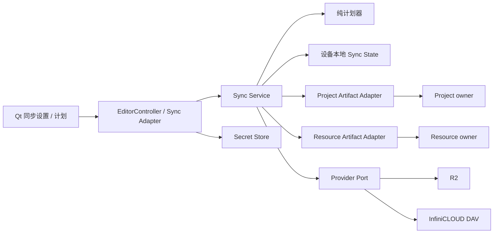
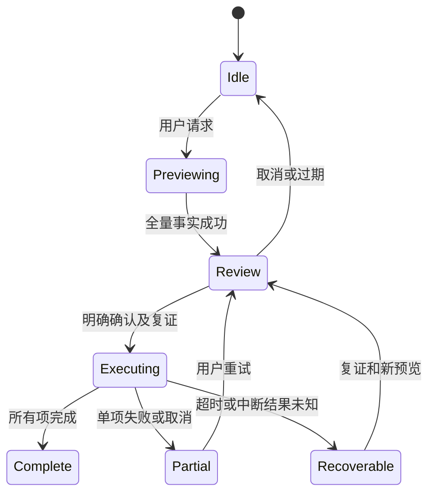

# 技术设计：手动包同步

## Overview

同步是 LocalCAT 的可禁用 Application 模块。它通过受限 artifact port 取得已完成的项目包或资源包，生成 base/local/remote 计划，使用 R2 或 InfiniCLOUD WebDAV 搬运 bytes，并将下载包交回原 owner 验证与应用。

### Goals

先完成 R2 手动上传/下载/双向闭环，再验证具名 InfiniCLOUD provider。并发变化不丢失内容，失败可恢复；本地编辑保存继续可用。凭据默认遮蔽、可显式显示，不启用内容加密。

### Non-Goals

不实现后台/定时任务、官方账号、实时协作、语义 merge、chunk 权限、通用动态插件安装或云端 TM；不搬运 live 数据库、事务残留、设备密钥或 Fuzzy 资格。

## Boundary Commitments

### This Spec Owns

设备连接配置、provider capability、传输对象命名/版本、同步基线/计划/冲突/逐项恢复、受限 staging 与 owner 调用编排。远端 head 只标识完整 artifact 的版本，不拥有项目或资源的内容解释/授权。

### Out of Boundary

ProjectPackage/ResourcePackage 的 schema、identity、解析、资源目标选择、事务、receipt、恢复与 codec 权限仍归各 owner。平台拥有本地 rooted publish；Qt 只显示 Controller view。同步不能通过修改旧 owner 状态来“修复”远端冲突。

### Allowed Dependencies

Sync domain 合同只依赖 stdlib；provider 不依赖 Project、Resource、Parser、Controller 或 Qt。Application 的两个 artifact adapter 分别消费对应 owner，网络 SDK 仅在具体 provider。provider 由显式可信 composition 创建，配置不接受模块路径。禁用同步不初始化 SDK client、不请求秘密、不启动 worker。

### Revalidation Triggers

transport schema/ETag/重试合同变化重验两个 provider 与恢复；owner port/receipt 变化重验导入和基线推进；secret backend/配置变化重验隔离与 Qt；新依赖及 frozen module closure 变化重验正常发行。项目/资源 schema 不为 provider 兼容性改变。

## Governance Impact

- **Applicable Steering**：本地优先、显式 opt-in、层级依赖、spec-ownership、repository-safety。
- **Applicable ADRs**：ADR-018/019 的 immutable package 与独立 authority；ResourcePortability owning R/D/T；ADR-020 及后继的本地 rooted 发布。
- **ADR disposition**：候选决策集中为“可选网络组合、Sync transport/state v1 与秘密后端边界”；只批准远端 CAS、设备同步状态和依赖，不创造通用 Package authority。RPY-first 的 ADR-018 §13 窄取代沿用 RPY Design 的治理前置，不重复立同义决策。
- **Scope amendment**：Pending。Project 增加无路径整包 artifact port；Application/Qt 增加手动同步命令；平台/发行批准 botocore、keyring、defusedxml 的可选组合及秘密 backend。Resource 优先复用既有 port，仅在实际合同不足时提增量。
- **Steering sync**：治理 owner 在相应决策后同步 product 的 opt-in 网络例外、tech/structure/spec-ownership 的依赖和模块，roadmap 保持 RPY→Sync；不回写历史验收。
- **Downstream revalidation**：Project/Resource 的 preview/apply/恢复，RPY 缺失 codec，Qt session 生命周期，source 与普通 Windows frozen 的可选依赖。

**实施判定：NO-GO，直到候选决策及必要 owner amendment 批准。** R/D/T 自动生成仅形成完整提案，Tasks 不执行未批准的协议或相邻修改。

## Architecture

### Existing Architecture Analysis

Resource 已有 `ResourcePackageArtifact.metadata/open_bounded_stream()/close()`，由 sealed package 的 `transfer_artifact()` 转移 retained authority。Project 当前只有 `OpenedProjectPackage.path/open_member()`，缺少整包受限出口；不能把这些路径/成员能力交给 provider。Project 的 `export_copy` 不改变 save baseline；`save_workspace` 必须有已提交 save report 和 durable receipt，不能仅看返回或保存数量。

Remotely Save 可参考 provider 分离和自有远端设置，但其公开写入接口不传 expected ETag，不能直接继承为本设计的 CAS 协议。Kiss Translator 的密码字段/眼睛按钮只参考交互，不引入其加密功能或复制源码。

### Architecture Pattern & Boundary Map



### Technology Stack

| 层 | 选择 | 约束 |
| --- | --- | --- |
| 合同/计划/状态 | Python stdlib、frozen DTO、严格 JSON | 独立的 `sync-transport-v1`、`sync-state-v1`；不复用包 manifest |
| R2 | 可选 `botocore` 低层 S3 client | 显式 key/secret、region=auto；使用条件 PutObject，不用高级 multipart uploader |
| WebDAV | stdlib HTTPS client + `defusedxml` | Depth 1、有限 XML、多状态逐项检查、禁止 DTD/实体；不使用通用文件镜像库 |
| 秘密 | `keyring` 的 allowlisted 系统 backend | Windows Credential Locker、macOS Keychain、Linux Secret Service；不自动加载任意第三方 backend |
| UI/异步 | 现有 PySide6/Controller 边界 | worker 结果带 session/generation；Qt 不持有 provider |
| 本地持久化 | 平台 rooted write/lock/publish | 设备本地状态，不反向依赖 Resource 事务封装 |

版本在依赖安装任务中选择与项目支持 Python 兼容的稳定版，写入独立 `requirements-sync.txt` 并纳入 frozen lock/hash 与显式模块声明；必须验证所选 botocore service model 含 `IfMatch`/`IfNoneMatch`。不使用 SDK 默认凭据链、自动从其他 AWS profile 回退或环境代理改变认证目标。

## File Structure Plan

| 文件（新增，除注明外） | 组件与职责 |
| --- | --- |
| `sync_contracts.py` | Sync DTO、provider/artifact ports、错误和能力枚举；stdlib-only |
| `sync_planner.py` | 纯 base/local/remote 比较、模式过滤与冲突决定 |
| `sync_transport.py` | transport head 编解码、不可变对象命名、CAS 与摘要规则；不解析包 |
| `sync_state.py` | 设备配置、基线与每项 pending operation 的 rooted 持久化/恢复 |
| `sync_service.py` | 预览、逐项执行、取消/恢复和 owner 编排 |
| `sync_r2_provider.py` | R2 低层请求、条件与错误归一化 |
| `sync_webdav_provider.py` | DAV HTTP、限额 XML、prefix 约束与能力验证 |
| `sync_secret_store.py` | 系统 secret backend 与环境变量会话来源；不可打印的 secret wrapper |
| `sync_project_adapter.py` | Project artifact 与 validate/preview/apply 适配 |
| `sync_resource_adapter.py` | Resource artifact 与本地资源选择/事务适配 |
| `sync_controller_adapter.py` | UI 安全投影、issued plan/reveal handle、异步生命周期 |
| `qt_sync_dialog.py` | 连接设置、密码显隐、计划、冲突选择与结果 |
| `requirements-sync.txt` | 可选依赖的版本范围/固定策略；实际冻结版本由任务落实 |
| `tests/test_sync_planner.py`、`tests/test_sync_transport.py`、`tests/test_sync_recovery.py` | 三方计划、CAS、截断/竞态/重启/取消 |
| `tests/test_sync_providers.py`、`tests/test_qt_sync.py` | 协议 fake server、secret 脱敏、Qt 生命周期 |
| `tools/accept_sync_provider.py` | 用户显式调用的隔离前缀合成包验收；默认只读连通性 |
| 修改 `project_package.py` | Project owner 的 `ProjectPackageArtifact` 整包出口 |
| 修改 `editor_controller.py`、`qt_editor.py`、`qt_editor_window.py` | 仅可信 composition、菜单/Controller 命令接入 |
| 修改 `requirements-frozen-build.txt`、`packaging/windows/frozen_roots.json`、`tools/build_windows_ordinary.py` | 受支持的可选依赖及正常发行模块闭包；不改变 Core/Host/Gate 合同 |

## System Flows

### 预览与逐项执行

1. 用户选连接、模式和项目/资源；本地 adapter 要求 owner 完成导出，取得 immutable artifact 和本地状态 revision。未保存编辑不被静默提交；需要保存时回到既有保存流程。
2. provider 完整列举 heads；读取对应 head、版本和摘要，planner 与本地 base 比较。任何不完整列举使计划无效；不是“空目录”。
3. 计划包含动作、字节量、三方状态及条件。用户确认后再检查 config revision、local owner lifecycle、remote version；下载的本地导入另走 owner preview。
4. 每项先记录 pending intent，再做传输及必要 owner apply，最后原子推进该项 base。跨项失败保留已完成项，剩余项重新预览。



## Components and Interfaces

### ProviderPort

```python
class ProviderPort(Protocol):
    def list(self, prefix: RemotePrefix, cursor: PageCursor | None) -> ObjectPage: ...
    def get(self, key: ObjectKey, limit: int) -> RemoteRead: ...
    def put(self, key: ObjectKey, body: BoundedBody, condition: WriteCondition) -> WriteResult: ...
    def delete(self, key: ObjectKey, condition: MatchVersion) -> DeleteResult: ...
# WriteCondition = Absent | MatchVersion(strong opaque version)
# WriteResult = Confirmed | Conflict | OutcomeUnknown | SafeFailure
```

枚举、digest、size 来自安全 metadata；provider 不解析 transport JSON 或包。GET 返回同一对象响应的 body+version，不能 HEAD 一个版本后无条件 GET 另一个。ETag 为 opaque 条件 token，不等于 SHA-256。缺失强条件能力返回 unsupported；所有写调用必须有条件。物理 delete 是独立可选能力，只供隔离测试对象的安全清理；产品删除使用 CAS tombstone，不依赖 R2 条件 DELETE 的未验证承诺。

限额：单 artifact 上限为 owner 允许值与 512 MiB 的较小者；流块 256 KiB；head 64 KiB；每前缀最多 10,000 heads；每页 XML/JSON 16 MiB，累计列举 64 MiB；超限整计划失败。连接超时 10 秒、单次阻塞读写 30 秒、最多 3 次可判定安全的重试，指数退避带抖动。SDK 自身自动重试设为一次，由 service 统一判定；OutcomeUnknown 不能盲重试。取消在网络阻塞超时或下个流检查点生效，不阻塞 Qt。

### Transport 与三方计划

每个用户选定 prefix 下建立独立 namespace：

- `objects/<sha256>.bin`：完整 immutable package bytes。`If-None-Match:*` 创建；若已存在，读取并验证大小/摘要后才能复用。无自动远端 GC。
- `heads/<sync_item_uuid>.json`：strict `sync-transport-v1` 小型头，字段为 `schema, item_id, kind, revision_id, operation_id, parent_revision_id, artifact_sha256, byte_count, deleted, previous_artifact_sha256`。kind 仅 project/resource，不能携包内身份、目标本地路径或授权。deleted=true 仍保留可恢复的前一 artifact 引用。

service 先确认 object 完整可读，再以 absent/expected strong version 写 head；head 是该项唯一远端可见提交点。对象写成功而 head 失败只产生未引用对象，不能推进 base。head 版本改变但 artifact 相同可视为内容未变，仍需更新用于下次写的条件 token。删除通过 CAS 写 tombstone，保留此前 bytes；本地显示“移除同步项”，不调用资源仓库删除或删除活跃项目。用户确认该删除建议后，本地绑定变为 detached 并记录 tombstone 基线，保留的本地包不再参与自动比较；只有显式重新加入同步才能使用新 item UUID，避免下次预览把保留副本当作复活上传。

设备本地 `SyncItemBinding` 将 item_id 关联到明确选择的本地 owner handle/ID；外来 item_id 不是项目 ID 或资源 ID。`base` 保存已确认对应的一对值：本地 owner 内容 fingerprint 与远端 artifact digest/revision/etag，加上 deleted 状态，不保存正文。Project fingerprint 来自已验证 workspace_content_digest，Resource 来自 payload_profile+payload_sha256；adapter 只消费 owner metadata，不自行解析正文。上传记录导出时的本地 fingerprint 与已确认远端 artifact；下载在 owner apply 后重新导出并核对 source/destination 内容 fingerprint，不能假设输入 artifact 与导入后的本地包字节相同。普通导出时间/资源外壳变化不作为本地编辑。

没有 base 时：单边存在是新增候选，双方不同是冲突；只有包经 owner 验证且内容 fingerprint 相同才可建立对应基线。本地观察值为 present(fingerprint)、explicit_delete、unavailable 或 unselected；仅持久保存的显式“移除同步项”请求构成 explicit_delete，路径失联、资源失活、用户本轮未选择都不构成删除。比较同时使用 deleted 标志与内容，tombstone 不与其保留的旧摘要判相同。

| base 比较 | two-way 结果 | push/pull 限制 |
| --- | --- | --- |
| 两端未变/同一摘要 | no-op / 复证后建共同基线 | 相同 |
| 仅 local 改变 | upload 候选 | pull 不覆盖 local，显示本地待上传 |
| 仅 remote 改变 | download 候选 | push 不覆盖 remote，显示远端待下载 |
| 两端不同改变或删除冲突 | conflict，保留双方 | 模式不隐含选择胜者 |
| 仅 local 显式删除、remote 未变 | 确认后 CAS tombstone，binding detached | pull 不发删除写入 |
| 仅 remote 删除、local 未变 | 确认后 detached，不删本地内容 | push 保留删除建议，不自动复活 |
| 双方显式删除 | 确认/复证后 detached+tombstone base | 仍需完整版本事实 |
| 一方删除、另一方修改 | conflict，保留包，用户重新选择 | 不按模式解决 |
| local unavailable/unselected | blocked/不纳入计划，保留 binding/base | 不推断删除 |

冲突选择生成新计划并复证双方，不能修改已签发计划。采用远端前，本地先经 owner 导出可恢复副本；保留本地覆盖远端时旧 immutable object 保留。保留双方时以新的 item UUID 保存副本，经用户选择本地位置/资源创建事务后建立绑定，不合并段落。

每次覆盖/删除须在计划中确认；默认批量删除超过 5 项或超过已绑定项目的 20%（任一条件）时需要额外确认。阈值是防误操作上限，不能绕过逐项条件写。

### R2 / WebDAV

R2 使用用户配置的 HTTPS S3 endpoint、bucket、prefix 和 region=auto。显式 `R2_KEY`/`R2_SECRET` 为可选凭据来源；两者齐备才建立 client，不列举所有 bucket，不借用 ambient AWS profile。低层 PutObject 的 `IfMatch/IfNoneMatch` 控制对象/head；单请求上传在产品大小上限内，无 multipart 完成竞态。ListObjectsV2 分页完整消费。

InfiniCLOUD 使用用户账户分配的 `/dav/` URL、User ID 和 Apps Password；与网站登录密码/API key 区别在帮助文案中说明，不自动重置或签发凭据。URL/用户名仅本地配置，本仓库不固化个人账号。Depth 1 递归受限列举，校验每个 multistatus 的 status/href；拒绝越出根、重复/循环 href 和跨 origin redirect，不将 Authorization 转发给其他主机。MKCOL 只建立用户批准 prefix 下的固定命名空间。

官方文档没有明确承诺实际节点强 ETag/原子 If-Match：连通性测试只做只读请求；写能力验证是另一个明确说明会创建隔离合成对象的操作。只有双创建/双更新竞争中恰好一方成功、旧条件失败不修改字节、读回版本一致之后，才标记该连接的写能力 verified。能力随 endpoint/config revision 失效；服务器违反条件时即时禁用写操作。未验证时只读，不以“WebDAV Class 1/2”代替并发验收。

### Artifact adapters 与 owner apply

Project owner 拟提供 `ProjectPackageArtifact`：完整已验证包的 size/digest/profile/workspace_content_digest、`open_bounded_stream()`、`close()`，持有 retained authority，并在流结束复证。不得暴露 `path`、manifest、member 或 writer。Resource 使用自己的既有 artifact，两个类型不互相继承包 schema。

下载写入受限、rooted 的私有 candidate，完成大小/摘要验证后交给对应 owner：Project `validate → preview_import → prepare_import/commit_prepared_import`；Resource `validate → preview → apply`。本地目标必须显式选择，用户拒绝时不推进 download base。apply 之前复证 plan/local revision；owner 返回 recovery-required 或无 durable receipt 时不宣称完成，只在 owner 存在 pending recovery 时调用其恢复入口，而不是反复导入。下载 staging 只是输入，不能 mint owner receipt。

收到成功 receipt 后重新取得当前本地 owner snapshot，核对其 fingerprint 与已验证 incoming 的 fingerprint。相同才记录成对基线；若 Project reconciliation 或资源规范化造成不同，则显示“已应用，待对齐”，保留本地结果、远端原包和原共同基线，记录 pending_alignment 的两侧事实。用户可新建预览将当前本地完整包上传对齐，或解除该项同步；不能把不同内容默认为共同基线。owner preview 接受应用不等于接受后续上传。

### SyncState 与恢复

`sync-state-v1` 是独立设备状态，按 connection ID 加本地进程锁，rooted JSON snapshot+pending intent 持久化；每次替换复读验证，只有确认 durable 的 base 可用。若新状态写入结果不确定，重新打开/验证，失败即 recovery-required，不覆盖损坏状态。该协议须由治理候选批准，不复用 Project/Resource manifest 或修改其日志。

每项 pending 存 operation UUID、config revision、方向、item UUID、预期 base/remote version、输入/输出 artifact 摘要、owner 提供的 pending/结果引用（若存在）、本地绑定与预期 fingerprint、阶段和可恢复副本引用；不保存秘密、正文或远端响应体。阶段为 `prepared → transfer_confirmed → owner_apply_started (下载) → owner_result_recorded (下载) → content_verified → base_committed`；不同内容转入 pending_alignment。owner_apply_started 必须在调用 owner 前持久化，owner_result_recorded 保存已返回的安全结果事实。上传不需要虚构 owner apply；本地导出在 prepared 前已成功。

超时上传重新 GET head：operation_id 和 artifact 相同则确认；版本仍为旧值则重新预览后重试；其他版本则冲突。下载 apply 后崩溃时，不假定 Project 存在按 operation ID 冷查询已完成 receipt 的 API。若 owner 暴露 pending recovery，就由该 owner 处理；若停在 owner_apply_started 且没有已持久化返回事实，则标记 OWNER_OUTCOME_UNKNOWN，禁止自动重放 apply 或宣布旧操作成功。用户通过现有 owner open/validate/export 重新检查当前本地目标，并与重新读取的 remote head 建立全新预览：内容相同可在明确确认后建立新基线，不同则进入冲突/待对齐。这是新观测形成的同步关系，不补造历史 receipt，也不新增 Project 完成台账。pending 写入失败在任何远端写之前退出。base 写失败保留 pending，仅对已记录成功且重新复证的内容建立基线。禁止从旧结果给新的 session 提交；禁用/关闭撤销 generation，取消后不发起新操作，已发出的写入可能发生，必须保留待复证状态。

### SecretStore、Controller 与 Qt

普通 config 保存 provider 类型、URL/bucket/prefix、username、secret reference、credential source 与 revision；秘密使用 keyring 的明确 allowlist backend。拒绝 keyrings.alt、配置注入的自定义模块和 plaintext fallback。系统秘密后端不可用时可选择仅当前会话输入或 environment source，提示不能持久保存；不将环境值复制到配置。secret wrapper 的 repr/error 永不包含值，原始 SDK/HTTP 请求/响应不进入日志。

设置字段使用 `QLineEdit.Password` 和有可访问名称的眼睛按钮，点击显示仅获取当前字段的短生命周期 reveal 值；关闭/隐藏/重开自动遮蔽并清空 reveal handle。用户名为普通文本，R2 key/secret 与 DAV Apps Password 为密码字段；不保证显示字形必为 ASCII 星号。该交互不等于加密，界面不出现加密开关。

Controller 提供连接投影、计划、选择、执行/取消与结果 DTO；worker 持有传输句柄而非 Qt 对象。Qt 只调用 Controller，晚到结果按 generation 丢弃；用户仍可编辑/保存，但 apply 前 revision 变化使计划 stale。下载替换活跃项目时沿用原 owner 的未保存保护与 session 切换。

## Data Models

所有 transport/state JSON 严格限定键、版本、UUID/digest/size、UTF-8 和数值类型，拒绝重复键、NaN、未知 required 字段和超限。非删除 head 的 artifact_sha256/byte_count 必填并对应 objects；首次创建 parent_revision_id/previous_artifact_sha256 为 null，后续提交指向已观测前一 revision/内容。tombstone 的 artifact_sha256=null、byte_count=0、previous_artifact_sha256 指向最后一个非删除完整包；禁止空引用的伪删除。kind 只选择 adapter；真实 package type 由 owner 再验证。未知版本不做迁移猜测；设备状态升级另作明确 migration。新的连接/prefix 生成独立 connection ID，不复用旧基线。

## Requirements Traceability

| 需求 | 组件/合同 | 验证 |
| --- | --- | --- |
| 1.1, 1.2, 1.3, 1.4 | composition、config revision、Controller | 禁用零网络、缺字段、只读连接、换远端失效 |
| 2.1, 2.2, 2.3, 2.4 | SecretStore、Qt 显隐、HTTPS | 环境与后端、脱敏、关闭重开、无加密 UI |
| 3.1, 3.2, 3.3, 3.4 | 两个 artifact adapter、owner preview/apply | 成功出口、完整性、目标选择、禁止成员 |
| 4.1, 4.2, 4.3, 4.4 | planner、base、issued plan | 三种模式、三方矩阵、stale/无基线/列举失败 |
| 5.1, 5.2, 5.3, 5.4 | CAS head、冲突副本、tombstone | 双写竞争、阈值、版本条件、活跃资源不删除 |
| 6.1, 6.2, 6.3, 6.4 | service、SyncState、worker | 限额/取消、超时复证、逐项提交、重启恢复 |
| 7.1, 7.2, 7.3, 7.4 | R2/DAV provider、acceptance tool | 实际条件能力、隔离合成对象、脱敏与两设备 |
| 8.1, 8.2, 8.3, 8.4 | Controller/Qt、Project adapter | 计划取消、未保存保护、无 codec 包、实际旅程 |

## Error Handling

统一安全结果类别：CONFIG_INCOMPLETE、AUTH_FAILED、CAPABILITY_UNVERIFIED、UNSUPPORTED、CONFLICT、PLAN_STALE、LIMIT_EXCEEDED、INTEGRITY_FAILED、OUTCOME_UNKNOWN、OWNER_RECOVERY_REQUIRED、OWNER_OUTCOME_UNKNOWN、ALIGNMENT_REQUIRED、CANCELLED。只保存 provider 类别、状态码和 request correlation 的非秘密部分；不得输出 secret-bearing URL、Authorization、cookie、SDK repr 或响应正文。失败对象不被当作远端缺失。

## Testing Strategy

- 纯计划器穷举 base/local/remote 的相同、改变、缺失、tombstone、无基线与模式矩阵；覆盖 4、5。
- 协议 fake server 注入条件失败、弱 ETag、分页漏项、multistatus 部分失败、越界 href、跨域 redirect、截断、digest mismatch 与写后超时；覆盖 3、5、6、7。
- 每个持久化阶段崩溃注入，确认上传已生效但 base 未写、下载 owner 已提交但本地未知时停止自动 apply 并重新观察；导入后内容不同不推进共同基线；覆盖 6.2–6.4。
- secret backend/环境来源与错误注入；Qt 默认隐藏、显式显示、关窗重开、取消、运行中编辑和 stale apply；覆盖 1、2、8。
- Project/Resource 分别进行真实 owner artifact/export/import 流，缺失 RPY codec 的包仍可中立编辑；覆盖 3、8.3。
- R2 先在隔离 prefix 做实际双创建/更新竞争和两设备冷重开，再验证 InfiniCLOUD 的具体能力；认证参数由本机配置/环境注入。无配置时报告未运行，不用 skip 冒充通过。真实操作只在用户批准测试范围执行，覆盖 7、8.4。

## Supporting References

外部合同与采用理由见 [research.md](research.md)。用户个人 endpoint、用户名和秘密不进入规格；仅在实施验收时从本机配置读取。
