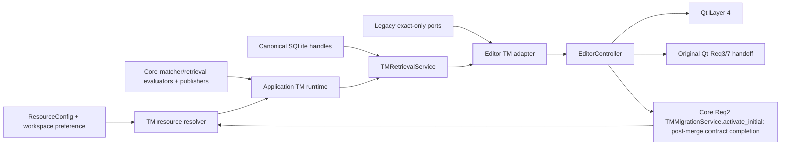
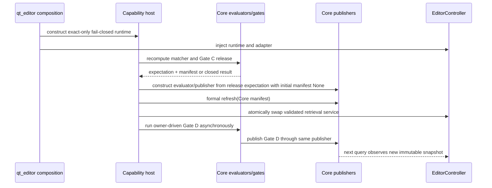
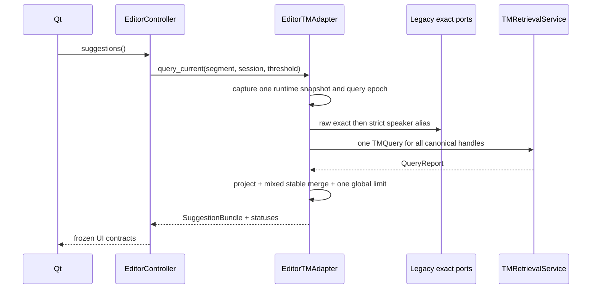
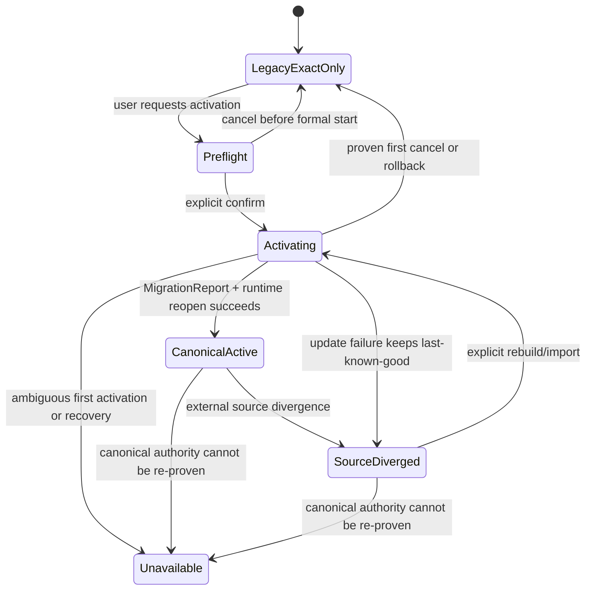
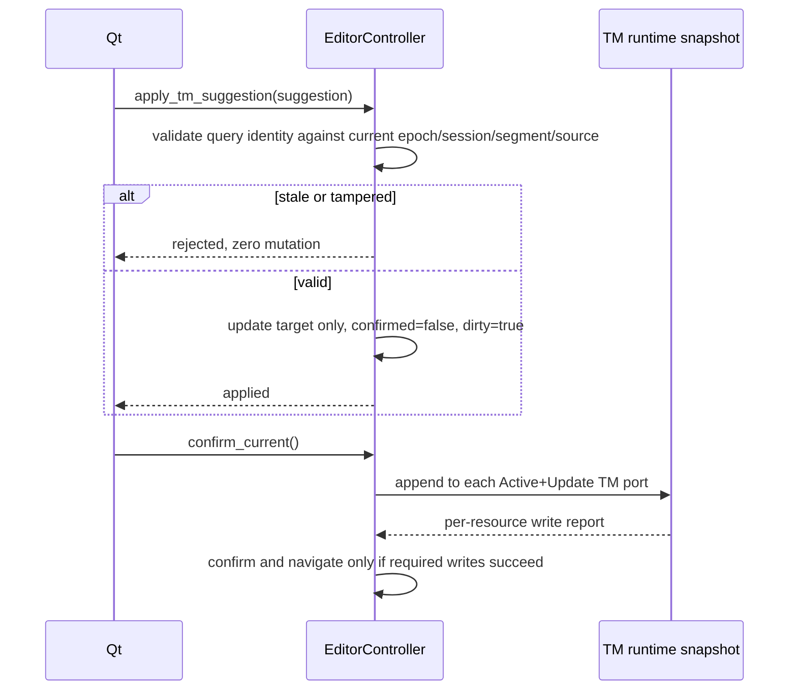
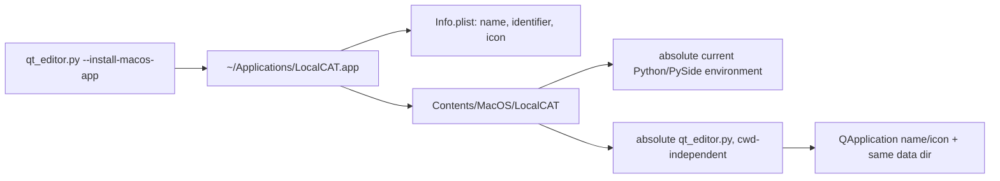
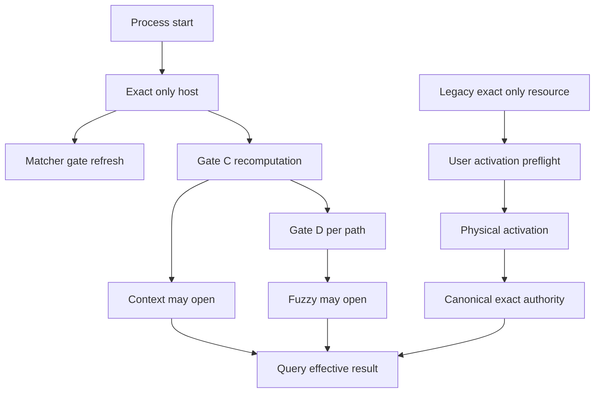

# 设计文档

## 概述

本集成在 Feature 5 Core 与现有单 JSON Qt 编辑器之间增加一层 Qt 无关的应用装配和 Controller adapter，使当前段能够同时查询 legacy exact-only 与 canonical SQLite TM，并以统一、可解释的建议合同呈现 exact/context/fuzzy 结果。Feature 5 继续拥有匹配、评分、候选证明、SQLite 生命周期和 capability 判定；Qt 只通过 `EditorController` 消费安全投影。

设计同时闭合显式 canonical 激活、device-local fuzzy 阈值、建议过期校验、资源局部失败和 macOS 轻量 `.app` 入口。项目搜索和术语 CRUD 仍由 `qt-editor-json-mvp-increment` 拥有；本规格只交付正式 `TextMatcher` handoff，不把相邻产品任务改记为已完成。

### 目标

- 从精确 `feature5@dd7c9fdb268b4ee8ac3545f43e3f5f19e715ff3b` 消费 frozen TM/matcher contracts，不复制 Core 规则。
- 在一次当前段查询中确定性合并 legacy exact 与 canonical exact/context/fuzzy，并只应用一次全局 top-10。
- 用明确的激活、能力和失败状态代替静默迁移、静默 fallback 或“无结果”伪装。
- 保持 fuzzy 只可显式应用，且项目、段落、source、资源、能力或阈值变化后旧建议 fail-closed。
- 提供不改变 Linux launcher 与 CLI 的 macOS `LocalCAT.app` 轻量入口。

### 非目标

- 修改 Feature 5 scorer、fold、Whole Word、CJK、candidate proof、SQLite schema 或 migration authority。
- 完成原 Qt Requirement 3 搜索产品、Requirement 7 术语 CRUD、speaker inventory、target-only preprocessing 或 batch undo。
- 扩展术语导入列映射/Domain、TMX DTD/ENTITY 方言、Parser、多文档、项目 chunk 或云端能力。
- 引入签名、公证、DMG、Mac App Store 或未经批准的大型 deployment 依赖。

## Boundary Commitments

### This Spec Owns

- `ResourceConfig` 到 legacy/canonical runtime port 的 Qt 无关解析与原子 runtime snapshot。
- matcher/retrieval 正式 publisher 的应用装配、fail-closed 初态和 Core gate 刷新。
- canonical cohort 的 `TMQuery` 构造、production `TMRetrievalService` 调用，以及 mixed cohort 的最终合并。
- `QueryReport` 到 frozen `TMSuggestion`、能力状态和资源状态的安全映射。
- 当前段 TM 建议卡、60%～100% device-local 阈值、显式 apply 和 stale apply 拒绝。
- 首次激活/显式更新的 Controller use case、语言资源设置状态与后台进度。
- Controller 与当前段 TM suggestion UI；即使落在 `qt_editor_window.py` / `qt_settings_dialog.py`，其产品合同和验收仍归本 Integration Spec。
- `TextMatcher` 向原 Qt Requirement 3/7 的正式 handoff。
- macOS user-local lightweight `LocalCAT.app` 的生成、身份和冷启动验证。

### Out of Boundary

- Core migration/seal/activation、retrieval proof、scorer、matcher capability 的内部实现和版本选择。
- 原 Qt 项目搜索 UI/结果导航、Match Case/Whole Word 控件完成度和术语管理页。
- Qt maintenance 簇中的平台快捷键、下拉框对比度和“添加术语”错误指引。
- 未来术语导入表头/语言列映射及 Domain 元数据；该方向通过 Discovery 另立 brief。
- legacy JSONL 自动升级、启动迁移或 activated resource 向 JSONL 的隐式回退。

### Allowed Dependencies

- application composition 可依赖 Feature 5 public contracts、migration/store facade、validator、publisher 和 gate owner。
- Controller adapter 可依赖 `editor_contracts.py`、`renpy_tm_compat.py`、Core public contracts 和 composition ports；不得依赖 Qt。
- `EditorController` 可依赖 adapter、resource/workspace repositories 和现有项目/术语服务。
- Qt presentation 只可依赖 `EditorController` 与 `editor_contracts.py`；不得导入 Feature 5 store、retrieval、scorer、evaluator、proof 或 migration 模块。
- macOS bundle builder 只依赖 Python 标准库；PySide6 deployment 只有 lightweight 验证失败并重新批准后才可进入。

### Revalidation Triggers

- `TMQuery`、`TMResult`、`QueryReport`、`TMResourceHandle`、migration outcome 或 append contract 改变。
- matcher/retrieval capability state、semantics version、证据 TTL、publisher 刷新或 Gate C/D 发布边界改变。
- Core 排序、global limit、minimum similarity、source/context identity 或 resource failure 语义改变。
- `EditorProject` session/segment/source/confirmed/dirty、resource order 或 legacy Ren'Py alias 语义改变。
- 原 Qt Requirement 3/7 的字段范围、configured matcher 或术语记录合同改变。
- Parser/multi-document 引入正式 context，或 macOS/PySide bundle identity 行为改变。

## Governance Impact

- **Applicable Steering**：`product.md`、`structure.md`、`tech.md`、`feature5-ui-integration.md`、`roadmap.md`、`spec-ownership.md` 与 repository safety rules。
- **Applicable ADRs**：ADR-007～013；ADR-002/006 仅保留 never-activated legacy exact-only 与历史背景。
- **ADR disposition**：Follow ADR-012 处理 unpublished orphan residue；Gate D follow ADR-009/011 的单一 Core authority，并按 ADR-013 复证设备本地资格。
- **Scope amendment**：Approved for ADR-012 orphan-residue remediation。首次迁移、完整激活、失败可重试、无 prior canonical 时保留 JSONL 兼容能力，已由 `tm-storage-retrieval-index` Requirement 2 批准；ADR-012 明确了 unpublished residue 不得被提升为 canonical authority fact。
- **Steering sync**：Required。实现闭合时同步 `product.md`、`structure.md`、`tech.md` 的 exact-only/JSONL 当前态与新增文件边界；已同步的 integration boundary、roadmap 和 ownership 不重复改写。
- **Downstream revalidation**：`qt-editor-json-mvp-increment` Requirement 3/7 matcher handoff、既有 Qt/Excel/legacy tests、macOS bootstrap；Parser/multi-document 仅登记未来触发器。

## 架构

### 现有架构分析

- `EditorController` 已拥有单一项目会话、资源配置、建议查询、确认写回和 workspace 偏好入口。
- 当前 `TMSuggestion` 折叠为单 `source`，只支持 legacy exact 1.0；stale 校验也只比较 source。
- 当前 `TMEngine` 在 never-activated JSONL 上保持 LWW exact；Feature 5 合并后，同一 facade 对 activated resource 改用 canonical exact/save，但 fuzzy 必须经 `TMRetrievalService`。
- Feature 5 的 retrieval service 只接受具有 query lease 的 canonical handles；仓库没有可直接塞入该服务的 legacy JSONL handle。
- Feature 5 提供 capability evaluator/publisher/gate seams，但不提供 UI application composition root。retrieval 的默认 publisher 明确关闭 context/fuzzy。
- `ResourceRepository` 的 `Active/Lookup/Update` 与稳定显示顺序继续是 declarative input；canonical authority 由 Core 邻接 activation artifacts 判定，不复制进 registry。
- 精确 `dd7c9f…` 尚无首次 canonical activation 的 application-facing public facade：`TMMigrationService.import_snapshot()` 只接受已激活 coordinator，而首次发布仍需私有 StageSealer/registry 链。精确 merge 后先在 Core 层完成既有 Feature 5 Requirement 2 的 `activate_initial()` 公开合同；未通过既有 frozen/tamper/seal/publication/recovery tests 前，阻断 Controller 和当前段 TM UI。Integration adapter/Qt 不得越权拼装私有迁移链。

### 架构模式与边界图

采用 **Ports and Adapters + immutable runtime snapshot**：composition root 只装配 Core authority；adapter 只做查询编排和安全投影；Controller 拥有用户操作与 stale epoch；Qt 只渲染。



边界不变量：

- 每次 query 捕获一个 resource snapshot、一个 retrieval capability snapshot 和一个 query identity；在途 query 不混用刷新后的状态。
- canonical resources 一次性传给 production `TMRetrievalService`；legacy resources 只走 exact compatibility port。
- Qt 不看到 `SimilarityEvidence`、proof metadata、candidate counts、FTS/fallback 选择或 migration evidence body。
- `degraded` 只是一种 display projection，不是 Core capability，也不能成为用户开关。

### 技术栈

| 层 | 选择 / 版本 | 作用 | 说明 |
|----|-------------|------|------|
| Frontend | PySide6 6.11.1 | 建议卡、阈值入口、状态与激活进度 | 只调用 Controller |
| Application | Python 3.14 frozen dataclass/protocol | composition、adapter、stale epoch | Qt 无关 |
| Core | Feature 5 `dd7c9f…` public API | SQLite、retrieval、matcher、migration、capability | 不复制内部规则 |
| Local state | JSON workspace state | device-local fuzzy threshold | 原子替换，不进项目/TM |
| Runtime | stdlib + existing PySide6 environment | CLI/Linux/macOS launcher | 不新增大型依赖 |

## File Structure Plan

```text
/
├── editor_contracts.py              # 升级 suggestion/query/status/preference frozen contracts
├── tm_application_composition.py    # publisher host、resource resolver、Core runtime snapshot
├── editor_tm_adapter.py             # mixed query、Core→UI projection、stale identity input
├── tm_migration.py                  # Feature 5 Req2 Core public-contract completion：activate_initial()
├── editor_controller.py             # current-segment use cases、epoch、apply/confirm/activation
├── workspace_state.py               # device-local threshold 读写与回退
├── resource_repository.py           # 继续只持有 declarative resource config/order
├── qt_editor_window.py              # TM cards、阈值 chip、持久状态、非阻塞反馈
├── qt_settings_dialog.py            # 第二阈值入口、canonical 状态/激活动作
├── macos_app_launcher.py            # stdlib lightweight bundle builder/validator
├── macos/LocalCATLauncher.c         # auditable native execv bootstrap source
├── LocalCAT-launcher                # tracked universal arm64/x86_64 Mach-O bootstrap
├── LocalCAT-logo-silver.icns        # 由已跟踪 silver PNG 生成并验证的 macOS 图标
├── qt_editor.py                     # composition/bootstrap 与 macOS install CLI
└── tests/
    ├── test_editor_contracts_tm.py
    ├── test_tm_application_composition.py
    ├── test_editor_tm_adapter.py
    ├── test_editor_controller_tm_integration.py
    ├── test_qt_tm_suggestions.py
    ├── test_qt_settings_dialog.py
    ├── test_macos_app_launcher.py
    └── fixtures/feature5_ui_integration/
        ├── legacy_exact.jsonl
        └── canonical_variants.jsonl
```

### Modified Files

- `editor_contracts.py` — 移除 ambiguous 单 `source` suggestion，增加双 source、Core match type、safe status 和 query identity。
- `editor_controller.py` — 将 legacy loops 替换为 adapter use case；保持唯一 session、dirty/confirmed 和 term flow。
- `workspace_state.py` — 在现有原子 workspace payload 中增加应用级 TM preference，旧/非法值回退 0.60。
- `resource_importer.py` — 通过精确 Feature 5 merge 继承 canonical variant-preserving import；integration 只验证 hot reload/status。
- `qt_editor_window.py` / `qt_settings_dialog.py` — 只渲染 Controller contracts，不构造 Core query 或 capability。
- `qt_editor.py` — 构造 application runtime 并增加 macOS launcher installation 分支；Linux/CLI 分支保持兼容。

## 系统流程

### Capability bootstrap 与刷新

本节所称 Gate A～D 只指 Feature 5 Core 在 `tm-storage-retrieval-index` 中定义的发布门。跨 Spec 的 Qt maintenance 与原 Qt Req3/Req7 不再使用 Gate 字样，分别称为 Checkpoint M 与 Checkpoint Q；完整范围、进入条件和退出条件见“实施、激活与能力开放顺序”。



- UI 可先以 legacy/canonical exact-only 工作；验证未完成、失败或过期时 context/fuzzy 保持关闭。
- matcher 只能来自 `build_validated_matcher_v1`；应用可原子替换“无 matcher”与正式 gated matcher，但不生成自己的 capability。
- 初始 exact-only service 可使用 Core default closed publisher，但该 sentinel publisher **不得**接收批准 Gate C roots。`recompute_retrieval_validation()` 成功后，host 必须用同一 `release.expectation` 新建 Core evaluator/publisher，先以 `initial_manifest=None` 保持关闭，再只刷新 `release.manifest`，并原子替换整套 retrieval service。
- Gate D 只能消费上述新 publisher 和同一 base manifest。真实重验仍固定 current `benchmark_tm_contract.json`，创建新的 `0700` private temporary `work_root` 与 absent evidence path；成功 real run 由 Core 写入 ADR-013 的设备本地 HMAC attestation。后续进程只能在 strict bundle、设备密钥、运行环境、implementation/proof/contract 与 Gate C identity 全部复证后重铸一次性 receipt；Qt/application 不解析、不重铸。
- 启动先执行 Matcher 与 Gate C，再快速尝试 attestation restore；不得自动运行 100k Gate D。缺失、损坏或 compatibility drift 时保留 exact/context 并显示显式重验入口。用户启动的 Gate D 在后台运行，不阻塞 Qt 主线程；失败保持当前较低能力。
- Qt 可经 Controller-only、process-local 的安全 lifecycle 投影区分 Gate D `IDLE/RUNNING/SUCCEEDED/FAILED`。该投影只驱动“Fuzzy 性能验证中”或有限失败原因，不参与 query、threshold 或 capability 判定；Exact/Context/Fuzzy 可用性仍只来自同代 `RetrievalDisplayState`。RUNNING 时阈值入口持续可发现但不可提交，正式 Gate D publication 后沿既有 queued generation bridge 刷新当前建议与入口。

### 当前段 mixed query



`TMQuery` 映射固定为：

- `query_source = EditorSegment.source`；
- `speaker_raw = EditorSegment.speaker or None`，不得拼入正文；
- 当前 JSON 没有正式 context contract，`context_prev_raw/context_next_raw = None`；
- `minimum_similarity = device-local threshold`；
- `limit = 10`；
- `resource_order` 只列本次 canonical cohort；canonical handles 按该 cohort 连续重编号为 `0..n-1`，满足 Core 一对一 mapping。独立 `global_order_by_resource_id` 保留完整 ResourceConfig 顺序，供 mixed 合并使用。

Mixed 合并算法：

1. 所有 canonical Active+Lookup handles 只调用一次 `TMRetrievalService.query()`；服务内部完成 canonical 排序、去重、局部失败和 canonical top-10。
2. 每个 legacy Active+Lookup port 最多贡献一个 direct LWW exact；direct miss 时才使用既有严格 same-speaker alias/unwrap bridge。
3. canonical `TMResult` 原样保留 Core order；adapter 不重算 scorer、context strength 或 fuzzy tie。
4. legacy exact 与 canonical exact 按 `global_order_by_resource_id` 合并；同 canonical resource 内沿用 Core `stable_tie_key` 的 record order。canonical cohort 过滤不改变这些资源之间的相对全局顺序。随后追加 Core 已排序的 CONTEXT、FUZZY lanes。
5. 以 `(resource_id, projected record_id)` 去重，在所有资源合并后只截取一次前十条。

canonical service 先返回十条不会使 mixed 全局结果丢失：任何 canonical 第十一条之前已经存在十条更高 canonical 结果，加入 legacy exact 只可能进一步占用前十，而不会让该第十一条进入最终集合。

阈值从不作为卡片后过滤。每次变化增加 query epoch，并用新 `TMQuery` 重新查询；是否满足阈值由 Core 使用未舍入 `TMResult.similarity` 判定。

### Canonical 激活与更新



- 打开应用、项目、设置、刷新或查询绝不调用 migration。
- 用户动作先调用只读 preflight 并显示资源名、输入 path 和 counts；取消只存在于正式开始前。
- 确认后由后台 worker 调用 Core-owned `TMMigrationService.activate_initial()`；该 public contract 在精确 dd7 merge 后作为 Feature 5 Requirement 2 合同补全先行落地。已激活资源的显式更新继续调用既有 `import_snapshot()` / `rebuild_from_snapshot()`。Qt 只持有 Controller operation id，不能接触 stage/seal/token。
- `activate_initial()` 必须在 Core 内部独占 `build → StageSealer → coordinator durable activation → verify/recovery` 链，公开方法只接收 configured JSONL 与 resource identity，不暴露 registry、mutable/sealed stage、capability 或 prepared activation。该合同未通过 Feature 5 既有 frozen/tamper/seal/publication/recovery tests 前，不得进入 Controller 或当前段 TM suggestion UI 实施。
- 正式开始后禁用重复激活与取消；既有 legacy query 或 last-known-good canonical 在 Core 允许的范围内继续服务。
- 成功后先重新 resolve 并 re-prove canonical runtime，再原子替换 resource snapshot、递增 epoch、刷新当前建议。
- 已证明未发布 canonical authority 的首次取消或完整回滚保持 JSONL bytes/config 和 legacy exact-only；已有 canonical 更新失败保持 last-known-good，不查询 JSONL。
- 上述 legacy 保留只适用于 Core 明确证明“从未发布 canonical”或“首次 activation 已完整取消/回滚”的 outcome；存在 ambiguous durable facts、rollback/cleanup 无法证明或可能已发布 authority 时，资源进入 `UNAVAILABLE`，不得查询 legacy。

### Apply、确认与写回



- Apply 对 EXACT/CONTEXT/FUZZY 一律显式，不写 TM、不确认、不跳段。
- `query_epoch` 在 project/session、segment/source、resource snapshot、capability snapshot 或 threshold 变化时递增；旧 identity 必须拒绝。
- 确认写回由 runtime port 分派：legacy append 保持 JSONL 行为，canonical append 使用 Core `TMRecordDraft`/store port。
- `Update=false` 资源可参与 Active+Lookup query，但 apply/confirm 不得改变其 bytes。资源导入权限沿用其既有 owner，不在本 Requirement 上扩张。

### macOS lightweight app



- bundle builder 在临时 sibling 中完整生成并验证后原子替换 user-local target；测试使用临时目录。
- `CFBundleName`/`CFBundleDisplayName = LocalCAT`，稳定 bundle identifier，silver `.icns`，可执行文件名 `LocalCAT`。该 executable 是由可审计 C source 生成的通用 arm64/x86_64 Mach-O，最低 macOS 13.0，只链接 macOS CoreFoundation/libSystem；不复制 Python/PySide，不引入 packaging runtime。
- builder 将安装时验证的 Python 与 checkout bootstrap 绝对路径写入 Info.plist；native launcher 读取并以 `execv` 参数数组启动，不依赖 Finder 工作目录。任一路径失效时以有限文案和非零状态退出，不伪装成功。
- 先以 Finder/Dock 冷启动、Activity Monitor/Dock identity 和 Qt window icon 验证真实身份。若仍显示 Python 或环境不能保真，停止此 cluster，提出最小 PySide6 deployment amendment；不自动引入依赖。

## Requirements Traceability

| 需求 | 设计元素 | 主要验证 |
|------|----------|----------|
| 1.1–1.7 | TMQuery mapping、Core report projection、TM card | exact/context/fuzzy projection、双 source、no-match |
| 2.1–2.7 | resource resolver、mixed merge、global limit | mixed order、determinism、legacy exact-only |
| 3.1–3.10 | TMPreferences、workspace repository、新 query epoch | 0.60/1.00 boundary、invalid fallback、restart |
| 4.1–4.7 | SuggestionQueryIdentity、Controller apply/write ports | stale/tamper zero mutation、Update=false bytes |
| 5.1–5.10 | activation coordinator、Core migration、runtime swap | cancel/failure/LKG/divergence/unavailable |
| 6.1–6.7 | capability host、resource status projection | closed/expired/recovery/local failure |
| 7.1–7.7 | matcher handoff、双阈值入口、statusBar feedback | BASIC/TEXT_V1、CJK vectors、keyboard access |
| 8.1–8.6 | macOS bundle builder、bootstrap | bundle metadata、Finder cold launch、CLI/Linux |
| 9.1–9.10 | compatibility gates、canonical fixtures | Excel/Trie/JSON/TXT/locality/canonical redline |

## 组件与接口

| 组件 | 层 | 职责 | 需求 | 关键依赖 |
|------|----|------|------|----------|
| Editor TM Contracts | Shared | suggestion/status/preference/query identity | 1–7 | Core public enums only |
| CapabilityHost | Application | 正式 publisher 与 Gate C/D 生命周期 | 5–7 | Core evaluator/gate |
| TMResourceResolver | Application | declarative config → runtime ports | 2, 4–6 | Core open/store facade |
| EditorTMAdapter | Application | query mapping、mixed merge、安全投影 | 1–4, 6, 9 | RetrievalService, legacy ports |
| `TMMigrationService.activate_initial` | Core Req2 completion | 首次激活的唯一 application-facing 公开入口 | 5 | Core private seal/activation chain |
| EditorController | Logic | use cases、epoch、apply/confirm/activation | 1–7 | Adapter/repositories |
| Qt TM Surface | Presentation | cards、threshold/status/feedback | 1, 3–7 | Controller only |
| MacOSAppLauncher | Bootstrap | lightweight bundle build/validate | 8 | stdlib |

### Editor TM Contracts

**Contracts**: State [x]

```python
@dataclass(frozen=True)
class SuggestionQueryIdentity:
    project_session_id: str
    segment_id: str
    source_digest: str
    query_epoch: int

@dataclass(frozen=True)
class TMSuggestionProvenance:
    resource_name: str
    resource_mode: TMResourceDisplayMode

@dataclass(frozen=True)
class TMSuggestion:
    resource_id: str
    record_id: str
    query_source: str
    matched_source: str
    target: str
    match_type: TMMatchType
    final_similarity: float
    provenance: TMSuggestionProvenance
    query_identity: SuggestionQueryIdentity
```

不变量：

- `match_type` 直接使用 Core `TMMatchType`，不定义第二份匹配枚举。
- canonical `record_id` 投影为 `canonical:<positive-int>`；legacy identity 为 body 不可逆的稳定 SHA-256 标识。
- EXACT/CONTEXT 必须 1.0 且双 source 相同；FUZZY 使用 `TMResult.similarity`，不得从 UI 重算。
- provenance 只含 resource display facts；不传递 raw Core provenance、SimilarityEvidence 或 proof metadata。
- 合同 validation 拒绝非法 enum、ratio、identity、source 组合和可变 collection；tamper tests 覆盖反序列化边界。

```python
@dataclass(frozen=True)
class TMResourceStatus:
    resource_id: str
    resource_name: str
    mode: TMResourceDisplayMode
    exact_available: bool
    context_available: bool
    fuzzy_available: bool
    safe_codes: tuple[str, ...]
    retryable: bool

@dataclass(frozen=True)
class RetrievalDisplayState:
    context_available: bool
    fuzzy_available: bool
    safe_codes: tuple[str, ...]

@dataclass(frozen=True)
class TextMatcherDisplayState:
    state: TextMatcherState
    supported_profiles: tuple[TextMatchProfile, ...]
    safe_reason: str | None

@dataclass(frozen=True)
class TMPreferences:
    minimum_similarity: float = 0.60
    result_limit: int = 10

@dataclass(frozen=True)
class TMActivationPreflightView:
    resource_id: str
    resource_name: str
    valid_count: int
    invalid_count: int
    variant_count: int

@dataclass(frozen=True)
class TMActivationOperationView:
    operation_id: str
    resource_id: str
    phase: str
    completed: bool
    succeeded: bool
    safe_code: str | None
    retryable: bool
```

`TMResourceDisplayMode` 可表达 `LEGACY_EXACT_ONLY`、`ACTIVATING`、`CANONICAL_ACTIVE`、`SOURCE_DIVERGED`、`DEGRADED`、`UNAVAILABLE`。它只用于展示；context/fuzzy authorization 仍来自 Core retrieval snapshot。activation phase 是对 Core stable stage 的 allowlist 投影，不携带 path 或 evidence。`result_limit` 首版只读且恒为 10。

### CapabilityHost

**Contracts**: Service [x] / State [x]

```python
class CapabilityHost:
    def matcher_snapshot(self) -> MatcherHandoffSnapshot: ...
    def retrieval_snapshot(self) -> RetrievalHandoffSnapshot: ...
    def start_validation(self) -> None: ...
    def status_snapshot(self) -> CapabilityDisplaySnapshot: ...

@dataclass(frozen=True)
class MatcherHandoffSnapshot:
    generation: int
    matcher: CapabilityGatedTextMatcher | None
    display: TextMatcherDisplayState

@dataclass(frozen=True)
class RetrievalHandoffSnapshot:
    generation: int
    service: TMRetrievalService
    publisher: RetrievalCapabilityPublisher
    display: RetrievalDisplayState

@dataclass(frozen=True)
class CapabilityDisplaySnapshot:
    matcher: TextMatcherDisplayState
    retrieval: RetrievalDisplayState
```

- `matcher_snapshot()` 每个 search operation 捕获一次 immutable gated matcher/state。
- retrieval service 始终持有同一个 Core publisher；refresh 为原子操作，query 自己捕获一次 snapshot。
- validation refresh 改变 query-effective capability 时通知 Controller 递增 epoch；在途 query 保持旧 snapshot，下一 query 生效。
- 普通 application persistence 不拥有 capability authority；验证 artefact 只作 Core gate input/诊断，不直接成为 UI 开关。

### TMResourceResolver

**Contracts**: Service [x] / State [x]

```python
class TMResourceResolver:
    def resolve(self, configs: tuple[ResourceConfig, ...]) -> TMRuntimeSnapshot: ...

class LegacyExactPort(Protocol):
    resource_id: str
    global_order: int
    active: bool
    lookup: bool
    update: bool
    def query_exact(self, source: str, speaker_raw: str | None) -> LegacyExactResult | None: ...
    def append(self, draft: TMRecordDraft) -> None: ...

class CanonicalResourcePort(Protocol):
    resource_id: str
    global_order: int
    active: bool
    lookup: bool
    update: bool
    handle: TMResourceHandle
    def append(self, draft: TMRecordDraft) -> None: ...

@dataclass(frozen=True)
class TMRuntimeSnapshot:
    generation: int
    legacy_ports: tuple[LegacyExactPort, ...]
    canonical_ports: tuple[CanonicalResourcePort, ...]
    canonical_handles: tuple[TMResourceHandle, ...]
    global_order_by_resource_id: tuple[tuple[str, int], ...]
    statuses: tuple[TMResourceStatus, ...]
```

- resolver 按 repository 顺序逐资源调用 Core canonical-open seam。
- 返回 `None` 只表示 never-activated/cancelled-first legacy；创建 legacy exact port。
- canonical reopen 成功时创建 store-backed handle/append port，并校验 Core resource identity 与 config id。
- 任意 present-but-invalid/tampered/ambiguous canonical fact产生 `UNAVAILABLE`；不得创建 legacy fallback。
- 一个资源失败只关闭该资源。完整 snapshot 构造后一次交换；旧 snapshot 在活动操作结束后释放。

### EditorTMAdapter

**Contracts**: Service [x]

```python
class EditorTMAdapter:
    def query_current(
        self,
        *,
        segment: EditorSegment,
        project_session_id: str,
        query_epoch: int,
        preferences: TMPreferences,
    ) -> TMSuggestionReport: ...

    def append_confirmed(
        self,
        *,
        segment: EditorSegment,
        target: str,
        file_source: str,
    ) -> WriteReport: ...

@dataclass(frozen=True)
class TMSuggestionReport:
    suggestions: tuple[TMSuggestion, ...]
    resource_statuses: tuple[TMResourceStatus, ...]
    retrieval_status: RetrievalDisplayState
    query_identity: SuggestionQueryIdentity
```

- adapter 是唯一 `QueryReport → TMSuggestion` mapping owner。
- Core `ResourceQueryFailure(stage,error_code,retryable)` 映射为同资源 safe status，不构造 suggestion。
- `results=()` 且无 failure 才是普通 no-match；部分 proof closure 可保留 Core 允许的 exact/context，同时显示 degraded。
- canonical `TMResult.similarity → TMSuggestion.final_similarity`；不读取 fuzzy evidence components。
- append 只遍历 snapshot 中 Active+Update TM ports，并保留 per-resource error；没有 writable TM 时允许确认但写入数为 0，沿用当前行为。

### Canonical activation（Feature 5 Req2 Core public-contract completion）

**Contracts**: Service [x] / Batch [x]

```python
class TMMigrationService:
    def activate_initial(self, source: Path, resource_id: str) -> MigrationOutcome: ...
```

- 既有 `preflight()` 只读；新增 `activate_initial()` 是从 build 到 durable READY/恢复的单一同步 Core transaction owner，供 application worker 调用。
- `source` 必须精确等于 service identity 的 configured JSONL，resource id 必须一致，coordinator 必须存在且没有 active generation；正式调用后不接受 UI cancellation token。
- 成功发布首 generation；失败返回原 JSONL preservation 且不产生可见 canonical。若尾部异常但 `GENERATION_PUBLISHED` 已闭合，恢复后返回同一 generation 成功，不重复迁移。
- 已 active 时稳定返回 `MIGRATION.ALREADY_ACTIVE` 且零 mutation；更新只走既有 `import_snapshot()` / `rebuild_from_snapshot()`，失败保留 last-known-good。
- application 可按现有 public constructor 注入与 resource/store identity 精确绑定的 `ResourceStoreCoordinator`；`activate_initial()` 内部独占其 `_seal_stage`/publish/recovery 调用。private registry、StageSealer、sealed/prepared value 和 token 不得由外部注入或取得。并发、foreign identity、ambiguous durable facts 或 rollback 不能证明时均 fail-closed 为稳定 code，不允许 legacy fallback。但按 ADR-012，无 live reservation 且无 durable publication/recovery fact 的 salted mutable stage orphan 不是 authority ambiguity；Core 必须保留其 inode/bytes、继续 legacy exact 并使用 fresh nonce 重试，不自动 cleanup。
- 用户取消边界位于调用前；Core stage 建议固定为 `PREFLIGHT/BUILD/SEAL/PREPARE/JOURNAL/PUBLISH/VERIFY/RECOVERY`，UI 只接收安全映射。
- 该 seam 完成 Feature 5 已批准 Requirement 2 的 application-facing 公开合同，同时是本 Spec Requirement 5 的执行性依赖；不由 `editor_tm_adapter.py` 或 Qt 实现。未通过 Core 既有合同、防篡改、seal、publication 与 recovery 回归前，必须阻断下游 Controller/TM UI，不得删除显式激活或从 UI 私补迁移链。

### EditorController

**Contracts**: Service [x] / State [x]

- `set/open/close project` 创建新 `project_session_id` 并递增 query epoch。
- `move/go_to`、source/session 改变、resource snapshot swap、capability refresh 和 threshold update 均替换 current query identity。
- `suggestions()` 返回 TM matches、term suggestions、resource statuses、retrieval/matcher display state 和当前 preference。
- `update_tm_preferences()` 先验证并原子持久化，再递增 epoch、重查；失败保留旧值。
- 每次 `suggestions()` 完成后，Controller 原子保存当前 report 中完整 frozen suggestion tuple；任何 epoch 改变立即清空 membership。
- `apply_tm_suggestion()` 同时验证 dataclass、session、segment、source digest、epoch，并要求传入 suggestion 与当前已签发 tuple 中某一项逐字段相等。合法形状下替换 target/record/match type/similarity/provenance 的 field substitution 也必须拒绝；成功只复用现有 `update_target()`。
- `prepare_tm_activation()` 返回安全 preflight；`activate_tm_resource()` 返回 operation id，由 worker completion 触发 resolver swap。
- Controller 对 Qt 统一抛 `EditorControllerError` 或返回 typed report，不透传 Core path/body exception。

### Qt TM Surface

- 本组件及其 Controller/current-segment TM suggestion 产品行为由 Integration Spec 拥有；文件位于 Qt Layer 4 不会把它们转记给原 Qt Spec。原 Qt Spec 仍只拥有 Requirement 3 单 JSON 搜索与 Requirement 7 术语产品/CRUD。
- Translation Matches 页签使用紧凑、始终可发现且可聚焦的 `60%` chip；不依赖 hover 才出现。点击打开受限 60%～100% 控件。
- 语言资源设置在 `Translation Memory & Termbase` 区提供同一 preference 的第二入口，并在每个 TM 行显示 legacy/canonical/diverged/degraded/unavailable 状态和显式激活/重建动作。
- suggestion card 显示 match type、舍入百分比、matched source、target 和 resource。query source 与当前 source 相同时不重复整段；FUZZY 必须明确呈现实际 matched source。
- capability/resource 状态使用持久 badge/inline message；动作结果沿用 `QStatusBar.showMessage`，不新增 toast。阻断性确认与不可恢复错误才使用 modal dialog。
- threshold chip、状态、激活动作具备 `objectName`、accessible name、tooltip、Tab focus 和 Enter/Space 操作。
- “管理术语”入口和术语 CRUD 不在本组件交付；后续由原 Qt Spec 从 Termbase 与设置页提供两级入口。

### MacOSAppLauncher

**Contracts**: Service [x] / Batch [x]

```python
class MacOSAppLauncher:
    def build_bundle(self, target: Path, python: Path, bootstrap: Path) -> Path: ...
    def validate_bundle(self, bundle: Path) -> MacOSBundleReport: ...

@dataclass(frozen=True)
class MacOSBundleReport:
    bundle: Path
    display_name: str
    bundle_identifier: str
    executable_name: str
    icon_present: bool
    cold_launch_passed: bool
```

- build 只允许明确的 `.app` target，验证输入为绝对 regular files，临时目录与 target 同 parent。
- `.icns` 由已跟踪 `LocalCAT-logo-silver.png` 通过 macOS 自带 `sips`/`iconutil` 生成并作为派生资产提交；builder 只复制并校验该 `.icns`，运行时不下载或安装图标工具。派生失败在该独立 cluster 内 fail，不引入第三方 packaging。
- executable 使用 `execv` 参数数组和 Info.plist 中的经验证绝对路径，不调用 shell/`eval`/`system`、不展开用户输入；bundle 内不复制项目、TM 或 data dir。
- validation 检查 plist、identifier、display name、executable mode、icon、cold-launch marker 和 cwd-independent bootstrap。
- 安装失败恢复旧 bundle 或保留 absence；不会影响 Linux `.desktop`。

## 数据模型与持久化

### Workspace state

在现有 workspace schema 中增加应用级区段：

```json
{
  "tm_preferences": {
    "minimum_similarity": 0.6
  }
}
```

- 缺失、bool、NaN/Infinity、非数值或区间外值读取为 0.60，并记录本地 warning。
- 成功更新与 recent/display preferences 使用同一 atomic temp/fsync/replace 规则。
- preference 跨项目共享，不写入 project JSON、resource registry、TM、termbase 或网络。

### Runtime state

- canonical lifecycle 不新增 registry flag；Core adjacent artifacts 是唯一 authority。
- `runtime_generation` 只存在内存，用于 snapshot/epoch，不持久化成 capability。
- activation operation state 只保存安全 operation id、resource id、display phase 和结果 codes；stage path/token/evidence 不进入 UI contract。

### Canonical test data

- legacy fixture 证明 LWW exact-only 与 strict speaker alias。
- canonical fixture 由 Core migration/activation 生成真实 SQLite，包含同 source 多 target、distinct fuzzy matched source、0.60 boundary 和跨资源 ties。
- `po/卷一_引.json`、`po/卷二_引.json` 与用户 TMX 可用于人工 journey，但保持 untracked/user-local；自动测试只提交合成 fixture。

## 错误处理

| 来源 | 归一化 | 用户可见行为 | 数据保证 |
|------|--------|--------------|----------|
| capability missing/expired | safe unavailable code | persistent disabled/degraded | 不开放对应能力 |
| legacy path/read failure | resource-local status | 其他资源继续 | 不改文件 |
| canonical reopen/health failure | unavailable, no fallback | 标识资源并停止使用 | 不读写 legacy 替代 |
| QueryReport local failure | stage/code/retryable projection | 结果与失败并存 | 其他结果保留 |
| threshold persistence failure | Controller error | statusBar，保留旧值 | query epoch/值不变 |
| stale/tampered suggestion | apply rejected | statusBar | target/confirmed/dirty/TM/index 不变 |
| proven first activation failure/cancel | migration safe report | legacy exact-only + failure | JSONL/config 不变且 Core 证明无 canonical authority |
| ambiguous first activation/recovery | unavailable safe code | 标识资源并停止使用 | 不以 legacy fallback 掩盖可能 authority |
| canonical update failure | source-diverged/degraded | LKG canonical + failure | 不回落 JSONL |
| macOS bundle failure | install/launch report | 明确失败 | 旧 bundle/CLI/Linux 保留 |

错误文案由 UI 对 closed safe codes 做有限映射；未知 code 使用通用安全描述并保留 code，不展示 exception body、source/target 或 proof 内容。

## 验证策略

### Contract 与 capability

- frozen dataclass type/range/enum/source relationship、roundtrip 和 tamper tests。
- matcher BASIC/TEXT_V1/UNAVAILABLE、publisher refresh 单 snapshot、expired/foreign/missing evidence。
- Unicode/CJK shared vectors；Qt/Glossary/Controller 不得出现 fold/Whole Word/CJK/scorer 副本。

### Retrieval 与资源

- production `TMRetrievalService` + real activated SQLite：exact/context/fuzzy、分数、matched source、同 source 多译文。
- threshold 0.60 inclusive、低于边界、1.00 fuzzy、每次新 TMQuery、固定 limit 10。
- mixed legacy/canonical exact-first、global order/top-10、重复查询稳定、resource-local failures。
- canonical closed/stale capability、source-diverged、present-but-invalid activation facts 和 no-fallback。
- Apply 对三种类型均显式；project/segment/source/resource/capability/threshold 变化后 stale zero mutation。
- Active+Lookup query 与 Active+Update append matrix；Update=false 前后 byte hash 相同。

### UI、边界与兼容

- Qt offscreen/QtTest：卡片字段、双入口同值、keyboard access、persistent status、statusBar feedback、activation busy gate。
- AST boundary：`qt_editor_window.py`、`qt_settings_dialog.py` 不导入 Core/store/retrieval/evaluator/proof。
- 原 Qt JSON/TXT、save/dirty/confirmed、legacy exact/Ren'Py、Trie term suggestions、Excel 三态完整回归。
- 用户本地真实项目仅作人工 smoke，不成为自动化依赖或 Git 输入。

### macOS 与发布门

- plist/name/bundle id/icon/executable 单元测试和临时 bundle cold-launch smoke。
- Finder/Dock 人工 smoke 验证显示 `LocalCAT` 与 silver logo、相同 default data dir、打开项目和 TM suggestions。
- Linux launcher tests 与 `python qt_editor.py --sample` 保持通过。
- changed-file `basedpyright --level error`、`git diff --check`、canonical suite、Qt journeys；每个语义阶段复核四个用户 WIP hashes。

## 实施、激活与能力开放顺序

### Owner 与执行者

本设计中的 owner 指 **Spec、task checkbox、代码责任边界和验收权威**，不指 Agent、subagent 或 thread。可以由同一个 Codex thread 依次执行不同簇；进入新簇前必须重新载入 owning Spec，只修改该 Spec 允许的边界，并只勾选该 Spec 的 Tasks。subagent 是 implementer/reviewer，不因执行任务而取得产品范围所有权。

### 唯一 Critical Path

| 顺序 | 簇 | Owning record | 进入条件 | 退出证据 |
|---|---|---|---|---|
| 1 | Integration Requirements → Design → Tasks 全部批准 | `feature5-ui-integration` | ADR-007～011 与 scope 已批准 | R/D/T metadata 批准且同一 Spec 提交可恢复 |
| 2 | 精确 merge `feature5@dd7c9f…` 并运行 Core baseline | Integration merge | 顺序 1 完成、身份/WIP gate 通过 | dd7 为 merge parent；Core Gate A/B、Gate C/D、Matcher Gate 的既有实现基线与 WIP hash 通过 |
| 3 | Checkpoint M：Qt maintenance | `qt-editor-mvp` maintenance ledger | 顺序 2 完成 | 平台快捷键、下拉框对比度、无 writable termbase 指引形成独立提交与 Qt regression evidence |
| 4 | Feature 5 Requirement 2 首次激活合同补全 | Feature 5 Core boundary；任务记在本 Integration | Checkpoint M 退出 | `activate_initial()` 的 frozen/tamper/seal/publication/recovery tests 通过并独立提交 |
| 5 | contracts → capability composition → resolver → adapter → Controller → current-segment TM UI | `feature5-ui-integration` | 顺序 4 完成 | 真实 activated SQLite 上 exact/context/fuzzy、mixed top-10、failure/stale/write matrix 与 TextMatcher handoff 全部通过 |
| 6 | Checkpoint Q1：单 JSON Requirement 3 搜索 | `qt-editor-json-mvp-increment` | 顺序 5 全部退出，不只是接口存在 | 原 Qt Req3 tasks 与 product journeys 以 fresh evidence 完成 |
| 7 | Checkpoint Q2：Requirement 7 术语 CRUD/管理入口 | `qt-editor-json-mvp-increment` | Checkpoint Q1 退出 | 原 Qt Req7 tasks、configured matcher 与 CRUD journeys 以 fresh evidence 完成 |
| 8 | macOS `LocalCAT.app` | `feature5-ui-integration` | Checkpoint Q2 退出且 Controller/TM UI 已验收 | Finder/Dock identity、bundle、CLI/Linux regression 通过并独立提交 |

该表是跨 Spec 顺序的唯一 Critical Path。Steering 保存同一张稳定摘要；下述 Core gate 说明只展开顺序 2、4、5 的内部能力语义，不另建第二条产品路线。

### Feature 5 Core gates 的范围

| Core gate / phase | 本次继承或执行的范围 | 通过后允许 | 失败时不得发生 |
|---|---|---|---|
| Gate A — Contracts / algorithms | 精确 dd7 已实现；merge 后重验 frozen contracts、TextMatcher pure algorithm、scorers 与 evidence evaluator | 下游可以按版本化 Core contracts 编译和测试 | 不得把未验证合同、算法或 matcher profile 交给 UI |
| Gate B — Canonical physical readiness | 精确 dd7 已实现；验证 schema、mutable stage、完整候选索引、StageSealer、binding 与 exact parity | sealed artifact 可进入 physical activation | 不得发布部分 sidecar、generation 或仅凭可打开 SQLite 冒充 canonical ready |
| Physical activation（不是 capability gate） | 顺序 4 补齐 application-facing 首次入口；运行时由用户对单一 legacy resource 显式触发 | 成功后该资源唯一 runtime authority 切换为 canonical SQLite，exact/save 立即可用 | 首次 proven failure 以外不得回落 JSONL；ambiguous durable facts 必须 unavailable；只有 unpublished orphan residue 时按 ADR-012 保留 legacy 并 fresh-nonce retry |
| Gate C — Retrieval correctness | CapabilityHost 以固定 build/fixture/semantics 重新计算 Core validation release，并用配对 expectation + manifest 新建正式 publisher/service | CONTEXT correctness 可独立开放；fuzzy-core 只满足 FUZZY 的 correctness 前提 | 不得刷新 sentinel publisher、用 manifest 自报 PASS 或仅凭 Gate C 开放任一 fuzzy execution path |
| Gate D — benchmark-v1 | Gate C 后，优先由 Core 复证 ADR-013 设备资格；缺失/失配时只允许显式运行 FTS5/fallback 100k benchmark/oracle | 只有 Gate C fuzzy-core 与兼容设备资格或本次真实 Gate D 都通过，FUZZY 才开放 | attestation 损坏/失配、超限、旧 receipt、cleanup pending 或 identity drift 不得开放 fuzzy，也不得撤销 canonical exact 或已开放 context |
| Matcher Gate | 与 Gate C/D 独立，消费 matcher validation manifest 发布 UNAVAILABLE/BASIC/TEXT_V1 | BASIC 允许基础连续搜索；TEXT_V1 才允许 Match Case / Whole Word 与 configured terms | 不得从 SQLite、Gate C/D、FTS5、控件状态或调用方布尔值推断 matcher state |

### 实现时序与运行时状态不可混淆

实现顺序固定为：exact merge/baseline → Checkpoint M → `activate_initial()` contract → frozen UI contracts → exact-only CapabilityHost → Matcher Gate composition → Gate C composition → Gate D composition → resolver/adapter/Controller/Qt → Integration validation → Checkpoint Q1/Q2 → macOS。

运行时则有两条正交状态链：



- process-level capability refresh 不迁移用户资源；resource-level physical activation 也不自行开放 context/fuzzy/matcher。
- 用户可以在 Gate C/D 尚关闭时激活资源；成功后 canonical exact 可用，UI 诚实显示 context/fuzzy unavailable。
- Task 7 的 Integration validation 必须同时证明 Gate C/D 的开放路径与关闭/失败路径。若没有至少一个正式 Gate D intended path 通过，fuzzy 产品能力未完成，不能进入 Checkpoint Q。
- Checkpoint Q 之所以位于 Core Gate C/D 与 Task 7 之后，是用户批准的 program order；即使原 Qt Req3 只技术依赖 Matcher Gate，也不得提前以此改变唯一 Critical Path。

## Supporting References

- Feature 5 Core：`tm-storage-retrieval-index` Requirements/Design/Tasks 与精确 `dd7c9fdb268b4ee8ac3545f43e3f5f19e715ff3b`。
- UI 基线：`qt-editor-mvp`、`qt-editor-json-mvp-increment` frozen contracts 与 tests。
- 治理：ADR-007～011、`feature5-ui-integration.md`、`roadmap.md`、`spec-ownership.md`。
