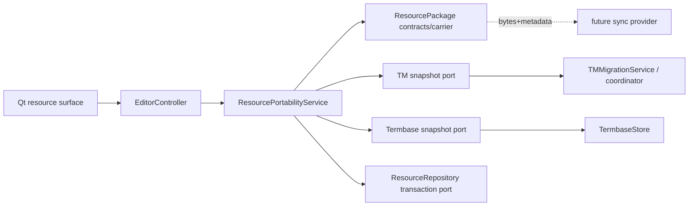
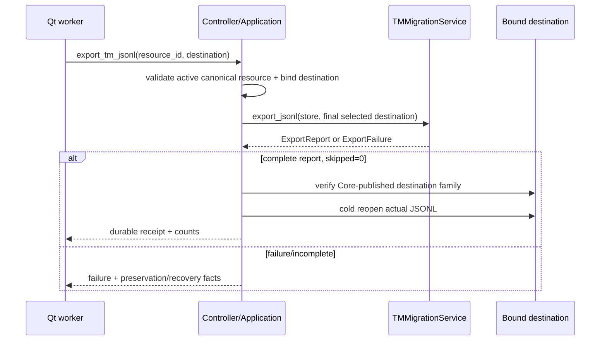
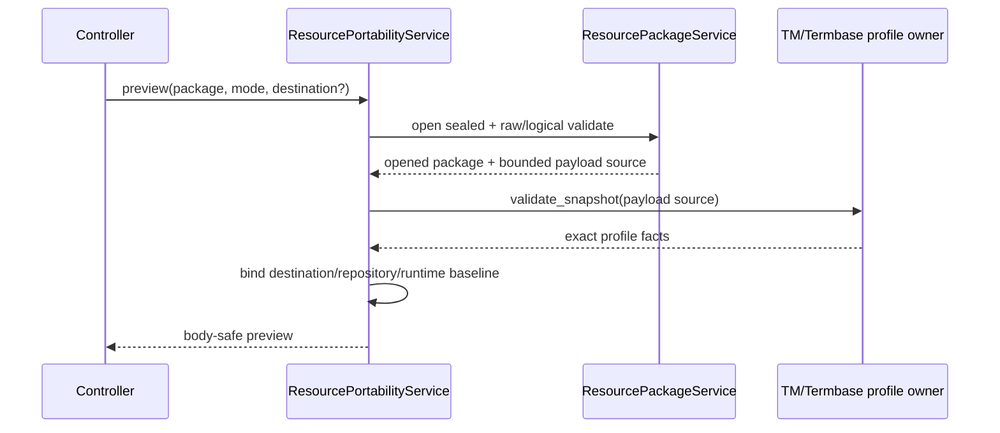
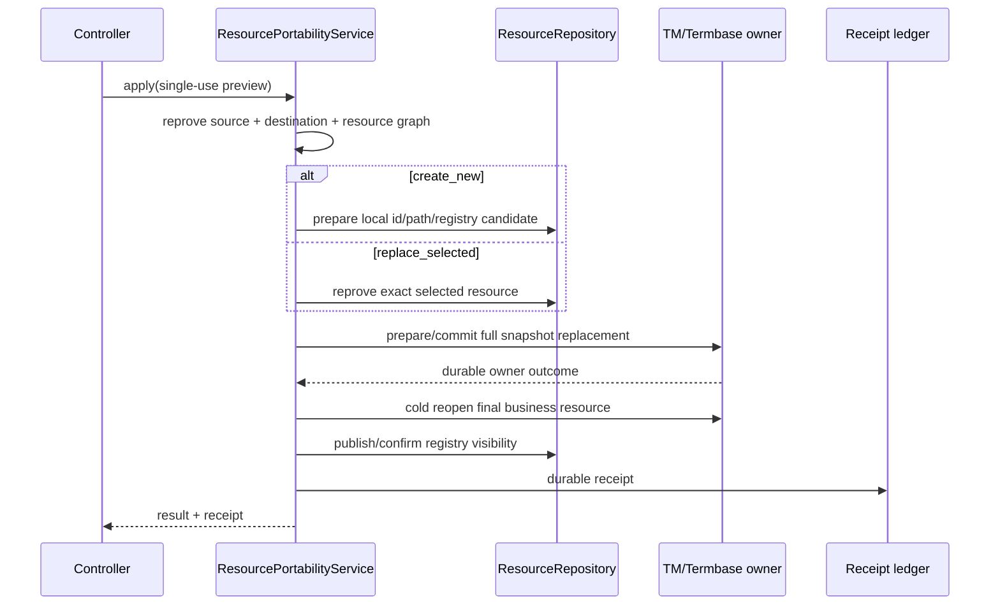

# Language Resource Portability 设计

## Overview

本设计在现有 TM/Termbase owner 之上增加一个资源快照编排层。它不解析 canonical TM SQLite，不定义 JSONL/CSV 记录 grammar，也不取得 local resource 的生命周期权威；它只调用资源 owner 发布的“完整快照导出/验证/替换”port，将已验证 payload 封装为独立 `ResourcePackage`，并负责 carrier、preview/apply stale binding、导出 destination 发布、receipt 和 recovery。

v1 关闭两个 profile：

- `localcat-tm-jsonl-v1`：字节只能由 `TMMigrationService.export_jsonl()` 产生；
- `localcat-termbase-csv-v1`：字节只能由 `TermbaseStore` 管理快照 encoder 产生，保留 legacy/v1 行事实。

两个产品出口使用同一 profile payload：

```text
Core/Store-owned snapshot export
          │
          ├── direct publish: .jsonl / .csv
          │
          └── ResourcePackage wrap: manifest.json + exact payload bytes
```

直接文件是近期人工兼容备份，不是 package。ResourcePackage 是带自身 schema/profile/validate/preview/apply/receipt 的单 artifact，供人工迁移以及未来 provider 原样传输。

### Goals

- 用真实 TM/Termbase 业务 owner 产生可复读快照，没有第二 grammar authority。
- 直接 JSONL/CSV 与 package payload byte-for-byte 同源。
- 单文件 deterministic ResourcePackage 可完整冷验证、预览、新建/替换导入与冷重开。
- 任何不完整导出不覆盖旧目标，任何不确定 apply 不报成功。
- 为后续 sync 提供 immutable bytes/metadata 与同一 import/apply 事务，不包含 provider 业务。

### Non-Goals

- 不传输/复制 live SQLite、WAL/SHM、sidecar、journal、stage、backup 或 recovery residue。
- 不实现 TMX；不定义 context/provenance 映射或有损报告。
- 不为 package import 做 record-level merge/LWW/conflict resolution。
- 不改 TM scorer/index/capability、Termbase matching 语义或资源显示顺序。
- 不与 ProjectPackage 抽象共同 manifest、identity 或 package service。

## Boundary Commitments

### This Spec Owns

- `ResourcePackageManifest` / `ResourcePackageReceipt` / validation/preview/result DTO 与 canonical codecs。
- `localcat-resource-package-zip-v1` raw carrier reader/writer。
- `localcat-resource-payload-set-v1` 与两个首批 profile adapter。
- direct export 和 package export 的 Application 编排、destination publication/recovery。
- package sealed validate、preview、create/replace apply 计划、receipt ledger 与发布后 cold reopen。
- Controller/Qt 人工入口和供 sync 消费的 immutable artifact port。

### Retained by Existing Owners

| Owner | Retained authority |
|---|---|
| `TMMigrationService` / TM Core | canonical snapshot capture、JSONL row grammar、ExportReport/SnapshotReceipt、import/rebuild generation publication/recovery |
| `SQLiteTMStore` / coordinator | live SQLite、generation、lease、schema、query/capability、canonical transaction |
| `TermbaseStore` | legacy/v1 row grammar、record validation、snapshot encode/decode、prepare/commit/LKG/recovery |
| `ResourceRepository` | local resource id/path/kind、registry publication and deletion |
| `EditorController` | current resource graph、busy/lifecycle coordination、runtime reload |
| `tmx-context-interchange` | future TMX payload grammar、context/provenance、loss report |
| `cross-device-sync-plugin` | provider bytes transfer、remote metadata、credentials/encryption、scheduling/conflict orchestration |
| `ProjectPackage` | project/document/segment identity、overlay、source reconciliation、project persistence |

### Allowed Primitive Reuse

ResourcePackage 可以复用或后续抽取以下无语义原语：

- bound-parent dirfd/no-follow open/replace/unlink/fsync；
- checked integer addition、bounded stream、SHA-256/CRC32；
- canonical JSON lexical scanner 的纯工具；
- 候选文件/LKG/journal 的存储原语。

这些原语不得知道 `ProjectPackageManifest`、`ResourcePackageManifest`、project/resource identity、profile 或 apply semantics。`project_package.py` 不是 ResourcePackage 的 runtime dependency。

## Governance Impact

- **ADR disposition**：本 R/D/T 已冻结单资源、strict deterministic ZIP 和 replace-only v1 语义，当前不另起跨 spec ADR。若未来将 carrier 提升为项目级持久格式决策，应另建本 spec ADR，不改写 ADR-018/019。
- **Implementation gate**：Requirements/Design/Tasks 已冻结；各 Cluster 仍须通过自己的业务与故障完成门。
- **Steering sync**：实现后才同步真实的 module/UI 事实，不在本规格生成提交中修改 Steering。
- **No common authority**：任何建议“将 ProjectPackage 泛化为 PackageBase”都属于新的设计变更，不是实现便利。

### Windows Compatibility Amendment WA-04

- **ADR mapping**：follow ADR-020/022。Resource owner 保留 payload/profile/carrier/preview/apply/receipt/repository lifecycle；platform/bootstrap 只交付 rooted/publish facts 与 bundle resource authority。
- **Port migration**：`resource_platform_io.py` 提供无业务语义的 retained-file stream/digest/copy 辅助；`resource_artifact_save.py`、`resource_package.py`、`resource_portability.py`、`resource_receipt_ledger.py`、`resource_repository.py` 与 `termbase_store.py` 消费 `RootedFileSystem`、`ProcessFileLock`、`BoundDirectoryPublisher`，不再内嵌 POSIX dirfd/flock/fsync 分支。
- **Frozen resources**：package/profile data 的 relative layout 由 ADR-022 manifest 与 trusted bundle root 解析；Resource 模块不从 CWD、checkout absolute path 或待验证 `__file__` 推断发行数据。
- **Verification**：direct/package export→validate→preview→create/replace→cold reopen 覆盖 Windows junction/swap/share/kill/recovery 和 non-repo CWD；最终由 TM/Termbase owner reader 与 receipt 闭合，不以 ZIP 可打开代替。

### ADR-027：ResourcePackage 输出锁收尾

- **Scope amendment**：已批准；只对 Windows `.localcat-resource` 导出使用平台输出锁闲置回收。普通锁和输出权威继续遵循 ADR-020/023；direct CSV/JSONL、import/apply、payload stage 清理、POSIX 与 frozen trust 不属于本修订。
- **Steering sync**：继承 Governance owner 的 ADR-027 与 ADR-020/023 取代元数据，不由本 Spec 重复修改 Steering。
- **Downstream revalidation**：Task 3.3a 依赖平台 Task 3.3a；重新验证 package 三种既有 payload profile 的 success/ledger failure/terminal failure 和 direct CSV/JSONL 不触发回收。Qt 仍只消费原 outcome，receipt/pending schema 不扩展。

## Architecture

### Dependency Map



依赖只向资源 owner 和中立 frozen contracts 流动。Package carrier 不导入 Controller/Qt/TM Store/TermbaseStore；profile adapter 在 Application 层将 carrier member handle 交给资源 owner。

### Proposed Modules

| Module | Responsibility |
|---|---|
| `resource_package_contracts.py` | leaf enums/DTO/limits/receipt codec; no Store/Qt/project imports |
| `resource_package.py` | strict ZIP raw reader/writer、logical manifest codec、sealed package handle |
| `resource_platform_io.py` | retained regular-file bounded stream/digest/copy；不持有 manifest/profile/resource 语义 |
| `resource_portability.py` | profile dispatch、direct/package export、validate/preview/apply/recovery coordination |
| `resource_receipt_ledger.py` | generic exact receipt persistence and path-free pending recovery inventory; no resource grammar/provider authority |
| `tm_resource_port.py` | narrow adapter over public TM export/import/rebuild facts; no JSONL grammar |
| `termbase_resource_port.py` | narrow adapter over TermbaseStore snapshot encode/validate/replace facts; no Parser column grammar |
| `resource_repository.py` | add staged-create/registry publication seam while retaining local identity authority |
| `editor_controller.py` | typed commands/projections and runtime refresh |
| `qt_settings_dialog.py` | async actions/dialog/feedback only |

最终文件分配可在 Cluster 0 characterization 后窄调整，但 owner/依赖方向不得改变。

### Cluster Placement of Publication / Receipt / Recovery

Cluster 1 在首个 direct export 宣称成功前，必须先落地通用 `ResourceOperationReceipt` exact codec、`ResourceReceiptLedger`、绑定目标的 artifact publication/LKG 与 path-free pending recovery inventory。这些基座同时服务 direct JSONL/CSV 和后续 ResourcePackage export，只记录有界操作证据，不解析 TM/Termbase 记录，不取得任何 canonical resource authority。

Cluster 3 不再重建通用 receipt codec/ledger 或 artifact publication；它只在 C1 基座上增加 import/apply pending-operation 状态机，以处理 owner 已发布但 registry/runtime/receipt/cleanup 未完成的冷恢复。Pending facts/LKG/stage 始终留在本地，不进入 transferable receipt metadata。

Windows ledger listing 只消费 platform 返回的有界 observation；每个候选仍须按相对名从同一 rooted authority 重新打开并复证 exact snapshot 后才能解码。Observation 既不是 receipt authority，也不是删除、替换或 CAS 授权。

## Profile Contracts

### `localcat-tm-jsonl-v1`

- **Producer**：`TMMigrationService.export_jsonl()` only。
- **Bytes**：该 service 发布前已验证的 UTF-8 JSONL destination bytes。
- **Validation**：TM owner 的 preflight/snapshot reader；ResourcePackage 只核对 member byte count/digest 与 returned valid/skipped counts。
- **Apply**：TM owner 的 full snapshot replacement transaction。
- **Success invariant**：`skipped_count == 0`，payload digest/count 与 `ExportReport`/profile validation 一致。
- **Direct export**：用户选择 `.jsonl`；既有 adjacent SnapshotManifest/receipt 事实依旧由 TM Core 管理。JSONL 单独搬运可作为兼容快照，但没有 ResourcePackage carrier/manifest 身份。

Package 不嵌入完整 `SnapshotReceipt`，避免随机 snapshot id 让同一 payload 导出成不同 package bytes。完整 TM receipt 只进入 package export operation receipt，其中 source-local resource/store 事实不授权导入 destination。

### `localcat-termbase-csv-v1`

- **Producer**：`TermbaseStore.export_portable_snapshot()`（待实现公开 port）。
- **Encoding**：UTF-8 BOM，LF，stdlib CSV canonical quoting，无 header。
- **Rows**：
  - legacy：`source,target`；
  - v1：`localcat-term-v1,record_id,source,target,match_case,whole_word`，boolean 只能为 lowercase `true|false`。
- **Validation**：`TermbaseStore.validate_portable_snapshot()` 复用受管 row grammar，返回 payload digest、record/legacy/v1 counts 与 exact frozen snapshot handle/facts。
- **Apply**：`prepare_snapshot_replace()` + existing-style commit/recovery，不经 Parser。
- **Direct export**：用户选择 `.csv`，发布 exact payload bytes。

本 profile 是 LocalCAT managed resource 交换/备份面，不声称为任意 CAT 的通用术语互换标准。

### Profile-set Versioning

`localcat-resource-payload-set-v1` 是闭集：

```text
(translation_memory, localcat-tm-jsonl-v1)
(termbase,          localcat-termbase-csv-v1)
```

对未知 profile 的包，carrier/manifest 可在不 materialize payload 时返回 `PROFILE_UNSUPPORTED`，但不能跳过 profile validation 去 apply。未来 `tmx-context-interchange` 完成 TMX grammar/context/loss 审批后，由本 spec 的后继版本增加新 profile-set id 和 adapter。

`localcat-resource-package-manifest-v1` + `localcat-resource-package-zip-v1` + `localcat-resource-payload-set-v1` 三元组唯一绑定 `localcat-resource-package-limits-v1`。Limit profile 不作为可被包自行选择的宽化字段；任何限额变化必须发布新的已批准三元组。

## Logical ResourcePackageManifest v1

Manifest 为 canonical UTF-8 JSON，v1 说明性 shape：

```json
{
  "schema": "localcat-resource-package-manifest-v1",
  "carrier_profile": "localcat-resource-package-zip-v1",
  "payload_profile_set": "localcat-resource-payload-set-v1",
  "resource": {
    "kind": "translation_memory",
    "payload_profile": "localcat-tm-jsonl-v1",
    "payload": {
      "path": "payload/tm.jsonl",
      "sha256": "...",
      "byte_count": 12345,
      "record_count": 123
    },
    "profile_counts": {
      "legacy_record_count": 0,
      "v1_record_count": 0
    }
  }
}
```

`profile_counts` 有 exact profile-specific closure：

- TM JSONL：`legacy_record_count=0` / `v1_record_count=0`，总数只由 `record_count` 表达；
- termbase CSV/v1：`legacy_record_count + v1_record_count == record_count`。

不把 `skipped_count` 放进 successful package manifest：包必须是完整 snapshot，任何 skipped/error 阻断 package publication，只在 failure report 中出现。不把 source local resource id/name/store id/revision 放进 manifest，使包身份只由 profile+payload content 决定。

Exact key order、escaping、UTF-8 normalization、integer lexical form 与 newline policy 由 contract/golden tests 冻结。未知 key、duplicate key、wrong type/value 全部 fail closed；不 last-key-wins。

## Physical Carrier v1

### Layout

TM package：

```text
manifest.json
payload/tm.jsonl
```

Termbase package：

```text
manifest.json
payload/termbase.csv
```

### ZIP Profile

`localcat-resource-package-zip-v1` 固定：

- classic single-disk ZIP，exact 2 members，`ZIP_STORED`；
- no ZIP64/encryption/data descriptor/extra/comment/prefix/trailing bytes；
- member order 如上，timestamp `1980-01-01 00:00:00`，creator/version/flags/regular-file permissions 固定；
- path 为 canonical UTF-8 forward-slash relative path，NFC 且 casefold 唯一；
- local header 与 central directory 的 name/CRC/size/offset/flags/method 精确一致；
- manifest 必须是第一个 member，payload 必须是 manifest 唯一声明的第二个 member。

### Limits

| Item | `localcat-resource-package-limits-v1` |
|---|---:|
| Artifact bytes | 512 MiB |
| Decoded payload bytes | 512 MiB |
| Manifest bytes | 1 MiB |
| Members | exactly 2 |
| Retained safe issues | 256 |
| JSON nesting depth | 32 |
| Member path | 255 UTF-8 bytes/segment, 1,024 total |

记录数、单记录/字段限制仍由 TM/Termbase profile owner 在 bounded payload 内执行；package 层只使用 checked exact non-bool integer 汇总计数，不静默宽化上游 accepted domain。

### Reader Algorithm

1. 通过 no-follow source boundary 打开 regular file，记录 device/inode/size/mtime 并保留 descriptor；
2. 检查 artifact byte limit，从同一 descriptor 复制到 sealed private temp 或保留 exact descriptor；
3. raw scan EOCD/central directory/local headers，拒绝非 profile envelope；
4. bounded stream manifest，运行 duplicate-key-aware canonical JSON parser；
5. 根据 manifest 锁定唯一 payload member，流式复算 CRC/SHA-256/count；
6. 将 retained bounded member source 交给 matching profile adapter 复读，核对 semantic counts；
7. 结束前再复证原 source path/descriptor facts；public report 不暴露 handle/temp path。

不调用 `extract()`/`extractall()`，不让 profile owner 访问 archive 中的任意路径。

## Core Contracts

### Leaf Enums

```python
class PortableResourceKind(Enum):
    TRANSLATION_MEMORY = "translation_memory"
    TERMBASE = "termbase"

class ResourcePayloadProfile(Enum):
    TM_JSONL_V1 = "localcat-tm-jsonl-v1"
    TERMBASE_CSV_V1 = "localcat-termbase-csv-v1"

class ResourceImportMode(Enum):
    CREATE_NEW = "create_new"
    REPLACE_SELECTED = "replace_selected"

class ResourceOperationKind(Enum):
    EXPORT_DIRECT = "export_direct"
    EXPORT_PACKAGE = "export_package"
    VALIDATE_PACKAGE = "validate_package"
    IMPORT_PACKAGE = "import_package"
    RECOVER = "recover"
```

`PortableResourceKind` 只是 package leaf 的两值闭集，不取得 resource repository authority。Existing `editor_contracts.ResourceKind` 在 Application adapter 中显式双向映射，leaf package contracts 不为了便利而导入整个 Editor contract module。

`VALIDATE_PACKAGE` 与 preview 是只读报告分类，不写 durable receipt；一次 apply 的成功 receipt 统一记为 `IMPORT_PACKAGE`。`RECOVER` 只描述恢复命令/结果，不新签一份脱离原 operation 的 receipt：complete 使原 pending receipt durable，rollback 清理已证明未发布的 pending 事实，manual 状态保持待处理。

### Manifest DTO

```python
@dataclass(frozen=True, slots=True)
class ResourcePayloadDescriptor:
    path: str
    sha256: str
    byte_count: int
    record_count: int

@dataclass(frozen=True, slots=True)
class ResourceProfileCounts:
    legacy_record_count: int
    v1_record_count: int

@dataclass(frozen=True, slots=True)
class ResourcePackageManifest:
    schema: str
    carrier_profile: str
    payload_profile_set: str
    resource_kind: PortableResourceKind
    payload_profile: ResourcePayloadProfile
    payload: ResourcePayloadDescriptor
    profile_counts: ResourceProfileCounts
```

DTO `__post_init__` 对 exact built-in types、lowercase SHA-256、路径/profile/kind 组合和 count closure 做完整校验。Canonical codec 不依赖 `dataclasses.asdict()` 或宽松 `json.loads()` default duplicate semantics。

### Snapshot Ports

```python
@dataclass(frozen=True, slots=True)
class PortableResourceSnapshot:
    kind: PortableResourceKind
    profile: ResourcePayloadProfile
    payload_digest: str
    payload_byte_count: int
    record_count: int
    legacy_record_count: int
    v1_record_count: int
    source_baseline_digest: str
    owner_receipt_digest: str | None

class PortableSnapshotExportPort(Protocol):
    def export_snapshot(self, destination: Path) -> PortableSnapshotExportOutcome: ...

class PortableSnapshotApplyPort(Protocol):
    def validate_snapshot(self, source: BoundedPayloadSource) -> PortableResourceSnapshot: ...
    def create_snapshot(self, local_identity: object, source: BoundedPayloadSource) -> PortableSnapshotApplyOutcome: ...
    def prepare_replace(self, source: BoundedPayloadSource, expected_baseline: object) -> object: ...
    def commit_replace(self, prepared: object) -> PortableSnapshotApplyOutcome: ...
    def cold_reopen(self) -> PortableResourceSnapshot: ...
```

Protocol 是说明性的最小行为面。实现时 TM 与 Termbase adapter 使用各自 exact DTO/错误，Application 做显式投影；不用一个可伪造的“通用 Store”对象取代 owner 准入。

`BoundedPayloadSource` 只提供限额流和 exact digest/count，不提供 archive path 或任意 member lookup。如 TM/Termbase 既有面只接受 `Path`，adapter 可将 exact member 复制到私有 regular-file temp，关闭/验证后交给 owner，不 extract 到用户目录。

### Validation / Preview

```python
@dataclass(frozen=True, slots=True)
class ResourcePackageValidationReport:
    artifact_digest: str
    artifact_byte_count: int
    manifest_digest: str
    carrier_profile: str
    payload_profile_set: str
    resource_kind: PortableResourceKind
    payload_profile: ResourcePayloadProfile
    payload_digest: str
    payload_byte_count: int
    record_count: int
    legacy_record_count: int
    v1_record_count: int
    safe_issues: tuple[str, ...]

@dataclass(frozen=True, slots=True)
class ResourcePackageImportPreview:
    operation_id: str
    mode: ResourceImportMode
    validation: ResourcePackageValidationReport
    destination_exists: bool
    destination_resource_id: str | None
    safe_warnings: tuple[str, ...]
    blocking_reasons: tuple[str, ...]
```

Public preview 不携 source handle、destination path/generation/token 或 apply capability 内部值。`ResourcePortabilityService` 私下保留 `_PreparedResourceImport`，绑定：

- exact sealed source artifact + manifest/payload digest/identity；
- selected profile adapter 的 exact behavior identity 与 validated payload handle；
- create mode 的 repository baseline/target parent facts，或 replace mode 的 resource id/kind/path/file identity；
- TM destination generation/head/binding facts 或 termbase file digest/record snapshot；
- Controller resource graph epoch/runtime generation；
- single-use random capability。

预览 DTO 与私有计划使用 service-owned mapping 及 exact Python object identity 相关联；从 JSON 重建或 `dataclasses.replace()` 得到相同字段 preview 不能获得 apply 权限。Controller 同时提供显式 cancel 命令，apply/cancel 均一次消费并关闭 retained sealed source；Qt close/cancel 必须调用该命令。

### Operation Receipt

```python
@dataclass(frozen=True, slots=True)
class ResourceOperationReceipt:
    receipt_schema: str
    operation_id: str
    operation_kind: ResourceOperationKind
    resource_kind: PortableResourceKind
    payload_profile: ResourcePayloadProfile
    source_resource_id: str | None
    destination_resource_id: str | None
    package_artifact_digest: str | None
    payload_digest: str
    destination_before_digest: str | None
    destination_after_digest: str | None
    record_count: int
    legacy_record_count: int
    v1_record_count: int
    skipped_count: int
    safe_warnings: tuple[str, ...]
    durable_state: str
```

TM export receipt 还通过 exact nested projection 绑定 canonical generation、exported revision、`SnapshotReceipt` digest；术语 export receipt 绑定 Store source baseline digest。为避免上述事实污染 manifest，receipt 位于包外的 Core-owned local operation ledger/返回值中。

Receipt codec 使用 exact canonical JSON 且与 DTO invariant 双向闭合。`durable_state` 是闭集 `committed|recovery_required`；失败不伪造 success receipt，而返回 `ResourceOperationFailure`。

## System Flows

### Direct TM JSONL Export



直接 TM JSONL 不在 `export_jsonl()` 外再套一次 replace/LKG 协议；Core 已经把用户路径与 adjacent SnapshotManifest 作为同一 destination family，成功只返回零 skipped/diagnostics 的 `ExportReport`，失败恢复 exact prior pair。Application 只复证 outcome 闭合并做产品投影。ResourcePackage 私有 stage 仍由同一 exporter 产生 JSONL+companion，但只封装 JSONL payload，stage companion 在封装后清理且不冒充 package manifest。

### Direct Termbase CSV/v1 Export

1. Controller 解析 local writable termbase、绑定 destination。
2. Termbase port 在 exact source baseline 上读取 records，输出 canonical payload candidate 并复读 row kind/id/flags/count。
3. Application 核对 source baseline 仍等于 capture，然后在 retained parent dirfd 上按 candidate/LKG 发布目标。
4. 从实际 destination 冷重开，生成 termbase export receipt。

### ResourcePackage Export

1. 通过 matching resource owner 向 private stage 导出 profile payload，得到 exact snapshot facts。
2. 要求零 skipped/error，重新从 staged payload 复读 digest/count/profile facts。
3. 生成 canonical manifest，建立 strict ZIP candidate。
4. 关闭 writer，用新 `ResourcePackageService` 实例冷验证 candidate，核对 logical content digest。
5. 复证 source resource baseline 与 destination parent/file binding。
6. 以 candidate/LKG 单点发布，从 actual destination 冷重开。
7. 原子写入 local receipt ledger，再向 Controller 返回 success。

Package export 的 logical content digest 为 canonical manifest bytes 与 payload descriptor 的稳定摘要；artifact digest 是完整 ZIP SHA-256。两者都进 receipt。

### Validate / Preview



`validate_resource_package()` 可独立返回报告后关闭所有 handle。`preview_resource_package_import()` 必须保留 sealed source/private payload 和 destination binding 至 apply/cancel，不能仅记录 digest 后在 apply 重新打开 source（hash-then-reopen）。

### Import / Apply



#### `create_new`

Repository 需增加一个 staged create seam：先在 managed root 分配 local id/path 和私有 registry candidate，但不让新资源进入 public list/runtime；profile owner 将 payload 发布到该本地 authority 并冷重开成功后，Repository 才发布 registry。如 registry publication 失败，coordinator 必须删除仅由本 operation 创建且身份已证明的新资源，或返回 recovery-required；不删除未知文件。

#### `replace_selected`

Preview 绑定 exact local `ResourceConfig`、path regular-file identity/digest，以及资源 owner 的 current generation/revision/binding 或 term snapshot facts。Apply 在首次 owner mutation 前复证。TM 使用 full generation replacement，termbase 使用 full managed snapshot replacement；不与 current rows merge。

#### Publication Ordering

1. source/destination/profile plan revalidation；
2. owner-owned prepared replacement + prior LKG/recovery proof；
3. owner publication；
4. independent owner cold reopen and semantic digest/count proof；
5. runtime graph reload/switch；
6. receipt ledger durable append；
7. cleanup/final result。

若 owner publication 已经 durable，但 runtime/receipt cleanup 失败，不得回滚已证明的新 canonical authority 到一个无法证明的旧态；返回 recovery-required，冷恢复以 owner journal + receipt ledger 事实判定 complete/rollback/hand-off。

## Export Publication and Recovery

Termbase direct export 与 ResourcePackage export 可共用 `ResourceArtifactSaveService`，但每种 artifact validator 是 exact profile behavior。TM direct JSONL 保留 `TMMigrationService.export_jsonl()` 已有的独立发布/恢复权威，不被新 service 双重包装。

### Destination Binding

- 用户选择的 ancestor symlink 可在选择边界 canonicalize 为真实 parent；从此只绑定 parent device/inode。
- destination 只允许 absent 或单链接 regular file；existing 文件绑定 device/inode/digest/size。
- candidate、LKG 与 destination 的 create/open/replace/unlink/fsync 全部相对 retained parent dirfd；不在 destructive step 重新解析 path。
- publication 要求 destination binding 的 inode+digest 都不变；“同字节换新 inode”仍 stale。

### Publication Phases

```text
STAGED -> VALIDATED -> LKG_READY -> PUBLISHED -> READBACK_PROVEN
       -> RECEIPT_READY -> COMPLETED/MANUAL_REQUIRED
```

发布过程在 retained parent descriptor 上持有 destination before fact、candidate digest/identity、LKG digest/identity 与 parent identity。`ResourceReceiptLedger` 只保存 path-free operation/receipt facts；不保存资源正文、绝对路径或用户目录扫描能力。

- `PUBLISHED` 之前故障：证明 destination 未变，清理 owned candidate/LKG；
- `PUBLISHED` 后验证失败且能证明 target==candidate：同步恢复 exact prior destination；
- target 未知或恢复结果不可证明：只返回 recovery-required/manual-required，不 unlink/replace；
- actual destination 冷重开与 receipt durable 之前不返回 success；receipt-ready 的终止清理可在 fresh process 中幂等完成。

### ResourcePackage 终结回调与输出锁收尾

当前 `ResourceArtifactSaveService.publish()` 的 `owner_commit` 只把 durable pending 推进到 receipt-ready；最终 `ResourceReceiptLedger.commit()` 在发布器返回后发生。因此不能在原发布器 `finally` 中凭“正常返回”直接回收锁。

`publish(..., owner_commit: Callable[[ResourceArtifactPublication, ValidationT], None], owner_finalize: Callable[[], None] | None = None)` 保留既有 tuple 返回值、validator 与 owner_commit 语义。只有 `export_package()` 提供 `owner_finalize`，由该回调提交同一 exact ready receipt；publisher 完成 retained readback、owner_commit、terminal reproof 与 owned LKG 清理后才调用它，且至多调用一次。原 package 调用方在返回后不重复 commit；direct CSV 不传该回调，原返回后 commit 路径不变。

```text
发布并读回 -> receipt-ready -> terminal reproof -> owned LKG 清理
        -> owner_finalize 提交既有 receipt -> 正常结束 retained publication
        -> finish_output_lock 消费 lease -> 返回原导出 outcome
```

- publisher 不导入 ledger，不持久化新的 operation 状态，也不把 parent/lease 暴露给 Qt 或公开 receipt。`resource_portability.py` 仍拥有 pending 与最终回执，`resource_artifact_save.py` 只调回调并在安全的终结位置消费可选平台 port。
- owner_finalize 或之前任何 publish/readback/terminal/cleanup 失败，不请求锁回收；沿既有 receipt-ready/manual/recovery-required 语义传播，保留恢复事实，不因 callback 迁移而把失败变为 success 或重复写回执。
- 回调正常结束且 retained publication 正常 close 后，才在 parent 仍存活时请求 `finish_output_lock(parent, lease)`；缺少可选能力时普通 close。平台 `IN_USE`/`NOT_PROVEN` 不改变已闭合 outcome；retained publication close 不确定时只保留普通锁，不宣称清理完成。
- 终结资格仅说明本次 operation 已闭合，不证明没有另一进程的 pending/recovery。不扩展 path-free receipt 格式，不建立跨进程输出路径映射，不扫描 AppData 或输出目录认领其他 operation。
- **文件边界与验证**：修改 `resource_artifact_save.py` 的可选终结 seam 和 `resource_portability.py` 的 package 单次 commit 编排；新增 `tests/test_resource_output_lock_retirement_windows.py` 验证无竞争时只保留最终包、三种既有 profile 冷验证与原 receipt 一致、ledger/terminal 失败保留锁、平台收尾失败不推翻回执、direct CSV/JSONL 不调用能力。payload handler 与随机临时正文的清理不归本修订。对应 6.7–6.8。

## Receipt Ledger（Cluster 1 通用基座）

`ResourceReceiptLedger` 是 Core/Application-owned 本地操作证据，不是 resource canonical store。建议布局：

```text
<config>/resource-portability/
  receipts/<operation_id>.json
  pending/<operation_id>.journal
```

实现必须使用 repository-owned safe root、exclusive temp、fsync、atomic replace 和 exact receipt codec。Receipt 可作为未来 sync metadata 消费，但 pending journal/LKG/stage 不可离开本地。

Cluster 1 先用该基座闭合 direct export 与通用 artifact publication/receipt finalization；Cluster 2 package export 复用同一 codec/ledger/publication seam。Cluster 3 只向 `pending/` 增加 import/apply 的 owner-publication、registry/runtime switch 与 receipt-finalization phase，不新建第二 ledger authority。

`ResourceReceiptLedger` 已作为 v1 持久 owner 冻结；不允许将 receipt 只留在 Qt 内存中而仍声称 durable。

本地恢复物的 owner 边界保持分离：`ResourceArtifactSaveService` 只拥有单个外部 destination 的 candidate/LKG，`TermbaseStore` 只拥有术语 snapshot 的 stage/recovery，`ResourceReceiptLedger` 只拥有 pending/receipt，`ResourceRepository` 只拥有 managed resource identity 与 registry publication。任一 observation 或 success receipt 都不能替代另一 owner 的 exact identity proof。

Windows source-lane acceptance 的 cold reopen 是退出当前进程后由 fresh process 重建 Repository、ledger 与 owner reader；OS reboot 可作为开发/候选环境的补充兼容证据，但不成为最终用户首次运行或日常操作的前置步骤。

## Error Semantics

Public errors 为 `ResourcePortabilityError(code, retryable=False)` 及 frozen failure DTO。`str(error)` 只包 stable code，known OS/store failure 在 Application boundary 按 phase 映射，原异常仅作为不可展示 cause。Programmer faults 不被包成输入错误。

| Domain | Stable codes |
|---|---|
| Contract | `RESOURCE.PORTABILITY.CONTRACT_INVALID`, `KIND_MISMATCH`, `PROFILE_UNSUPPORTED`, `LIMIT_EXCEEDED` |
| Package source | `RESOURCE.PACKAGE.SOURCE_UNSAFE`, `FORMAT_UNSUPPORTED`, `MANIFEST_INVALID`, `MEMBER_INVALID`, `DIGEST_MISMATCH`, `COUNT_MISMATCH` |
| Export | `RESOURCE.EXPORT.SNAPSHOT_UNAVAILABLE`, `SNAPSHOT_INCOMPLETE`, `STAGE_FAILED`, `VALIDATION_FAILED`, `DESTINATION_STALE`, `PUBLICATION_FAILED`, `RECOVERY_REQUIRED` |
| Preview/apply | `RESOURCE.IMPORT.PREVIEW_STALE`, `SOURCE_STALE`, `DESTINATION_STALE`, `DECISION_REQUIRED`, `APPLY_FAILED`, `COLD_REOPEN_FAILED`, `RECOVERY_REQUIRED` |
| Receipt | `RESOURCE.RECEIPT.INVALID`, `LEDGER_FAILED`, `RECOVERY_REQUIRED` |

Safe issue/warning tuple 只可使用 allowlisted stable codes，数量截断必须显式报告；不将 raw parser/store diagnostic message 拼进 public output。

## Controller / Qt Design

### Controller Commands

```python
export_tm_jsonl(resource_id, destination) -> ResourceExportOutcome
export_termbase_csv_v1(resource_id, destination) -> ResourceExportOutcome
export_resource_package(resource_id, destination) -> ResourceExportOutcome
validate_resource_package(source) -> ResourcePackageValidationReport
preview_resource_package_import(source, request) -> ResourcePackageImportPreview
apply_resource_package_import(preview) -> ResourcePackageImportResult
cancel_resource_package_import(preview) -> None
inspect_resource_portability_recovery() -> tuple[ResourceRecoveryPreview, ...]
recover_resource_portability(preview, action) -> ResourceRecoveryOutcome
```

Controller 先校验 issued resource identity/current graph epoch，再调用 Application service；不解析 manifest/profile。Apply 成功后 Controller 以 receipt 的 destination resource id 定向 reload，不根据列表 index 猜测资源。

### Qt Surface

- TM `⋮`：`导出兼容 JSONL…`、`导出资源包…`；
- Termbase `⋮`：`导出 CSV/v1…`、`导出资源包…`；
- 资源页入口：`导入资源包…`，validate 后展示 kind/profile/counts，选择“新建资源”或同 kind 现有资源；
- replace 必须第二次明示确认，当前资源忙、隔离或 lifecycle 不可替换时禁用；
- export/validate/apply/recovery 都在 worker 中，与 TMX/术语导入、TM lifecycle、term CRUD 使用一个 resource-operation gate；
- Qt 只显示用户已选路径和 body-safe report，不把 Core error 与路径字符串拼接后写日志。

## Sync Handoff

### Immutable Artifact Port

```python
@dataclass(frozen=True, slots=True)
class ResourcePackageTransferMetadata:
    artifact_sha256: str
    artifact_byte_count: int
    manifest_schema: str
    carrier_profile: str
    payload_profile_set: str
    resource_kind: PortableResourceKind
    payload_profile: ResourcePayloadProfile
    payload_sha256: str
    record_count: int

class ResourcePackageArtifact:
    metadata: ResourcePackageTransferMetadata
    def open_bounded_stream(self) -> ContextManager[BinaryIO]: ...
```

Port 不暴露 path、member lookup、manifest parser 或 apply handle。Provider 下载后必须把收到的单 artifact 交给 `validate_resource_package()`，metadata 只能用于列表/传输前筛选，不能替代包内验证。

## Compatibility Decisions

- 现有 `TMMigrationService.export_jsonl()` API/产物语义不修改；新 Application adapter 消费其 outcome。
- 现有 TMX import 继续是 language-resource import，不因 ResourcePackage 而变成 package profile。
- 现有 termbase CSV/XLSX explicit-column import 继续 merge；ResourcePackage termbase import 是 exact snapshot replace。
- 旧 resource registry schema 必须可原样重开；如 staged-create 需要 registry 新版本，必须提供独立迁移/回滚证据，不将 pending operation 写成 active resource。
- 第一版不依赖 provider、network、daemon 或登录态。

## Testing Strategy

### Contracts / Canonical Codecs

- exact type/subclass/bool-as-int、tuple/private copy、digest/count closure；
- duplicate/extra/missing JSON keys、错误 profile-kind/path、canonical encode/decode golden；
- receipt encode/decode 与未知 version fail closed；
- limits 的边界值、checked addition 和 safe issue truncation。

### Carrier

- deterministic same payload -> same ZIP bytes；
- local/CD name/CRC/size/offset mismatch、gap/overlap、duplicate/missing/extra member；
- compression/ZIP64/encryption/data descriptor/extra/comment/external attrs/prefix/suffix；
- path traversal/backslash/NUL/NFC/casefold、artifact/member/manifest limits；
- sealed same-inode same-size rewrite、new-inode same-bytes replacement、ancestor/parent replacement。

### TM Profile

- 真实 active canonical store -> `export_jsonl()` -> exact direct/package payload；
- generation/revision/receipt digest/count 闭合，skipped/error 阻断 package；
- import/rebuild 只经 owner transaction，prior generation 保留/恢复；
- JSONL 记录字段与 context/provenance 字节由 owner round-trip 验收，package 测试不重写 grammar。

### Termbase Profile

- mixed legacy/v1、quotes/newlines/BOM、empty resource、duplicate source/id 与 invalid bool；
- direct/package payload exact equality；
- create/replace 后 row kind/id/source/target/match_case/whole_word exact equality；
- 证明 ResourcePackage path 不调用 Parser column-selection merge。

### Publication / Recovery

- stage/write/fsync/close/cold validate/LKG/replace/readback/ledger/cleanup 每一 fault；
- first export LKG None，existing target exact restore，unknown target 不删除；
- terminal cleanup 中断的 fresh recovery idempotence；
- create-new registry publication 与 resource publication 故障矩阵；
- replace-selected 的 source/destination/resource graph/generation stale 零 mutation。

### Controller / Qt / Architecture

- menu 可达性、file filters、worker busy/cancel/close、create/replace confirmation、structured feedback；
- Qt/Controller 不导入 zipfile/csv/JSONL parser/Store internals；
- package 不导入 `project_package`，ProjectPackage 不导入 resource package；
- ResourcePackage 模块不出现 TM JSONL row keys 或 termbase CSV row parser；
- sync/TMX/provider 类型不进首批 production roots。

## Requirements Traceability

| Requirement | Components | Verification |
|---|---|---|
| 1 Authority | leaf contracts, architecture guards | import/AST/closed-schema tests |
| 2 TM payload | TM adapter, direct/package exporter | real Core export + digest/receipt tests |
| 3 Termbase payload | Termbase snapshot port | mixed legacy/v1 round-trip |
| 4 Manifest/profile/limits | contracts + canonical codec | hostile JSON/limit matrix |
| 5 Carrier | resource package reader/writer | raw ZIP adversarial suite |
| 6 Export publication | artifact save/recovery | full fault matrix + cold recovery |
| 6.7–6.8 Windows 输出收尾 | package finalization、可选平台输出锁能力 | 单次 ledger commit、异常保留、无竞争目录结果与 direct 路径隔离 |
| 7 Validate/preview | sealed package + prepared import | zero-write/stale/forgery tests |
| 8 Import/apply | repository + TM/Termbase owner ports | create/replace/cold reopen/faults |
| 9 Reports/receipts | receipt codec/ledger | closure/serialization/restart tests |
| 10 Controller/Qt | commands/workers/dialog | QtTest user journeys |
| 11 Sync/TMX boundary | transfer metadata port/guards | negative capability/import tests |
| 12 Completion | cumulative suites/evidence | current-source acceptance + review |

## Completion Conditions

1. R/D/T 保持一致且各 Cluster 完成门通过后才有 production GO。
2. 直接 TM JSONL 与 package TM payload 从同一 `export_jsonl()` 产物对账；无 skipped/error。
3. 术语 direct/package/create/replace/cold reopen 保留 mixed legacy/v1 行及匹配 flags。
4. ResourcePackage strict carrier hostile matrix、destination fault/recovery 和 preview stale 全部通过。
5. 从最终本地 TM/Termbase 业务 reader 冷重开并与 receipt 对账；不用“ZIP 可打开”代替。
6. ProjectPackage/TMX/provider/live SQLite/Fuzzy/CONTEXT 权威均未进入本实现。
7. Controller/Qt 人工闭环、既有 TM/术语兼容回归和 final cumulative architecture 证据全部 fresh 通过。
