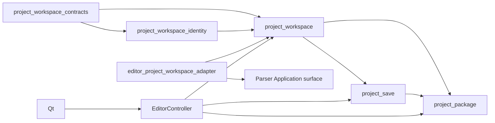

# 多文档项目工作区设计

## 概述

本设计在 Parser/Codec 的单输入结果与 `EditorController` 之间建立格式中立的 `Project → Document → Segment` 工作区，并以版本化 `ProjectPackage` 作为首个真实多文档持久载体。目标不是让当前编辑器一次扫描整个文件夹，也不是提前实现 multi-sheet XLSX 或 RPY；目标是先冻结可移植身份、聚合、source reconciliation、保存/恢复和手工包闭环，让后续 origin adapter、协作 chunk 与同步只能消费这些已验证合同。

当前单 JSON 路径继续可用。Cluster 1 通过 compatibility adapter 把一个 LocalCAT JSON 映射为一个 Project/Document，不要求用户先迁移，也不改变 `load_project()` / `save_project()` 的公开行为。Cluster 2 才建立多文档聚合与 `ProjectPackage`；第一种真正承载多个 Document 的生产 substrate 是 ProjectPackage import，不是 folder scan、workbook sheet 枚举或 RPY folder。

持久权威关系为：

```text
Parser / Format codec
    │  单输入 ParsedDocument、source snapshot、live capability
    ▼
Application adapter
    │  显式映射；不复制 grammar
    ▼
Project workspace ───────────────> ProjectPackage
    │  identity/order/target/        多文档 canonical workspace persistence
    │  confirmation/reconcile
    │
    ├── explicit source write-back ─> single file / directory / workbook
    │                                  仅在 live writer capability 获批时
    ├── Controller / Qt
    ├── future Chunk（只引用 segment identity）
    └── future Sync（只传输已验证 package bytes/receipt）
```

外部 origin/source binding 不是第二份 workspace authority。它提供 source 更新和未来可选回写目标；一旦项目由 ProjectPackage 持久，target、确认状态、Document 顺序与复合身份以包内工作区为准。reader-only source 的 target 由逻辑 Editing Overlay 保存，原 source member 的 bytes 保持不变，系统不得因此声称原格式可写。ProjectPackage是persistence/substrate，不伪装成第四种source origin。

### 设计目标

- 冻结 Project/Document/Segment immutable contracts 与稳定复合身份。
- 分离 `single_file` / `directory` / `workbook` source origin、设备本地 source binding 和 ProjectPackage persistence binding；origin叶合同本身不授权后置profile。
- 保持 display name/order 与持久身份正交，禁止用 sheet 名、显示名或列表位置重铸 ID。
- 只按稳定 ID 与 source fingerprint reconciliation；不按当前索引或正文相似度猜测重关联。
- 为当前 single-file/ProjectPackage 与后续 directory/workbook profile 冻结诚实的保存/恢复语义；directory 不虚构跨文件原子性，workbook 只按单文件原子替换。
- 建立逻辑与物理 `ProjectPackage` 的 export/validate/preview/import/apply/receipt 同一闭环。
- 把 `codec_private_member` 作为 codec-owned opaque bytes 保存、校验和原样搬运，workspace/UI/chunk/sync 均不解释。
- 冻结 path normalization、stale preview、body-safe error、版本化 limits 与 legacy single JSON compatibility adapter。
- 为 Controller/Qt 提供章节导航、连续扁平视图和 `current_document` / `entire_project` search scope，但不提前加入 chunk 控件。

### 非目标

- 不在本规格实现 directory discovery、多 JSON folder、multi-sheet workbook profile、RPY 或 XLIFF codec。
- 不给 TXT、PO、POT 或其他 reader-only 格式补 source writer；它们的 target 只能由 ProjectPackage 工作区持久。
- 不实现 TMX project opening、TMX context/provenance/export，也不改变 TMX 的 `language_resource` purpose；任何TMX-as-project组合必须在铸造project/document identity前拒绝。
- 不实现 CONTEXT evidence 字段或 “上下文一致” UI；该表面仍归 Integration TM owner。
- 不实现 chunk membership、split/merge、assignment、permission 或 `current_chunk` UI。
- 不实现 provider、S3/WebDAV、remote listing、凭据、加密、同步 planner 或冲突自动合并。
- 不建立 ProjectPackage/ResourcePackage 的共同 manifest、identity、authority 或 merge layer。
- 不在同步主线前实现 `rpy-project-codec`；RPY 的 token/sidecar/writer 继续由后续 codec/ACL 独占。
- 不修改 canonical TM、Fuzzy qualification、TM Store、术语资源或 live SQLite。

## Boundary Commitments（边界承诺）

### 本规格拥有

- Project、Document、Segment、origin、persistence binding、dirty、progress 与 search scope 合同。
- portable project/document/segment identity 与 source-ref normalization。
- 多个单输入文档的聚合、确定性顺序和扁平导航投影。
- source reconciliation preview/apply、removed 决策与 target/confirmation 保留规则。
- ProjectPackage 的逻辑 schema、C2C人工门获批的物理carrier profile、member digest、limits 与操作 receipt。
- ProjectPackage export/validate/preview/import/apply 的唯一 Application authority。
- single-file/workbook 原子替换与 directory 分阶段写入/恢复报告的 project-level orchestration。
- 当前单 JSON 到单 Document workspace 的兼容映射；旧入口在迁移期间只保留一条受测 adapter 路径。

### 保留在既有或未来 owner

| Owner | 保留权威 |
|---|---|
| Parser Foundation | 单输入 source boundary、purpose/format selection、codec registry、ParsedDocument、verified terminal、limits 与 source snapshot |
| Format codec / plugin | tokenization、source/target 字段映射、writer capability、round-trip token/sidecar、格式专属验证 |
| Existing single JSON facade | Cluster 1 之前和未显式提升为 package 的 legacy `load_project()` / `save_project()` 行为 |
| `collaborative-job-chunks` | chunk identity、membership、split/merge、assignment、permission、chunk progress |
| `language-resource-portability` | TM JSONL、术语 CSV/v1、ResourcePackage manifest/profile、资源 import/export receipt |
| `cross-device-sync-plugin` | provider、remote plan、凭据、加密、远端冲突与操作日志 |
| `rpy-project-codec` | RPY grammar、repository ACL、token/sidecar、占位符保护、source round-trip writer |
| `tmx-context-interchange` | TMX export profile、context/provenance 与有损取舍 |
| Integration TM surface | CONTEXT 能力与最小 UI 标签；不由项目工作区推导 evidence 字段 |

### 禁止进入通用工作区

- Qt widget、TM Store、SQLite、provider SDK、账号或远程凭据；
- RPY token、XLSX cell/style、PO entry 等格式私有类型；
- 对 `codec_private_member` 的 JSON/XML/pickle 解析、字段合并或语义比较；
- 从扩展名、sheet/display name、数组位置或 source/target 正文猜测持久身份；
- writer capability 的持久授权。包内 capability 只能作说明，实际回写必须重新取得 live codec capability；
- Fuzzy attestation、device key、qualification artifact、live SQLite sidecar/journal/stage residue。

## Governance Impact（治理影响）

- **Applicable Steering**：`product.md`、`structure.md`、`tech.md`、`roadmap.md`、`spec-ownership.md` 与本规格 border。
- **Applicable ADRs**：ADR-014（设备本地偏好不污染项目包）、ADR-015（Parser/Codec 中立边界）；新增 ADR-018。
- **ADR disposition**：ADR-018 冻结 ProjectPackage/workspace 的多文档持久权威、origin/write-back 边界与 ProjectPackage/ResourcePackage 分离；不取代 ADR-014/015。
- **Scope amendment**：不修改已完成 Parser 的单输入合同；本规格接续 Parser 明确延期的 multi-document/ProjectPackage scope。folder/workbook/RPY 仍须各自规格批准。
- **Steering sync**：C0 只建立 ADR、Requirements、Design、Tasks 与 border，不修改 runtime。真实模块落地并通过对应 Cluster gate 后，`structure.md` / `tech.md` 只同步已实现事实；Feature GO 再一次闭合 roadmap/ownership disposition。
- **Downstream revalidation**：Cluster 2 完成后，`language-resource-portability` 才可借鉴已验证的原子写、digest、preview、receipt 原语起草独立 R/D/T；Chunk 必须等待 C2A/C2B/C2C，Sync 必须消费 ProjectPackage/ResourcePackage，RPY 产品顺序在 Sync 后。

## Critical Path 与验证锚点

```text
C0 规格/ADR
  → C1 identity/origin/single-JSON adapter
    → C2A aggregation/reconciliation
      → C2B save/recovery
        → C2C ProjectPackage logical + physical closure
          → C3 Controller/search scope
            → C4 Qt/current-source acceptance

C2A + C2B + C2C
  → collaborative-job-chunks

C2C
  → language-resource-portability 独立 R/D/T
  → cross-device-sync-plugin（另需 ResourcePackage）
```

每簇验证前必须锚定以下现象：

| Cluster | 验证目标 | 必要前置能力 |
|---|---|---|
| C0 | R/D/T/ADR/border 一致，runtime 零 diff | 用户边界、ADR-015、brief |
| C1 | 同一单 JSON 冷重开后 Project/Document/Segment identity 与 legacy 行为不变 | 规范化 source_ref、兼容 adapter |
| C2A | 重排/改名不改 ID；source_changed 保留 target 并撤销确认；removed 不被静默丢弃 | C1 identity、版本化 fingerprint |
| C2B | 单Document save只清其baseline；发布不确定保留LKG/dirty并可冷恢复；future directory/workbook模型不虚构原子性 | C2A workspace、carrier-neutral staging/report/recovery |
| C2C | 一个真实多 Document 包经 export→cold validate→preview→import/apply→cold reopen 后身份、顺序、target 与 opaque member 精确保持 | C2A/C2B、获批物理carrier、stale binding |
| C3 | current-document 与 entire-project 共用同一 matcher，hit 绑定复合身份 | C2C 已有真实多文档 session |
| C4 | UI 在真实多文档包上显示章节分隔、跳转和保存/失败反馈 | C3 Controller API，不直接读 manifest |

在 C2C 通过前，不得用两个手工构造的内存 Document 宣称“多文档产品已完成”；真实验收必须走 ProjectPackage 目标业务 API。

## 架构

### 分层与依赖方向



- contracts/identity 不导入 Parser、Controller、Qt、TM、provider 或具体 codec。
- workspace 聚合只消费 Application 已映射的 immutable document facts。
- adapter 是 Parser 与 workspace 的唯一映射层；workspace 不注册 codec，不打开 source。
- save coordinator 只消费 live writer port 和 caller-owned destination binding；不解析格式。
- project package 独占 logical grammar、获批carrier validation 与 install protocol，不进入 Parser codec registry。
- Controller 组合 workspace/search/save/package；Qt 只消费 Controller 与 frozen view contracts。
- Chunk/Sync/ResourcePackage 可以依赖公开的 immutable identity/package port；Project workspace 不反向导入它们。

### 文件结构计划

仓库继续使用平铺 Python 模块：

| 文件 | 单一责任 | 首次落地 |
|---|---|---|
| `project_workspace_contracts.py` | frozen 项目、文档、段落、origin、dirty、search、reconcile/save/package report 合同与错误码 | C1 |
| `project_workspace_identity.py` | ID、portable source_ref、member path、canonical digest 与 limits 验证 | C1 |
| `project_workspace.py` | 已验证 Document facts 的聚合、扁平投影、progress、dirty、reconciliation stage/preview/apply | C2A |
| `project_workspace_intake.py` | Application 层 rooted 显式文件选择、Parser verified terminal 与中立 Document facts 映射 | C2A |
| `editor_project_workspace_adapter.py` | LocalCAT JSON 单文档兼容映射及 legacy projection | C1 |
| `project_save.py` | carrier-neutral candidate/LKG、逐Document baseline、journal与save/recovery report；后续origin原子性policy seam | C2B |
| `project_package.py` | ProjectPackage v1 logical grammar、获批physical carrier、export/validate/preview/import/apply/receipt | C2C |
| `editor_controller.py` | session/revision/current document/search/save/package Application commands | C3 |
| `project_search.py` | 在既有 matcher 上增加 scope 与复合 hit identity，不复制 matcher | C3 |
| `qt_editor.py` / Qt view modules | 章节选择、分隔、范围文案、报告展示 | C4 |

文件名是 Design 级所有权。实现可在不改变依赖方向和唯一 authority 的前提下合并纯 helper，但不得把 package grammar 放回 `editor_project.py`，也不得让 Controller/Qt 解析 manifest。

## C1：身份、Origin 与单 JSON 兼容

### Project/Document/Segment 合同

核心合同为 exact frozen dataclass；下面是字段级 shape：

```python
class ProjectOriginKind(Enum):
    SINGLE_FILE = "single_file"
    DIRECTORY = "directory"
    WORKBOOK = "workbook"

class ProjectPersistenceKind(Enum):
    LEGACY_SINGLE_JSON = "legacy_single_json"
    PROJECT_PACKAGE = "project_package"

@dataclass(frozen=True, slots=True)
class ProjectOrigin:
    kind: ProjectOriginKind
    profile_version: str
    portable_root_ref: str

@dataclass(frozen=True, slots=True)
class CodecPrivateMemberRef:
    member_path: str
    sha256: str
    byte_count: int
    codec_identity: CodecIdentity
    profile_version: str

@dataclass(frozen=True, slots=True)
class ProjectSourceSegment:
    local_segment_id: str
    source: str
    raw_speaker: str
    source_fingerprint: str

@dataclass(frozen=True, slots=True)
class EditingOverlayEntry:
    document_id: str
    local_segment_id: str
    source_fingerprint: str
    target: str
    confirmed: bool
    saved_state_digest: str

@dataclass(frozen=True, slots=True)
class ProjectSegment:
    identity: SegmentIdentity
    source: str
    target: str
    raw_speaker: str
    confirmed: bool
    source_fingerprint: str

@dataclass(frozen=True, slots=True)
class ProjectDocument:
    document_id: str
    source_ref: str
    display_name: str
    order: int
    format_id: str
    codec_identity: CodecIdentity
    writer_capability_snapshot: WriterCapabilitySnapshot
    source_snapshot_digest: str
    source_segments: tuple[ProjectSourceSegment, ...]
    editing_overlay: tuple[EditingOverlayEntry, ...]
    codec_private_member: CodecPrivateMemberRef | None

@dataclass(frozen=True, slots=True)
class ProjectWorkspace:
    schema_version: int
    project_id: str
    name: str
    source_locale: str
    target_locale: str
    origin: ProjectOrigin
    persistence_kind: ProjectPersistenceKind
    documents: tuple[ProjectDocument, ...]
```

`CodecIdentity` 在实现中可复用 Parser 的中立值对象或映射为等价叶 primitive；workspace 不得因此导入具体 codec。包内 codec identity 只绑定 opaque member 与来源，不授予 writer。

`ProjectSegment` 是 workspace 将 exact source segment 与 exact overlay entry按复合 ID合成的immutable view，不是第三份持久正文。source member与overlay member仍是唯一package事实；两者不能完整一对一闭合时不发布该view。

不变量：

1. `project_id` 在 package export/import、设备移动和 origin 路径重新绑定后不变。
2. `document_id` 在 display name 修改、章节重排和包路径改变后不变。
3. 项目内 segment identity 是 exact 二元组 `(document_id, local_segment_id)`；不通过字符串拼接形成第二种规范 ID。
4. `local_segment_id` 在一个 Document 内唯一；相同 local ID 可合法出现在不同 Document。
5. `documents` 顺序必须与 `order=0..n-1` 一致；order 只是持久排序事实，不参与 identity。
6. `source_ref` 是 source member 的 portable relative reference；绝对本机路径不进入 ProjectPackage。
7. 空 source、重复 ID、错误顺序、无文档项目、非法 digest/enum/limit 在构造时 fail closed。
8. source/speaker 位于 source projection；target/confirmed/需复核状态只位于 Editing Overlay。overlay 必须一对一引用现存复合 ID并绑定相同 source fingerprint。
9. writer capability snapshot 只描述导出时观察到的能力，不是 live writer 授权；绝对 path、live writer、session/revision、打开的文件句柄不进入 immutable package graph。

### ID 产生与规范

ProjectPackage v1 的可移植 ID 采用闭合 ASCII token：

- `project_id = "prj-" + 64 lowercase hex`；
- `document_id = "doc-" + 64 lowercase hex`；
- `local_segment_id` 保留 codec 产生的 exact non-empty opaque string，但一旦提升为 Workspace/ProjectPackage v1，UTF-8 最多 1024 bytes且不得含 NUL/control/surrogate；不符合者不改写 ID，而是结构化拒绝该次提升，旧 `load_project()` / `save_project()` 仍独立可用；
- 新 project 使用 256-bit cryptographic random seed 的 SHA-256 token；测试可注入 deterministic ID issuer，但生产不得用 display/order/time 单独生成；
- `explicit-selected-files-v1` intake 的 document ID 使用 `SHA256("localcat.document.explicit-selected-files.v1\0" || normalized_source_ref)` 一次性确定，随后由 ProjectPackage 原样持久；同一项目内规范化 ref collision 在签发前拒绝；
- legacy single JSON adapter用带domain separator的device-local origin key产生project ID，并用normalized source_ref产生document ID，随后由package原样持久；
- manifest 已提供合规 ID 时必须保留，不得因 source_ref 或显示名变化重发 ID。

legacy derivation 使用长度前缀的 UTF-8 fields：

```text
SHA256("localcat.project.single-json.v1\0" || device_local_origin_key)
SHA256("localcat.document.single-json.v1\0" || normalized_source_ref)
```

`length_prefixed_utf8` 的 v1 字节合同固定为“8-byte unsigned big-endian UTF-8 byte length + exact UTF-8 bytes”；不得改用字符数、平台字节序或可变长整数。`device_local_origin_key` 必须是已验证 absolute lexical binding 的 64 位 lowercase SHA-256，不能把 `source_ref` 直接当 project binding key。

`device_local_origin_key`是对已验证single-file绝对lexical binding的body-safe digest，不把绝对path写进package；同一路径内容替换后仍稳定，legacy文件移动可被视为新binding，显式export后则由manifest ID脱离路径保持稳定。这只给未带manifest的既有单JSON建立兼容身份；它不是未来目录或workbook的ID方案。后续获批origin adapter必须优先使用已有manifest ID；无manifest时只能按其获批profile产生一次ID并立即写入ProjectPackage。

### Portable source_ref 与 member path normalization

所有可移植路径在进入 identity、manifest、digest 或 filesystem target 前运行同一个 `normalize_portable_ref_v1()`：

1. 输入必须是 exact Unicode string，UTF-8 非空且不超过 1024 bytes；先验证无 surrogate/NUL/C0/C1 control，再规范化为 NFC。
2. 分隔符唯一为 `/`；反斜杠、绝对路径、前导/尾随 `/`、UNC、drive prefix、URI scheme、空 segment、`.`、`..` 一律拒绝，不做猜测性修复。
3. 每个 segment UTF-8 最多 255 bytes；不允许 `:`、NUL 或平台保留的尾随空格/点；manifest member path 必须使用 lower ASCII 固定前缀加合规 ID。
4. identity 比较按规范化 UTF-8 bytes 大小写敏感；同时对同一 package 的所有 refs 做 NFC + `casefold()` 冲突检查，避免在大小写不敏感或 normalization-insensitive 文件系统上提取覆盖。
5. normalization 输出只能作为 rooted handle 下的相对引用。运行时打开/写入仍须逐 component no-follow 证明；lexical normalization 不能代替安全文件绑定。
6. 后续 workbook profile中的多个 Document可以共享同一 workbook `source_ref`；稳定 document_id必须来自manifest。sheet/display name永远不进入source_ref identity；本规格不据此启用workbook origin。

C1 只批准 legacy single JSON 的 `SINGLE_FILE/localcat-json-v1` 实际入口；`DIRECTORY/explicit-selected-files-v1` 留给 C2A，`WORKBOOK` 在 C1 仅是可构造的 origin 叶类型，没有获批产品 profile、扫描或 writer。叶合同接受规范的版本 token 不等于启用对应产品能力；C2C package validator仍须按已批准 profile allowlist fail closed。

设备本地 `OriginBinding` 另行保存已验证 absolute root、规范化 source_ref → document_id 映射、binding revision 与最近一次 observed source identity；只存在 Application session 或设备本地 workspace state，不进入 package，也不随 sync 搬运。换设备后必须由用户显式重新绑定 origin。最近一次 source identity 是变更/preview-stale 事实，不参与稳定 document ID 回接键。

### Source fingerprint v1

`source_fingerprint` 只证明 source-owned facts，不包含 target、confirmed、display order 或设备路径：

```text
SHA256(
  "localcat.segment-source.v1\0" ||
  length_prefixed_utf8(source) ||
  length_prefixed_utf8(raw_speaker) ||
  codec_source_state_digest
)
```

`codec_source_state_digest` 是 codec 对会影响 source 语义但不应由 workspace 解释的中立 metadata 所作 SHA-256；没有此类事实时使用固定 empty digest。workspace 只验证 digest shape。不得把 target 预处理、当前列表索引或 private member bytes混入 source fingerprint。

### Single JSON compatibility adapter

`editor_project_workspace_adapter.py` 是现有 `EditorProject` 与新 workspace 的唯一兼容边界：

- 输入仍通过 Parser `localcat-json-v1` 单输入路径读取，不复制 JSON grammar。
- 一个 legacy JSON 映射为 `SINGLE_FILE` origin、`LEGACY_SINGLE_JSON` persistence 和一个 Document。
- `EditorSegment.id` 原样映射为 `local_segment_id`；旧 project 内唯一约束保持。
- legacy `EditorProject.segments` 是单 Document 的 projection；C1 不改变 Controller 当前 index、dirty、recent path、save error 或 JSON writer。
- 从 workspace 投影回 legacy EditorProject 只允许 `documents` 恰好一个且为 LocalCAT JSON；多 Document 必须拒绝，不能静默 flatten 后交给旧 saver。
- TXT 的既有 load/save-as-JSON 路径继续回归，但 C1 不宣称 TXT 已由 workspace adapter 接管；任何迁移须在后续 task 显式批准。
- 用户显式 export 为 ProjectPackage 后，包保留同一 project/document/segment identity与`SINGLE_FILE` source-origin描述；原JSON不被覆盖或删除。ProjectPackage成为canonical persistence，但不重写成第四种origin，也不让原single-file来源成为第二workspace authority。
- legacy `load_project()` / `save_project()` 的 accepted domain 与行为保持 exact，adapter 不改它们。但“提升为 Workspace”是一个显式的 v1 eligibility boundary：超过 name/ID 限制、含 control 的 opaque local ID 或不具备 portable `source_ref` 的旧文件必须返回 body-safe `PROJECT.WORKSPACE.LIMIT_EXCEEDED` / `CONTRACT_INVALID` / `PATH_INVALID`，且不修改原文件、不发布部分 workspace。用户仍可继续使用 legacy 单项目路径；不得为了提升而截断、转义或重铸 ID。

## C2A：聚合与 Source Reconciliation

### Explicit selected-files intake

首个产品可达的多文档 workspace 不依赖预制 fixture，也不扫描目录。Application-owned `project_workspace_intake.py` 提供 `stage_selected_project_documents(root, selected_paths, request)`；`project_workspace.py` 只接收它已验证并私有复制的 immutable Document facts，不导入 Parser 或打开 source：

1. `root` 通过 rooted no-follow source boundary 固定，`selected_paths` 必须是 exact tuple、至少两个、顺序即初始 document order；
2. 每个 path 必须是 root 内用户明确选择的 regular file，拒绝重复、symlink、越界、枚举过程中新增的未选择文件；
3. 首批 suffix/format 闭集为 LocalCAT JSON、TXT、PO、POT，且每个输入都经现有 `ParserApplicationSurface.open_input()`、自然 EOF 与 verified terminal；TMX、CSV/XLSX termbase、normalized TM JSON 不可作为 ProjectDocument；
4. 任一输入、terminal、limit、identity 或 duplicate-local-id 失败时，整个 intake 不发布 workspace；
5. 成功后产生 `DIRECTORY` origin、profile `explicit-selected-files-v1` 和规范化 relative source refs。该 profile只记录用户明确选择的一组 source，不递归 discovery、不监视目录、不授予 source write-back；
6. `directory/explicit-selected-files-v1` 在本规格中只允许保存 ProjectPackage，不允许多文件 origin write-back。JSON live writer是未来回写的必要但不充分条件；只有 legacy `single_file` LocalCAT JSON 继续使用既有 writer。TXT/PO/POT 的 target/confirmed只写package overlay。

这个 intake 只建立 carrier-neutral staged workspace。只有 C2C ProjectPackage 成功发布并 cold reopen 后，它才成为 durable 多文档项目；失败时原 source bytes与当前session均不变。

### 聚合与扁平导航

`ProjectWorkspaceService` 接收已经完整验证的 ProjectDocument tuple：

- 先 exact 验证全部 nested contracts、limits、ID/ref collision 与 dense order，再发布 workspace；
- 默认扁平顺序为 `(document.order, segment position within document)`；
- 扁平项携带 `SegmentIdentity(document_id, local_segment_id)`、document_id、document-local index 与 project-global index；
- display name/order 的 mutation 产生新 workspace revision，但不改变 document/segment identity；
- `current_document_id` 是 Controller session 状态，不持久为内容 authority；包可保存最后访问位置作为可选 device-neutral hint，但导入不得用它改变 identity；
- project progress 是所有 segment 的聚合，document progress只统计本 Document；未来 chunk progress 不进入本服务。

### Dirty 与 baseline

Application session 分开维护：

- `workspace_content_digest`：对 project metadata、document order/content、segment target/confirmed/source fingerprint 与 opaque member digest 的 canonical digest；
- `saved_package_digest`：最近一次 durable ProjectPackage/legacy JSON 保存对应的 content digest；
- `saved_workspace_snapshot`：最近一次durable persistence的完整immutable baseline，供单Document save保留其他dirty Documents的旧版本；不能只保留digest后从当前内存猜回旧内容；
- `dirty_document_ids`：逐 Document 比较当前与 baseline，不依赖 UI touched flag；
- `manifest_dirty`：name/locale/order/origin descriptor 等项目级变化；
- `origin_write_state`：仅描述 source origin 是否 unbound/unsupported/in_sync/workspace_ahead/source_diverged，不决定 package dirty。

ProjectPackage durable save 或 legacy single JSON compatibility save才可更新workspace baseline。单Document save构造`selected current Document + unselected saved baseline Documents`的完整package candidate；只有该candidate发布并cold readback后才更新所选Document baseline，其他dirty Documents继续留在内存且仍dirty。项目级save使用全部current Documents。普通“导出副本”不改变当前persistence binding或dirty；只有显式Save/Save As adopt成功才更新baseline。显式source write-back成功只更新对应origin write state，不能把尚未保存到ProjectPackage的工作区标为clean。

### Reconciliation stage/preview/apply

reconciliation 是 Application-owned 两阶段事务：

```text
current workspace + exact session/revision
    + newly parsed origin documents + sealed source identities
        → stage and compare by stable identity
        → public body-safe preview + private staged candidate
        → explicit removed/ambiguous/unresolved decisions
        → revalidate session/revision/origin identities
        → one immutable workspace swap
        → reconciliation receipt
```

匹配规则：

1. 先按 `document_id`，再按 exact `local_segment_id`。外部 source 重新解析前，Application 只能从设备本地 `OriginBinding` 的 exact `(root identity, normalized source_ref, binding revision) → document_id` 映射取得既有 ID；新 sealed source identity允许变化并作为 incoming事实计算source fingerprint。无稳定绑定的 origin adapter只能产生新的 ID，不得按 display name、sheet name、source text或 index 猜旧 ID。
2. 同一复合 ID且 source fingerprint相同为 `unchanged`：保留当前 package target/confirmed，不让 origin target 静默覆盖。
3. 同一复合 ID且 source fingerprint不同为 `source_changed`：采用新的 source-owned facts，保留当前 target，强制 `confirmed=False`。
4. 只在 incoming 中为 `new`：采用 incoming source；target 若由 reader 提供则可作为初始 workspace target，否则为空，但一律不得凭空标记confirmed；任何后续编辑由overlay持久。
5. 只在 current 中为 `removed`：不自动删除。public preview列出复合 ID，apply 前调用方必须对每项明确选择 `keep_detached` 或 `remove`；缺少、重复或 forged decision均拒绝。
6. 已认证update mapping对同一旧ID给出多个互斥新ID、或多个旧ID竞争同一新ID时为`ambiguous`；缺失足够稳定关联事实、无法证明应归入new/removed配对时为`unresolved`。两类都保留旧overlay/恢复引用并要求显式处置，不运行正文相似或index fallback。
7. incoming内部重复document/local ID、fingerprint shape错误或source-ref collision属于fatal invalid input，不产出可apply preview；这类伪造/损坏不能降级为可批准的ambiguous。
8. source_ref/display/order改变不自动改变ID；同ID下这些metadata变化单独报告，不伪装为segment source变化。

`OriginBinding` 是设备本地、版本化且不进入 ProjectPackage 的中立映射。正常内容更新保持root/ref/revision回接并产生`source_changed`；preview创建后source identity再次变化才使preview stale。外部文件重命名不自动继承旧 ID：用户必须在 preview 中显式确认 old/new source_ref mapping，Application同时复证旧新 rooted source identities并签发新 binding revision。重复目标、跨root、stale revision、casefold/NFC冲突或伪造 mapping在Parser读取或workspace mutation前拒绝。Cluster 2A fault matrix必须覆盖正常更新、rename确认、源替换、binding stale与跨项目复用。

`keep_detached` 保留旧Document/Segment content与overlay并标记`source_presence=detached`，使用户仍能导出/复制target；它不伪造source writer。`remove`只在显式确认且preview仍current时执行。`ambiguous` / `unresolved`必须由用户选择保留detached、接受一个由preview列出的已认证关联或取消；未完成全部决定时不得发布新workspace authority。未来若要正文相似度辅助人工重关联，只能返回不具授权力的建议，不能签发identity或绕过显式决定。

### Stale preview 与 capability

public `ReconciliationPreview` 只含：opaque operation id、project/session/revision、current/incoming/proposed digests、`unchanged` / `source_changed` / `new` / `removed` / `ambiguous` / `unresolved`六类数量与复合ID、需要决策项和safe codes；不含source/target/speaker/private bytes。

service 私下保留 exact staged candidate，public dataclass本身不能授权 apply。apply 必须同时验证：

- operation id由当前 service实例签发且未消费；
- project session id、base revision、current workspace digest不变；
- 每个 incoming source snapshot identity与 preview时相同，或重新获取后 digest/byte count/codec profile完全相同；
- explicit decisions覆盖所有 required items且没有额外 ID；
- live limits/capability/profile仍兼容。

任一变化返回 `PROJECT.RECONCILE.PREVIEW_STALE` 或更精确 stable code，零 workspace mutation，operation capability随失败消费或显式关闭；不得“尽量应用剩余项”。

## C2B：保存、回写与恢复

C2B先建立carrier-neutral的candidate/LKG、逐Document baseline、structured report与cold recovery协议，供C2C获批物理carrier消费。它不在当前规格启用directory discovery、workbook project profile或任何新source writer。下面的directory/workbook段落是后续origin adapter必须遵守的冻结原子性红线，不是本Cluster的产品支持声明。

### Writer port

workspace 不从 package 中恢复 writer authority。当前只有legacy LocalCAT JSON沿用既有canonical writer；未来每次source write-back都必须由Application从当前codec registry取得live `ProjectDocumentWriterPort`：

```python
class ProjectDocumentWriterPort(Protocol):
    codec_identity: CodecIdentity
    format_id: str
    write_mode: Literal["canonical", "source_round_trip"]

    def prepare(
        self,
        document: ProjectDocument,
        origin_binding: OriginBinding,
        codec_private_member: OpaqueMemberHandle | None,
    ) -> PreparedDocumentWrite: ...
```

prepared write只能产生 caller-owned staging artifact、validation report与目标相对引用；不得自行 commit、更新 package baseline或发布 save receipt。identity/version/source fingerprint/private member不匹配必须在打开目标前 fail closed。

reader-only 文档没有此 port：

- target/confirmed仍完整写入 ProjectPackage；
- `save workspace` 可成功；
- `write back to source` 返回 `unsupported` document result；
- UI 必须显示“已保存到 LocalCAT 项目包，原格式只读”，不得显示“已写回源文件”。

PO/POT 当前均保持 reader-only；新增 canonical/source round-trip writer须另立格式规格。LocalCAT JSON 的现有 canonical writer不推广为其他格式 writer。

### Carrier-neutral Project save phases

ProjectPackage保存、legacy single JSON保存与未来origin write-back都遵循：

```text
validate immutable workspace snapshot
  → prepare all requested document artifacts
  → validate staged artifacts and source staleness
  → commit according to origin kind
  → durability verification
  → structured report / recovery state
```

在 prepare/validate 全部成功前不得触碰任何目标。source binding在首次 mutation前重新验证；目标改变返回 stale，不能覆盖。

### Single-file

- 一个 Document 对应一个目标文件。
- codec 完整生成同目录私有 temp，验证后 flush/fsync，以 rooted no-follow parent 内的 `os.replace` 替换并 fsync parent。
- replace 前保留旧目标 identity，失败不得更新 package baseline或 origin state。
- legacy LocalCAT JSON 继续使用既有 verified canonical writer；adapter不能产生第二份 JSON serializer。

### 后续 Directory profile 的冻结红线

directory是多个独立文件的保存范围，不承诺跨文件原子性。未来profile只有在独立R/D/T批准后才可实现，且必须遵守：

1. 为全部待写 Document在各自目标同目录完成 staging、codec validation与 stale check。
2. 写入 durable recovery journal，记录 operation id、每个 document id、目标 identity、stage/backup digest与 phase；journal不含正文。
3. 按 document order逐个建立可恢复 backup并替换；每步文件和 parent durability完成后更新 journal。
4. 任一步失败后停止提交，对已替换目标执行 best-effort reverse-order rollback；未开始项保持 `unchanged`。
5. 每个 Document只能报告 `saved`、`rolled_back`、`unchanged` 或 `failed`：
   - `saved`：新目标已通过 post-write digest/identity与durability验证；
   - `rolled_back`：旧目标已恢复并验证，workspace edit仍 dirty；
   - `unchanged`：没有发生目标 mutation；
   - `failed`：最终目标状态无法证明或该项提交/回滚失败，必须 recovery。
6. 只要存在 `rolled_back` / `failed`，project report不能声称完整成功；相关 dirty不清除。存在 `failed` 时 journal与stage/backup必须保留并返回 recovery-required receipt。
7. 冷重开 recovery先读journal并核对digest/identity，再提供 complete-commit、rollback或abandon-staged-copy选择；不得按mtime猜状态。

### 后续 Workbook profile 的冻结红线

workbook是一个物理文件保存单元，即使逻辑上包含多个Document。未来profile只有在独立R/D/T批准后才可实现，且必须遵守：

- matching workbook codec必须从全部相关 Document与opaque private state生成一个完整新 workbook；
- 在同目录 temp上执行全部 sheet/profile/unknown-content round-trip validation；
- 首次 mutation前复证原 workbook identity；
- 单次原子 replace + parent fsync发布；失败保留旧 workbook与所有dirty状态；
- 不允许按 sheet逐个写回并声称项目原子；也不把“workbook origin”解释为任意 Office 表格支持。

本规格不以fake directory/workbook writer宣称这些产品origin可用；只通过contract/fault model证明carrier-neutral coordinator没有预设虚假原子性。真实directory discovery、multi-sheet XLSX profile与codec均由后续规格提供并重新做current-source acceptance。

### Save report 与恢复合同

`ProjectSaveReport` 包含 operation id、origin kind、workspace revision/content digest、requested/saved/rolled_back/unchanged/failed counts、ordered `DocumentSaveResult`、journal state、retryable与safe code。结果项只携 document_id、状态、before/after digest与safe code，不携绝对路径或正文。

programmer fault保持可观察，不能被折叠成 source input failure；已知 OS/codec/stale错误在 Application boundary映射为稳定 body-safe code。没有 complete durable proof时不得清除 dirty或删除 recovery artifact。

## C2C：ProjectPackage 逻辑与物理闭环

### Authority

ProjectPackage v1 是多文档 workspace 的 canonical persistence：

- 拥有 project/document/segment identity、排序、source snapshot/fingerprint、target、confirmed、detached状态、opaque member引用和保存baseline；
- 不拥有 Parser/codec grammar或live writer capability；
- 不拥有 TM/术语资源、Fuzzy qualification、chunk权限或provider状态；
- import/apply默认只安装/更新 ProjectPackage，不自动写回任何origin；
- sync未来只能传输已封存的package bytes与metadata，并调用同一validate/preview/apply事务。

### Logical ProjectPackageManifest v1

根 manifest使用 canonical UTF-8 JSON：

```json
{
  "schema": "localcat-project-package-manifest-v1",
  "project_id": "prj-...",
  "project": {
    "name": "...",
    "source_locale": "en-US",
    "target_locale": "zh-CN",
    "origin_kind": "directory",
    "origin_profile": "explicit-selected-files-v1",
    "portable_root_ref": "project"
  },
  "documents": [
    {
      "document_id": "doc-...",
      "order": 0,
      "source_ref": "chapter-01.json",
      "display_name": "Chapter 1",
      "document_member": {
        "path": "documents/doc-....json",
        "sha256": "...",
        "byte_count": 1234
      },
      "codec_private_member": null
    }
  ]
}
```

这是说明性shape；`explicit-selected-files-v1`只说明这些Document最初来自用户在同一portable root下明确选择的一组文件，ProjectPackage已把受管source members收入清单；它不授权扫描外部directory。实现的exact key集合、排序、版本与canonical encoder由contract tests冻结。未知或未批准origin/profile、未知required字段、重复key、非canonical number、NaN/Infinity、错误type、额外root/document字段在v1 fail closed；不得last-key-wins。未来可选字段只能通过新schema/version或明确的namespaced extension机制批准，v1不预埋chunk/sync/resource字段。

每个document member保存该Document的format/codec identity、writer capability snapshot、source binding、source segments和逻辑Editing Overlay。overlay在逻辑模型中独立于source-owned facts，但v1不强制它成为独立物理member；所选carrier可以把两者编码在同一个受摘要绑定的document member中。reader-only Document还必须绑定原source bytes的managed source member或等价carrier blob；overlay变化不得改写该source member。manifest不复制segment正文，只引用带digest的document member和全部受管blob。每个Document最多一个`codec_private_member`；其bytes独立存放，manifest只记录path/digest/byte count/codec identity/profile version。

### C2C Physical carrier 人工决策门

C0只冻结logical manifest/member/receipt与carrier必须保持的安全/事务语义，不批准具体物理容器。C2C开始时必须先提交carrier spike与人工decision record；未批准前不得把`.zip`、目录或任一扩展名写入production contract。

所有候选carrier必须证明：

- logical project/document/segment identity与member digest不依赖物理路径、member枚举顺序或容器类型；
- 全部member先stage并完整validate，发布前复证target parent/destination，失败保留LKG；
- member引用不可逸出root，不跟随symlink，规范化冲突、重复/未声明/missing member与trailing payload均fail closed；
- source artifact、manifest/member digests、destination baseline与workspace revision可绑定同一个stale preview；
- export/import receipt能唯一绑定最终carrier artifact/content digest并支持cold reopen；
- 无网络、无常驻服务、无provider依赖，且符合`ProjectLimitProfile v1`。

首选候选是单文件deterministic ZIP，原因是手工搬运和未来provider只需处理一个immutable artifact；但它在C0仍只是候选。C2C spike至少要与“versioned directory root + atomic current pointer”比较crash recovery、跨平台path语义、原子发布、实现复杂度和大member流式能力。普通裸目录in-place覆盖不合格，因为它会虚构跨member原子性。

如果人工批准ZIP候选，建议profile为`localcat-project-package-zip-v1`，布局为：

```text
manifest.json
documents/<document_id>.json
sources/<document_id>/<sha256>.bin          # reader-only/source snapshot when retained
codec-private/<document_id>/<sha256>.bin   # optional, at most one/document
```

ZIP候选必须额外证明固定member order/timestamp/permission/comment/extra、明确compression/ZIP64策略、duplicate/casefold/NFC collision、CRC/trailing data、symlink/executable/encryption拒绝以及bounded stream读取；这些条目是selection acceptance，不是C0已批准事实。

如果人工批准versioned-directory候选，必须将每次完整candidate写入新immutable generation root，并只用一个经fsync的原子pointer切换current generation；不得逐member覆盖active generation，也不得把generation residue当成成功package。未被选择的候选不得保留并行production reader/writer。

### Export

`export_project_package(workspace, target)`：

1. exact validate workspace、limits、live session/revision和全部opaque member handles；
2. canonical encode document members和manifest，计算member digests；
3. 由C2C获批carrier在隔离位置生成完整candidate；
4. 关闭candidate后用独立cold carrier reader执行完整physical + logical validation并重算workspace content digest；
5. revalidate target parent/destination baseline，按获批carrier的单一publication point发布并做durability proof；
6. 返回 `ProjectPackageExportReceipt`，含operation id、schema/profile、project id、artifact/content digest、document/segment/member/byte counts与before-destination digest；
7. 任一步失败保留旧target，删除可安全删除的temp；若无法证明cleanup，返回body-safe recovery path token而不是绝对路径。

只有第5步完成才可用receipt更新package persistence baseline。

### Validate

`validate_project_package(source)` 是只读操作：

- 通过rooted no-follow source boundary建立sealed snapshot；不进行hash-then-reopen；
- 验证获批physical carrier、manifest、member set/digest、nested contracts、identity/ref collisions和limits；
- materialize前先完成carrier/member/JSON lexical limits；
- 返回body-safe `ProjectPackageValidationReport`：artifact identity/digest、profile/schema、project id、counts、safe issues；
- 不返回source/target/speaker/private bytes，不打开origin，不查询codec registry，不授予writer或apply。

### Preview

`preview_project_package_import(source, destination)` 在完整validate后建立private staged workspace，并绑定：

- sealed source artifact digest/identity；
- destination package absent事实或existing artifact digest/identity；
- current project/session/revision（若替换当前同project workspace）；
- project/content/manifest/member digests、ID set、codec versions、limits/profile；
- explicit operation id与single-use capability。

public preview只显示project name、document/segment/editing-state counts、new/replace模式、same/different project id、destination是否存在、六类reconciliation counts/required decisions、opaque member counts、safe warnings与blocking reasons。project name是用户可见metadata；正文和private payload不可进入preview diagnostics/log。

覆盖existing destination必须由UI显式确认；不同project_id不得作为同一project update静默apply。当前workspace dirty时不得replace current session，必须先保存、关闭或选择独立destination。

当incoming package与current workspace具有相同project_id时，private staged workspace必须先走C2A六类reconciliation并完成全部required decisions；不同project_id的fresh import只可建立新session/独立destination。两条路径都不能把package member顺序或扁平index当作identity。

### Import/apply transaction

`apply_project_package_import(preview)` 使用preview时已验证的exact bytes，且在mutation前重新证明source与destination：

1. operation capability未消费，source artifact仍与preview digest/identity相同；
2. destination absent/existing digest仍相同；若当前session参与，session/revision/content digest仍相同；
3. 将exact validated carrier artifact复制到隔离candidate并再次校验digest；
4. 通过获批carrier的单一publication point安装package并完成parent/root durability；
5. 从installed destination执行cold reopen并验证project/content digest；
6. 生成durable import receipt；
7. C2C 返回 installed package 与 durable receipt，不直接修改 Controller。C3 Application adapter 只在 receipt 成功后一次性切换 session；若后续 session 切换失败，installed package仍可从receipt恢复/打开，但旧session不被半修改。

source/destination/session任一变化返回 `PROJECT.PACKAGE.PREVIEW_STALE` / `SOURCE_STALE` / `DESTINATION_STALE`，零destination mutation。install后cold reopen不一致属于fail-closed recovery，旧destination backup必须保留到处置完成。

fresh import与未来sync apply调用同一个API。provider不能绕过preview/apply而直接替换active package；项目语义冲突策略仍由未来sync spec在该事务外编排。

### Receipt

export/import/validate/reconcile/save receipt均使用exact frozen DTO和versioned codec。ProjectPackage durable receipt至少包含：

- receipt schema与operation kind/id；
- project/package schema/profile；
- project id、artifact/content digest；
- source/destination before/after digest（适用时）；
- document/segment/member/byte counts；
- ordered safe warning/error codes；
- durable/retryable/recovery-required状态。

receipt不包含正文、private bytes、absolute path、credential、device key或Fuzzy资格。receipt证明一次操作事实，不铸造codec writer、chunk permission、remote authority或resource authority。

## Opaque `codec_private_member`

`codec_private_member` 是统一名称且始终为singular optional member：

- bytes及内部schema由matching codec/plugin独占；Core只验证byte count、SHA-256、codec identity/profile绑定和package membership；
- workspace可存储、复制、比较digest、删除整个member，但不得解析、局部merge、重写或把它投影到UI；
- source write-back前，Application只向exact matching live codec提供受限read-only handle；identity/version/source fingerprint不匹配则在目标open前拒绝；
- package import不要求对应codec当前已安装，因此reader-only离线查看和target编辑仍可工作；缺codec只使source write-back unavailable；
- export必须bit-for-bit保留未修改document的private member；document source reconciliation需要新private member时，由codec产生完整replacement，workspace不合并旧新bytes；
- Chunk与Sync只见member reference/digest或整个package bytes，不读取payload。

该名称不等于通用sidecar authority，也不允许ResourcePackage复用其schema。未来RPY、XLSX或XLIFF可各自定义private payload，但必须通过独立codec规格与golden round-trip验证。

## C3：Controller、搜索与导航

### Session

Controller在现有`project_session_id`之外维护exact workspace revision、current document id和current composite segment identity：

- open/set/import成功后才切换session；失败保留旧project/current index/dirty/TM query epoch；
- navigation API接受复合identity或validated global index；recent position持久为project id + document id + local segment id，旧path/index继续兼容读取；
- Document reorder/display rename不使current segment失效；identity消失时按reconciliation receipt显式选择最近可用项，不按旧index重关联；
- TM query继续使用current segment source，project/document identity不进入TM source key；speaker display profile仍独立。

### SearchScope

v1只发布：

```python
class SearchScope(Enum):
    CURRENT_DOCUMENT = "current_document"
    ENTIRE_PROJECT = "entire_project"
```

UI文案为“当前章节 / 搜索全部章节”。`ProjectSearchRequest`增加exact scope，默认兼容当前行为；同一matcher pipeline按scope选择segment view，不复制match-case/whole-word算法。

`ProjectSearchHit`绑定`document_id + local_segment_id + field + offsets`并可附global index作为一次性导航projection。apply/navigation前重新验证session/revision/identity/field text；order变化不能通过旧global index误跳。v1不声明`CURRENT_CHUNK` enum值或UI；协作规格以后可发布新contract version并复用同一search service。

## C4：Qt 产品表面

- 章节selector显示display name与progress，选择后跳到章节首段；同名章节用稳定序号/安全source hint区分，但不暴露ID为主要文案。
- “新建多文档项目”只允许选择portable root与其中的显式 JSON/TXT/PO/POT 文件列表；UI显示选择顺序并允许重排后提交，不提供递归目录扫描或“自动导入全部文件”。
- 编辑和浏览模式都保留明确章节header/divider；默认连续导航跨Document边界。
- 搜索scope显示“当前章节 / 搜索全部章节”；不显示chunk、sync或provider控件。
- dirty/save反馈区分“LocalCAT项目包已保存”与“源文件已写回/只读/部分失败”，并按当前 ProjectPackage 的逐 Document report 展示状态。`explicit-selected-files-v1` 当前统一显示“源文件只读；仅保存项目包”；未来 directory/workbook write-back profile 获批后才可投影其逐文件/单文件报告，C4 不预装未启用入口。
- import preview只显示body-safe metadata/counts；用户确认后才apply。失败不清空当前session。
- 窄/宽布局与键盘导航必须在真实ProjectPackage fixture上验收；Qt不得直接读physical carrier、manifest或private member。

## 安全与限制

### ProjectLimitProfile v1

所有限制属于profile `localcat-project-limits-v1`，在建立 Workspace、新建 ProjectPackage candidate 或将 legacy project 提升为 Workspace/ProjectPackage 的 validate/stage/materialize 前执行。这些限制不反向改变独立 legacy facade 的 accepted domain：

| 项目 | v1 上限 |
|---|---:|
| Project documents | 1,024 |
| Segments per document | 100,000 |
| Segments per project | 100,000 |
| local segment id | 1,024 UTF-8 bytes |
| project/display name | 512 Unicode scalar values |
| portable source ref | 1,024 UTF-8 bytes；255 bytes/segment |
| Package carrier artifact bytes | 512 MiB |
| Managed members | 8,192 |
| Manifest bytes | 4 MiB |
| One document member | 100 MiB |
| One codec private member | 256 MiB |
| Total decoded member bytes | 512 MiB |
| Retained safe issues | 256 |
| JSON nesting depth | 64 |

若C2C人工批准deterministic ZIP候选，则其profile必须另外冻结compression/ZIP64与对应输入限制；C0不把stored member或“拒绝所有compressed member”预先写成已批准合同。所有carrier的计数和byte limits都用exact non-bool integer与checked addition，超限即停止读取并清理private staging。未来调高/降低数值必须发布新profile version与兼容策略，不能静默改变v1。

### Body-safe error contract

稳定错误为`ProjectWorkspaceError(code, retryable=False)`及分域子类，public `str(error)`只含code。首批code集：

| Domain | Stable codes |
|---|---|
| Contract/identity | `PROJECT.WORKSPACE.CONTRACT_INVALID`, `IDENTITY_DUPLICATE`, `PATH_INVALID`, `LIMIT_EXCEEDED` |
| Reconcile | `PROJECT.RECONCILE.INPUT_INVALID`, `PREVIEW_STALE`, `DECISION_REQUIRED`, `SOURCE_STALE`, `APPLY_FAILED` |
| Save | `PROJECT.SAVE.WRITER_UNAVAILABLE`, `STAGE_FAILED`, `VALIDATION_FAILED`, `SOURCE_STALE`, `COMMIT_FAILED`, `ROLLBACK_FAILED`, `RECOVERY_REQUIRED` |
| Package | `PROJECT.PACKAGE.SOURCE_UNSAFE`, `FORMAT_UNSUPPORTED`, `MANIFEST_INVALID`, `MEMBER_INVALID`, `DIGEST_MISMATCH`, `LIMIT_EXCEEDED`, `PREVIEW_STALE`, `SOURCE_STALE`, `DESTINATION_STALE`, `APPLY_FAILED`, `RECOVERY_REQUIRED` |

public error/report/log不得包含source/target/speaker/private bytes、carrier raw manifest JSON、绝对路径、OS exception string、credential或device identity。安全字段限于stable code、project/document/segment opaque ID、digest、profile、enum状态和非负counts。绝对路径可由UI从用户当前selection单独显示，不能拼进Core error。

未知异常不以正文包装；programmer fault继续raise并由最外层crash telemetry policy处理。已知`OSError`在Application boundary基于操作phase映射safe code，原异常只保留为不可展示cause。

## 实施 Clusters

### Cluster 0：规格与治理

- 完成Requirements、Design、Tasks、ADR-018、border和对抗性review。
- 冻结identity/path/fingerprint、limits、stale、body-safe error、authority和Cluster gates。
- production/runtime/UI与owner evidence payload零diff；允许新增Cluster 0 characterization/inventory/architecture tests。ADR-018虽已采纳，但不得据此跳过详细R/D/T人工门抢跑实现。

### Cluster 1：Identity / Origin / Single JSON adapter

- 落地叶contracts与identity normalization。
- 建立单LocalCAT JSON compatibility adapter与legacy projection。
- 冷重开、rename/reorder、duplicate/limit/path adversarial tests。
- 不新增真实多文档入口，不迁移TXT，不触碰Qt。

### Cluster 2A：Aggregation / Reconciliation

- 聚合、flat view、progress、dirty baseline、source fingerprint。
- body-safe staged preview、explicit removed/ambiguous/unresolved decisions、single-swap apply与stale faults。
- 使用合成中立Document和单JSON adapter测试，不以合成测试宣称真实多文档产品完成。

### Cluster 2B：Save / Recovery

- carrier-neutral candidate/LKG、逐Document baseline/save report、reader-only package persistence与cold recovery。
- legacy single-file原子行为回归；以contract model冻结后续directory非原子四状态与workbook单文件原子红线。
- 不实现任何directory/workbook discovery、product profile或新格式writer。

### Cluster 2C：ProjectPackage

- logical manifest/document/private member contracts、carrier spike/人工决策与获批physical profile。
- export/cold validate/preview/import/apply/cold reopen/receipt完整链。
- 用真实至少2 Document package作为首个production multi-doc substrate。
- 完成本Cluster后，Chunk可开始独立C0；现有 `language-resource-portability` brief 可借鉴实现原语提升为独立R/D/T，但不复用schema/authority。

### Cluster 3：Controller / Search

- workspace session、composite navigation、recent-position migration。
- current-document/entire-project scope与stale hit。
- save/reconcile/package commands和错误映射。

### Cluster 4：Qt / Current-source acceptance

- 章节selector/divider/continuous navigation/search scope/save与package preview。
- 窄宽布局、keyboard、真实package cold reopen与逐Document save/recovery report projection。
- 在final roots上重签受影响current-source evidence；未受影响的TM Gate C/D不得机械刷新。

## 验证设计

### Contract / Architecture

- contracts/identity import allowlist与exact frozen nested validation；
- Parser不导入workspace/package，workspace不导入具体codec/Qt/TM/provider；
- package grammar唯一owner AST guard；Qt/Controller不解析manifest；
- `codec_private_member`无JSON/XML/pickle decode consumer；
- ProjectPackage/ResourcePackage不存在共同manifest/base class/identity authority。

### Identity / Compatibility

- single JSON多次冷开ID exact equality；display rename/order变化ID不变；
- local segment ID跨Document可重复但复合ID唯一；
- NFC/casefold/path traversal/drive/UNC/backslash/reserved尾缀冲突拒绝；
- legacy load/save/TXT regression、recent position与错误shape保持；
- multi-document workspace不得投影给legacy single JSON saver。

### Reconciliation

- unchanged/source_changed/new/removed/ambiguous/unresolved完整矩阵；
- source_changed保留target并unconfirm；new target初始化；removed必须显式决定；
- document reorder/display rename/source_ref metadata变化不重铸identity；
- list-index/source-text fuzzy重关联负向guard；
- session/revision/source snapshot/private profile变化的stale preview零mutation；
- preview/report/log正文泄漏扫描。

### Save / Recovery

- reader-only target仅package保存、source write-back unsupported；
- single-file prepare/validate/stale/replace/fsync faults保留旧文件；
- carrier-neutral journal/publication crash points与cold recovery；future directory contract model证明逐项四状态且不声称产品支持；
- future workbook contract model证明任一Document/opaque/validation fault均不得部分发布；
- success only clears exact proven baseline；programmer fault不被stable input code吞掉。

### ProjectPackage

- 获批carrier的canonical artifact/generation、member set/digest/content digest与golden package；
- duplicate JSON key/member、undeclared/member missing、path escape、symlink、casefold/NFC collision、trailing bytes与limit faults；若ZIP获批，再追加CRC/extra/compression/encryption/ZIP64矩阵；
- export failure不覆盖旧package；validate只读；preview source/destination/session stale；
- import apply cold reopen identity/order/source/target/confirmed/private bytes exact equality；
- different project ID/dirty current session不静默替换；
- package无chunk/resource/sync/credential/Fuzzy fields；provider不能绕过apply。

### Controller / Qt

- chapter first/last navigation、cross-document next/previous、reorder后的identity导航；
- current/entire scope hit membership、offset与stale revalidation；
- 真实2+ Document package的编辑、保存、关闭、冷重开；
- reader-only提示与逐Document save/recovery report；
- Qt无manifest/private member解析，失败保留原session。

## Requirements Traceability

| Requirement | Design coverage | Primary gate |
|---|---|---|
| 1 Promotion | Critical Path、实施Clusters、人工门 | C0–C4 |
| 2 Stable identity | C1 contracts、ID/path rules、legacy adapter | C1 |
| 3 Origin/substrate | origin三叶、ProjectPackage persistence、后置profile负向边界 | C1/C2C |
| 4 Manifest/member | Logical Manifest、document/overlay、opaque member | C2C |
| 5 Path safety | portable ref、root binding、carrier safety | C1/C2C |
| 6 Reader-only | Editing Overlay、source bytes不变、live writer gate | C2B/C2C |
| 7 Reconciliation | 六类preview、显式决定、stale apply | C2A |
| 8 Manual package | export/validate/preview/import/apply/receipt | C2C |
| 9 Dirty/recovery | per-document baseline、candidate/LKG、structured report | C2B |
| 10 Controller | composite navigation、progress、两种search scope | C3 |
| 11 Qt | chapter boundary、keyboard、preview/save/recovery反馈 | C4 |
| 12 Compatibility | legacy/TMX负向/真实包/本地与current-source acceptance | C1/C4 |

## 风险与缓解

| 风险 | 缓解 |
|---|---|
| 把多文档等同于folder scan | ProjectPackage作为首个真实substrate；folder/multisheet adapter明确后置 |
| display/sheet/order重铸身份 | 闭合ID规范、复合ID、rename/reorder property tests |
| package与origin形成双authority | ADR-018；package持久workspace，origin只reconcile/write-back |
| reader-only被误报可写 | live writer gate；package save与source write-back分开报告 |
| directory被虚假称为atomic | durable journal、逐document四状态、cold recovery faults |
| workbook按sheet部分写 | 完整文件stage/validate + single replace guard |
| preview被路径或session变化绕过 | sealed artifact + source/destination/session/revision exact binding |
| opaque member成为第二grammar | no-decode architecture scan、matching live codec gate、bit-preserving tests |
| 为sync抽象共同package authority | ProjectPackage/ResourcePackage显式分离；只复用低层原语 |
| synthetic aggregation冒充多文档完成 | C2C目标业务API cold round-trip作为首个真实验收 |
| scope膨胀到Chunk/RPY/TMX/CONTEXT | border负向矩阵与各Cluster审计 |

## Completion 条件

只有以下全部成立才能标记本规格完成：

1. Project/Document/Segment、origin、identity/path/fingerprint/limits/error合同与ADR-018一致；
2. legacy单JSON与TXT现有行为不回归，single JSON adapter没有复制Parser grammar/writer；
3. reconciliation不按index/正文猜identity，source_changed/removed/stale语义完整；
4. reader-only target由ProjectPackage可靠持久且没有虚假writer声明；
5. directory/workbook failure和recovery按真实原子性边界验收；
6.真实多Document ProjectPackage通过export→cold validate→preview→import/apply→cold reopen；
7. Controller/Qt只消费frozen API并完成章节/search/save产品验收；
8. Chunk、Sync、ResourcePackage、RPY、TMX/CONTEXT、TM Store均无越界实现；
9. final source tree上的tests/evidence与Steering/border/tasks一致；
10. architect-decision复核确认没有把任一当前Cluster硬性能力降级为“未来再做”。
