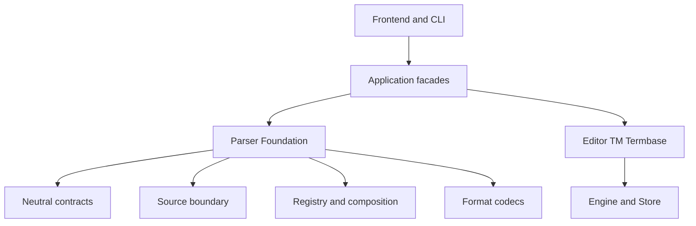
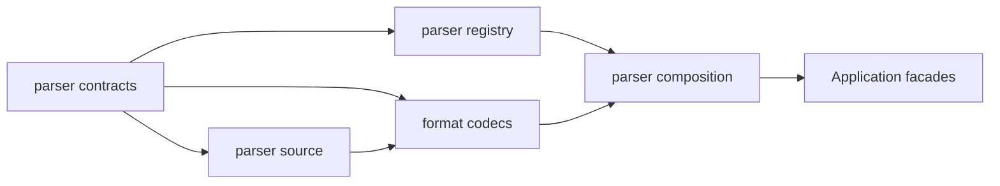
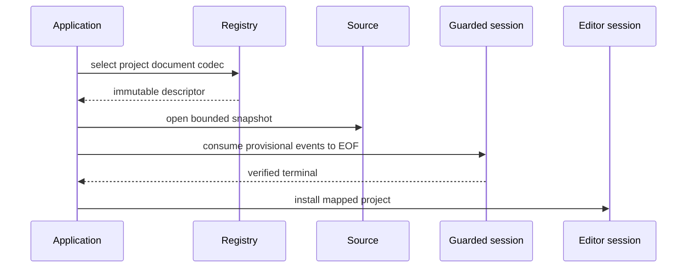
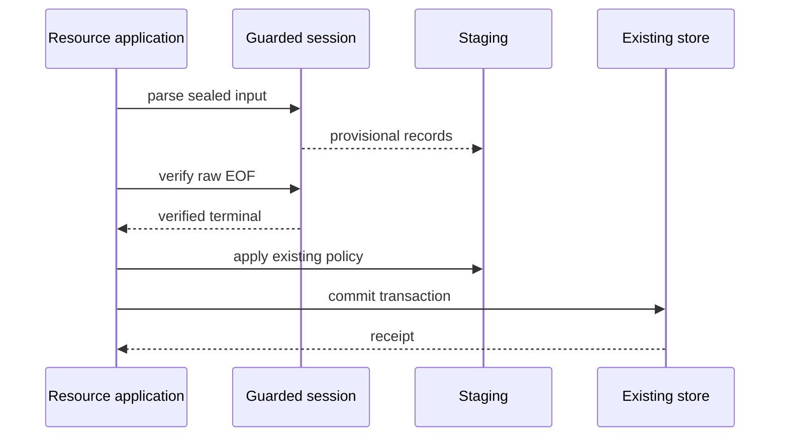
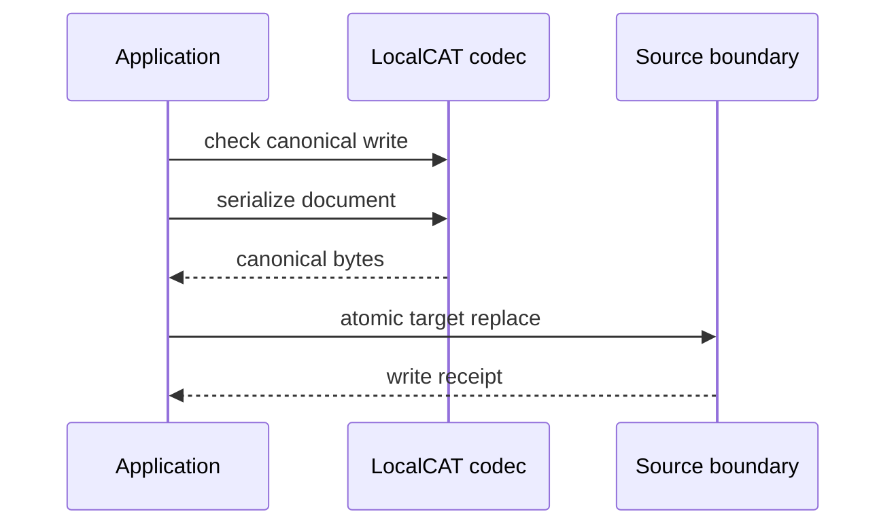

# Parser 子系统重新基线设计

## 概述

本设计在当前平铺 Python 仓库中建立一个用途感知、单输入、格式中立的 Parser Foundation。它把散落在 `editor_project.py`、`resource_importer.py`、`tm_json_importer.py`、`tm_engine.POHandler` 和 `glossary_engine.GlossaryLoader` 中的格式语法逐波迁移到唯一 codec，同时保留既有 Application 调用面、事务、receipt、session 和错误映射。

Parser 只回答四类问题：这个输入按什么用途和格式读取、如何安全取得同一 snapshot、产生了哪些中立记录与诊断、是否观察到允许下游提交的唯一成功终态。Parser 不查询 TM、不写 canonical TM/termbase、不拥有编辑会话，也不聚合多文档项目。

### 设计目标

- 以 `(EffectivePurpose, FormatId)` 消除同扩展名的用途歧义。
- 用 frozen 中立合同承载单输入文档、资源记录、诊断、能力、snapshot 和成功终态。
- 让 reader、canonical writer 与 source round-trip writer 分别声明能力并在操作前 fail closed。
- 让资源 consumer 先 stage，只有观察到 `TerminalSuccess` 后才按既有 Application/Store 事务提交。
- 保持 LocalCAT JSON/TXT、TMX、术语导入和现有调用面的兼容语义；有意改变的历史失败行为必须显式记录。
- 为外部格式提供显式注册的 plugin port，但不实现 RPY plugin，也不把 plugin 私有 token 带入 Core。
- 迁移结束后，每种格式只保留一份 tokenization、unescaping、validation、row-selection 或 writer 语法权威。

### 非目标

- 不实现 multi-document、current-document UI、ProjectPackage、chunk 或同步。
- 不实现 RPY、XLIFF、Office/PDF/OCR codec；不直接回填 `.rpy`。
- 不改变 canonical TM、CONTEXT/FUZZY、Gate C/D、TM activation、termbase transaction 或 Qt 产品语义。
- 不增加 TMX context/provenance/export；不实现术语列选择 UI，也不根据项目语言自动推断 source/target 列。
- 不引入生产 `BaseParser`，不把归档规格中的名义继承恢复为准入条件。
- 不借本规格拆分 `tm_sqlite_store.py`；该维护工作不属于 Parser。

## Boundary Commitments（边界承诺）

### This Spec Owns（本规格拥有）

- 单输入 Parser contracts、source snapshot/limits/issues/terminal 与用途感知 registry。
- 八个首波 `(EffectivePurpose, FormatId)` reader 合同和唯一格式语法权威。
- LocalCAT JSON v1 canonical writer 语法与安全原子目标替换原语。
- 外部 format-codec provider 的显式注册 port 与 opaque round-trip token envelope。
- 既有混合入口逐波委托、重复语法退出和 Parser 架构/兼容证据。

### Out of Boundary（范围外）

- Application 的 project session、dirty、资源去重/合并、TM/termbase transaction、activation、receipt 与 rollback。
- Engine/Store 的 EXACT/CONTEXT/FUZZY、canonical TM、Gate C/D、speaker profile 与设备资格。
- 多文档聚合/UI、RPY plugin/ACL、ProjectPackage、chunk、同步、TMX context/export 与术语列自动推断。
- `tm_sqlite_store.py` 和 `tm_contracts.py` 的维护性提取。

### Allowed Dependencies（允许依赖）

- Python 3.14 标准库；XLSX codec 可条件依赖 `openpyxl>=3.1,<4`。
- Parser contracts/source/registry/codecs/composition 只按本设计依赖图自左向右依赖。
- Application facade 可同时依赖 Parser 中立合同和既有 Editor/TM/Termbase 合同，并独占两侧映射。
- Parser 不导入 Engine、Store、Controller、Qt、workspace、sync provider 或格式 plugin 私有类型；Engine/Store 不反向导入 Parser。

### Revalidation Triggers（复验触发器）

- 中立 dataclass、FormatId、error code、capability、limit profile 或 terminal shape 变化：重跑全部 parser contract/golden 与 Application adapter tests。
- LocalCAT/TMX/termbase/normalized JSON/gettext 语法或 facade mapping 变化：重跑对应兼容 suite 和重复语法 AST guard。
- `resource_importer.py`、`tm_engine.py`、TM adapter 或 Feature 5 source roots 变化：向 Integration TM owner 交接 current-source fingerprint 和 Gate C/acceptance/fault/release evidence 复验。
- plugin port 或 opaque token identity 变化：`rpy-project-codec` 等下游 codec 重新确认注册、版本和 round-trip 兼容。
- 本规格不因上述复验触发而取得下游 Feature 的语义或 evidence publication 权威。

## Governance Impact（治理影响）

### 适用 Steering 与 ADR

- `tech.md`、`structure.md`：Parser 与 Engine/Store 互不导入；Application 层协调两侧。
- `spec-ownership.md`：`parser-rebaseline` 只拥有本规格的合同、实现与迁移，不修改相邻 Feature 权威。
- ADR-015：中立 Parser/Engine 边界、用途感知 codec 与行为/capability 准入。
- ADR-004、ADR-005：仅保留 superseded history，不再作为新实现依据。
- ADR-009/011/012/013/014：分别约束 TM 数据、事务、检索资格与 workspace 预处理；本规格不迁移这些权威。

### 治理约束

- `rebaseline-plan.md` 与本规格 Requirements 定义 Parser 的范围和需求合同。
- ADR-015 定义 Parser Foundation 与 Engine/Store 的中立依赖方向，并取代 ADR-004/005 的旧方向。
- Parser 触发的 Feature 5 current-source evidence 重验由 Integration TM owner 处理；Parser 只交接变更清单，不自签 TM 资格。

| 项目 | 处置 |
|---|---|
| Applicable Steering | `tech.md`、`structure.md`、`roadmap.md`、`spec-ownership.md` |
| Applicable ADRs | ADR-015；相邻 ADR-009/011/012/013/014 不迁权 |
| ADR disposition | Follow ADR-015；ADR-004/005 已被取代 |
| Scope contract | `rebaseline-plan.md` 与本规格 Requirements |
| Steering sync | runtime 收口时只更新真实派生事实 |
| Downstream revalidation | Integration TM owner；未来 RPY/Multi-Document consumer |

## 现状与约束

当前没有成熟 Parser 子系统，只有五类混合入口：

| 入口 | 当前拥有的语法 | 混合的非 Parser 责任 |
|---|---|---|
| `editor_project.py` | LocalCAT JSON/TXT 读取、JSON v1 写入 | `EditorProject` 映射、Controller session/dirty/error |
| `resource_importer.py` | TMX、CSV、XLSX snapshot 与记录选择 | canonical/legacy 选择、LWW、stage、commit、receipt |
| `tm_json_importer.py` | normalized TM JSON 单文件解析 | 目录发现、跨文件 source-LWW、JSONL 输出 |
| `tm_engine.POHandler` | 极简 PO tokenization | runner 使用，异常被吞并返回 partial/empty |
| `glossary_engine.GlossaryLoader` | 另一份 CSV/XLSX 规则 | 直接更新 Engine、吞 parser 异常 |

因此“提取”表示从这些真实入口迁移，而不是实现遗留 `design.md` 描述的 `BaseParser` 架构。稳定 Application facade 可以长期存在；平行 tokenizer 不可以。

## 架构

### Architecture Pattern & Boundary Map（架构模式与边界图）



允许的模块依赖为：



- `parser_contracts.py` 只依赖标准库。
- `parser_source.py` 只依赖标准库和 `parser_contracts.py`。
- codec 只依赖 contracts/source；XLSX codec 可条件导入 `openpyxl`。
- registry 只依赖 contracts，不导入具体 codec。
- composition 是唯一内建注册点，可导入 registry 与 codecs。
- Application facade 可以导入 Parser 和现有 Editor/TM/Termbase 合同。
- Engine、Store、Qt、Controller、workspace、provider 不得被 Parser 模块导入。
- `tm_engine.py`、`glossary_engine.py` 中的历史格式语法在消费者迁移后删除；不通过 Engine re-export Parser。

### Technology Stack（技术栈）

| Layer | Choice / Version | Role | Notes |
|---|---|---|---|
| Runtime | Python 3.14 | frozen contracts、codec、registry、source safety | 不增加常驻服务或网络依赖 |
| Format parsing | stdlib `json/csv/xml.etree/xml.parsers.expat/zipfile/gettext-style state machine` | JSON/TXT/CSV/TMX/PO/XLSX preflight | XML 禁止 DTD/entity；不引入新的 XML 依赖 |
| XLSX | `openpyxl>=3.1,<4` | active-sheet termbase reader | 条件导入；通过 zip preflight 后使用 |
| Storage | None | Parser 不拥有持久化 store | 只提供 LocalCAT JSON 原子目标替换 |

## File Structure Plan（文件结构计划）

### 新增模块

仓库继续保持根目录平铺：

| 新模块 | 单一责任 |
|---|---|
| `parser_contracts.py` | frozen enums/dataclasses/protocol：用途、格式、能力、限制、snapshot、记录、issue、terminal |
| `parser_source.py` | safe-root regular-file 打开、bounded snapshot、fingerprint、stale/cancel、原子目标替换原语 |
| `parser_registry.py` | descriptor 注册、用途内选择、hint 缩小与重复权威拒绝 |
| `parser_composition.py` | 内建 codec 的显式 composition root、外部 provider 注册端口 |
| `parser_json_support.py` | JSON string/depth/完整输入的 bounded lexical preflight；不拥有项目或资源字段语义 |
| `parser_xlsx_support.py` | ZIP member/ratio/展开与 OPC XML DTD/entity preflight；不拥有术语 row 语义 |
| `parser_localcat_codec.py` | LocalCAT JSON/TXT reader 与 LocalCAT JSON v1 canonical serializer |
| `parser_gettext_codec.py` | PO/POT singular-profile reader |
| `parser_tmx_codec.py` | TMX Level 1 reader |
| `parser_tm_json_codec.py` | normalized TM JSON 单输入 reader |
| `parser_termbase_codec.py` | CSV/XLSX 显式 source/target 列选择与 row reader |

新增测试放在 `tests/test_parser_*.py`，可分发合成样本放在 `tests/fixtures/parser/`。真实下载样本只用于本地兼容核对；未确认授权的全量内容不提交。

### Modified Files（修改文件）

- `editor_project.py` — 保留公开 facade，委托 LocalCAT codec/writer 并映射 EditorProject/ProjectError。
- `resource_importer.py` — 保留资源 policy/transaction/receipt，委托 TMX 与 termbase codecs。
- `tm_json_importer.py` — 保留 CLI/batch/LWW/output，委托 normalized TM JSON 单输入 codec。
- `glossary_engine.py`、`logic_controller.py` — 迁移或删除重复术语 loader，不让 Engine 保留 row parser。
- `tm_engine.py`、`translation_runner.py`、`stress_runner.py` — runner 改用 gettext codec 后删除 `POHandler`。
- `tests/` — characterization、contract、AST、compatibility 和 Application regression。
- `.kiro/steering/structure.md`、`.kiro/steering/tech.md` — 只在 runtime 文件真实落地后同步派生文件表。

## Components and Interfaces（组件与接口）

| Component | Domain/Layer | Intent | Req Coverage | Key Dependencies | Contracts |
|---|---|---|---|---|---|
| Parser Contracts | Layer 2 neutral | 冻结用途、记录、能力、issue、limit、snapshot、terminal | 1.1–2.8, 6.1–10.7, 11.1, 12.1–13.6 | stdlib P0 | State, Service protocol |
| Source Boundary | Layer 2 neutral | safe-root snapshot、fingerprint、stale/cancel、atomic target | 3.9, 6.3–6.6, 7.2–7.3, 8.1–9.7, 10.2 | Contracts P0, OS filesystem P0 | Service, State |
| Registry / Composition | Layer 2 neutral | 用途内选择、重复拒绝、内建与外部 provider 注册 | 1.1–1.9, 10.1–10.3, 11.4, 11.6–11.8 | Contracts P0, codecs P1 | Service |
| Project Codecs | Layer 2 format | LocalCAT JSON/TXT 与 gettext 单输入文档 | 2.1–4.9, 8.1–10.7, 12.1–13.6 | Contracts/Source P0 | Service, Batch |
| Resource Codecs | Layer 2 format | TMX、normalized TM JSON、CSV/XLSX 中立 records 与术语列选择 | 2.2–2.8, 5.1–5.13, 8.1–12.5 | Contracts/Source P0, openpyxl P1 | Service, Batch |
| Application Facades | Layer 3 | 映射 Editor/TM/Termbase 并拥有 session/stage/transaction/receipt | 3.8–3.9, 5.13, 7.4–7.6, 11.2–11.5, 14.1–14.6 | Parser P0, existing domains P0 | Service, Batch |

所有组件都由上表对应到 File Structure Plan。完整方法 shape、数据模型和不变量在后续“中立合同”“迭代器与提交授权”“格式设计”中冻结；没有未映射到文件的 runtime component。

## 中立合同

### 标识与选择

```python
class EffectivePurpose(Enum):
    PROJECT_DOCUMENT = "project_document"
    TRANSLATION_MEMORY = "language_resource.translation_memory"
    TERMBASE = "language_resource.termbase"

@dataclass(frozen=True)
class FormatId:
    value: str

@dataclass(frozen=True)
class CodecIdentity:
    provider_id: str
    codec_id: str
    codec_version: str
```

首波稳定 `FormatId`：`localcat-json-v1`、`line-text-v1`、`gettext-po-v1`、`gettext-pot-v1`、`tmx-level1-v1`、`normalized-tm-json-v1`、`termbase-csv-v1`、`termbase-xlsx-v1`。

`SelectionRequest` 必须携带 EffectivePurpose，并携带明确 FormatId 或一个有界 hint 集合。扩展名、MIME 和最多 4 KiB 的 prefix sniff 只能在用途内缩小候选；sniff 不读取记录，也不取代用途。`SelectionFailure` 返回稳定 code、请求用途、观察到的 hints 与受支持组合，不含正文。

registry 以 `(EffectivePurpose, FormatId)` 为唯一键。重复注册、provider 禁用、版本不兼容和 capability 不匹配均 fail closed；注册顺序不改变结果。

术语列选择属于 Parser read request，而不是 Qt 状态或 codec 隐式默认：

```python
class ColumnSelectorKind(Enum):
    HEADER_NAME = "header_name"
    ZERO_BASED_INDEX = "zero_based_index"

class TermbaseHeaderPolicy(Enum):
    FIRST_ROW = "first_row"
    NO_HEADER = "no_header"
    LEGACY_ALLOWLIST = "legacy_allowlist"

@dataclass(frozen=True)
class TermbaseColumnSelector:
    kind: ColumnSelectorKind
    header_name: str | None = None
    zero_based_index: int | None = None

@dataclass(frozen=True)
class TermbaseColumnSelection:
    source: TermbaseColumnSelector
    target: TermbaseColumnSelector
    header_policy: TermbaseHeaderPolicy

@dataclass(frozen=True)
class TermbaseReadOptions:
    columns: TermbaseColumnSelection
```

selector 必须恰好设置与 `kind` 对应的一个值：`HEADER_NAME` 使用 trim 后非空字符串且 `zero_based_index=None`；`ZERO_BASED_INDEX` 使用非 bool 的非负整数且 `header_name=None`。`HEADER_NAME` 必须配合 `FIRST_ROW`，只在首个物理行的非空字符串 cell 中以 trim 后、大小写敏感的文本精确匹配，并把该行作为 header 跳过。source/target 不得解析为同一物理列。`ZERO_BASED_INDEX` 可配合调用方显式选择的 `NO_HEADER` 或 `FIRST_ROW`；`LEGACY_ALLOWLIST` 仅允许 source index 0、target index 1 的既有兼容 preset，按现有 header allowlist 决定是否跳过首行。Parser 不从项目语言、单元格内容或相邻列猜测映射。

`ReadRequest` 对 termbase purpose 必须携带 `TermbaseReadOptions`，缺失或与 format/purpose 不匹配时在读取记录前返回 `PARSER.TERMBASE.COLUMN_SELECTION_REQUIRED`。现有 Application import facade 显式构造 source index 0、target index 1、`LEGACY_ALLOWLIST` 的兼容 preset；未来 Qt/CLI 列选择器只构造同一 DTO 并调用同一 Application command，不在 UI 复制 header matching。

### 能力快照

```python
@dataclass(frozen=True)
class CodecCapabilities:
    readable: bool
    validatable: bool
    canonical_write: bool
    source_round_trip_write: bool
    streaming_input: bool
    iterator_view: bool
    materialized_view: bool
    format_profile: str
    active_sheet_only: bool = False
    opaque_features: tuple[str, ...] = ()
```

能力对象与 `CodecIdentity`、`LimitProfile` 一同由 descriptor 发布，选择后不可变。reader 不暗示 writer。首波只有 `localcat-json-v1` 声明 canonical write；其余格式全部 reader-only。首波没有内建 source-round-trip writer。

外部 plugin 若声明 source round trip，只能返回不透明 `RoundTripTokenEnvelope`，字段为 provider/codec identity 与 version、source fingerprint、format-state fingerprint 和 opaque bytes。Core/Application 只透传 payload，不解释内容；identity、版本或 fingerprint 失配必须在打开目标前失败。

### 来源与 snapshot

`SourceReference` 包含用户选择路径、调用方提供的 `safe_root` 和只读 display hint。`SourceSnapshotIdentity` 包含安全根内相对引用摘要、原文件的 regular-file identity/size/mtime_ns、实际解析 bytes 的 SHA-256、byte count 和 snapshot schema version。

`parser_source` 不执行“hash 一遍、rewind 后再 parse”。它先建立一个 Foundation-owned `SealedSourceSnapshot`：

1. 以 safe-root directory handle 为锚，逐 component no-follow 打开目标；拒绝 symlink/reparse escape、非 regular file 和超出 root 的引用；
2. 只读取原 descriptor 一次，同时在 byte limit 内把 bytes 写入私有、不可按路径重新打开的临时 snapshot，并计算 SHA-256；
3. 原文件复制前后 `fstat` 必须一致；变化则销毁 snapshot 并返回 stale；
4. snapshot 完整 flush 后封存为只读；Foundation 可为每个 validation/parse pass 签发独立 cursor lease：顺序格式 lease 从 offset 0 开始且不可 seek，XLSX 同一时刻只允许一个 offset-0 read-only seekable lease；codec 自己不能 reopen snapshot 或原路径；
5. validation、records 与 verified terminal 全部绑定 sealed snapshot 的同一 digest/byte count。

POSIX adapter 从已绑定 safe-root dirfd 逐 component 使用 `O_DIRECTORY|O_NOFOLLOW`，最终文件也以 no-follow 打开。Windows adapter 使用 native directory/file handle 和 final-path/reparse proof；若平台不能建立等价 rooted handle，操作以 `PARSER.SOURCE.ROOT_BINDING_UNAVAILABLE` fail closed。writer 对目标 parent 使用同一 rooted-handle contract，在 retained parent 内相对创建 temp、验证并 replace；不依赖先 `resolve()` 再普通 pathname open 的 TOCTOU 检查。

validation 可把仍存活的 sealed snapshot capability 直接交给 parse；validation lease 关闭后，Foundation 为 parse 签发新的 offset-0 lease，二者绑定同一 sealed digest。snapshot 只有在所有 lease、session 和可能的 writer token 都关闭后清理。若只保留 identity而已关闭 snapshot，parse 必须先重新建立完整 sealed snapshot，并在发出记录前比较 digest/byte count/codec profile，失配返回 `PARSER.SOURCE.STALE`。路径摘要和统计可进入诊断；source/target 正文不得进入错误消息。

现有单文件 facade 没有显式 safe-root 参数时，以用户已选择文件的已绑定 parent 作为本次操作 safe root；未来 directory/workbook/plugin 调用方必须传入其 owner 已验证的项目根。Parser 不自行扩大根目录，也不把 workspace root 固化为全局状态。

### 版本化限制

每个 descriptor 发布不可变 `LimitProfile`，至少包括 profile identity/version、input bytes、decoded field chars、records、materialized records、retained issues、declared issue codes、metadata entries/decoded bytes、structure depth，以及格式适用的 expanded bytes、archive members 和 compression ratio。

首波数值按 codec 独立发布，不建立“全 Parser 记录上限”：

| codec profile | 输入 | 字段/记录/materialize | 诊断/metadata/深度/展开 |
|---|---:|---|---|
| `localcat-json-v1` | 100 MiB | 单字段最多 100 Mi 字符；记录/materialize 100,000；非 streaming input | 256 issues、64 codes；每 metadata container 256 entries/1 Mi 字符、全输入 16 Mi 字符；深度 64 |
| `line-text-v1` | 100 MiB | 单字段最多 100 Mi 字符；记录 1,000,000、materialize 100,000；streaming | 同上；深度 8 |
| `gettext-po-v1` / `gettext-pot-v1` | 100 MiB | 单字段最多 100 Mi 字符；记录 1,000,000、materialize 100,000；streaming | 同上；深度 16 |
| `tmx-level1-v1` | 100 MiB | 单 segment 1,000,000 字符；记录 1,000,000、materialize 100,000；streaming | 同上；深度 64；关闭 entity/DTD/network |
| `normalized-tm-json-v1` | 100 MiB | 单字段最多 100 Mi 字符；记录/materialize 100,000；非 streaming input | 同上；深度 64 |
| `termbase-csv-v1` | 100 MiB | 单字段最多 100 Mi 字符；记录 1,000,000、materialize 100,000；streaming | 同上；深度 8 |
| `termbase-xlsx-v1` | 容器 100 MiB | 单 cell 1,000,000 字符；记录 1,048,576、materialize 100,000；streaming row view | 同上；深度 64；4,096 members、展开 256 MiB、100:1 |

这些记录/materialization 数值是本 Design 新提出的 Parser v1 安全边界，不是既有实现事实；其中 1,000,000 也不是旧“契约包”权威。它们与 Gate D 的 100,000 条 TM 查询、迁移、延迟和内存资格边界用途不同，即使数值偶合也不得互相替代。LocalCAT/PO/normalized TM JSON 旧入口此前没有输入上限；引入 100 MiB 和记录上限是 Requirements 8.1 要求的显式 fail-closed 变更，由版本化 limit profile 与边界测试共同冻结，不能冒充历史兼容事实。

materialized helper 在记录上限之外还受输入/展开 byte 上限约束，不承诺固定内存占用。JSON codec 在 sealed bytes 上先以共享的 bounded lexical preflight 检查 depth/string/完整输入，再调用标准库 `json` materialize；它们诚实声明 `streaming_input=False`，不会把事件 iterator 冒充流式 JSON 解码。未来修改数值必须发布新 profile version；validation 和 terminal 均携带实际 profile。

### 中立记录

```python
@dataclass(frozen=True)
class RawSpeaker:
    value: str

@dataclass(frozen=True)
class ParsedSegment:
    local_id: str
    source: str
    target: str | None
    target_presence: TargetPresence
    translation_state: TranslationState | None
    speaker: RawSpeaker
    format_metadata: tuple[MetadataEntry, ...]

@dataclass(frozen=True)
class ParsedDocument:
    source: SourceSnapshotIdentity
    format_id: FormatId
    name: str
    source_locale: str | None
    target_locale: str | None
    segments: tuple[ParsedSegment, ...]
    document_metadata: tuple[MetadataEntry, ...]
    issues: tuple[ParseIssue, ...]
    capabilities: CodecCapabilities

@dataclass(frozen=True)
class ResourceRecord:
    local_id: str
    source: str
    target: str
    speaker: RawSpeaker
    format_metadata: tuple[MetadataEntry, ...]

@dataclass(frozen=True)
class ValidationReport:
    outcome: ValidationOutcome
    source: SourceSnapshotIdentity | None
    format_id: FormatId
    codec_identity: CodecIdentity
    observed_capabilities: CodecCapabilities
    limit_profile: LimitProfile
    provisional_record_count: int
    issue_counts: tuple[IssueCount, ...]
    issues: tuple[ParseIssue, ...]
    issues_truncated: bool
    terminal: TerminalSuccess | None
```

`TargetPresence` 区分 missing 与 explicit empty；若格式不区分，两者可按该 codec 的已记录兼容规则折叠。`TranslationState` 只可为格式中已有事实或派生状态；不得凭空生成 confirmed。`MetadataEntry` 使用稳定 key 和 JSON-compatible scalar/tuple 值；不得放入 EditorProject、TMRecord、SQLite row、Qt 对象或 plugin 私有类型。

局部 ID 只在一个 ParsedDocument/资源输入内唯一。Parser 不分配 project document_id、复合 segment identity、排序、dirty 或 reconcile 状态。

`ValidationOutcome` 为 `SUCCESS`、`FAILED` 或 `CANCELLED`。只有 guarded session 自然 EOF 并取得 verified terminal 时，report 才能是 SUCCESS 且 `terminal` 非空、fatal count 为零；FAILED/CANCELLED 的 terminal 必须为空，provisional count 只供诊断，绝不授权 commit。`IssueCount` 只使用 descriptor 的有限 code allowlist 与 warning/fatal severity。

canonical writer 不直接消费 `EditorProject` 或带旧 snapshot/issues 的 `ParsedDocument`，而消费 stdlib-only 写入 DTO：

```python
@dataclass(frozen=True)
class CanonicalSegmentWrite:
    local_id: str
    source: str
    target: str
    speaker: RawSpeaker
    confirmed: bool

@dataclass(frozen=True)
class CanonicalDocumentWrite:
    name: str
    source_locale: str
    target_locale: str
    segments: tuple[CanonicalSegmentWrite, ...]

@dataclass(frozen=True)
class CanonicalSerializeRequest:
    format_id: FormatId
    document: CanonicalDocumentWrite

@dataclass(frozen=True)
class CanonicalBytes:
    codec_identity: CodecIdentity
    format_id: FormatId
    schema_version: int
    payload: bytes
```

invariants 与现有 v1 保存兼容：name/source/ID 非空、local ID 唯一、tuple 保序、target/speaker 保留字符串、confirmed 必须是 exact bool；不额外禁止 `confirmed=True` 与空 target 的历史可表示组合。Application facade 独占 `EditorProject → CanonicalDocumentWrite` 映射，LocalCAT codec 独占 `CanonicalSerializeRequest → CanonicalBytes` 的 v1 serialization，Application 调用 Foundation 的 Source Boundary 将 CanonicalBytes 写入目标并取得 receipt。三段之间均不复制 JSON field/schema 规则。

### 诊断与失败

`ParseIssue` 包含 stable code、warning/fatal severity、可空 byte/line/record location 和不含正文的 safe summary。稳定错误族：

- `PARSER.SELECTION.*`：unsupported、ambiguous、duplicate authority、provider disabled/version incompatible。
- `PARSER.SOURCE.*`：outside root、not regular、read/encoding failed、stale、cancelled。
- `PARSER.SYNTAX.*`：malformed、invalid field、duplicate local ID、empty input。
- `PARSER.LIMIT.*`：input、field、record、materialization、diagnostic、depth、expansion。
- `PARSER.CAPABILITY.*`：unsupported read/write/round-trip、invalid token。
- `PARSER.TMX.*`、`PARSER.GETTEXT.*`、`PARSER.TERMBASE.*`：需调用方识别的格式细分原因。

safe summary 只描述规则和位置，例如“record 7 的 source 类型无效”，不得嵌入正文、目标译文、speaker 或 secret。每个 descriptor 声明最多 64 个稳定 issue codes；Foundation 拒绝未声明 code，外部 plugin 的越界 code 折为单一 fatal `PARSER.PLUGIN.ISSUE_UNDECLARED`。issue 达 256 条后只按有限 allowlist 增加计数并设置 `issues_truncated=true`，不会因任意新 code 形成无界字典。

Foundation 同时验证 metadata 的 JSON-compatible scalar/tuple 结构。每个 segment/resource record 的 `format_metadata`、`DocumentHeader` metadata 和最终 `document_metadata` 都各自是一个 container，各限 256 entries/1 Mi decoded chars；同一输入所有 metadata container 合计限 16 Mi decoded chars，并受 profile depth 约束。未知 plugin object、过深 nesting 或任一局部/全局超限都是 fatal，而不是截断后成功。

## 迭代器与提交授权

codec 的行为合同是结构化 protocol，不是必须继承的 ABC。raw codec 只有一个语法入口，不能自行发布提交终态：

```python
class RawReaderCodec(Protocol):
    descriptor: CodecDescriptor
    def iter_raw(
        self,
        source: SnapshotCursorLease,
        request: ReadRequest,
    ) -> Iterator[RawParseEvent]: ...

class CanonicalSerializerCodec(Protocol):
    descriptor: CodecDescriptor
    def serialize_canonical(
        self,
        request: CanonicalSerializeRequest,
    ) -> CanonicalBytes: ...
```

reader 与 canonical serializer 使用分离 protocol。reader-only codec 不实现 serializer port；registry 以 descriptor capability 和 factory 判定，不用 `hasattr` 推断。descriptor 若声明 canonical write，却缺少 serializer factory 或 Foundation target-writer composition，注册时结构化失败。只有 Source Boundary 产生 `WriteReceipt`。

Foundation-owned `GuardedParseSession` 包装 `iter_raw()`。raw event 闭合集合只有 `DocumentHeader`、`ParsedSegment`、`ResourceRecord` 和 `ParseIssue`，不包含 `TerminalSuccess`。session 在每次交付 provisional event 前验证：

- purpose 与 event kind 匹配；document header 数量为一，resource 输入不得产 header；
- local ID 唯一，record/header/metadata/field/depth/issue code 均满足 descriptor/profile；
- warning/fatal/counts 由 wrapper 自己累计，不信任 plugin 自报数字；
- fatal、cancel、consumer exception、未知 event、early close 或 raw generator exception 立即把 session 标为不可提交。

只有 raw generator 的下一次 `next()` 已真实返回 `StopIteration`，descriptor 的 input-consumption policy 已满足，且 session 未见 fatal/abort 时，wrapper 才把状态置为 `EOF_VERIFIED`。顺序 text/XML/JSON profile 要求 bounded reader 到达 sealed byte count；XLSX profile 要求 Foundation 的完整 ZIP central-directory/member/expansion preflight 成功并由 codec 完成声明的 active-sheet parse。Application 随后调用 `verified_terminal()`；仅该方法可构造 Foundation-issued `TerminalSuccess`。raw codec 未满足 consumption proof、未自然 EOF、terminal 被调用两次、EOF 后存在 raw event 或 session 被关闭时，均不返回 terminal。

`TerminalSuccess` 绑定 sealed snapshot、codec identity/version、limit profile、record count、warning counts、issue truncation，且 invariant 固定为 `fatal_count == 0`。它不是 codec event，所以不存在“先 yield terminal、后 yield record/fatal”而提前授权 commit 的路径。

Foundation 的 `validate()`、`materialize()` 和 Application 使用的 guarded iterator 全部消费同一个 `RawReaderCodec.iter_raw()`：validation 丢弃 records 后读取 verified terminal，materialize 在限制内暂存 records 后读取同一 terminal。不存在 codec 可单独实现的第二 validator。

资源 Application facade 固定为 `select → sealed snapshot → stage provisional records → raw EOF → Foundation verified terminal → existing policy → store transaction/receipt`。任何尾部 fatal、cancel、early close 或 consumer exception 都销毁 stage。多文件 batch 由 Application/CLI 逐文件调用；continue/stop policy 不进入 Parser。

## Registry 与 plugin port

`CodecDescriptor` 包含 identity、purpose、FormatId、extensions/MIME hints、capabilities、limit profile 和 codec factory。`ParserRegistry` 在构造期完成所有注册并冻结；运行期不允许覆盖。

`parser_composition.create_builtin_registry()` 显式注册首波 codecs。外部 plugin 只通过调用方注入的 `CodecProvider` 注册：

```python
class CodecProvider(Protocol):
    provider_id: str
    provider_version: str
    def descriptors(self) -> tuple[CodecDescriptor, ...]: ...
```

Foundation 不扫描目录、不导入任意模块、不下载 provider，也不使用 entry-point fallback。调用方负责配置、启用状态和版本 allowlist；registry 负责结构化拒绝重复键与不兼容 capability。

RPY plugin 可在独立 Spec 中实现 provider，并将 `.rpy` 解析成中立 ParsedDocument。RPY tokenization、sidecar、安全回填、文件 ACL 和 round-trip proof 全归 plugin；Core 只看到中立 records 和 opaque token。folder 聚合与跨文件配对仍等待 Multi-Document。

## 格式设计

### LocalCAT JSON / TXT

`parser_localcat_codec.py` 复刻当前单项目语义：

- JSON 数组根使用 stem、`en-US` / `zh-CN`；对象根要求 `segments`。
- JSON 严格接受 UTF-8 或 UTF-8-BOM，与当前 `utf-8-sig` 读取兼容；不做编码猜测。
- 字符串字段按现路径 trim；target/speaker 的 missing、null、empty 依兼容路径映射，parsed contract 记录 presence。
- confirmed 出现时必须为 bool；segment 非对象、source 空、字段类型错误或 ID 重复使整文档 fatal。
- 缺失/空 ID 生成 `segment-{1-based index}`。
- TXT 使用严格 UTF-8/UTF-8-BOM，过滤 trimmed empty line，以接受的非空行稠密顺序生成 ID；不是物理原行号。
- TXT 每个接受行只产生 source：`target=None`、`TargetPresence.MISSING`、`translation_state=None`、`RawSpeaker("")`。兼容 `editor_project` facade 映射为空 target 与 `confirmed=false`；这不是双语 TXT 或 source/target 交替行协议。
- 空文档 fatal。
- JSON 先经 `parser_json_support.py` 对 sealed bytes 做 string/depth/完整输入 preflight，再由标准库 `json` materialize；descriptor 明确 `streaming_input=False`。

LocalCAT JSON canonical write 是首波唯一写能力。codec serializer 只生成 schema version 1 `CanonicalBytes`；`parser_source` 在 rooted target parent 内创建独占临时文件、flush/fsync、原子 replace，并返回绑定目标 identity/digest 的 `WriteReceipt`。replace 前失败不得改变目标。`editor_project.save_project()` 保留 EditorProject 映射和 `ProjectError`/Controller 稳定失败码。TXT 只读，不声明 round trip。

### PO / POT singular profile

`parser_gettext_codec.py` 使用单一显式状态机解析 comments、`msgctxt`、`msgid`、`msgstr` 及 continuation string：

- 统一解码 gettext quoted string 与合法转义；无效 escape/语法携行号 fatal。
- 空 `msgid` header 进入 document metadata，不输出 segment。
- comments、references、flags、previous-value comments 作为不透明 metadata；不映射 speaker/context。
- fuzzy 保留 target，但 translation state 为未确认。
- POT 或未翻译 PO 保留 explicit empty target。
- `msgid_plural`、`msgstr[n]` 首波以 `PARSER.GETTEXT.PLURAL_UNSUPPORTED` fatal；不折叠。
- local ID 由 entry 起始位置和同位置 ordinal 确定性生成，不依赖 source 内容。
- 首波严格接受 UTF-8 或 UTF-8-BOM；header charset 缺失或声明 UTF-8 可接受，其他 charset 返回 `PARSER.GETTEXT.CHARSET_UNSUPPORTED`，不做 best-effort 转码。

PO/POT 仅注册为 project document reader，不成为 language resource，不写 PO/POT。

### TMX Level 1

`parser_tmx_codec.py` 只抽取 snapshot/安全 XML/locale/unit 语法：

- 输入最多 100 MiB，禁止 DTD、ENTITY、外部解析和网络。
- locale 先规范化精确匹配，再做无歧义 base-language fallback。
- `seg` 文本只按既有路径去除首尾空白，内部字符不 normalize 或折叠。
- 保持 translation unit 输入顺序和同 source variants。
- 每个接受记录使用 `tu-{physical TU ordinal}`；ordinal 对所有物理 `<tu>` 以 1 起计，跳过 unit 留下空洞，不因 warning 或重复 source 重编号。
- inline XML、缺 pair、歧义 fallback 或单 segment 超过 1,000,000 字符为 record warning 并跳过 unit。
- 无 TU、malformed XML 或输入级 limit 为 fatal，无 terminal。
- 不把 `<prop>` 推断为 CONTEXT/provenance；可作为不透明 metadata 保留安全标量，但首波 Application 不消费为匹配证据。

`resource_importer.import_tmx()` 继续拥有 source digest、canonical/legacy lane、legacy source-LWW 兼容、stage/commit/receipt 和 ImportReport 映射。codec 本身保序保重复。

### normalized TM JSON

`parser_tm_json_codec.py` 只接受单文件数组根：

- 编码严格为 UTF-8，不接受 UTF-8-BOM；这保持当前 `read_text(encoding="utf-8")` 行为，并与 LocalCAT JSON 的 UTF-8/UTF-8-BOM profile 明确区分。
- source/target 必须是 trim 后非空字符串；坏记录 warning 并跳过。
- speaker 为字符串时按现路径 trim 并作为 RawSpeaker；missing/null 为空身份；其他类型按格式策略 warning 拒绝该记录。
- 保持接受记录顺序和重复 source；空有效结果 fatal；不写 JSONL。
- 每个接受记录使用 `record-{physical array ordinal}`；ordinal 对数组元素以 1 起计，拒绝元素留空洞。JSON 使用与 LocalCAT 相同的 bounded lexical preflight，并声明 `streaming_input=False`。

`tm_json_importer.py` 保留目录/多文件发现、每文件 policy、跨文件 source-LWW 和兼容输出。每个文件必须 terminal success 后才纳入 batch；输出失败不得被报告为 parse success。

### CSV / XLSX 术语资源

`parser_termbase_codec.py` 统一 `resource_importer` 与 `GlossaryLoader` 的 row-selection：

- CSV 严格 UTF-8/UTF-8-BOM；CSV 与 XLSX 都要求 `TermbaseReadOptions` 显式给出 source/target 列。
- header-name selector 只在首个物理行的非空字符串 cell 中精确匹配 trim 后的列名；缺失、重复命中、所选 header 无效或 source/target 指向同列时，在任何 record 输出前 fatal。
- index selector 使用零基物理列索引；负数、同列或与 header policy 不兼容时，在任何 record 输出前 fatal。行缺少任一所选列时 warning/skip，不回退到前两列或其他候选列。
- 所选 source/target 单元格按既有资源路径转为字符串并只去除首尾空白；内部字符不 normalize 或改写。
- 既有 Application 入口显式传入“索引 0/1 + legacy header allowlist”的兼容 preset；codec 不把 options 缺失解释为默认。未来 UI 只负责选择列并传入 DTO，不拥有匹配算法。
- header、空行、不完整行和空 source/target 产生结构化 skipped count/warning。
- XLSX 先由 `parser_xlsx_support.py` 枚举全部 ZIP members、限制展开资源，并用标准库 Expat 对每个 OPC XML member 做 bounded well-formedness preflight；`StartDoctypeDeclHandler`、`EntityDeclHandler` 或 external-entity callback 一旦出现即 fatal，参数实体解析关闭。通过后才条件导入 openpyxl，并固定 `read_only=True, data_only=True, keep_links=False, keep_vba=False`，只消费 active worksheet。
- 不执行 macro/formula/external link/object；zip expansion 先过限制。
- 多 sheet 只报告 active-sheet-only，不聚合 chapter。
- 保持行顺序和重复 source，不在 codec LWW。
- CSV/XLSX 接受记录使用 `row-{physical row ordinal}`；header、空行和拒绝行留空洞，CSV 以 parser row、XLSX 以 worksheet row 计数。
- 首波不支持 `.xls`；历史 `GlossaryLoader` 的名义支持没有可用实现或测试，不形成兼容承诺。

Controller/TermbaseStore 继续拥有 LWW、事务、metadata 保留和 reload。`GlossaryLoader` 迁移后只做 consumer mapping；无真实调用者后删除。

## Compatibility facade 与精确迁移表

兼容 facade 保护公开调用形状、稳定错误映射和 Application 权威；它不保护第二份 parser。

| 当前入口 / 责任 | 新唯一语法权威 | 保留责任 | 退出条件 | 相邻复验 |
|---|---|---|---|---|
| `editor_project.py` JSON/TXT 读取与 JSON v1 写入 | `parser_localcat_codec.py` | `load_project/save_project` 签名、EditorProject 映射、Controller `PROJECT.*`、session/dirty | 无第二份 segment 清洗、TXT 行选择或 JSON writer | editor project、Controller、Qt 单项目 journeys |
| `resource_importer.py` TMX 解析 | `parser_tmx_codec.py` | canonical/legacy、digest、variants/LWW policy、stage/commit/receipt、ImportReport | 私有 XML tokenizer 删除 | resource importer、legacy facade、Integration TM evidence |
| `resource_importer.py` CSV/XLSX row selection | `parser_termbase_codec.py` | 显式传入前两列兼容 preset；保留 row 映射、LWW、事务、metadata、reload | 不再私自匹配 header/列或选择 active sheet | term import/reload、列选择合同、LKG、Excel 三态 |
| `glossary_engine.GlossaryLoader` 私有 parser | 同一 termbase codec | 迁移期 consumer adapter | 无 tokenization/吞 parser 异常；无调用者后删除 | Glossary self-check、LogicController |
| `tm_json_importer.py` 单文件解析 | `parser_tm_json_codec.py` | 目录发现、batch policy、跨文件 LWW、兼容输出 | 单输入记录选择只有一份 | normalized JSON golden、CLI self-check |
| `tm_engine.POHandler` | `parser_gettext_codec.py` | runner 的 project-document adapter | runners 不再引用后删除；Engine 不 re-export | gettext golden、runner、TM engine self-check |
| 无 registry/composition | contracts/source/registry/composition | Application 显式 purpose 和 mapping | 不创建 BaseParser、动态扫描或 fallback | registry/capability/AST/plugin failure |

### Parser outcome → compatibility facade 映射

| Facade | Verified success / warning | Fatal / no terminal | 保持的可观察合同 |
|---|---|---|---|
| `editor_project.load_project()` | terminal 后映射 `ParsedDocument → EditorProject` | 抛 `ProjectError`；Controller 继续映射 `PROJECT.LOAD_FAILED` | 公开返回类型、当前 session 仅成功后替换、字段缺省与顺序 |
| `editor_project.save_project()` | `EditorProject → CanonicalDocumentWrite → WriteReceipt` 后返回绝对 Path | serializer/rooted temp/replace 失败抛 `ProjectError`；Controller 映射 `PROJECT.SAVE_FAILED` | replace 前目标不变，成功后才清 dirty |
| `resource_importer.import_tmx()` | accepted records 按现 canonical/legacy policy 提交；record warnings 继续进入 `ImportReport.errors`，因此允许 `imported>0` 且 `succeeded=False` | 无有效 pair、输入 fatal 或 store transaction 失败返回仅含 errors 的 `ImportReport`，不产生新 commit | imported/skipped/overwritten/errors 形状、variants/order、legacy LWW、source digest |
| `resource_importer.read_legacy_termbase_import()` | 显式传入前两列兼容 preset；terminal 后映射为 `(tuple[LegacyTermRow, ...], skipped)`；保序保重复 | 列选择无效、无有效行或 parse fatal 继续抛 `ImportFailure`；不写 store | Controller 当前只读导入 seam、返回 tuple 形状、无副作用 |
| `resource_importer.import_termbase()` | 显式传入前两列兼容 preset；skipped/header/空行只累计 `skipped`，不进入 errors；非空 accepted set 事务提交 | 列选择无效、无有效行、输入 fatal 或写入失败返回 errors，目标不变 | ImportReport 形状、source-LWW、UTF-8-SIG 原子写 |
| `tm_json_importer` | per-file terminal 后才纳入 batch；record warnings 保留在内部 per-file result，兼容 CLI 对部分有效输入仍返回成功 | 单文件无有效记录/fatal 不纳入 batch；若 batch 无成功输入或输出失败，CLI 非零且目标不截断 | 目录发现、跨文件 source-LWW、成功 stdout 继续可用；旧“空成功并截断”明确退役 |
| `GlossaryLoader` | 迁移期仍返回 `None`，只在 terminal 后向既有 Engine 添加 accepted rows | parser failure 不添加任何 term；旧吞异常/print 作为有意版本化失败变更，由 runner/self-check 改为显式非零 | valid 调用形状与 term content；无第二 row parser |
| translation/stress runners | terminal 后把 ParsedSegments 映射成既有 runner `SourceUnit` 使用形状 | gettext fatal 使 runner 明确非零，不再返回 partial/empty success | valid singular fixture 输出与 TM/术语三态顺序 |

TMX warning 进入 `ImportReport.errors` 是当前 facade 的兼容事实，不代表 Parser warning 本身拥有事务失败语义。未来若要让该 facade 的 `succeeded` 只反映 transaction outcome，必须另有版本化 contract；本规格不顺手修改。

### 有意记录的历史行为变化

| 历史行为 | 新行为 | 理由与兼容处理 |
|---|---|---|
| `POHandler` catch-all 后返回 partial/empty | 语法、plural、编码错误 fatal 且无 terminal | Requirements 4/7；runner adapter 映射稳定失败，不保留 partial success |
| normalized TM JSON 坏行静默跳过 | warning + 确定性计数 | Requirements 5/6；接受记录与 LWW 结果可核对 |
| normalized TM JSON 非字符串 speaker 原先接受并置空 | record warning 并拒绝该记录 | Requirements 12.3 禁止强制转换；这是显式版本化兼容变更，不冒充旧行为 |
| `GlossaryLoader` 吞异常/print | 结构化失败，经 consumer 映射 | 避免第二权威；不改变 TermbaseStore 事务 |
| LocalCAT/PO/normalized JSON 未设输入上限 | 采用版本化 100 MiB profile | Requirements 8 的显式安全变更；由 limit profile 和边界测试冻结 |
| `GlossaryLoader` 声称 `.xls` | 首波只注册 CSV/XLSX | openpyxl 无真实 `.xls` 兼容证据；不新增第三方依赖 |

## System Flows（系统流程）

### Project document 打开



任一步失败均不替换 Controller 当前 session。Parser 不知道 recent projects、current segment 或 workspace preferences。

### Language resource 导入



Parser warning 不自动等于 Application failure；Application 显式映射 warning、skipped 和 transaction outcome。无 terminal 时必须丢弃 stage。

### Canonical write



不具备 writer 的格式在打开目标或创建 temp 前返回 `PARSER.CAPABILITY.WRITE_UNSUPPORTED`。

## 错误处理与可观察性

- Parser 错误是结构化结果或稳定异常包装，不暴露正文、堆栈或 secret。
- programmer fault 不被折成输入错误；Application 在测试中保留异常可见性。
- codec warning 只允许记录级可跳过问题；syntax/encoding/source/limit/cancel 均 fatal。
- source fingerprint、codec/version、limit profile、记录/issue 计数进入 validation/terminal/receipt。
- 不记录 source/target/speaker；本规格不增加网络 telemetry。
- writer receipt 只能在原子 replace 后产生；Parser receipt 不替代 Store/import receipt。

## 测试与验收

### Wave 0 characterization 与 golden

每个 `(purpose, format)` 至少覆盖 valid、格式边界、encoding、limit、cancel。record warning 只要求 TMX、normalized TM JSON、CSV/XLSX 覆盖；fatal-tail 只要求可构造尾部错误的格式覆盖；registry duplicate 由 registry 级 fixture 单独覆盖。重点新增 LocalCAT JSON array/object/source-only TXT、PO/POT multiline/escape/header/fuzzy/plural、TMX locale/fallback/variant/DTD/entity、normalized TM JSON bad row/speaker/duplicate，以及 CSV/XLSX header-name/index selector、missing/duplicate/same-column、headerless/legacy preset、active sheet/expansion。

`MVol2Ch5_mymemory_compatible.tmx` 与 `MVol2Ch5.tmx` 只用于生成最小合成 fixture/安全摘要和本地核对，不直接提交原文件。`CAT_Working_File.xlsx` 只验证它不会被 termbase codec 聚合成 project。

### 合同与性质测试

- registry：用途内选择、重复键、hint 有界、unsupported、plugin missing/disabled/version mismatch。
- terminal：fatal tail、cancel、early close、consumer exception、raw codec 伪造 terminal/EOF 后 event、未消费尾字节、verified terminal 单次 issuance、无 partial commit。
- iterator/materialized：同 snapshot 的顺序、records、issues、counts、terminal 等价。
- snapshot：同一次 copy 的 sealed bytes/digest、原文件并发变化、validation/parse stale、root component symlink/reparse swap、non-regular/outside-root。
- limits：各 profile 边界、JSON lexical depth、metadata bytes/depth、plugin issue-code allowlist、issue truncation、XLSX expansion 与 OPC XML DTD/ENTITY fixtures。
- writer：unsupported preflight、token mismatch、JSON determinism、失败保留目标。
- 内容：严格 decoding、无 Unicode normalize、无正文诊断、raw speaker 大小写/内部字符。
- 术语列选择：header 精确匹配、索引与 header policy、无隐式 fallback、既有入口显式兼容 preset，以及 UI/Application/Parser 不产生第二份匹配算法。

### 架构守卫

AST/import 测试证明 Parser 不导入 Engine/Store/Controller/Qt/workspace/sync provider 或 plugin implementation，Engine/Store 不导入 Parser，registry 不导入具体 codec，只有 composition 注册内建 codec，生产入口迁移后不存在第二份相同格式语法，Core 不导入 RPY 类型或解释 token。Parser 自己定义并依赖中立 `CodecProvider` protocol 是合法边界。

### 兼容与下游证据

- 复用 editor project、resource importer、legacy TM facade、term import/reload、Excel adapter、runner、自检和 Qt 单项目 suites。
- Parser 修改命中 Feature 5 source roots 时，只生成 current-source 变更清单并交给 Integration TM owner；由其重跑并发布 Gate C/acceptance/fault/release evidence。Parser 不复制或自签 evidence。
- Gate D 的 100,000 条 TM 双路径性能资格不属于 Parser limit test；只有实际触碰其 source fingerprint 时由 Integration TM owner 复验。

## 安全与性能

- 输入先做 safe-root/regular-file/bounded snapshot；Parser 不访问网络。
- XML 禁止 DTD/entity；XLSX 不执行公式、宏、外链或对象，并限制 zip 展开。
- 迭代器不要求全量记录常驻；materialized helper 受 profile 约束。
- cancellation 点至少位于每次 bounded byte chunk、每个 row、gettext entry 和 TMX TU 之后。
- issue retention 有界，计数不丢；错误正文不包含翻译内容。
- 本设计不承诺新的 TM 查询性能；100k Gate D 保持原 owner。

## 实施波次

### Wave 0：证据护栏

- 建立可分发 golden、characterization、terminal/materialized/registry/AST 测试。
- 冻结当前 Application 返回形状、错误映射和事务行为。

### Wave 1：Foundation

- 实现 contracts/source/registry/composition，尚不切生产入口。
- 验证 plugin port、snapshot、limit、issue 与 terminal。

### Wave 2a：LocalCAT JSON/TXT

- 实现 LocalCAT codec 与 JSON canonical writer。
- 让 `editor_project.py` 委托并保持 Controller/Qt 行为。

### Wave 2b：术语 CSV/XLSX

- 先冻结并实现 `TermbaseColumnSelection`，让既有 `resource_importer` 显式传入前两列兼容 preset，再迁移 `GlossaryLoader`。
- 保留 TermbaseStore/Controller 事务；删除重复 row parser。

### Wave 2c：TMX

- 只抽 parse/validation；保留 import/stage/authority/receipt。
- 保持 variants/order/snapshot digest 与 legacy LWW 兼容结果。

### Wave 2d：normalized TM JSON

- 建立单输入 codec；CLI 保留 batch/LWW/输出策略。
- 只有 terminal success 的输入可进入 batch 结果。

### Wave 3：gettext

- 实现 singular profile，迁移 translation/stress runners。
- 删除 `tm_engine.POHandler`，不留 Engine re-export。

### Wave 4：收口与交接

- 删除所有已迁移的平行语法，跑完整兼容与架构守卫。
- 同步 Parser 相关 Steering/README 派生事实。
- 向 Integration TM owner 交付 source/fingerprint 变更与需重验 evidence 清单。
- 不启动 TM store maintenance，也不扩大到 Multi-Document/Chunk/Sync。

## Requirements Traceability（需求追踪）

| Requirement | Summary | Components | Interfaces | Flows / Evidence |
|---|---|---|---|---|
| 1.1, 1.2, 1.3, 1.4, 1.5, 1.6, 1.7, 1.8, 1.9 | 用途感知选择 | Registry / Composition | SelectionRequest/Failure, CodecDescriptor | registry unsupported/duplicate tests |
| 2.1, 2.2, 2.3, 2.4, 2.5, 2.6, 2.7, 2.8 | 单输入中立结果 | Parser Contracts, codecs | ParsedDocument/Segment, ResourceRecord, opaque token | materialized 与 plugin boundary tests |
| 3.1, 3.2, 3.3, 3.4, 3.5, 3.6, 3.7, 3.8, 3.9, 3.10 | LocalCAT 兼容 | Project Codecs, Source Boundary, facade | localcat descriptor, WriteReceipt | project open/write/atomic failure |
| 4.1, 4.2, 4.3, 4.4, 4.5, 4.6, 4.7, 4.8, 4.9 | gettext singular profile | Project Codecs, runner facade | ParseEvent, format metadata | gettext golden、runner migration |
| 5.1, 5.2, 5.3, 5.4, 5.5, 5.6, 5.7, 5.8, 5.9, 5.10, 5.11, 5.12, 5.13 | 语言资源与术语列选择 | Resource Codecs, import facades | ResourceRecord, ParseIssue, TermbaseColumnSelection | stage/terminal/import/column-selection compatibility |
| 6.1, 6.2, 6.3, 6.4, 6.5, 6.6 | 验证与诊断 | Contracts, Source Boundary | ValidationReport, ParseIssue | stale/preflight/truncation tests |
| 7.1, 7.2, 7.3, 7.4, 7.5, 7.6, 7.7 | 成功终态 | Contracts, codecs, facades | ParseEvent, TerminalSuccess | stage-before-commit、equivalence |
| 8.1, 8.2, 8.3, 8.4, 8.5, 8.6 | 资源限制 | Contracts, Source Boundary, codecs | LimitProfile, terminal | boundary/cancel tests；100k TM 排除 |
| 9.1, 9.2, 9.3, 9.4, 9.5, 9.6, 9.7 | 内容与文件安全 | Source Boundary, codecs | SourceReference/Snapshot | encoding/safe-root/XML/XLSX/no-network |
| 10.1, 10.2, 10.3, 10.4, 10.5, 10.6, 10.7 | 能力与 writer | Contracts, registry, LocalCAT codec | CodecCapabilities, token, WriteReceipt | preflight/round-trip identity/atomic write |
| 11.1, 11.2, 11.3, 11.4, 11.5, 11.6, 11.7, 11.8 | 层级边界 | 全部 Foundation 与 facades | behavior protocol, provider port | ADR-015、AST/plugin failure |
| 12.1, 12.2, 12.3, 12.4, 12.5 | Raw speaker | Contracts, format codecs | RawSpeaker | format validation、非 profile/device guard |
| 13.1, 13.2, 13.3, 13.4, 13.5, 13.6 | 单/多文档边界 | Contracts, project facade | local_id, ParsedDocument | single-document regression、workspace exclusion |
| 14.1, 14.2, 14.3, 14.4, 14.5, 14.6 | 单一语法权威 | Application Facades | compatibility mapping | 精确迁移表、duplicate parser AST |
| 15.1, 15.2, 15.3, 15.4, 15.5, 15.6, 15.7 | 验收与延期 | tests/evidence owners | golden/receipt/handoff | metamorphic/fault/current-source routing |

每个表中范围均含首尾及中间所有 numeric acceptance criteria，共 114 条。Tasks 必须逐项引用这些 ID，不得用区间掩盖遗漏。

## 风险与缓解

- **compatibility facade 被误解为旧 parser**：迁移表列出唯一语法权威和退出条件；不创建 BaseParser。
- **iterator 被误作可提交流**：所有 records provisional，Application 只认唯一 terminal。
- **warning 与 ImportReport success 混淆**：codec issue 与 Application transaction outcome 分层映射。
- **PO 行为改正影响 runner**：用 versioned failure mapping 和 golden 明示，不保留 partial success。
- **XLSX 解压资源失控**：读取前检查 archive members、展开大小和压缩比。
- **100 MiB 新限制影响历史大项目**：作为版本化 Design 合同与测试边界，不冒充旧行为。
- **Plugin authority 泄漏到 Core**：只允许 opaque envelope，配 AST guard 和 fail-closed tests。
- **Parser 修改使 TM evidence 过期**：由 Integration TM owner 按真实 source roots 重验，不由 Parser 重签。
- **TM store 体量问题回流 Parser**：本规格只禁止 Parser 取得其 authority；任何维护性提取由相邻 owner 另行立项和支付 evidence 成本。
