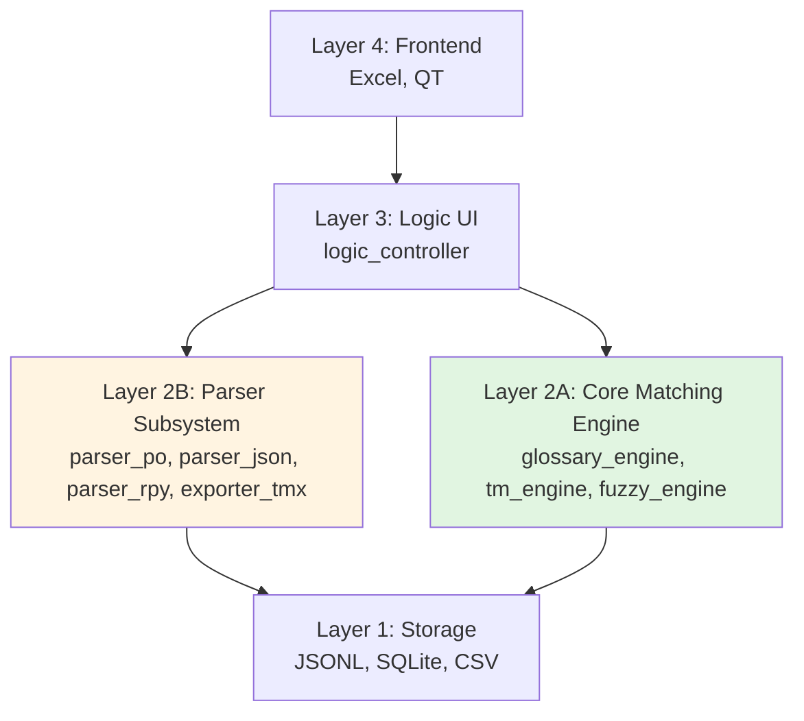
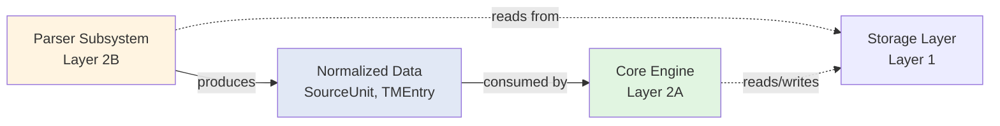
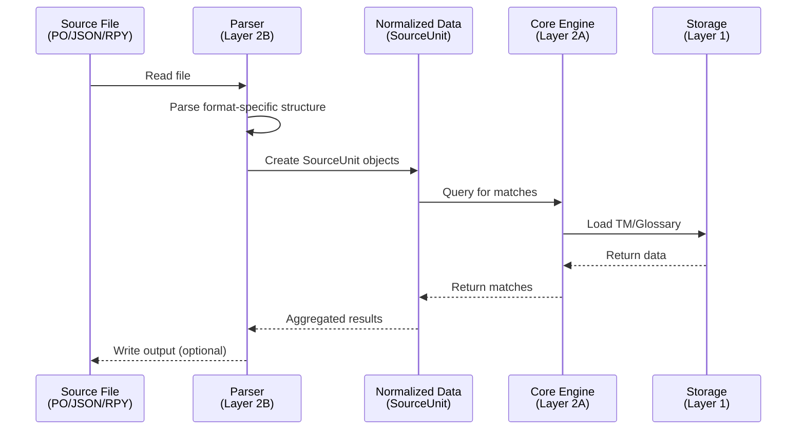

# Design Document: Parser Subsystem Extraction

> **状态：遗留草案，禁止直接实施（2026-07-27）。** 本设计不再代表当前依赖方向或数据契约。保留它用于追踪“解析与匹配分离”的原始意图；重新基线裁决见 `research.md` 和 `rebaseline-plan.md`。

## Overview

This design addresses the architectural concern identified in the external AI review: the current Layer 2 (Core Engine) is experiencing responsibility creep by mixing core matching algorithms (glossary_engine, tm_engine) with file parsing logic (parser/import). This creates coupling risks and will hinder future extensibility when adding new file formats, AI pipelines, and multi-format export capabilities.

The solution is to extract parser/import/export functionality into a separate subsystem, creating a clear architectural boundary:
- **Layer 2A: Core Matching Engine** - Pure matching algorithms (glossary_engine, tm_engine, future fuzzy_engine)
- **Layer 2B: Parser / Import-Export Subsystem** - File format handling (parser_po, parser_json, parser_rpy, exporter_tmx)

This separation ensures that file format changes do not pollute the core engine, and new parsers can be added without modifying existing matching logic.

## Architecture

### High-Level Layer Structure



### Dependency Flow



**Key Principle**: Parser → Engine is a **unidirectional dependency**. The Engine never depends on Parser implementations.

### Data Flow Diagram



## Components and Interfaces

### Component 1: BaseParser (Abstract Interface)

**Purpose**: Defines the contract that all file format parsers must implement.

**Interface**:
```python
from abc import ABC, abstractmethod
from typing import List, Iterator
from dataclasses import dataclass

@dataclass(frozen=True)
class SourceUnit:
    """Normalized translation unit (already defined in tm_engine.py)"""
    id: str
    text: str
    context_prev: Optional[str] = None
    context_next: Optional[str] = None
    speaker: Optional[str] = None
    file_source: str = ""
    metadata: Dict[str, Any] = None

class BaseParser(ABC):
    """
    Abstract base class for all file format parsers.
    Parsers convert format-specific files into normalized SourceUnit objects.
    """
    
    @abstractmethod
    def parse_file(self, file_path: str) -> List[SourceUnit]:
        """
        Parse a file and return a list of SourceUnit objects.
        
        Args:
            file_path: Path to the source file
            
        Returns:
            List of SourceUnit objects
            
        Raises:
            FileNotFoundError: If file does not exist
            ParseError: If file format is invalid
        """
        pass
    
    @abstractmethod
    def parse_stream(self, file_path: str) -> Iterator[SourceUnit]:
        """
        Parse a file and yield SourceUnit objects one at a time.
        Use for large files to avoid loading entire file into memory.
        
        Args:
            file_path: Path to the source file
            
        Yields:
            SourceUnit objects one at a time
            
        Raises:
            FileNotFoundError: If file does not exist
            ParseError: If file format is invalid
        """
        pass
    
    @abstractmethod
    def validate_file(self, file_path: str) -> bool:
        """
        Check if a file is valid for this parser without fully parsing it.
        
        Args:
            file_path: Path to the source file
            
        Returns:
            True if file is valid, False otherwise
        """
        pass
    
    @property
    @abstractmethod
    def supported_extensions(self) -> List[str]:
        """Return list of supported file extensions (e.g., ['.po', '.pot'])"""
        pass
```

**Responsibilities**:
- Define standard interface for all parsers
- Ensure consistent error handling
- Support both batch and streaming modes
- Provide file validation capability

### Component 2: POParser (Concrete Implementation)

**Purpose**: Parse PO (Portable Object) files used in gettext localization.

**Interface**:
```python
class POParser(BaseParser):
    """
    Parser for PO (Portable Object) files.
    Handles msgctxt, msgid, msgstr, and multiline strings.
    """
    
    def __init__(self):
        self._current_file = None
    
    def parse_file(self, file_path: str) -> List[SourceUnit]:
        """Parse entire PO file into memory"""
        return list(self.parse_stream(file_path))
    
    def parse_stream(self, file_path: str) -> Iterator[SourceUnit]:
        """
        Stream-parse PO file, yielding one SourceUnit per msgid/msgstr pair.
        Handles multiline strings and escape sequences.
        """
        pass
    
    def validate_file(self, file_path: str) -> bool:
        """Check if file has valid PO structure"""
        pass
    
    @property
    def supported_extensions(self) -> List[str]:
        return ['.po', '.pot']
    
    def _parse_multiline_string(self, lines: List[str], start_idx: int) -> tuple[str, int]:
        """Helper to handle multiline PO strings"""
        pass
    
    def _unescape_po_string(self, text: str) -> str:
        """Handle PO escape sequences (\\n, \\t, \\", etc.)"""
        pass
```

**Responsibilities**:
- Parse PO file structure (msgctxt, msgid, msgstr blocks)
- Handle multiline strings correctly
- Unescape PO-specific escape sequences
- Extract context information

### Component 3: JSONParser (Concrete Implementation)

**Purpose**: Parse JSON-based translation files (custom format used in tm_json_importer.py).

**Interface**:
```python
class JSONParser(BaseParser):
    """
    Parser for JSON translation files.
    Expects array of objects with 'source', 'target', 'speaker' fields.
    """
    
    def __init__(self, schema_validator: Optional[Callable] = None):
        self._schema_validator = schema_validator
    
    def parse_file(self, file_path: str) -> List[SourceUnit]:
        """Parse entire JSON file into memory"""
        pass
    
    def parse_stream(self, file_path: str) -> Iterator[SourceUnit]:
        """
        Stream-parse JSON file using ijson for large files.
        Falls back to standard json.load for small files.
        """
        pass
    
    def validate_file(self, file_path: str) -> bool:
        """Validate JSON structure and required fields"""
        pass
    
    @property
    def supported_extensions(self) -> List[str]:
        return ['.json']
    
    def _normalize_entry(self, entry: dict, file_name: str) -> Optional[SourceUnit]:
        """Convert JSON object to SourceUnit with validation"""
        pass
```

**Responsibilities**:
- Parse JSON array structure
- Validate required fields (source, target)
- Handle optional fields (speaker, context)
- Support streaming for large JSON files

### Component 4: ParserRegistry (Factory Pattern)

**Purpose**: Centralized registry for discovering and instantiating parsers based on file extension.

**Interface**:
```python
class ParserRegistry:
    """
    Registry for managing parser instances.
    Automatically selects appropriate parser based on file extension.
    """
    
    def __init__(self):
        self._parsers: Dict[str, BaseParser] = {}
        self._register_default_parsers()
    
    def register_parser(self, parser: BaseParser) -> None:
        """
        Register a parser for its supported extensions.
        
        Args:
            parser: Parser instance to register
        """
        for ext in parser.supported_extensions:
            self._parsers[ext.lower()] = parser
    
    def get_parser(self, file_path: str) -> BaseParser:
        """
        Get appropriate parser for a file based on extension.
        
        Args:
            file_path: Path to file
            
        Returns:
            Parser instance
            
        Raises:
            UnsupportedFormatError: If no parser found for extension
        """
        ext = Path(file_path).suffix.lower()
        if ext not in self._parsers:
            raise UnsupportedFormatError(f"No parser registered for extension: {ext}")
        return self._parsers[ext]
    
    def list_supported_formats(self) -> List[str]:
        """Return list of all supported file extensions"""
        return sorted(self._parsers.keys())
    
    def _register_default_parsers(self) -> None:
        """Register built-in parsers"""
        self.register_parser(POParser())
        self.register_parser(JSONParser())
```

**Responsibilities**:
- Maintain mapping of file extensions to parsers
- Provide parser discovery mechanism
- Support dynamic parser registration
- List supported formats

### Component 5: TMImporter (High-Level Import Orchestrator)

**Purpose**: Orchestrate the import process from source files to TM storage.

**Interface**:
```python
class TMImporter:
    """
    High-level orchestrator for importing translation data into TM.
    Uses ParserRegistry to handle multiple file formats.
    """
    
    def __init__(self, tm_engine: TMEngine, parser_registry: ParserRegistry):
        self._tm_engine = tm_engine
        self._parser_registry = parser_registry
    
    def import_file(self, file_path: str, deduplicate: bool = True) -> ImportResult:
        """
        Import a single file into TM.
        
        Args:
            file_path: Path to source file
            deduplicate: If True, skip entries already in TM
            
        Returns:
            ImportResult with statistics
        """
        pass
    
    def import_directory(self, dir_path: str, pattern: str = "*.json") -> ImportResult:
        """
        Import all matching files from a directory.
        
        Args:
            dir_path: Directory path
            pattern: Glob pattern for file matching
            
        Returns:
            Aggregated ImportResult
        """
        pass
    
    def import_batch(self, file_paths: List[str]) -> ImportResult:
        """Import multiple files in batch"""
        pass

@dataclass
class ImportResult:
    """Statistics from import operation"""
    files_processed: int
    units_imported: int
    units_skipped: int
    errors: List[str]
    duration_seconds: float
```

**Responsibilities**:
- Coordinate parser selection and TM writing
- Handle batch imports
- Provide import statistics
- Manage error collection

## Data Models

### Model 1: SourceUnit (Already Defined)

```python
@dataclass(frozen=True)
class SourceUnit:
    id: str                 # Unique identifier
    text: str               # Source text to be translated
    context_prev: Optional[str] = None
    context_next: Optional[str] = None
    speaker: Optional[str] = None
    file_source: str = ""
    metadata: Dict[str, Any] = None
```

**Validation Rules**:
- `text` must be non-empty string
- `id` must be unique within a file
- `file_source` should contain original filename

### Model 2: TMEntry (Storage Format)

```python
@dataclass
class TMEntry:
    """
    Internal representation of a TM record for storage.
    This is what gets written to JSONL files.
    """
    source: str
    target: str
    context_prev: Optional[str] = None
    context_next: Optional[str] = None
    speaker: Optional[str] = None
    file_source: str = ""
    last_used: str = ""     # ISO timestamp
    usage_count: int = 1
```

**Validation Rules**:
- Both `source` and `target` must be non-empty
- `last_used` must be valid ISO 8601 timestamp
- `usage_count` must be positive integer

### Model 3: ParseError (Exception Hierarchy)

```python
class ParseError(Exception):
    """Base exception for all parsing errors"""
    pass

class UnsupportedFormatError(ParseError):
    """Raised when file format is not supported"""
    pass

class InvalidStructureError(ParseError):
    """Raised when file structure is invalid"""
    pass

class ValidationError(ParseError):
    """Raised when data validation fails"""
    pass
```

## Error Handling

### Error Scenario 1: Unsupported File Format

**Condition**: User attempts to import a file with no registered parser
**Response**: Raise `UnsupportedFormatError` with list of supported formats
**Recovery**: User can register custom parser or convert file to supported format

### Error Scenario 2: Malformed File Structure

**Condition**: File exists but has invalid structure (e.g., malformed JSON, incomplete PO blocks)
**Response**: Raise `InvalidStructureError` with line number and description
**Recovery**: Parser skips invalid entries and continues, collecting errors in ImportResult

### Error Scenario 3: Missing Required Fields

**Condition**: Parsed entry lacks required fields (source or target)
**Response**: Log warning and skip entry
**Recovery**: Continue processing remaining entries, report skipped count in ImportResult

### Error Scenario 4: File Not Found

**Condition**: Specified file path does not exist
**Response**: Raise `FileNotFoundError` immediately
**Recovery**: User corrects file path

### Error Scenario 5: Encoding Issues

**Condition**: File has incorrect encoding or contains invalid UTF-8 sequences
**Response**: Attempt to detect encoding, fall back to UTF-8 with error replacement
**Recovery**: Log warning about encoding issues, continue with best-effort parsing

## Testing Strategy

### Unit Testing Approach

**Test Coverage Goals**:
- Each parser implementation: 90%+ coverage
- Edge cases: empty files, single entry, malformed entries
- Encoding: UTF-8, UTF-8-BOM, Latin-1
- Multiline strings and escape sequences

**Key Test Cases**:
1. **POParser Tests**:
   - Valid PO file with msgctxt
   - Multiline msgid/msgstr
   - Escape sequences (\\n, \\t, \\")
   - Empty msgid (header entry)
   - Malformed PO structure

2. **JSONParser Tests**:
   - Valid JSON array
   - Missing required fields
   - Extra fields (should be preserved in metadata)
   - Large file streaming
   - Invalid JSON syntax

3. **ParserRegistry Tests**:
   - Parser registration
   - Extension lookup (case-insensitive)
   - Unsupported format handling
   - Multiple parsers for same extension (last wins)

4. **TMImporter Tests**:
   - Single file import
   - Batch import
   - Deduplication logic
   - Error collection
   - Import statistics accuracy

### Property-Based Testing Approach

**Property Test Library**: Hypothesis (Python)

**Properties to Test**:
1. **Parsing Idempotency**: `parse(serialize(data)) == data`
2. **Streaming Equivalence**: `list(parse_stream(file)) == parse_file(file)`
3. **Validation Consistency**: `validate_file(file) == True` implies `parse_file(file)` succeeds
4. **Error Recovery**: Parser never crashes, always returns result or raises expected exception

### Integration Testing Approach

**Integration Test Scenarios**:
1. **End-to-End Import**: Import PO file → Verify TM contains entries → Query TM for exact match
2. **Multi-Format Import**: Import JSON + PO → Verify both formats coexist in TM
3. **Large File Handling**: Import 10,000+ entry file → Verify memory usage stays bounded
4. **Backward Compatibility**: Existing `tm_json_importer.py` functionality still works

## Performance Considerations

### Memory Management
- **Streaming Mode**: For files >10MB, use `parse_stream()` to avoid loading entire file
- **Lazy Loading**: Parser registry creates parser instances on-demand
- **Bounded Buffers**: Limit in-memory buffer size during streaming

### Parsing Performance
- **Target**: Parse 1000 entries/second for JSON, 500 entries/second for PO
- **Optimization**: Use compiled regex for PO parsing, ijson for large JSON files
- **Benchmarking**: Include parsing performance in existing benchmark suite

### Scalability
- **File Size**: Support files up to 1GB without memory issues
- **Concurrent Imports**: Support parallel import of multiple files (future enhancement)

## Security Considerations

### Input Validation
- **Path Traversal**: Validate file paths to prevent directory traversal attacks
- **File Size Limits**: Reject files exceeding reasonable size limits (configurable)
- **Content Sanitization**: Escape special characters in parsed content before storage

### Resource Limits
- **Memory Limits**: Enforce maximum memory usage per import operation
- **Timeout**: Set timeout for parsing operations to prevent DoS
- **Error Limits**: Stop parsing after N consecutive errors to prevent resource exhaustion

## Code Organization

### Directory Structure

```
CAT/
├── parsers/                    # New directory for parser subsystem
│   ├── __init__.py
│   ├── base.py                 # BaseParser abstract class
│   ├── po_parser.py            # POParser implementation
│   ├── json_parser.py          # JSONParser implementation
│   ├── registry.py             # ParserRegistry
│   ├── importer.py             # TMImporter orchestrator
│   └── exceptions.py           # ParseError hierarchy
├── engines/                    # Renamed from root level
│   ├── __init__.py
│   ├── glossary_engine.py      # Moved from root
│   ├── tm_engine.py            # Moved from root
│   └── fuzzy_engine.py         # Future: fuzzy matching
├── storage/                    # Future: storage abstraction
│   └── __init__.py
├── logic_controller.py         # Layer 3 (unchanged)
├── excel_adapter.py            # Layer 4 (unchanged)
└── translation_runner.py       # Updated to use new parser subsystem
```

### Migration Path

**Phase 1: Create Parser Subsystem** (This Feature)
1. Create `parsers/` directory with new structure
2. Implement `BaseParser`, `POParser`, `JSONParser`
3. Implement `ParserRegistry` and `TMImporter`
4. Add comprehensive tests

**Phase 2: Migrate Existing Code**
1. Extract `POHandler` logic from `tm_engine.py` → `parsers/po_parser.py`
2. Refactor `tm_json_importer.py` to use `JSONParser`
3. Update `translation_runner.py` to use `ParserRegistry`
4. Deprecate old parsing code

**Phase 3: Reorganize Engines**
1. Create `engines/` directory
2. Move `glossary_engine.py` and `tm_engine.py` to `engines/`
3. Update all imports across codebase
4. Update documentation

**Phase 4: Future Extensions**
1. Add `RPYParser` for Ren'Py script files
2. Add `TMXExporter` for TMX export
3. Add `XLIFFParser` for XLIFF support

## Dependencies

### Required Libraries
- **Standard Library**: `json`, `pathlib`, `abc`, `dataclasses`, `typing`
- **Existing**: No new external dependencies for core functionality

### Optional Libraries (for future enhancements)
- **ijson**: Streaming JSON parser for large files
- **chardet**: Automatic encoding detection
- **lxml**: Fast XML parsing for TMX/XLIFF formats

### Internal Dependencies
- `tm_engine.TMEngine`: For writing imported data to TM
- `tm_engine.SourceUnit`: Shared data contract
- `tm_engine.TMMatch`: For TM query results

## Correctness Properties

*A property is a characteristic or behavior that should hold true across all valid executions of a system—essentially, a formal statement about what the system should do. Properties serve as the bridge between human-readable specifications and machine-verifiable correctness guarantees.*

### Property 1: Parser Returns Correct Types

*For any* parser implementing BaseParser and any valid input file, calling parse_file SHALL return a list where all elements are SourceUnit objects, and calling parse_stream SHALL return an iterator that yields SourceUnit objects.

**Validates: Requirements 1.3, 1.5, 1.6**

### Property 2: PO Parser Preserves All Translation Pairs

*For any* valid PO file containing N msgid/msgstr pairs, parsing the file SHALL produce exactly N SourceUnit objects, each containing the corresponding source text.

**Validates: Requirements 2.1**

### Property 3: PO Parser Preserves Context

*For any* PO file containing msgctxt entries, the parsed SourceUnit objects SHALL contain the context information in the appropriate field.

**Validates: Requirements 2.2**

### Property 4: PO Parser Handles Multiline Strings

*For any* PO file containing multiline msgid or msgstr entries, the parser SHALL correctly concatenate the lines into a single string in the SourceUnit.

**Validates: Requirements 2.3**

### Property 5: PO Parser Unescapes Correctly

*For any* PO file containing escape sequences (\\n, \\t, \\", etc.), the parser SHALL convert them to their actual character representations in the SourceUnit text.

**Validates: Requirements 2.4**

### Property 6: JSON Parser Extracts All Valid Entries

*For any* valid JSON translation file containing N entries with required fields, parsing SHALL produce N SourceUnit objects.

**Validates: Requirements 3.1**

### Property 7: JSON Parser Skips Invalid Entries

*For any* JSON file containing entries that lack required fields (source or target), those entries SHALL be skipped and not appear in the parsed results.

**Validates: Requirements 3.2**

### Property 8: JSON Parser Preserves Optional Fields

*For any* JSON entry containing optional fields beyond the required ones, those fields SHALL be preserved in the SourceUnit metadata dictionary.

**Validates: Requirements 3.3**

### Property 9: JSON Parser Rejects Invalid Syntax

*For any* file with invalid JSON syntax, the JSONParser SHALL raise InvalidStructureError.

**Validates: Requirements 3.6**

### Property 10: Parser Registry Associates All Extensions

*For any* parser with multiple supported extensions, after registration, calling get_parser with a file path having any of those extensions SHALL return the same parser instance.

**Validates: Requirements 4.2, 4.3**

### Property 11: Parser Registry Rejects Unsupported Formats

*For any* file extension that has not been registered, calling get_parser SHALL raise UnsupportedFormatError.

**Validates: Requirements 4.4**

### Property 12: Parser Registry Case-Insensitive Matching

*For any* registered file extension, calling get_parser with file paths using different case variations of that extension SHALL return the same parser instance.

**Validates: Requirements 4.5**

### Property 13: Import Deduplication Prevents Duplicates

*For any* translation file, importing it twice with deduplicate=True SHALL result in the second import skipping all entries (units_imported = 0 on second import).

**Validates: Requirements 5.2**

### Property 14: Batch Import Processes All Files

*For any* list of N valid files, calling import_batch SHALL result in ImportResult.files_processed = N.

**Validates: Requirements 5.3, 5.4**

### Property 15: Import Result Contains Required Statistics

*For any* import operation, the returned ImportResult SHALL contain the fields files_processed, units_imported, units_skipped, and errors.

**Validates: Requirements 5.5**

### Property 16: Error Isolation in Batch Import

*For any* batch import containing one malformed file and N-1 valid files, the valid files SHALL still be processed successfully and ImportResult.files_processed SHALL be at least N-1.

**Validates: Requirements 5.6, 7.5**

### Property 17: SourceUnit Requires Non-Empty Text

*For any* attempt to create a SourceUnit with empty or whitespace-only text, the system SHALL raise ValidationError.

**Validates: Requirements 6.1**

### Property 18: SourceUnit IDs Are Unique Within File

*For any* parsed file, all SourceUnit objects SHALL have unique id values (no duplicates).

**Validates: Requirements 6.2**

### Property 19: TMEntry Requires Non-Empty Fields

*For any* attempt to create a TMEntry with empty source or target fields, the system SHALL raise ValidationError.

**Validates: Requirements 6.3**

### Property 20: TMEntry Requires Valid Timestamp

*For any* attempt to create a TMEntry with an invalid ISO 8601 timestamp in last_used, the system SHALL raise ValidationError.

**Validates: Requirements 6.4**

### Property 21: TMEntry Requires Positive Usage Count

*For any* attempt to create a TMEntry with usage_count ≤ 0, the system SHALL raise ValidationError.

**Validates: Requirements 6.5**

### Property 22: Parser Raises FileNotFoundError for Missing Files

*For any* non-existent file path, calling parse_file or parse_stream SHALL raise FileNotFoundError.

**Validates: Requirements 7.1**

### Property 23: Unsupported Format Error Includes Format List

*For any* file with an unsupported extension, the raised UnsupportedFormatError SHALL include information about supported formats.

**Validates: Requirements 7.2**

### Property 24: Invalid Structure Error Includes Details

*For any* file with invalid structure, the raised InvalidStructureError SHALL include error details such as line number or description.

**Validates: Requirements 7.3**

### Property 25: Import Result Collects All Errors

*For any* import operation that encounters errors, all errors SHALL be collected in ImportResult.errors list.

**Validates: Requirements 7.6**

### Property 26: Streaming Equivalence

*For any* valid file, the result of list(parse_stream(file)) SHALL be equal to parse_file(file) in terms of the SourceUnit objects produced.

**Validates: Requirements 8.4**

### Property 27: Dynamic Parser Registration

*For any* new parser class implementing BaseParser, after calling ParserRegistry.register_parser, the parser SHALL be usable via get_parser without modifying existing code.

**Validates: Requirements 9.5, 13.1, 13.2**

### Property 28: Path Traversal Prevention

*For any* file path containing directory traversal patterns (e.g., "../"), the parser SHALL reject the path or sanitize it to prevent traversal attacks.

**Validates: Requirements 12.1**

### Property 29: File Size Limit Enforcement

*For any* file exceeding the configured size limit, the parser SHALL reject the file before attempting to parse it.

**Validates: Requirements 12.2**

### Property 30: Consecutive Error Limit

*For any* batch import where more than N consecutive parsing errors occur, the system SHALL stop processing to prevent resource exhaustion.

**Validates: Requirements 12.5**

### Property 31: Special Character Escaping

*For any* parsed content containing special characters, those characters SHALL be properly escaped before storage.

**Validates: Requirements 12.6**

### Property 32: Validation Implies Parsing Success

*For any* file where validate_file returns True, calling parse_file SHALL succeed without raising parsing exceptions.

**Validates: Requirements 14.2**

### Property 33: Validation Failure Provides Information

*For any* file where validate_file returns False, the system SHALL provide information about why validation failed.

**Validates: Requirements 14.3**

## Future Extension Points

### Extension Point 1: Custom Parser Registration
**Use Case**: User wants to import proprietary translation format
**Implementation**: 
```python
class CustomParser(BaseParser):
    # Implement abstract methods
    pass

registry = ParserRegistry()
registry.register_parser(CustomParser())
```

### Extension Point 2: Export Subsystem
**Use Case**: Export TM to TMX, XLIFF, or other formats
**Implementation**:
```python
class BaseExporter(ABC):
    @abstractmethod
    def export_tm(self, tm_engine: TMEngine, output_path: str) -> None:
        pass

class TMXExporter(BaseExporter):
    def export_tm(self, tm_engine: TMEngine, output_path: str) -> None:
        # Generate TMX XML from TM entries
        pass
```

### Extension Point 3: AI Pipeline Integration
**Use Case**: Pre-process or post-process parsed content with AI
**Implementation**:
```python
class ParserPipeline:
    def __init__(self, parser: BaseParser):
        self._parser = parser
        self._preprocessors: List[Callable] = []
        self._postprocessors: List[Callable] = []
    
    def add_preprocessor(self, func: Callable) -> None:
        self._preprocessors.append(func)
    
    def parse_file(self, file_path: str) -> List[SourceUnit]:
        # Apply preprocessors → parse → apply postprocessors
        pass
```

### Extension Point 4: Format Conversion
**Use Case**: Convert between different translation file formats
**Implementation**:
```python
class FormatConverter:
    def __init__(self, registry: ParserRegistry):
        self._registry = registry
    
    def convert(self, input_path: str, output_path: str) -> None:
        # Parse input → Write output in different format
        pass
```

## Success Criteria

✅ **Decoupling Achieved**: Parser and Engine are independent, Engine does not depend on specific file formats

✅ **Extensibility**: New file formats can be added by implementing `BaseParser` without modifying Engine code

✅ **Backward Compatibility**: Existing functionality (PO/JSON import) continues to work correctly

✅ **Performance**: Parsing performance meets or exceeds current implementation (1000+ entries/second)

✅ **Test Coverage**: Parser subsystem has 90%+ test coverage with property-based tests

✅ **Documentation**: Clear migration guide and API documentation for custom parser development

✅ **Future Ready**: Extension points for AI pipeline, multi-format export, and format conversion are clearly defined
