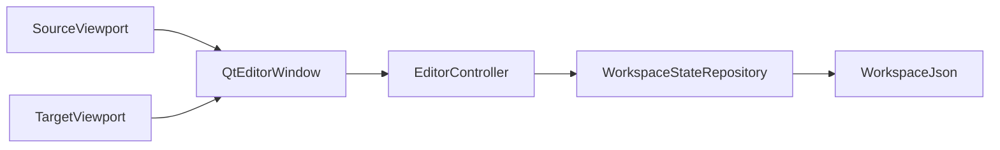
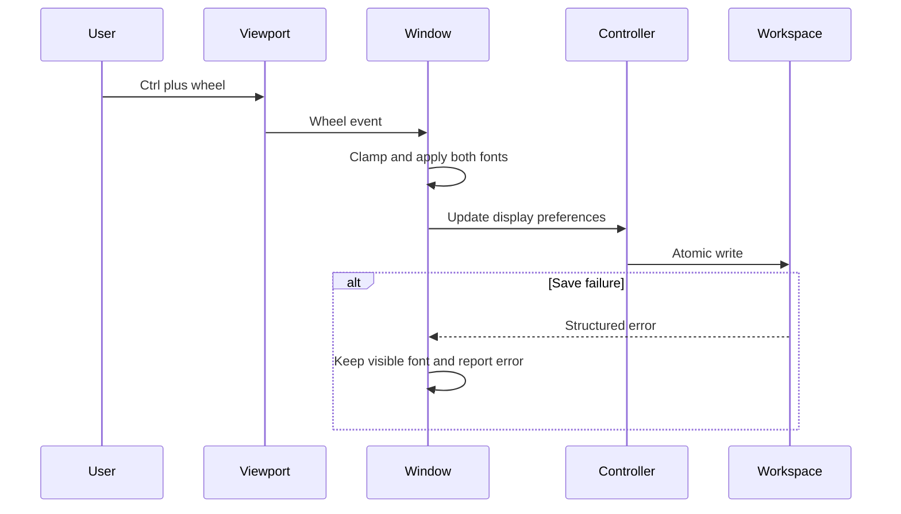

# 技术设计

## Overview

本功能在既有 Qt 三栏编辑器中提供 source/target 同步字号缩放，并通过当前本地 workspace 状态恢复最近一次成功保存的字号。实现沿用 `DisplayPreferences → EditorController → WorkspaceStateRepository`，不创建第二套配置权威。

UI 仅过滤 source/target viewport 的 Ctrl+滚轮事件。字号先在当前窗口即时生效，再尝试原子持久化；保存失败不回滚当前视觉结果，也不改写此前有效的本地状态。

### Goals

- source 与 target 以相同步进和边界同步缩放。
- 字号作为用户级本地显示偏好跨窗口、项目与重启恢复。
- 普通滚动、浏览模式、段落列表和项目数据保持不变。

### Non-Goals

- 不缩放浏览/校对页、段落列表、菜单、设置或全局 UI。
- 不提供字体族、逐项目字号、快捷键配置或浏览模式缩放。
- 不改变项目、TM、术语表、speaker 或段落身份。

## Boundary Commitments

### This Spec Owns

- 编辑区字号的有效范围、默认值和持久化字段。
- source/target viewport 的 Ctrl+滚轮识别与同步视觉应用。
- 字号偏好缺失、非法及保存失败时的回退和错误反馈。

### Out of Boundary

- Linux `.desktop`、应用图标和资源省略号按钮维护。
- 项目搜索、预处理、术语管理及 Feature 5 搜索/TM 能力。
- 浏览/校对页、段落导航和其他 Qt 控件的字体。
- 项目文件或语言资源中的显示配置。

### Allowed Dependencies

- `editor_contracts.DisplayPreferences` 作为唯一显示偏好契约。
- `EditorController.display_preferences()` 和 `update_display_preferences()` 作为 Qt 唯一持久化入口。
- `WorkspaceStateRepository` 现有原子 `workspace.json` 写入机制。
- PySide6 6.11.1 的 viewport event filter、`QWheelEvent`、`QFont` 与 `QTextDocument`。

### Revalidation Triggers

- `DisplayPreferences` 或 `workspace.json.display` 的契约/所有权变化。
- source/target 控件从 `QTextBrowser`/`QTextEdit` 更换或滚轮事件接收对象变化。
- source HTML/QSS 再次引入固定字号。
- Qt 前端绕过 `EditorController` 直接访问 workspace 存储。

## Architecture

### Existing Architecture Analysis

- `QtEditorWindow` 在启动时经 Controller 读取 `DisplayPreferences`，并用 `replace()` 更新段落密度和工作区模式。
- `WorkspaceStateRepository` 将最近项目和 display 对象一次原子写入 `workspace.json`。
- source 高亮 HTML 与 source/target QSS 目前固定为 `15px`，必须改为继承运行时文档字体。
- 滚轮事件由文本控件 viewport 接收；过滤主窗口或 QApplication 会扩大功能边界。

### Architecture Pattern & Boundary Map

**Selected pattern**: 现有 Controller-mediated local preference，加两个 viewport 的局部事件适配。



依赖方向保持 `Qt Frontend → EditorController → Storage`。字体应用属于 Layer 4；范围验证属于 frozen contract；持久化属于既有 Storage。

### Technology Stack

| Layer | Choice / Version | Role in Feature | Notes |
|-------|------------------|-----------------|-------|
| Frontend | PySide6 6.11.1 | 滚轮过滤、同步设置文档字体、错误反馈 | 无新依赖 |
| Logic | `EditorController` | 读取和提交显示偏好 | 接口不变 |
| Data | `WorkspaceStateRepository` / JSON schema v1 | 原子保存可选 `editor_font_size` | 旧文件兼容 |

## File Structure Plan

### Directory Structure

```text
/
├── editor_contracts.py               # 字号常量与 DisplayPreferences 有界字段
├── workspace_state.py                # display.editor_font_size 可选读写和字段级回退
├── qt_editor_window.py               # viewport Ctrl+滚轮、同步字体应用和失败反馈
└── tests/
    ├── test_workspace_state.py       # 字号持久化、旧状态和损坏状态
    └── test_qt_editor_font_zoom.py   # 真实 Qt 事件、范围隔离和内容完整性
```

### Modified Files

- `editor_contracts.py` — 定义默认值 15、范围 10–28 及 `editor_font_size: int`。
- `workspace_state.py` — 在 schema v1 的 display 对象中兼容读写字号。
- `qt_editor_window.py` — 移除 source/target 固定字号覆盖，安装局部过滤器并同步应用。
- `tests/test_workspace_state.py` — 扩展本地状态回归。

### New Files

- `tests/test_qt_editor_font_zoom.py` — 隔离字号交互的 Qt offscreen 测试。

## System Flows



无 Ctrl 的滚轮不由该流程消费，继续交给文本控件默认滚动行为。

## Requirements Traceability

| Requirement | Summary | Components | Interfaces | Flows |
|-------------|---------|------------|------------|-------|
| 1.1 | source Ctrl+上滚放大 | QtEditorWindow Font Zoom Adapter | `eventFilter`, `set_editor_font_size` | Ctrl+滚轮 |
| 1.2 | target Ctrl+下滚缩小 | QtEditorWindow Font Zoom Adapter | `eventFilter`, `set_editor_font_size` | Ctrl+滚轮 |
| 1.3 | 两个编辑区即时同步 | QtEditorWindow Font Zoom Adapter | `apply_editor_font_size` | UI 即时应用 |
| 1.4 | 普通滚轮不改变字号 | QtEditorWindow Font Zoom Adapter | `eventFilter` pass-through | 默认滚动 |
| 1.5 | 最小/最大边界 | DisplayPreferences, Font Zoom Adapter | constants, clamp | 有界变更 |
| 1.6 | 会话内跨段落/模式保持 | QtEditorWindow | runtime font state | 工作区切换 |
| 2.1 | 成功改变后保存 | QtEditorWindow, EditorController | `update_display_preferences` | 原子提交 |
| 2.2 | 重启/新窗口恢复 | WorkspaceStateRepository, QtEditorWindow | `display_preferences` | 启动恢复 |
| 2.3 | 不写项目或语言资源 | Boundary, WorkspaceStateRepository | `workspace.json` only | 本地状态 |
| 2.4 | 缺失/损坏/越界回退 | DisplayPreferences, WorkspaceStateRepository | optional field parser | 启动恢复 |
| 2.5 | 保存失败保留可见字号 | QtEditorWindow | error feedback contract | 失败分支 |
| 3.1 | 项目与匹配身份不变 | QtEditorWindow Font Zoom Adapter | font-only mutation | UI 即时应用 |
| 3.2 | 其他 UI 字号不变 | Boundary, viewport filter | scoped target set | Ctrl+滚轮 |
| 3.3 | 区域外 Ctrl+滚轮不缩放 | viewport filter | installed object identity | 事件隔离 |
| 3.4 | 全程本地无网络 | Existing local stack | Controller/Workspace only | 本地状态 |

## Components and Interfaces

| Component | Domain/Layer | Intent | Req Coverage | Key Dependencies | Contracts |
|-----------|--------------|--------|--------------|------------------|-----------|
| DisplayPreferences | Shared contract | 约束字号默认值和范围 | 1.5, 2.4 | none | State |
| WorkspaceStateRepository | Storage | 兼容、原子保存字号 | 2.1–2.5, 3.4 | DisplayPreferences P0 | State |
| QtEditorWindow Font Zoom Adapter | Qt UI | 过滤输入并同步应用字体 | 1.1–1.6, 2.1, 2.5, 3.1–3.3 | EditorController P0 | Service, State |

### Shared Contract

#### DisplayPreferences

**Responsibilities & Constraints**

- `editor_font_size` 为非 bool 的整数，默认 15，闭区间为 10–28。
- 字号值只描述 source/target 编辑文本的逻辑像素大小。
- `replace()` 更新段落密度、工作区模式或字号时保留其他字段。

**Contracts**: State [x]

```python
DEFAULT_EDITOR_FONT_SIZE: int = 15
MIN_EDITOR_FONT_SIZE: int = 10
MAX_EDITOR_FONT_SIZE: int = 28

@dataclass(frozen=True)
class DisplayPreferences:
    segment_density: SegmentDensity = SegmentDensity.COMPACT
    workspace_mode: WorkspaceMode = WorkspaceMode.EDIT
    editor_font_size: int = DEFAULT_EDITOR_FONT_SIZE
```

### Storage

#### WorkspaceStateRepository

**Responsibilities & Constraints**

- 写入 `display.editor_font_size`，与其他 workspace 状态共享一次原子替换。
- 缺少该键时使用 15；类型错误或越界时仅字号回退，不损坏项目文件。
- 保持 schema version 1，因为新增键是向后兼容的可选字段。

**Contracts**: State [x]

##### State Management

- State model: `workspace.json.display.editor_font_size: integer`
- Persistence: 现有同目录临时文件、`fsync`、`os.replace`
- Recovery: 缺失/非法字段回退常量；写失败保留旧文件

### Qt UI

#### QtEditorWindow Font Zoom Adapter

**Responsibilities & Constraints**

- event filter 只安装到 `source_display.viewport()` 和 `target_editor.viewport()`。
- 仅 Ctrl 修饰且垂直滚轮增量非零时消费事件；按符号改变一个步进。
- 同步更新两个 widget font 和 document default font。
- source 高亮 HTML 不声明字号；source/target QSS 不声明固定字号。
- UI 先应用，再通过 Controller 保存；保存失败保持运行时字号并显示错误。

**Contracts**: Service [x] / State [x]

##### Service Interface

```python
def set_editor_font_size(self, size: int, *, persist: bool = True) -> bool:
    """Clamp and apply the editor font; return whether persistence succeeded."""

def apply_editor_font_size(self, size: int) -> None:
    """Apply one validated size to source and target without domain mutation."""
```

- Preconditions: 主窗口 UI 已构建；输入可转换为有界整数。
- Postconditions: source/target 的有效像素字号相同；项目与资源状态不变。
- Invariants: 区域外事件、无 Ctrl 事件和边界外滚动不改变字号。

**Implementation Notes**

- Integration: 在 `_build_ui()` 完成后应用已恢复的值，再连接 viewport event filter。
- Validation: 对比两个控件和文档字体；记录 Controller 持久化调用。
- Risks: source `setHtml()` 后需保留 document default font，防止高亮刷新恢复固定字号。

## Error Handling

| Error | Response | Preserved State |
|-------|----------|-----------------|
| workspace 缺少字号 | 使用 15 | 其他有效偏好 |
| 字号类型错误/越界 | 记录警告并使用 15 | 项目与旧文件 |
| 持久化失败 | 显示“字号偏好未保存”错误 | 当前可见字号、此前有效 workspace 文件 |
| 边界外滚轮 | 保持边界，不重复写入 | 当前字号 |

## Testing Strategy

### Unit Tests

- `DisplayPreferences` 接受 10、15、28，拒绝 bool、非整数、9 与 29。
- `WorkspaceStateRepository` 往返保存字号，并从旧 schema v1 缺失字段恢复 15。
- 非法字号字段单独回退 15，不写回、不修改项目或语言资源。

### Integration Tests

- source viewport Ctrl+上滚后 source/target 同步增加 1 并写入 `workspace.json`。
- target viewport Ctrl+下滚后同步减少 1；新窗口恢复结果。
- 注入 `EditorControllerError` 后仍保留两个控件的新可见字号并显示错误。

### E2E/UI Tests

- 普通滚轮保持字号并继续改变文本滚动位置。
- 段落列表、浏览表、菜单和设置上的 Ctrl+滚轮不改变编辑字号。
- 到达 10/28 后继续滚动不越界、不产生冗余持久化。
- 切换段落和浏览/编辑模式后返回时字号不变，source/target/speaker/confirmed 内容保持原值。

### Regression

- 运行全部 Qt offscreen 与 workspace 状态测试。
- 运行 AST 边界守卫，确认 Qt 未直接导入 `WorkspaceStateRepository`。

