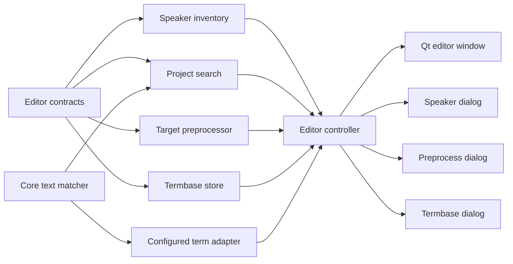
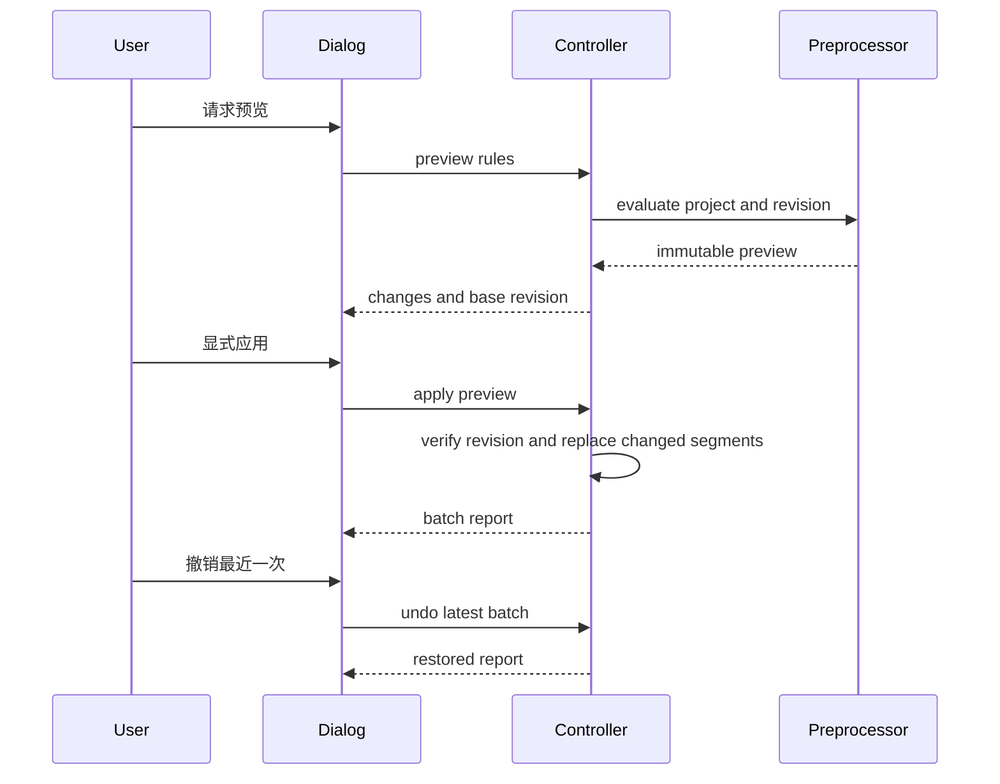
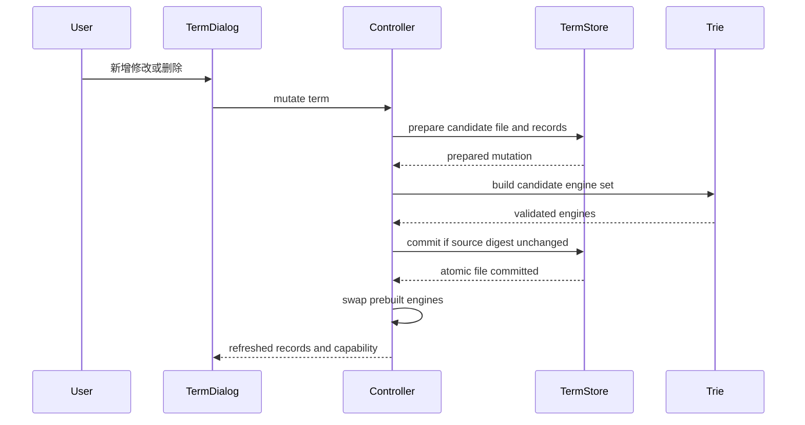
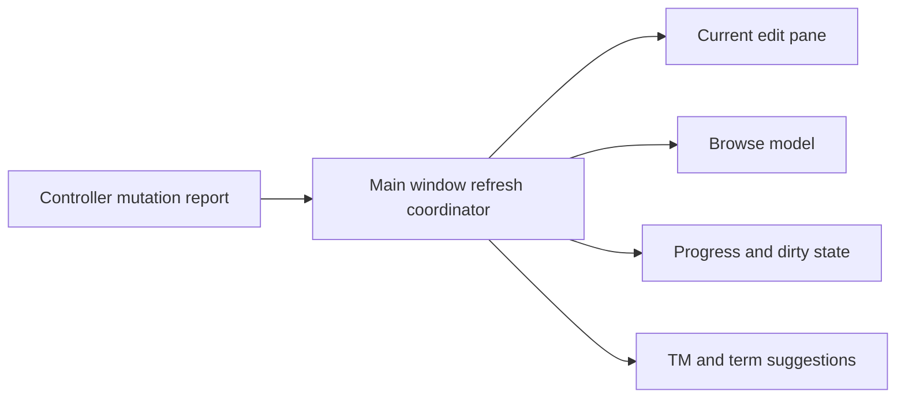
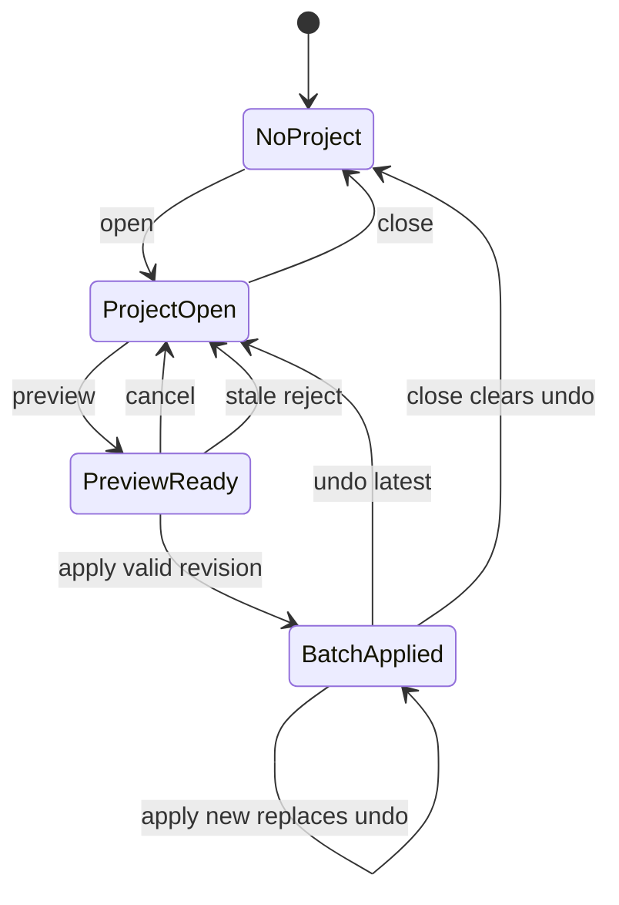

# 设计文档

## 概述

本增量把现有单 JSON 编辑器扩展为更完整的个人翻译工作台：只读盘点并显示项目已有 raw speaker，提供项目内关键词定位、target-only 预处理与单批次撤销、译文框撤销/重做、术语 CRUD，以及 silver logo 和紧凑资源操作。它继续复用唯一的 frozen `EditorProject` 会话，不增加项目格式或第二份可变状态。

搜索产品入口属于 Qt，但字符匹配只消费 Feature 5 的中立 `TextMatcher`。Qt 负责字段遍历、结果导航、控件状态和反馈，不实现 case-fold、Whole Word 或 CJK 特判。其他增量服务保持标准库、Qt 无关，并统一经 `EditorController` 暴露。

### 目标

- 在不修改 source、speaker 与 TM identity 的前提下完成 raw speaker inventory 和双模式显示。
- 提供可预览、可拒绝 stale apply、可撤销最近一次应用的 target-only 预处理。
- 通过版本化单文件术语存储完成 CRUD，同时保持 legacy 两列语义。
- 保持 Qt → Controller → Domain/Storage 的单向依赖与既有回归。

### 非目标

- 新项目格式、多文档/章节、目录搜索或 source reconciliation。
- speaker alias、留空 profile、头像和导出变换。
- Qt 自己实现 Match Case、Whole Word、Unicode 边界或 fuzzy。
- 正则、脚本、Replace All、项目级无限 undo history。
- SQLite TM、context/fuzzy 检索或 Parser 重构。

## Boundary Commitments

### This Spec Owns

- 单 JSON `EditorSegment.speaker` 的只读 inventory 与编辑/浏览显示。
- 项目级 search request/report、字段遍历、结果导航与 matcher capability 展示。
- target-only literal preprocessing、revision 校验和最近一次批量应用撤销。
- 译文框本地 undo/redo 的焦点与会话同步。
- legacy/v1 mixed termbase 的 CRUD、原子保存、冲突反馈和 Trie 热重载。
- silver logo、紧凑 ellipsis 与相关可访问性/QtTest。

### Out of Boundary

- 项目 codec、source 更新重关联和多章节 `SearchScope`。
- Feature 5 `TextMatcher` 的字符语义、offset 计算和 capability 判定实现。
- 术语 fuzzy、云端资源、同步与协作 chunk。
- speaker display profile 的持久化。
- 旧 `LogicController` 与 Excel 三态的扩展。

### Allowed Dependencies

- Domain services 可依赖 `editor_contracts.py` 和标准库，不得依赖 PySide6。
- `TermbaseStore` 可依赖标准库 CSV/JSON 编码工具和本地原子替换，不得依赖 Trie 或 Qt。
- `EditorController` 可依赖项目、workspace、资源仓储、现有 Engine、新领域服务和 Feature 5 中立 matcher port。
- Qt presentation 文件只可依赖 `EditorController`、`editor_contracts.py` 和其他 Qt presentation 文件。
- composition root `qt_editor.py` 可构造 repository/controller/Qt window，但不得实现或调用领域规则。
- Qt presentation 不可导入 `editor_project.py`、`TermbaseStore`、preprocessor、inventory、Feature 5 store/scorer 或 `LogicController`。

### Revalidation Triggers

- `EditorSegment.speaker` 的规范化或保存语义改变。
- Feature 5 `TextMatcher`、`SearchOptions`、offset 或 capability contract 改变。
- termbase v1 行格式、legacy Trie 语义或 import merge 规则改变。
- Controller revision/dirty/confirmed 语义或 `QTextEdit` 刷新路径改变。
- Parser 接管 JSON codec、多文档 workspace 或 speaker profile 落地。

## Governance Impact

- **Applicable Steering**：`product.md`、`structure.md`、`tech.md`、`feature5-ui-integration.md`、`spec-ownership.md`。
- **Applicable ADRs**：ADR-009、ADR-011；项目搜索继续只消费 Feature 5 的中立 matcher handoff。
- **ADR disposition**：None。可折叠表面、清除已签发结果与由现有 `target/confirmed` 派生的状态筛选不改变 authority、持久格式、发布协议、依赖方向或跨 Spec matcher contract。
- **Scope amendment**：Approved，对应 Requirements Scope Lineage 中 2026-08-19 Requirement 3 表面 amendment。
- **Steering sync**：Not required。产品定位、架构层级与技术栈不变；Feature GO 只核对最终实际 delta。
- **Downstream revalidation**：Feature 5 Matcher Gate generation invalidation、JSON/TXT/sample capability、Qt search keyboard/accessibility 及 current-source Requirement 3 acceptance。

## 架构

### 现有架构分析

- `EditorController` 已拥有唯一项目会话、导航、dirty、资源热重载和建议协调。
- `EditorProject`/`EditorSegment` 是 frozen dataclass，适合纯扫描和批量 immutable replace。
- `GlossaryEngine` 是运行时 Trie，不适合作为 CRUD 仓储；现有 importer 只保留两列。
- 主窗口已有编辑/浏览共享会话，但尚未显示 speaker、搜索或项目工具。
- `qt_editor_window.py` 直接依赖 `ProjectError` 是现有边界漂移，本增量一并收口。

### 架构模式与边界图



依赖方向为 Contracts/Core Port → Pure Domain/Storage → EditorController → Qt。搜索编排与 matcher 分离：前者知道 project fields，后者只知道 text/query/options。

### 技术栈

| 层 | 选择 / 版本 | 作用 | 说明 |
|----|-------------|------|------|
| Frontend | PySide6 6.11.1 | 搜索条、对话框、speaker 展示、undo/redo | 沿用现有依赖 |
| Logic | Python 3.14 frozen dataclass | Controller 门面、revision、batch undo | 无 Qt 类型 |
| Domain | Python 3.14 标准库 | inventory、search orchestration、literal preprocessing | 无新增依赖 |
| Storage | UTF-8-SIG mixed CSV | legacy/v1 术语 CRUD | 同目录临时文件 + `os.replace` |
| Shared integration | Feature 5 `TextMatcher` port | 唯一文本匹配语义 | Core 未就绪时 capability 明示不可用 |

## File Structure Plan

### Directory Structure

```text
/
├── editor_contracts.py               # 新增 inventory/search/preprocess/term frozen contracts
├── speaker_inventory.py              # 只读扫描 EditorProject
├── project_search.py                 # 遍历字段并消费 TextMatcher port
├── target_preprocessor.py            # literal rule preview/apply 纯逻辑
├── termbase_store.py                 # mixed CSV parser、CRUD 与原子写
├── editor_controller.py              # use case 门面、revision、batch undo、异常归一化
├── resource_importer.py              # 术语 import 改经 TermbaseStore merge
├── glossary_engine.py                # legacy Trie 与 configured TextMatcher adapter
├── qt_editor_window.py               # speaker、search bar、editor undo、入口
├── qt_speaker_inventory_dialog.py    # inventory 只读表
├── qt_preprocess_dialog.py           # rule、preview、apply、batch undo
├── qt_termbase_dialog.py             # term list/CRUD/disabled capability
├── qt_settings_dialog.py             # 管理入口与紧凑 ellipsis
├── qt_editor.py                      # silver launcher/application icon
└── tests/
    ├── test_speaker_inventory.py
    ├── test_project_search.py
    ├── test_target_preprocessor.py
    ├── test_termbase_store.py
    ├── test_editor_controller_tools.py
    ├── test_qt_project_tools.py
    ├── test_qt_editor_undo.py
    ├── test_qt_browse_mode.py
    ├── test_qt_settings_dialog.py
    ├── test_qt_bootstrap.py
    └── test_qt_user_journey.py
```

### Modified Files

- `editor_contracts.py` — 只新增跨层数据形状，不实现业务。
- `editor_controller.py` — 组合服务并保持唯一项目状态。
- `resource_importer.py` — 防止术语导入丢失 v1 行。
- `glossary_engine.py` — 接受 store 解析后的有效记录，legacy 语义不变。
- `qt_editor_window.py` — presentation 与动作分派，不持久化数据。
- `qt_settings_dialog.py`、`qt_editor.py` — 管理入口、ellipsis 和图标维护。
- `tests/test_qt_user_journey.py` — 加强 Layer 4 AST guard。

## 系统流程

### 预处理 preview、apply 与 undo



stale preview 不进行部分应用。apply 只替换有实际 target 变化的段落，并把这些段落的 confirmed 设为 false。

### 术语 CRUD 与热重载



candidate Engine 构建失败时丢弃 staged file；source digest 变化或原子提交失败时保留旧文件和旧 Engine。文件提交成功后只执行不会解析或分配资源的引用交换，因此不存在“磁盘新版本、运行时旧版本”的可接受成功状态。

### 跨视图一致刷新



- preprocess apply/undo 对话框在 Controller 成功后发出 typed mutation report；主窗口唯一 `_refresh_from_controller()` 依次刷新当前段 source/target/speaker/confirmed、browse rows、进度/dirty、suggestions。
- term mutation 只有在 `TermCommitOutcome.state=COMMITTED` 时发出其中的 `TermMutationReport`；同一 coordinator 至少重取当前 suggestions 与资源状态。其他 state 显示 error/recovery/quarantine，不发 committed refresh；edit/browse/progress 读取同一 Controller snapshot，不保留 dialog 私有副本。
- 任何失败不发送 committed report；当前段 index/cursor 仅在对应内容仍存在时保留，刷新期间 signal-block 防止把展示更新写回 Controller。

## 需求追踪

| 需求 | 摘要 | 组件 / 接口 |
|------|------|-------------|
| 1.1, 1.2, 1.3, 1.4, 1.5, 1.6, 1.7 | raw speaker 扫描、顺序、计数与只读 | SpeakerInventoryService, `speaker_inventory()` |
| 2.1, 2.2, 2.3, 2.4, 2.5 | 编辑/浏览 raw speaker | QtEditorWindow, browse table |
| 3.1, 3.2, 3.3, 3.4, 3.5, 3.6, 3.7, 3.8, 3.9, 3.10 | 搜索、导航、capability、CJK | ProjectSearchService, TextMatcher port, search bar |
| 4.1, 4.2, 4.3, 4.4, 4.5, 4.6, 4.7, 4.8, 4.9, 4.10, 4.11 | target-only preview/apply | TargetPreprocessor, revision flow |
| 5.1, 5.2, 5.3, 5.4, 5.5, 5.6 | 最近一次批量撤销 | EditorController BatchUndoState |
| 6.1, 6.2, 6.3, 6.4, 6.5, 6.6 | editor undo/redo | QtEditorWindow target editor |
| 7.1, 7.2, 7.3, 7.4, 7.5, 7.6, 7.7, 7.8, 7.9, 7.10, 7.11, 7.12, 7.13 | term CRUD、legacy/v1、热重载 | TermbaseStore, TermbaseDialog, Controller |
| 8.1, 8.2, 8.3, 8.4, 8.5 | silver logo 与 ellipsis | QtBootstrap, SettingsDialog |
| 9.1, 9.2, 9.3, 9.4, 9.5, 9.6, 9.7 | 单 JSON、本地性、兼容与错误恢复 | Controller gates, AST/full regressions |

关键跨线验收采用更细绑定，防止整章覆盖掩盖 capability 或提交缺口：

| 验收标准 | 可执行绑定 | 证明 |
|----------|------------|------|
| 3.1–3.2 | `ProjectSearchService` + handoff `BASIC_VALIDATED` state | false/false golden + Qt navigation test |
| 3.7–3.10 | `TextMatcherDisplayState` + `CONFIGURABLE_TEXT_V1` profile | disabled-state QtTest + CJK shared vectors |
| 5.2, 5.5 | project session id + before/after batch snapshot | stale/cross-project undo tests |
| 7.2–7.6 | prepare/build/commit/swap transaction | failure injection before/at commit |
| 7.7–7.12 | legacy Trie/configured adapter capability cohorts | legacy/new flags/CJK matrix |
| 9.1, 9.7 | `_require_json_project()` + `ProjectToolCapability` | JSON/TXT/sample capability tests |

## 组件与接口

| 组件 | 层 | 目的 | 需求覆盖 | 关键依赖 | 契约 |
|------|----|------|----------|----------|------|
| EditorContracts | Shared | 冻结跨层形状 | 1–7, 9 | 无 | State |
| SpeakerInventoryService | Domain | 只读 speaker 盘点 | 1 | EditorProject | Service |
| ProjectSearchService | Domain | project fields 搜索编排 | 3 | TextMatcher | Service |
| TargetPreprocessor | Domain | literal preview | 4 | EditorProject | Service |
| TermbaseStore | Storage | mixed CSV CRUD | 7, 9 | filesystem | Service, State |
| ConfiguredTermAdapter | Domain adapter | v1 flags 与 legacy Trie 兼容 | 7, 9 | GlossaryEngine/TextMatcher | Service |
| EditorController | Logic | use case、revision 与 batch undo | 1–7, 9 | domain/store/engines | Service, State |
| QtEditorWindow | Frontend | 主编辑、search、speaker、undo | 2, 3, 6, 8 | Controller | UI |
| ProjectToolDialogs | Frontend | inventory/preprocess/termbase | 1, 4, 5, 7 | Controller | UI |
| QtBootstrap | Runtime | silver desktop/app icon | 8 | stdlib/PySide6 | CLI |

### Shared contracts

```python
@dataclass(frozen=True)
class SpeakerInventoryItem:
    raw_speaker: str
    count: int
    first_segment_id: str
    first_index: int

@dataclass(frozen=True)
class SpeakerInventory:
    items: tuple[SpeakerInventoryItem, ...]
    empty_count: int
    segment_count: int

@dataclass(frozen=True)
class ProjectToolCapability:
    project_session_id: str | None
    single_json_tools_available: bool
    project_kind: str
    unavailable_reason: str | None

class SearchField(str, Enum):
    SOURCE = "source"
    TARGET = "target"
    SPEAKER = "speaker"

class SegmentTranslationStatus(str, Enum):
    UNFILLED = "unfilled"
    DRAFT = "draft"
    TRANSLATED = "translated"

@dataclass(frozen=True)
class ProjectSearchRequest:
    query: str
    fields: tuple[SearchField, ...]
    options: SearchOptions
    status: SegmentTranslationStatus | None = None

@dataclass(frozen=True)
class ProjectSearchHit:
    segment_id: str
    segment_index: int
    field: SearchField
    start_index: int
    end_index: int
    preview: str

@dataclass(frozen=True)
class ProjectSearchReport:
    hits: tuple[ProjectSearchHit, ...]
    capability: TextMatcherDisplayState

@dataclass(frozen=True)
class LiteralReplaceRule:
    find: str
    replacement: str
    enabled: bool

@dataclass(frozen=True)
class PreprocessChange:
    segment_id: str
    segment_index: int
    before_target: str
    after_target: str
    before_confirmed: bool
    after_confirmed: bool

@dataclass(frozen=True)
class PreprocessPreview:
    project_session_id: str
    base_revision: int
    changes: tuple[PreprocessChange, ...]

@dataclass(frozen=True)
class BatchOperationReport:
    operation: str
    project_session_id: str
    resulting_revision: int
    changed_segment_ids: tuple[str, ...]
    dirty: bool

@dataclass(frozen=True)
class BatchUndoState:
    project_session_id: str
    applied_revision: int
    dirty_before: bool
    saved_baseline_digest_at_apply: str
    changes: tuple[PreprocessChange, ...]

class TermMatchPolicy(str, Enum):
    LEGACY = "legacy_case_sensitive_substring"
    CONFIGURED = "configured"

class TermRowKind(str, Enum):
    LEGACY = "legacy"
    V1 = "localcat-term-v1"

@dataclass(frozen=True)
class TermRecordLocator:
    row_kind: TermRowKind
    file_digest: str
    row_ordinal: int
    row_digest: str
    record_id: str | None

@dataclass(frozen=True)
class TermRecord:
    locator: TermRecordLocator
    record_id: str | None
    source: str
    target: str
    policy: TermMatchPolicy
    match_case: bool | None
    whole_word: bool | None

@dataclass(frozen=True)
class TermDraft:
    source: str
    target: str
    match_case: bool = False
    whole_word: bool = True

@dataclass(frozen=True)
class LegacyTermRow:
    source: str
    target: str
    input_ordinal: int

@dataclass(frozen=True)
class PreparedTermMutation:
    action: str
    resource_path: Path
    base_digest: str
    staged_path: Path
    recovery_path: Path | None
    candidate_records: tuple[TermRecord, ...]

@dataclass(frozen=True)
class TermMutationReport:
    action: str
    resource_path: Path
    committed_digest: str
    records: tuple[TermRecord, ...]
    created: int
    updated: int
    deleted: int
    imported: int
    overwritten: int

class TermCommitState(str, Enum):
    COMMITTED = "committed"
    NOT_COMMITTED = "not_committed"
    ROLLED_BACK = "rolled_back"
    INDETERMINATE = "indeterminate"

@dataclass(frozen=True)
class TermCommitOutcome:
    state: TermCommitState
    report: TermMutationReport | None
    error_code: str | None
    retryable: bool
    recovery_path: Path | None
    quarantined: bool
    safe_detail: str | None

@dataclass(frozen=True)
class TermCleanupReport:
    cleaned: bool
    recovery_path: Path | None
    warning_code: str | None
```

`TextMatcherDisplayState` 直接复用 Integration frozen contract，不在 Qt Spec 重定义 readiness、availability boolean、semantics version 或 validation digest。`BASIC_VALIDATED` 的 supported profiles 必须精确为 handoff 的 BASIC 集合；`TEXT_V1_VALIDATED` 必须精确包含 `CONFIGURABLE_TEXT_V1`。Qt MVP 完成验收时 basic search 必须可用；未批准状态只能 fail closed，Qt 不能自行降级匹配。v1 locator 必须有 record id，legacy locator 不得有；file/row digest 使用 SHA-256，ordinal 非负。Prepared paths 必须同目录且不等于 resource path；candidate records 必须已完整验证。COMMITTED 必须有 report，其他 state 不得有；只有 INDETERMINATE 可 quarantined。所有 tuple 在 `__post_init__` 中校验，字符范围必须引用原字段文本，legacy flags 必须同时为 `None`；Batch report 的 changed ids 不重复，term mutation counts 非负。

### SpeakerInventoryService

```python
def build_speaker_inventory(project: EditorProject) -> SpeakerInventory: ...
```

- 本规格的 raw speaker 精确定义为 JSON loader 完成既有首尾空白规范化后保存于 `EditorSegment.speaker` 的运行时值；它不是源文件字节级值，也不是从 source 解析的前缀。
- 仅消费该 `EditorSegment.speaker`；空值不进入 items。
- 顺序由首次出现 index 决定，重复调用确定性相同。
- 无 I/O、无缓存、无 project mutation。

### ProjectSearchService

```python
class ProjectSearchService:
    def __init__(self, matcher: TextMatcher) -> None: ...
    def search(
        self,
        project: EditorProject,
        request: ProjectSearchRequest,
    ) -> ProjectSearchReport: ...
```

- 空 query 在边界拒绝；字段按 segment order 与固定 SOURCE/TARGET/SPEAKER 顺序扫描。
- 段状态是非空 query 的可选前置筛选：`confirmed=true` 为 TRANSLATED；否则 `target.strip()==""` 为 UNFILLED，其余为 DRAFT。未选状态时遍历全部段落。
- service 只对通过状态筛选的段落调用唯一 Core matcher；Qt 不得对返回 hits 事后过滤。
- 每个字段调用唯一 Core matcher，hit offsets 原样传递。
- basic request 固定使用 `false/false`，要求 handoff state 至少为 `BASIC_VALIDATED`；只有 `TEXT_V1_VALIDATED` 才允许 Controller 接受其他 options。
- service 不导航，Controller 用 hit 的 stable segment id/index 调用 `go_to()`。
- UI 可先渲染稳定搜索入口，但 Qt MVP 不得在 basic capability 缺失时宣称基础搜索完成。

### TargetPreprocessor

```python
def preview_preprocessing(
    project: EditorProject,
    project_session_id: str,
    revision: int,
    rules: tuple[LiteralReplaceRule, ...],
) -> PreprocessPreview: ...
```

- 规则按可见顺序应用，只处理 target；find 为空或无 enabled rule 返回结构化 validation error。
- 每条规则采用 Python 字符串的区分大小写、从左到右、非重叠 literal replace；不做 Unicode normalization、正则或递归重跑。
- change 保存 segment id/index、before/after target 与 before confirmed。
- 纯函数不写 project；Controller apply 时复核 revision、segment id 与 before target。

### TermbaseStore

```python
class TermbaseStore:
    def list_records(self, path: Path) -> tuple[TermRecord, ...]: ...
    def prepare_create(self, path: Path, draft: TermDraft) -> PreparedTermMutation: ...
    def prepare_update(
        self, path: Path, locator: TermRecordLocator, draft: TermDraft
    ) -> PreparedTermMutation: ...
    def prepare_delete(
        self, path: Path, locator: TermRecordLocator
    ) -> PreparedTermMutation: ...
    def prepare_merge_legacy(
        self, path: Path, rows: tuple[LegacyTermRow, ...]
    ) -> PreparedTermMutation: ...
    def commit(self, prepared: PreparedTermMutation) -> TermCommitOutcome: ...
    def discard(self, prepared: PreparedTermMutation) -> None: ...
    def finalize(
        self, prepared: PreparedTermMutation, outcome: TermCommitOutcome
    ) -> TermCleanupReport: ...
```

**行契约**

- legacy：恰好两列 `source,target`，policy=LEGACY、id/flags 为 `None`。
- v1：恰好六列 `localcat-term-v1,id,source,target,match_case,whole_word`。
- 未知 marker、空 source/target、重复 exact source、重复 id 或无效布尔值导致整个 mutation 拒绝。
- prepare 完整解析当前文件、记录 source digest，把原文件逐字节复制为同目录 recovery file，并把 candidate rows 写入同目录 staged file；两者均 flush/fsync，随后 fsync parent directory，尚不替换源文件。
- Controller 先用 candidate records 构建所有受影响的 runtime engines；构建失败调用 discard。
- commit 复核 source digest 后 `os.replace(stage, resource)` 并 fsync parent directory；post-replace 任一步失败时必须用 recovery file 原子恢复、再次 fsync 并验证原 digest，只有恢复成功才返回普通失败。
- 如果恢复本身失败，返回 fail-stop `COMMIT_INDETERMINATE`、隔离该资源并继续使用内存 last-known-good Engine；不得报告成功，且 UI 必须提示从 recovery path 恢复。fault-injection gate 要证明所有可恢复失败保持原字节。
- 提交和目录 fsync 成功后返回 COMMITTED；Controller 只交换预构建的不可变 engine references，再调用 finalize 清理 recovery。清理失败只形成可删除的冗余 recovery warning，不回滚已提交术语。
- discard 只允许在 commit 前或 NOT_COMMITTED/ROLLED_BACK 后删除 staged/recovery，不得用于 COMMITTED/INDETERMINATE；finalize 只允许 COMMITTED 且不得改 resource bytes。
- legacy update/delete 通过当前 snapshot locator 定位，更新仍保持两列 legacy；stale locator 拒绝整个 mutation。
- 创建新记录使用 UUID 与 `false/true`；统一 matcher 未验收时记录仍按 legacy preset 进入现有 Trie，只有两个新 flags 暂不参与匹配。
- merge incoming rows 先按 source 做 last-write-wins；命中 legacy 时只覆盖 target 并保持两列/原位置，命中 v1 时只覆盖 target 并保留 id/policy/flags，新增 source 按首次输入顺序追加为 legacy row。

### ConfiguredTermAdapter

- legacy rows 始终进入现有 `GlossaryEngine` Trie，保持区分大小写、连续子串、重叠候选与长词优先。
- handoff 尚未包含 `CONFIGURABLE_TEXT_V1` profile 时，v1 rows 也以 legacy preset 进入同一 Trie，使新增/修改立即可见，但两个 flags 不改变结果。
- handoff 包含 `CONFIGURABLE_TEXT_V1` profile 时，v1 rows 从 legacy Trie cohort 移出；adapter 对每条记录调用唯一 Core matcher port，不在 Qt 线复制 case-fold、词界或 CJK 规则。
- configured hits 与 legacy Trie hits 合并后按原文 start、匹配长度降序、资源顺序、记录顺序稳定排序，并使用既有长词优先/非重叠选择规则生成建议。
- capability 切换或 term mutation 必须重建完整 candidate engine set；只有成功构建才允许原子提交术语文件。

### EditorController

```python
class EditorController:
    def project_tool_capability(self) -> ProjectToolCapability: ...
    def speaker_inventory(self) -> SpeakerInventory: ...
    def search_project(self, request: ProjectSearchRequest) -> ProjectSearchReport: ...
    def clear_project_search(self) -> None: ...
    def go_to_search_hit(self, hit: ProjectSearchHit) -> EditorProject: ...
    def preview_preprocessing(
        self, rules: tuple[LiteralReplaceRule, ...]
    ) -> PreprocessPreview: ...
    def apply_preprocessing(self, preview: PreprocessPreview) -> BatchOperationReport: ...
    def undo_latest_preprocessing(self) -> BatchOperationReport: ...
    def list_terms(self, resource_id: str) -> tuple[TermRecord, ...]: ...
    def create_term(self, resource_id: str, draft: TermDraft) -> TermCommitOutcome: ...
    def update_term(
        self, resource_id: str, locator: TermRecordLocator, draft: TermDraft
    ) -> TermCommitOutcome: ...
    def delete_term(
        self, resource_id: str, locator: TermRecordLocator
    ) -> TermCommitOutcome: ...
```

- `project_revision` 在 target/confirmed/project 内容变化时增加；仅导航不增加。
- project-search issued context 绑定 session、matcher generation、request fields/status 与全项目 `id/source/target/speaker/confirmed` digest；任一依赖改变后旧 hit 不得导航。
- `clear_project_search()` 只清空 Controller 当前 report、issued hits 和 issued context，不导航、不修改 project/revision/dirty。
- 每次成功 open/set/close 生成新的 `project_session_id`；preview 与 batch snapshot 同时携带该 identity 和 revision。
- `_require_json_project()` 精确检查 `project.path is not None and project.path.suffix.lower() == ".json"`；`.txt` 与无路径 sample 继续可打开，但这些入口明确 disabled/rejected。
- apply 是单次 immutable project replacement；undo snapshot 包含 project identity、changed segment 的 before/after target、confirmed 和应用后 revision。
- undo 要求相同 project identity、没有更新批次覆盖该撤销点，且所有 changed segment 仍为 batch after state；无关段落后来被编辑不阻止撤销，任一相关段被编辑则拒绝整批，不部分覆盖新内容。成功撤销产生新 revision，并保留无关编辑。
- Controller 保存 canonical project-content digest 作为 saved baseline，并在成功 open/save 后更新；BatchUndoState 记录 `dirty_before` 与 apply 时的 baseline digest。undo 完成后以恢复后的当前 digest 对比“当前” saved baseline 重新计算 dirty：无保存/无其他编辑时回到 dirty_before，apply 后曾保存或存在其他编辑时保持正确 dirty。
- open/close/set_project 清空 batch undo；保存不清空，保存后 undo 会产生新的 dirty state。
- term mutation 使用 prepare → candidate engine build → commit → reference swap；任一步失败都不把部分新术语状态发布给磁盘或运行时。
- 公开项目 I/O 异常统一为 Controller error，Qt 不认识 codec error。

### Qt presentation

- 主编辑区在 source/target 对齐位置显示 raw speaker；空值保留布局并显示“无 speaker”可访问文本。
- browse table 增加 speaker 列，双击仍按 stable index 返回编辑。
- 顶栏提供 checkable 放大镜入口；项目搜索面板初始折叠，以不改变主 workspace geometry 的顶部浮层展示。点击入口或平台原生 Find 快捷键展开并聚焦，再次触发折叠；编辑/浏览切换保留当前展开状态，该状态不持久化。macOS 原生显示为 `Command+F`，Qt portable text 仍为 `Ctrl+F`。
- search bar 展示 query、source/target/speaker、全部/未填写/草稿/已翻译状态、结果计数与前后导航；advanced checkboxes 读取 capability 决定 enabled/reason。
- 显式“清除”先调用 Controller clear，再清 query 与可见 report；保留字段、matcher options、状态筛选和面板展开状态。
- Replace/Replace All 不是 search surface 直接 mutation；如未来纳入，必须经 Task 4.4 target-only preview/apply/undo 事务并另行 scope amendment。
- Translation Matches/Termbase 页签使用实体 `Control+Tab` / `Control+Shift+Tab`。由于 Qt 在 macOS 将 portable `Ctrl` 映射为 Command，实现仅对这两个页签快捷键使用 portable `Meta` 以接收并显示 `⌃`；不得注册 `Command+Tab`。编辑/校对仍使用 portable `Ctrl+1/2`，在 macOS 原生显示为 `Command+1/2`。
- inventory/preprocess/termbase 使用三个独立对话框，均只调用 Controller。
- `Ctrl+Z`、`Ctrl+Y`、`Ctrl+Shift+Z` 仅在 target editor 聚焦时调用 native undo/redo；`textChanged` 继续同步 Controller。
- 同段 suggestion 插入使用 `QTextCursor.beginEditBlock()`；切段/换项目时 signal-blocked `setPlainText()` 并明确清空 editor undo。
- 所有项目/术语 mutation 都通过主窗口 `_refresh_from_controller()` 更新 edit、browse、progress 与 suggestions；dialogs 不直接修改这些 widgets。
- 所有新控件有稳定 `objectName`、tooltip 和 accessible name。
- ellipsis 使用 `QToolButton(autoRaise=true)`、Fixed horizontal policy 和 32 logical px 最小键盘命中宽度；按钮宽度取 `sizeHint + 8` 且最大 40 logical px。
- 资源表操作列使用 `ResizeToContents`/Fixed，不参与 Stretch；名称/路径列承担剩余宽度。窗口缩放时操作列保持可见且不覆盖相邻单元格。

## 数据模型

### 会话状态



`project_revision`、project session id、saved baseline digest 与 batch undo 只存在于 Controller session，不进入 JSON project 或 `workspace.json`。project-content digest 使用固定字段顺序覆盖 locales 与每段 id/source/target/speaker/confirmed，不记录或输出正文。

### Termbase 物理模型

mixed CSV 保持一个资源文件和一个提交边界。v1 id 只属于术语管理身份，不进入 Trie 命中或翻译项目。legacy locator 只存在于一次读取 snapshot，不写回文件。读取顺序即显示顺序；mutation 保持未修改行的相对顺序。

## 错误处理

| 类别 | 示例 | 响应 |
|------|------|------|
| Capability | Core matcher 不可用/未验收 | 禁用执行或高级选项并显示 reason |
| Validation | 空搜索、空 find、无效术语 | 不改当前段/项目/文件 |
| Stale state | preview revision 不匹配 | 拒绝 apply，要求重新预览 |
| Storage | CSV 无效、stale locator、pre-commit 失败 | 丢弃 staged/recovery，保留旧字节和旧 Engine |
| Commit recovery | replace 后 fsync 失败 | recovery 原子恢复；恢复也失败则 fail-stop/quarantine |
| Runtime build | candidate Trie/configured adapter 构建失败 | 提交前失败，保留旧字节和旧 Engine |
| UI state | 无 undo/redo、无 batch snapshot | no-op + 明确反馈 |
| Project | 打开/保存失败 | Controller 统一错误，当前会话不变 |

默认日志只记录路径、记录数、错误类别和 revision，不记录 source/target/speaker 正文。

## 测试策略

### 单元测试

- Inventory：首次顺序、计数、空 speaker、重复确定性、项目完全不变（1.1–1.7）。
- Search orchestration：字段顺序、offset 透传、空 query、basic/advanced capability gate、无结果，以及未填写/草稿/已翻译派生与 matcher 前置筛选（3.1–3.16）。
- Preprocessor：规则顺序、no-op、confirmed、stale/cross-project preview、编辑后 stale batch undo、clean/dirty/save-after-apply baseline（4.1–5.6）。
- TermbaseStore：legacy/v1 mixed round-trip、legacy locator、默认 flags、merge overwrite、冲突、未知 marker、prepare/commit failure（7.1–7.13）。

### 集成测试

- Controller inventory/search/navigation 不丢未保存 target。
- apply/undo 后 project revision、dirty、target 和 confirmed 一致。
- apply/undo report 触发 edit、browse、progress、suggestions 四视图从同一 Controller session 刷新；失败不刷新为部分状态。
- term CRUD 后当前段 legacy/configured 建议即时变化；candidate build 或提交失败同时保留旧文件/Engine。
- resource import 经过 TermbaseStore 后不丢 v1 行。
- Qt 模块 AST 不导入 codec/store/domain/Core implementation。
- JSON 允许本规格工具；TXT/sample 保持可打开但工具 capability 明确不可用。

### E2E / QtTest

- `卷一_引.json` inventory 显示稳定 speaker/计数，编辑与 browse speaker 一致。
- 顶栏放大镜折叠/`Ctrl+F`、显式清除、status+keyword 筛选、speaker-only `littleoldme` 段 1 命中、search result 前后导航、disabled reason 与 Core capability enable journey。
- 预览→取消、预览→apply、apply→undo，切项目后不可跨项目 undo。
- target editor 三个标准快捷键；普通输入与 suggestion edit block 可撤销；macOS 页签实体 Control 与编辑/校对 Command 快捷键分别可达且不冲突。
- term create/edit/delete、重启恢复、legacy 行不显示虚假 flags。
- desktop/window/dialog silver logo；ellipsis 验证 32–40 logical px、ResizeToContents、窄/宽窗口不遮挡、键盘和 tooltip。

### 回归

- 全量 `unittest`、offscreen smoke、JSON/TXT 打开和 JSON 保存。
- 精确 TM、Ren'Py 兼容、Trie 长词优先、资源导入/删除和 Excel 三态。
- `qt_editor_window.py` 与新 dialogs 的 import guard。

## 安全与性能

- 所有能力完全本地，无网络客户端。
- 搜索与 inventory 为 O(segments × selected fields) orchestration；字符匹配成本由 Core contract 管理。
- preview 只保存 changed rows；batch undo 只保存最近批次，避免无限内存增长。
- mixed CSV 写入限制在单资源，先完整解析和验证再替换。
- 项目文本进入 rich text 前继续 HTML escape；speaker/search preview 同样不得直接注入 HTML。

## 实施顺序约束

1. contracts 与纯 inventory/preprocessor/termbase store 可独立实施。
2. Controller revision、batch undo、term hot reload 在 Qt dialogs 前完成。
3. Feature 5 TextMatcher port 合并后实施 project search execution；advanced controls 需 capability/golden gate。
4. Qt presentation、undo journey、logo/ellipsis 组合。
5. full regression 与 steering/README 同步。

该顺序不允许 Qt 为等待 Core 而复制 matcher，也不允许 Core 修改 Qt 文件。
