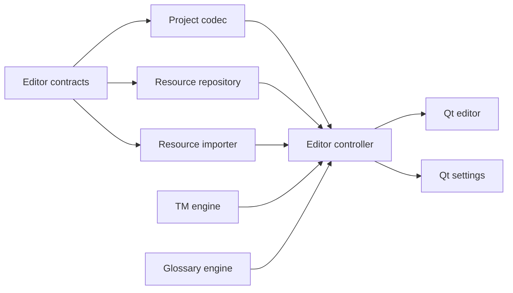
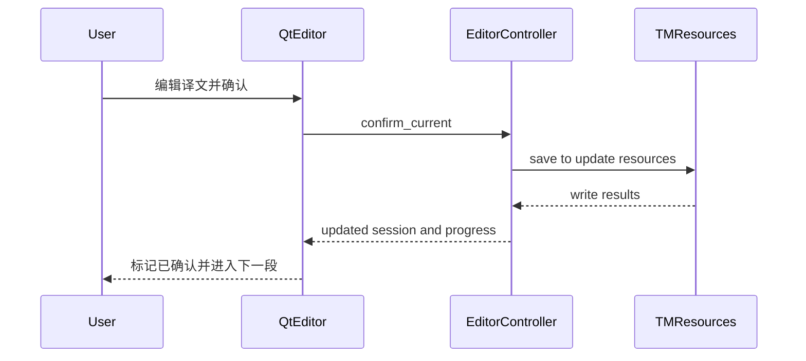
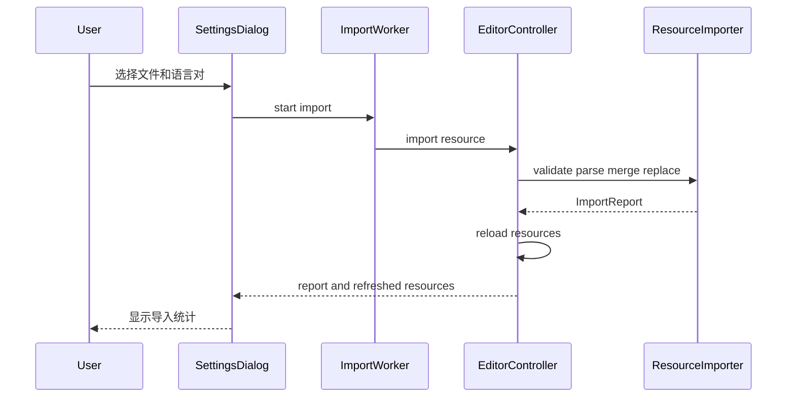
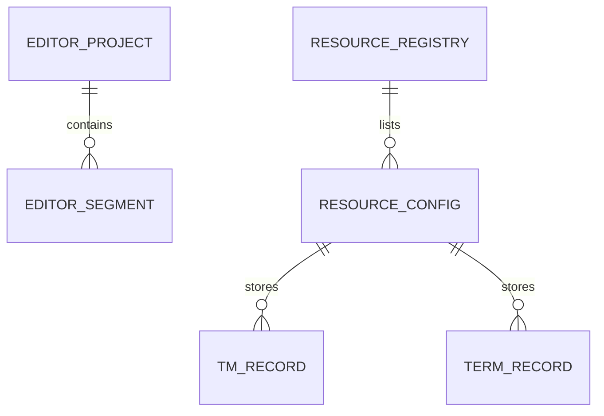

# 设计文档

## 概述

Qt 专业编辑器 MVP 为 LocalCAT 增加 Layer 4 桌面前端，并新增一个面向编辑器的 Layer 3 协调入口。它复用现有 TMEngine、GlossaryEngine 和 JSONL/CSV 数据格式，新增的项目编解码、资源注册与导入模块全部保持 Qt 无关。

用户可打开 JSON/TXT 项目，在双栏当前段编辑器中获得精确 TM 与术语建议，通过确认动作写回活动资源，并在齿轮设置中管理本地资源和导入 TMX、CSV/XLSX。

### 目标

- 闭合个人翻译的打开、编辑、建议、确认、回写和保存流程。
- 提供 MateCat 风格但适合桌面的专业信息层级与键盘节奏。
- 保持四层依赖方向和旧 LogicController/Excel 契约。
- 对语言资源 I/O 提供结构化结果、原子写入和可重复验证。

### 非目标

- 模糊匹配、机器翻译、QA、自动预翻译和全文 TM 搜索。
- 账号、共享密钥、在线协作、云同步和网络服务。
- PO/XLIFF/ODS/旧 XLS 项目解析或复杂排版回写。
- MateCat 像素级复刻、品牌资产或服务端兼容。

## 边界承诺

### 本规格拥有

- 编辑器项目与段落的会话契约和 JSON/TXT 编解码。
- 本地资源清单、活动/Lookup/Update 状态和默认资源引导。
- TMX Level 1、两列 CSV/XLSX 的安全原子导入。
- EditorController 的项目、建议、确认、术语添加和资源热重载接口。
- PySide6 主窗口、设置对话框、快捷键与 offscreen GUI 验证。

### 边界外

- 不改变 TMEngine/GlossaryEngine 的既有数据格式和匹配算法。
- 不改变 `LogicController.get_suggestions()` 三态契约。
- 不实现通用 ParserRegistry；仅提供编辑器 MVP 所需的明确格式适配。
- 不承担模糊匹配、多人协作、网络资源和复杂格式标签保真。

### 允许依赖

- Layer 3 可依赖 `tm_engine.py`、`glossary_engine.py`、编辑器项目/资源模块。
- Layer 4 可依赖 `editor_controller.py` 与 `editor_contracts.py`，不得直接依赖 Engine。
- `resource_importer.py` 可依赖标准库 XML/CSV 和 Layer 4 已有的 `openpyxl`，不得依赖 PySide6。
- `qt_editor.py` 是 stdlib 启动 bootstrap，不直接导入 PySide6；Qt 类型只出现在 `qt_editor_window.py`、`qt_settings_dialog.py` 和 GUI 测试中。

### 重新验证触发器

- 旧 `LogicController` 三态字段、TM JSONL 字段或术语 CSV 两列约定改变。
- 资源清单 schema、Lookup/Update 语义或原子替换策略改变。
- Qt 启动依赖版本、入口文件或 Layer 4 → Layer 3 依赖方向改变。
- 通用 Parser Subsystem 落地并接管 JSON/TXT/TMX/术语格式时。

## 架构

### 现有架构分析

- 现有 Layer 1–3 核心使用标准库并保持 UI 无关。
- `LogicController` 是 Excel 使用的 TM 优先无状态查询入口，不适合承载编辑会话和多资源。
- `TMEngine` 与 `GlossaryEngine` 可对任意文件路径实例化，适合由新控制器按资源清单组合。
- 当前根目录平铺模块是项目约定，新代码继续遵循该结构。

### 架构模式与边界图



**依赖方向**：Contracts → Storage/Parser/Engine → EditorController → Qt Frontend。任何向左的导入均视为错误。

- **选定模式**：薄前端 + 编辑会话控制器 + 文件资源仓库。
- **保留模式**：根目录平铺、frozen dataclass、JSONL append-only、Trie 查询。
- **新增组件理由**：编辑状态与多资源语义不能安全塞入旧 LogicController。
- **Steering 合规**：Qt 仅 Layer 4，核心引擎零 UI 依赖，所有 I/O 返回结构化结果。

### 技术栈

| 层 | 选择 / 版本 | 作用 | 说明 |
|----|-------------|------|------|
| Frontend | PySide6 6.11.1 | Widgets 桌面 UI、快捷键、offscreen 冒烟 | 支持 Python 3.14 |
| Logic | Python 3.14 类型注解与 frozen dataclass | 会话与资源协调 | 不依赖 Qt |
| Parser / Storage | stdlib XML/CSV/JSON + openpyxl 3.1+ | TMX、CSV/XLSX、资源清单与项目文件 | 原子替换 |
| Test | unittest + PySide6 QtTest | 纯逻辑、集成、GUI 交互 | 不引入 pytest 必需依赖 |

## 文件结构计划

### 目录结构

```text
/
├── editor_contracts.py          # 编辑段落、资源、建议与导入结果的不可变契约
├── editor_project.py            # JSON/TXT 项目读取、示例项目与原子 JSON 保存
├── resource_repository.py       # 本地资源清单、默认资源与状态持久化
├── resource_importer.py         # 安全 TMX 与 CSV/XLSX 解析、合并和原子写入
├── editor_controller.py         # Layer 3 编辑会话、查询、确认、热重载与资源操作
├── qt_settings_dialog.py        # Layer 4 资源设置、导入 worker 和状态反馈
├── qt_editor_window.py          # Layer 4 主窗口、样式、快捷键与交互
├── qt_editor.py                 # stdlib 启动入口、依赖诊断与 smoke 分派
├── requirements-ui.txt          # PySide6/openpyxl UI 依赖
├── README.md                    # 当前能力、安装、启动、验证和分支状态
└── tests/
    ├── test_editor_project.py
    ├── test_resource_importer.py
    ├── test_editor_controller.py
    └── test_qt_editor.py
```

### 修改文件

- `logic_controller.py` — 只修正漂移的自检输入，使测试使用现有默认 TM 夹具；业务方法不改。
- `.kiro/steering/structure.md` — 记录 Editor Logic、资源模块和 Qt Frontend 文件归属。
- `.kiro/steering/tech.md` — 记录 PySide6 版本、依赖安装、测试与启动命令。
- `.kiro/steering/product.md` — 实现验收后把 Feature 4 标记为 MVP 已交付。
- `README.md` — 在保留用户现有 Feature 3 状态修订的基础上，更新 Qt MVP 的实际架构、依赖、启动与验证说明。

## 系统流程

### 段落确认



确认动作先校验非空译文；所有目标 TM 写入均成功后再标记确认。若部分资源写入失败，返回具体资源错误，当前段不自动前进。

### 资源导入



只有完整验证成功才替换目标文件；可跳过的单元进入统计，不把整个有效文件判为失败。

## 需求追踪

| 需求 | 摘要 | 组件 | 接口 / 流程 |
|------|------|------|-------------|
| 1.1, 1.2, 1.3, 1.4, 1.5 | 专业工作区与响应分栏 | QtEditorWindow | 主窗口初始化、splitter |
| 2.1, 2.2, 2.3, 2.4, 2.5, 2.6 | JSON/TXT 项目与未保存保护 | EditorProjectCodec, EditorController, QtEditorWindow | load/save/maybe_save |
| 3.1, 3.2, 3.3, 3.4, 3.5, 3.6 | 编辑、确认、导航和 TM 回写 | EditorController, QtEditorWindow | update_target/confirm/navigation |
| 4.1, 4.2, 4.3, 4.4, 4.5 | 精确 TM 建议 | EditorController, TMEngine, QtEditorWindow | suggestions/apply |
| 5.1, 5.2, 5.3, 5.4, 5.5, 5.6 | 术语建议、突出和添加 | EditorController, GlossaryEngine, QtEditorWindow | suggestions/add_term |
| 6.1, 6.2, 6.3, 6.4, 6.5, 6.6 | 资源设置和持久化 | ResourceRepository, QtSettingsDialog | list/create/update |
| 7.1, 7.2, 7.3, 7.4, 7.5, 7.6 | TMX/术语导入与热重载 | ResourceImporter, EditorController, ImportWorker | import resource flow |
| 8.1, 8.2, 8.3, 8.4, 8.5, 8.6, 8.7 | 本地性、依赖、回归、快捷键和 README | 全部组件、README | bootstrap/full suite/offscreen/docs |

## 组件与接口

| 组件 | 层 | 目的 | 需求覆盖 | 关键依赖 | 契约 |
|------|----|------|----------|----------|------|
| EditorContracts | Shared | 冻结跨层数据形状 | 2–7 | 无 | State |
| EditorProjectCodec | Layer 2B | JSON/TXT 项目 I/O | 2 | Contracts | Batch |
| ResourceRepository | Layer 1 | 资源清单与状态 | 6 | Contracts | State |
| ResourceImporter | Layer 2B | 安全原子语言资产导入 | 7, 8 | Contracts, openpyxl | Batch |
| EditorController | Layer 3 | 会话、查询与写回协调 | 2–7 | Project, Repository, Importer, Engines | Service, State |
| QtSettingsDialog | Layer 4 | 资源管理与导入交互 | 6, 7 | EditorController | UI |
| QtEditorWindow | Layer 4 | 主翻译工作区 | 1–5, 8 | EditorController, SettingsDialog | UI |
| QtBootstrap | Runtime | 依赖诊断、启动与 smoke 分派 | 8 | stdlib, QtEditorWindow | CLI |

### Shared Contracts

```python
@dataclass(frozen=True)
class EditorSegment:
    id: str
    source: str
    target: str = ""
    speaker: str = ""
    confirmed: bool = False

@dataclass(frozen=True)
class ResourceConfig:
    id: str
    name: str
    kind: ResourceKind
    path: Path
    active: bool
    lookup: bool
    update: bool

@dataclass(frozen=True)
class ImportReport:
    imported: int
    skipped: int
    overwritten: int
    errors: tuple[str, ...]
```

其他冻结契约包括 `EditorProject`、`TMSuggestion`、`TermSuggestion`、`SuggestionBundle` 和 `WriteReport`。可变会话通过替换 frozen 实例实现，不向 Engine 注入 UI 状态。

### EditorProjectCodec

**职责与约束**

- JSON 根必须为对象数组或带 `segments` 数组的对象；每项必须有非空 `source`。
- TXT 每个非空行成为段落。
- 保存统一输出带 schema 版本、项目名和 segments 的 JSON。
- 写入采用同目录临时文件与原子替换；读取失败不改变当前会话。

```python
def load_project(path: Path) -> EditorProject: ...
def save_project(project: EditorProject, path: Path) -> Path: ...
def sample_project() -> EditorProject: ...
```

### ResourceRepository

**职责与约束**

- 资源清单 schema 带版本号，路径保存为绝对路径。
- 首次运行注册现有 `tm.jsonl` 与 `terms.csv` 为活动 Lookup/Update 默认资源。
- 新资源只创建在应用数据目录 `resources/` 下，名称经安全化但显示名保留。
- 配置更新原子写入，不删除非活动资源文件。

```python
class ResourceRepository:
    def list_resources(self) -> tuple[ResourceConfig, ...]: ...
    def create_resource(self, name: str, kind: ResourceKind) -> ResourceConfig: ...
    def update_resource(self, resource: ResourceConfig) -> ResourceConfig: ...
    def get(self, resource_id: str) -> ResourceConfig: ...
```

### ResourceImporter

**职责与约束**

- 最大输入 100 MB；拒绝 DTD/ENTITY。
- TMX 语言标签大小写不敏感，并规范 `_` 为 `-`；先精确 locale，再允许同 base language 唯一候选。
- `<seg>` 含行内元素的 TU 不导入并记录错误。
- CSV/XLSX 只消费前两列；识别常见 Source/Target 表头；空值跳过；同源后写胜出。
- 全部解析完成后再合并旧数据并原子替换。

```python
def import_tmx(
    input_path: Path,
    target_path: Path,
    source_locale: str,
    target_locale: str,
) -> ImportReport: ...

def import_termbase(input_path: Path, target_path: Path) -> ImportReport: ...
```

### EditorController

**职责与约束**

- 持有当前 `EditorProject` 与当前索引，Engine 不持有 UI 状态。
- 活动 Lookup 资源决定查询集合，活动 Update 资源决定写回集合。
- 资源变动和成功导入后重建内存引擎；重建失败时保留上一组可用引擎。
- 任何公开方法返回 frozen contract 或显式异常，不返回展示字符串。

```python
class EditorController:
    def open_project(self, path: Path) -> EditorProject: ...
    def load_sample(self) -> EditorProject: ...
    def update_target(self, target: str) -> EditorProject: ...
    def confirm_current(self) -> ConfirmResult: ...
    def move(self, direction: int, unconfirmed_only: bool = False) -> EditorProject: ...
    def suggestions(self) -> SuggestionBundle: ...
    def add_term(self, source: str, target: str) -> ResourceConfig: ...
    def import_resource(self, request: ImportRequest) -> ImportReport: ...
    def reload_resources(self) -> None: ...
```

确认时由控制器构造现有 `SourceUnit` 并调用每个 TMEngine。旧 `LogicController` 不被 Qt 调用，也不承担会话。

### QtSettingsDialog

- 使用资源表显示 Active、Lookup、Update、名称、类型和路径。
- 新建资源仅要求名称与类型；创建后立即刷新表。
- TM 资源提供“导入 TMX”，术语资源提供“导入术语表”。
- 导入 worker 在后台调用控制器；对话框禁用冲突操作并显示忙碌状态。
- 完成时显示 ImportReport，发出 `resources_changed` 信号。
- 对话框只收集输入、调用 EditorController 并渲染结果；配置持久化、热重载和资源写入仍完全属于 EditorController/ResourceRepository。

### QtEditorWindow

- 顶栏：LocalCAT 标识、项目名、语言方向、进度、打开/保存/设置。
- 左栏：段号、源文摘要、确认状态和未确认过滤。
- 中栏：源文只读卡、译文编辑器、上一段/下一段/确认按钮。
- 右栏：Translation Matches 与 Termbase 页签；双击或按钮应用建议。
- 源文 HTML 使用转义后再注入高亮 span，避免项目文本形成 HTML。
- 快捷键：`Ctrl+O`、`Ctrl+S`、`Ctrl+Enter`、`Alt+Up`、`Alt+Down`、`Ctrl+,`。

### QtBootstrap

- `qt_editor.py` 只使用 stdlib 解析参数并延迟导入 `qt_editor_window`。
- 缺少 PySide6 时向 stderr 输出 `python -m pip install -r requirements-ui.txt` 并返回非零退出码。
- XLSX 导入缺少 openpyxl 时由 ResourceImporter 返回同样可操作的依赖错误；CSV/TMX 和核心功能仍可运行。
- `--smoke-test` 在依赖可用时委派给窗口模块，缺依赖时走与普通启动相同的诊断路径。

### Qt 与 Controller 集成接缝

- 资源表 checkbox、新建和导入信号只调用 EditorController 的公开方法。
- `resources_changed` 触发主窗口重新请求当前段 SuggestionBundle，不直接访问 Repository 或 Engine。
- 该接缝在任务中作为显式 integration work 验收，避免把持久化责任藏进 QtSettingsDialog。

## 数据模型

### 逻辑模型



**不变量**

- Segment id 在单项目内唯一，source 非空。
- 只有非空 target 可确认。
- 非活动资源的 lookup/update 即使为 true 也不生效。
- TM JSONL 同源后写胜出；术语导入同源后写胜出。
- 配置与数据写入均为 UTF-8，本地绝对路径不得为空。

### 物理数据

- `resources.json`：`{"schema_version": 1, "resources": [...]}`。
- TM：沿用每行一个对象的 JSONL。
- Termbase：沿用 UTF-8-SIG 两列 CSV。
- Project save：`{"schema_version": 1, "name": "...", "segments": [...]}`。

## 错误处理

| 类别 | 示例 | 响应 |
|------|------|------|
| 用户输入 | 空资源名、空译文、无可写术语表 | 保持状态并显示具体原因 |
| 文件错误 | 无效 JSON/TMX、缺语言对、不可读 XLSX | 不替换目标文件，显示路径与可操作提示 |
| 资源错误 | 单个 TM 写入失败 | ConfirmResult 列出失败资源，不自动前进 |
| 依赖错误 | 未安装 PySide6/openpyxl | 启动或导入入口显示安装方法 |
| 运行错误 | 引擎热重载失败 | 保留上一组可用实例并记录日志 |

所有 Qt 无关模块使用 `logging`，公开 I/O 边界把底层异常转换为 `ProjectError`、`ResourceError` 或 `ImportError`。

## 测试策略

### 单元测试

- ProjectCodec：JSON/TXT、已有 target/speaker/confirmed、无效输入、原子保存。
- ResourceRepository：默认资源、创建、状态持久化、非活动保留。
- ResourceImporter：多语言 TMX、缺语言对、DTD、带标签、重复覆盖、CSV/XLSX、失败不损坏。
- EditorController：查询集合、确认回写、修改已确认段、导航、添加术语、导入热重载。
- Bootstrap：模拟缺少 PySide6 与缺少 openpyxl，验证错误信息包含精确安装命令且不出现 traceback。

### 集成测试

- 临时 JSON 项目 + 临时 TM/术语资源完成打开、建议、应用、确认和保存。
- 设置状态从 Lookup 开关传递到建议结果。
- 导入 TMX/CSV 后无需重启即可查询到新内容。
- 运行既有五个核心/集成脚本，验证旧三态与 Excel 接缝。
- 用临时输入工作簿运行 headless openpyxl adapter，并对交互式 xlwings adapter 做编译/import 边界检查。

### E2E / UI 测试

- offscreen 创建主窗口，空状态和示例项目可用。
- 模拟 `Ctrl+Enter`，确认当前段并移动到下一段。
- 点击齿轮打开设置；创建资源；验证设置刷新信号。
- 应用 TM/术语建议并检查译文编辑器。
- 缩小与放大主窗口，验证主要 splitter 面板仍可见且具有最小可读尺寸。
- 从设置添加术语后，回到当前段立即显示该术语建议。

### 冒烟

```bash
QT_QPA_PLATFORM=offscreen python qt_editor.py --smoke-test
```

输出首个可用状态、窗口标题、段落数并以 0 退出。

## 任务治理例外

通用 task generation 规则默认排除 documentation task；本规格存在两项更高优先级的显式要求：

1. 用户在规格生成过程中明确要求 README 也必须更新；
2. 项目 `steering-sync-mechanism.md` 要求设计/实现触发后同步 steering。

因此 README 与 steering 更新作为最终集成验收的必需交付物保留，不是可选文档整理。该例外只适用于 Requirement 8.7 和本规格的 steering 同步，不扩大其他任务范围。

## 安全考虑

- 不包含网络客户端或 URL 请求路径。
- XML 导入拒绝 DTD/ENTITY、限制文件大小和单段长度。
- 资源新建路径由仓库生成，不接受用户提供的任意输出路径。
- 所有展示为 HTML 的源文本必须先转义。
- 不记录翻译原文到默认日志，只记录路径、计数和错误类别。

## 性能与可扩展性

- 导入在 worker 线程执行，避免主线程冻结。
- TMX 使用 `iterparse` 并在处理后清理元素。
- 当前精确 TM 仍使用内存索引；几十万条以上或引入模糊查询时触发 SQLite/索引规格。
- 段落导航仅渲染当前段与轻量摘要，不为每段创建完整编辑器控件。

---

## Steering 同步检查

- **日期**：2026-07-27
- **触发事件**：Qt Editor MVP design review
- **检查结果**：实施阶段更新 `structure.md`、`tech.md`；功能验收后更新 `product.md`
- **理由**：本设计新增 Editor Logic、资源导入组件、PySide6 依赖和桌面启动/测试命令。
