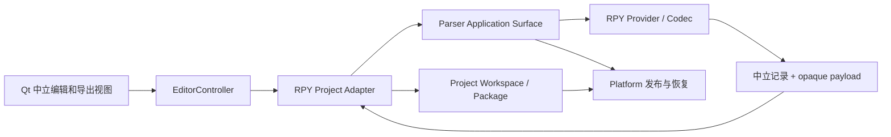
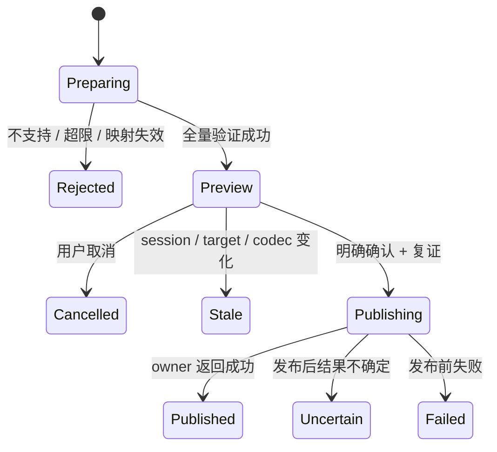

# 技术设计：RPY TL 项目 Codec

## Overview

本设计将受支持的 Ren'Py TL 转为中立项目段落，以 ProjectPackage 保存原始内容、编辑 overlay 和 codec 私有映射。独立的 RPY provider 通过 Parser 接入；Application 协调单文件及多文件项目，Qt 不解释脚本。

### Goals

- 单个 TL 从打开、编辑、确认、保存、冷重开到预览/导出形成闭环。
- 多 TL 复用稳定相对路径、顺序及 reconciliation；既有 JSON/TXT/PO/POT 行为不变。
- 保留未知格式之外已声明支持的原始字节，明确拒绝无法证明映射安全的输入。

### Non-Goals

不执行 Ren'Py，不提供完整游戏 parser、第三方可执行插件安装或 TM/术语权威变更。codec 不扫描文件夹；根目录发现由 Project 的显式预览提供。无网络依赖；不提供脚本原地自动保存。

## Boundary Commitments

### This Spec Owns

- `renpy-tl-v1` 的有限词法/块识别、翻译槽、局部身份、raw speaker、转义/占位符及私有 payload。
- 从该 profile 准备 TL 导出内容的实现；独立合成 fixture 与 golden round-trip。
- RPY Application adapter 对既有 Project/Parser 公共合同的消费和中立诊断投影。

### Out of Boundary

Project/Document/Segment 身份、包 manifest、overlay、dirty/baseline、保存恢复及 receipt 归 Multi；通用 codec 调用与 token 规则归 Parser；rooted publish 归平台；Qt 入口归其 UI owner。包内私有成员不能铸造 live writer 权限。

### Allowed Dependencies

RPY codec 仅依赖 stdlib 与 `parser_contracts.py`；不得导入 Qt、EditorController、Project、TM/Store 或 Sync。Application adapter 可以消费 Parser surface 与 Project owner ports。Project/package 不导入 RPY 实现，只有 composition 显式注册随产品交付的 provider；配置仅选择已知 provider ID 与 enabled 状态，不接受模块路径或下载地址。composition 在建 surface 前筛除禁用 provider；现有 ProviderBinding(enabled=False) 会抛错，不能让关闭 RPY 破坏全部内建格式。

### Revalidation Triggers

TL profile/token 版本变化重验 RPY golden fixtures 与旧包缺失/不兼容处理；中立 writer surface 变化重验内建 canonical codecs；single-file origin/profile 变化重验 legacy JSON 与 ProjectPackage；Controller view 变化重验 Qt/Chunk 既有权限切片；任何包格式变化交回 Project owner。

## Governance Impact

- **Decision basis**：[ADR-030](../../steering/adr/adr-030.md) 定义目录选择、格式导出与 RPY→Sync 顺序；ADR-015/018/019 保持 Parser、codec、项目包分权，ADR-020/025/026 保持 rooted 发布与无状态 Parser。
- **Contract changes**：各 owner 的当前条款与唯一执行任务见 [跨规格合同](cross-spec-amendments.md)，本设计只定义 RPY 语法、private payload 与 Application 消费方式。
- **Steering sync**：Multi border/review-clustering 的顺序、spec-ownership，以及交付后 product/tech/structure/roadmap 的实际能力。
- **Downstream revalidation**：Parser canonical 路径、Project 单/多文档与包恢复、Qt/Chunk mutation guards、ResourcePackage 手工消费、Sync 的 RPY 包冷重开。

## Architecture

### Existing Architecture Analysis

`FormatId` 与已知 provider composition 提供格式选择；RPY 消费 Parser 的中立 round-trip 接缝，以及 Project 的配置 intake/private handoff、`explicit-single-file-v1` 与 `explicit-selected-files-v1`。这些依赖的实现与验证由 Tasks 指向各 owner 的执行项，不将单 TL 伪装为 legacy JSON。

### Architecture Pattern & Boundary Map

### Technology Stack

| 层 | 选择 | 约束 |
| --- | --- | --- |
| codec | 项目支持的 Python、stdlib | 有界扫描，禁止 eval/exec/动态导入脚本 |
| 项目持久化 | 现有 ProjectPackage ZIP v1 | 不新增另一份 JSON 项目 schema |
| UI | 现有 PySide6 与 Controller DTO | 异步工作结果绑定 session/revision |
| 发布 | Parser/平台既有 rooted 原语 | 不增加 codec journal/LKG |
| 兼容基准 | Ren'Py 8.5.4 官方 TL 文档中的有限子集 | profile 声明子集；不是所有 8.x/7.x 文件通吃 |

## File Structure Plan

| 文件（新增，除注明外） | 组件与职责 |
| --- | --- |
| `parser_rpy_codec.py` | RpyProvider/RpyCodec：descriptor、词法/块识别、中立输出、私有 payload 编解码、prepare |
| `rpy_text_rules.py` | RpyTextRules：字符串解码/编码、interpolation 与 tag 校验；stdlib-only |
| `rpy_project_adapter.py` | RpyProjectAdapter：配置 provider 消费、私有成员 handoff、单/多文件候选及导出协调 |
| `project_codec_settings.py` | CodecSettings：设备本地已知 provider 启停；只保存 ID/版本策略，不保存执行路径 |
| `project_export_contracts.py` | ProjectExportView：中立 preview/result/逐文档状态，Qt 无关 |
| `qt_project_export_dialog.py` | 导出目标、警示、错误位置和逐文件结果 |
| `tests/test_rpy_codec.py`、`tests/test_rpy_round_trip.py` | 词法/身份/golden/故障测试 |
| `tests/test_rpy_project.py`、`tests/test_qt_rpy_project.py` | 包重开、调和、Controller/Qt 旅程 |
| `tests/fixtures/rpy/` | 合成 TL、期望中立记录与导出；无外部目录依赖 |
| 修改 `parser_contracts.py`、`parser_composition.py`、`parser_source.py` | Parser owner 的通用 prepare/publish amendment |
| 修改 `project_workspace_contracts.py`、`project_workspace_intake.py` | Multi owner 的单文件 profile、注入 surface 与 private payload 通道 |
| 修改 `platform_fs_contracts.py`、`platform_fs_posix.py`、`platform_fs_windows.py` | 平台 owner 的导出子目录准备/创建/绑定；与 Multi 只读观察端口分别验收 |
| 修改 `editor_controller.py`、`qt_editor_window.py`、`qt_editor.py` | 明确的跨 owner composition/命令集成；codec 只在 composition 注册 |
| 修改 `tools/build_windows_ordinary.py`、`packaging/windows/frozen_roots.json` | 将新模块纳入正常发行；不改变 Core/Gate 输入合同 |

ProjectPackage 若需格式白名单/decoder 对新 profile 的识别，仅在 Project owner amendment 中修改 `project_package.py`；不得由 RPY adapter 绕过其验证。

## System Flows

### 单文件保存与重开

1. 选择 TL 和可移植 origin；Parser 从 sealed source 完成读取。只有 verified terminal 才把 source bytes、中立记录和 opaque private payload 交给 Project intake。
2. 建立 `SINGLE_FILE + explicit-single-file-v1` 的非 legacy workspace。原始 TL 保存在 `sources/{document_id}/{source_snapshot_sha256}.bin`；`documents/{document_id}.json` 使用既有 `localcat-project-package-document-v1` 保存 source facts 与 target/confirmed overlay；私有数据在 `codec-private/{document_id}/{private_sha256}.bin`。首包创建保留 rooted source binding 至发布完成，不仅构造内存 Document；不用 JSON canonical serializer 重写原始 TL。
3. 桌面验证成功后显示建包引导并选择包目标；Controller 保有候选及其签发会话/代次，Qt 只消费中立信息。Project owner 保存并冷重开验证 ProjectPackage 后提交 baseline/receipt，Controller 才安装新项目。此前当前项目保持可恢复；取消、失败或过期候选不替换它，已经发生的包发布如实报告。未保存候选保持非 durable，不伪造干净 baseline；源 TL 不被修改。
4. 重开从包恢复中立状态。导出时重新从当前配置解析 exact live codec，再以包内原始字节和私有数据准备输出。设备 origin 只在用户要求覆盖原路径/调和时重绑定。

### 预览与导出

预览绑定 session、workspace revision、选定 Document identities、codec identity、source/private digest、输出目标身份和导出策略。导出全部当前 target；空/未确认是可见警示，不自动填源文或丢段。用户编辑、重开、换 provider 或重选路径使预览失效。TL 导出不清除 package dirty，也不更新 package baseline。

包内源文的临时物理副本只用于建立 Parser sealed snapshot；预览就绪前完成同文件目标检查并清理副本及其目录句柄，清理失败阻断预览。issuing `OpenedParserInput` 与 prepared 结果继续存活到消费或丢弃，设备配置变化仍使旧预览失效。

单文件发布成功后关闭预览窗口，并在主窗口显示成功结果与输出路径；失败、阻断、过期或结果不确定时保留诊断供检查。用户已经关闭窗口时，晚到结果不重新弹出窗口，已发生的发布仍按真实结果报告。

多文件导出由用户选择一个导出根目录，按已验证的 source_ref 重建相对目录，不按 basename 展平。先准备/验证所有输出及目录/大小写/同名冲突，再确认并按顺序独立发布；root 与每个目标 ancestor 在发布前复证，拒绝符号链接/reparse、逸出和替换。缺失子目录仅由平台在用户选择的导出根内受控创建；预览不建目录，目录创建失败列为未发布，已创建空目录不宣称回滚。取消只停止尚未发布项。报告 `published/unchanged/failed/uncertain/not_attempted`，已发布项不虚构回滚。再次执行重新预览。

## Components and Interfaces

### RpyCodec 与 TL profile

首个 profile 固定为 `renpy-tl-v1`，provider/codec ID 使用 `localcat.rpy`/`renpy-tl`；codec version 与 payload version 独立校验。单文档最多 16 MiB 输入、100,000 段、单逻辑字符串 1 MiB、私有 payload 32 MiB、输出 32 MiB，并同时遵守更小的 Parser/Project owner 限额；扫描/编码遇超限立即终止。批量按文件串行处理，最多 256 个 TL，包总限额仍归 Project。

支持 UTF-8（可带 BOM）、LF/CRLF、空行、注释和空格缩进。支持的 grammar 明确限定为：

- `translate <language> <label>:`，其中一个源文注释 say 与一个目标 say 一一对应；支持 narrator 的单字符串，或 `speaker [attributes] <quoted-string> [with transition]`。speaker 为单个标识符或单行姓名字符串；姓名字符串解码为 raw speaker，只有其后的台词字符串进入翻译槽。属性为零个或多个标识符/负属性（`-name`），可有一个 `@` 分隔临时属性（其后至少一个属性）；transition 限单个标识符，不求值。源/目标的 speaker 内容及形式必须一致，字符串姓名与同名标识符不混同；属性及 transition 各自保留，不要求翻译前后显示效果相同。可保留 `voice <quoted-string>` 与 `nvl clear`；纯控制 block 不产生段落。
- `translate <language> strings:` 中一一对应的 `old <quoted-string>` / `new <quoted-string>`；可有多个 pair 和多个 strings block，但同一文档同一语言的重复 old key 拒绝。dialogue 与 strings 按块状态区分，可在同一文档交替出现；strings 无 speaker，不从相邻 dialogue 继承角色。
- 字符串为单行单/双引号文本，允许声明的反斜杠转义（反斜杠、相应引号、n/r/t）；未声明转义、物理多行字符串、三引号、上述有限属性/transition 以外的 say 表达式或调用参数、`pass` 代替译文、多 say 对一 source、Python/style/条件块、原始游戏语句均整文档 unsupported。不保留无法确定边界的“未知代码”。
- 一文档仅一个目标语言 token；language 按原 token 保存，不强制 BCP 47。`None` 只允许 strings。空目标、评论中的引号/井号按词法识别，不靠行过滤。

speaker 映射示例：`guide thinking "Source"` 的中立 speaker 是 `guide`，`thinking` 只保留在 codec 的结构跨度中；`guide -thinking @ happy "Source" with dissolve` 采用同一规则。`"Alarm clock" "Ring"` 的 speaker 是 `Alarm clock`，`"[character]" "Hello"` 的 speaker 是 `[character]`，姓名插值不求值，姓名字节不属于可回填的译文跨度。narrator 没有 speaker；`extend`、`centered` 按原始特殊 say 标识保留，不执行游戏去推断前一角色或显示别名。属性不会因未显示在 speaker 列而从导出文件删除。翻译单元 label 的摘要样式后缀是身份线索，不视为加密文本。

局部 ID：dialogue 使用 language+label 的无歧义编码；strings 使用 language+完整解码 old（含 `{#...}`）的 SHA-256 派生值，若碰撞或重复直接拒绝。ID 不使用当前序号。dialogue 的 label 不变而源文改变时 ID 保持，交给 Project 判定 source_changed、保留 target 并清除 confirmed；label 改变或 strings 的 old key 改变时产生 new/removed，交给显式调和，不靠相似文本自动合并。source 相同而显示/顺序变化不改变 ID。

### RpyTextRules

编辑器存放解码后的 Unicode 文本，不进行 Ren'Py 空白折叠或文本执行。未编辑 target 直接复用原字节；编辑 target 使用原引号风格重新编码，只替换目标字符串内部跨度。控制字符转义输出，不产生新脚本行。

interpolation 按 bracket/quote 深度识别为不执行的 token；`[[` 和 `{{` 是字面 escape。空 target 表示未翻译，允许原样导出并在预览警示，不要求它包含源文的保护 token；非空 target 以源文为基准验证 interpolation token 的多重集合保持（含转换/格式部分），禁止增加新表达式。标签按源文出现的 token 集合及嵌套配对验证，允许围绕译文调整合法位置，禁止增删/改参；未知标签可按原 token 保留但不可新增，错误嵌套拒绝。首次读取已有 target 允许保留诊断并编辑修复；未编辑字节导出仍须经过结构校验，不以 no-op 绕过非法 token。源文自身无法 tokenize 或解码后为空时输入 unsupported；现有中立 source 合同不允许空字符串，不以占位文本绕过。

### Private payload 与 live writer

`rpy-roundtrip-v1` 私有 JSON bytes 包含 version、exact codec identity、source SHA-256、profile、语言、slot ID→source/target byte spans、原 target 语义摘要及保护 token。它不保存当前编辑 target/confirmed，不持有绝对路径或可执行对象。

codec 对 payload 做有界解析，重读 source 重建映射并核对跨度/摘要/ID集合；不能相信包内自报 offsets。原始字节在 source member，payload 仅是可验证映射。包 owner 只验证外层 membership/digest/size，不解码 payload。冷重开时从上述事实重建当前调用的 token；持久 token 本身不是执行授权。

codec 实现 [Parser 中立 round-trip 准备与发布合同](../parser-subsystem-extraction/design.md#中立-round-trip-准备与发布)：接收 verified source、opaque token 与中立 edits，完成映射复证、保护 token 验证与有界编码，返回 source/output fingerprints。factory 缺失为 unsupported；codec 不接收目标路径、Project session、baseline 或 receipt。

### 嵌套导出编排

Application 消费 [平台目录合同](../windows-platform-enablement/design.md#只读目录观察与受控目标物化) 的 `prepare_descendant_target`/`materialize_target`，codec 不接触目录。导出 preview 绑定目录 plan、session/revision、source/private/输出摘要；确认前排除重复、大小写与文件/祖先冲突。RPY 批次至多 256 文件，同时遵守平台深度与更小的 owner 限制。

确认后按顺序物化并调用 Parser `write_prepared`，只编排发布结果，不绕过 issuing surface、一次性消费和 rooted binding 验证。目录失败不发布该文件；已创建空目录如实报告，不伪称回滚。canonical serializer 不重新编码 round-trip bytes，Application 不取得 codec journal/LKG 或 Project receipt 权威。

### RpyProjectAdapter 与 UI

intake amendment 把“已验证 records + opaque payload”作为单次 handoff，在一个 retained source snapshot 下完成；codec 不能提交 workspace。单文件 profile 与多文件 profile 都保留准确 RPY CodecIdentity/FormatId，不能设置 legacy JSON codec 来规避校验。多文件选择语言必须一致，全部验证后才发布新 workspace。目录发现归 Multi 的 Requirement 13 增量，RPY 只消费其确认后的有序选择与 retained root，不自行递归或在筛选后重算共同父目录。0 文件不得提交，1 文件使用 explicit-single-file-v1，多个使用 explicit-selected-files-v1；单选嵌套文件也保留最初根下的 source_ref。章节树仅消费 Controller 的路径投影，不读取文件系统；分组不修改 manifest 顺序。

Controller 继续校验 issued identity、session/revision 与 Chunk mutation permission。新增导出命令只接受 Controller-issued Document selection 和用户选择的目标；Qt 不自行构造 token。异步 result 带 session/request generation，关闭/换项目后丢弃迟到结果并释放 handle。单文件到多文件保持同一 package 权威；不改变最近项目或恢复断点语义。

单 Document 的编辑和浏览页隐藏重复章节进度栏及章节分隔行；顶栏保留项目名称、总体进度和真实 dirty 状态，需要展示文档来源时使用源文件名。切换到 legacy TXT/JSON 时清空并隐藏 workspace 专属提示和操作投影，不复用上一个项目的名称、保存提示或章节进度。

## Data Models

唯一当前译文/确认状态在 Project 的中立记录/overlay。source member 不变，private member 不镜像 overlay。源调和调用当前 codec 重新提取整体 payload；Project 决定 unchanged/changed/new/removed/ambiguous 并消费显式 rename。缺失旧 codec 时不解释/迁移其 payload；已有包可中立编辑，直到兼容 codec 可用。

设备本地 CodecSettings 保存已知 provider ID/启用状态；不进入 package。新 profile 使用现有 version 字段表达，若 Project owner 判定需要改变严格包 schema，须先修订 Project owner 合同并经过工作流决策门，不能默加字段。

## Requirements Traceability

| 需求 | 组件/合同 | 验证 |
| --- | --- | --- |
| 1.1, 1.2, 1.3, 1.4 | RpyCodec、CodecSettings、Parser surface | 完整读取、拒绝矩阵、缺失/禁用、独立发行 |
| 2.1, 2.2, 2.3, 2.4 | TL grammar、局部 ID、Project overlay | 空槽/已有译文/重复身份/默认未确认 |
| 3.1, 3.2, 3.3, 3.4 | 单文件 profile、ProjectPackage、private handoff | 保存/冷重开/缺失 codec/发布失败 |
| 4.1, 4.2, 4.3, 4.4, 4.5 | RpyTextRules、round-trip prepare、ProjectExportView | golden、错误转义/标签、stale 与不确定发布 |
| 5.1, 5.2, 5.3, 5.4 | intake/reconcile、批量导出协调 | 同名路径、顺序、源更新、部分发布 |
| 6.1, 6.2, 6.3, 6.4 | Controller/Qt、既有 ResourcePortability | 用户旅程、资源建议、取消/迟到结果、手工包 |
| 7.1, 7.2, 7.3, 7.4 | limits、verified terminal、纯词法、合成 fixture | 超限/截断/中断/无执行/仓库独立复现 |

## Error Handling

codec 使用 Parser 既有安全诊断容器，RPY 错误 namespace 区分 unsupported syntax、ambiguous slot、invalid escape、placeholder mismatch、private stale、limit exceeded。诊断包含 source_ref、行列和 slot ID，不泄漏整个文件正文。Project/package/平台错误保留 owner code，经 Application 投影为用户动作；不重新分类成成功。

## Testing Strategy

- 词法与 golden：每个支持 grammar 正/反例；引号、井号、空目标、BOM/CRLF、Unicode、dialogue/strings 同文件、多 strings block、speaker/属性分离、extend/centered、with transition 与控制行；验证 1、2、4、7。
- 私有数据攻击/失效：越界/重叠 span、重复 ID、foreign/version/stale token、错误摘要；核对拒绝发生在目标打开前，覆盖 3.3、4.4、7.2。
- 项目集成：真实单 Document 包冷重开、无原路径导出、无 codec 编辑保存；根目录预览后单选/多选、至少两层目录与同 basename、树导航不改变阅读顺序、按原目录导出、rename/source change 与 Chapter/Chunk 稳定身份，覆盖 3、5。
- 故障：读取失败、取消、目标/祖先替换、缺失目录创建竞争与失败、跨文件祖先冲突、发布前/后平台失败、多文件部分发布与迟到 UI 结果，分别验证 owner 语义，覆盖 3.4、4.5、5.4、6.3。
- 产品验收：source 支持环境与实际普通 Windows frozen 的单/多 TL 编辑保存导出、手工 JSONL/CSV 资源使用；只声明实际验证的平台/子集，覆盖 1.4、6、7.4。新模块打包不隐含重签历史 Gate。

## Supporting References

语法依据、替代方案与外部资料见 [research.md](research.md)；实施不依赖该文档外的个人文件。
