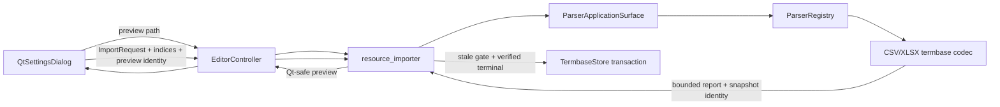
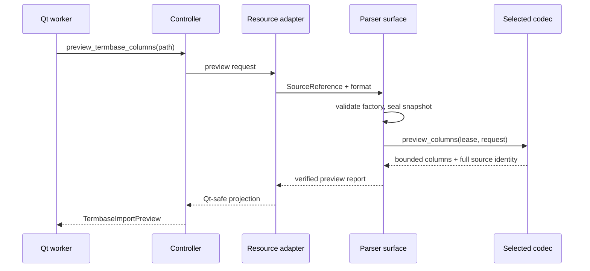
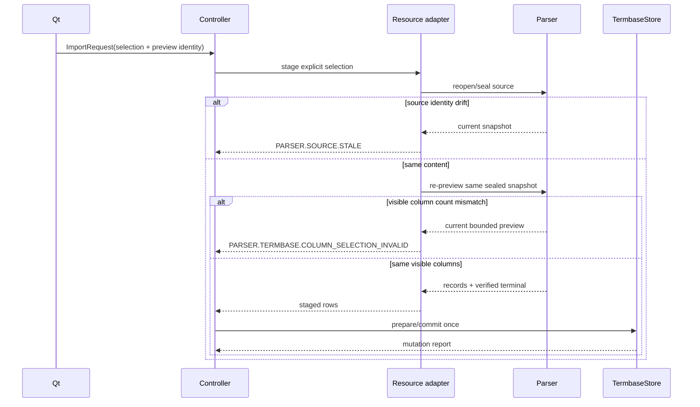

# 设计文档

## Overview

本设计在已完成的 Parser 与语言资源设置之间增加一个窄 preview/selection 消费面。CSV/XLSX termbase codec 继续独占首行、header、active sheet 与 row selection grammar；Parser Application surface 在 sealed snapshot 上调用 codec preview，Controller 将其投影为 Qt-safe DTO，Qt 只展示候选并提交物理列索引。

preview 不授权提交。正式导入重新 sealed 同一路径，并以完整 preview source identity 做 stale gate；只有 source identity、verified terminal 和既有 TermbaseStore transaction 全部成功后才发布资源变更。

### Goals

- 用户可以导入 source/target 不在前两列的 CSV/XLSX 术语表。
- preview 与正式解析共用 codec grammar 和安全边界。
- preview→import 绑定同一内容身份，外部变化 fail closed。
- 保留所有旧调用的前两列兼容行为。

### Non-Goals

- 不选择或聚合多个 XLSX Sheet。
- 不自动按语言匹配列。
- 不导出术语或建立 ResourcePackage。
- 不改 TermbaseStore transaction/LWW、TMX 或项目格式。

## Boundary Commitments

### This Spec Owns

- Parser 中立 termbase preview DTO、capability 与 structural behavior port。
- CSV/XLSX codec-owned first-row/active-sheet preview。
- preview content identity 到显式 ImportRequest 的绑定。
- Controller preview command 与 Qt 异步列选择对话。

### Out of Boundary

- `TermbaseStore` 仍独占 managed CSV/v1 transaction、source-LWW、recovery 和 runtime reload。
- Qt 不导入 `parser_contracts` 或具体 codec，不读取输入字节。
- Parser 不拥有 UI 状态、资源身份、目标路径或 import commit。
- ResourcePackage/出口、Multi-Document、PO/POT、TMX 保持相邻规格。

### Allowed Dependencies

- Parser contracts/source/registry/composition 与既有 termbase codecs。
- `resource_importer.py` 作为 Parser→Editor/Store Application adapter。
- `EditorController` 与 `qt_settings_dialog.py` 现有异步 import 形状。

### Revalidation Triggers

- `CodecCapabilities`、reader factory 或 preview report shape 改变时重验 Parser registry/composition。
- ImportRequest/Qt-safe preview DTO 改变时重验 Controller 与 Qt。
- resource importer staging/identity/transaction 顺序改变时重验 TermbaseStore/LKG。

## Governance Impact

- **Applicable Steering**：Parser 中立合同、Application 唯一协调、Qt 不解析资源、资源事务归 Store。
- **Applicable ADRs**：ADR-015 Parser 中立边界；既有 Feature 5/Integration TM 资源 UI 与 current-source evidence边界。
- **ADR disposition**：Follow existing；没有新 authority 或持久格式决策。
- **Scope amendment**：用户已批准 Parser consumer follow-up，不修改已完成 UI increment 的任务边界。
- **Steering sync**：实施后窄更新 `tech.md` 与 `roadmap.md` 的现有资源导入事实；无新 production 文件时不改 structure layout。
- **Downstream revalidation**：Parser architecture、resource importer、Controller term import、Qt settings import；不触发 TM Gate C/D，因为不修改 TM retrieval/store implementation roots。

## Architecture

### Existing Architecture Analysis

- Parser 已冻结 `TermbaseColumnSelection`，支持 header name/index 与三种 header policy。
- `resource_importer.read_legacy_termbase_import()` 当前始终构造 `legacy_first_two_columns()`。
- `EditorController.import_resource()` 在 parser terminal 后一次性调用 `TermbaseStore.prepare_merge_legacy()`。
- Qt 导入已有 `ImportWorker`，但术语文件选择后没有 preview。

### Architecture Pattern & Boundary Map



关键顺序：factory behavior proof → rooted sealed snapshot → codec preview → snapshot release → UI choice → reopen/seal → digest/byte-count exact gate → guarded parse terminal → Store prepare/commit。

### Technology Stack

| Layer | Choice | Role | Notes |
|---|---|---|---|
| Parser contracts | frozen dataclasses/protocol | preview capability、request/report | stdlib-only |
| CSV codec | existing strict UTF-8-SIG + stdlib csv | first logical record preview | 复用 field-size lock |
| XLSX codec | existing OPC preflight + openpyxl | active-sheet first row preview | 非执行 flags不变 |
| Application | resource_importer/Controller | identity projection、stale gate、transaction | 不解析格式 |
| Qt | QThread/QDialog/QComboBox/QCheckBox | 非阻塞 preview 与显式选择 | 不导入 Parser |

## File Structure Plan

### Modified Files

- `parser_contracts.py` — preview constants/DTO/protocol/capability。
- `parser_registry.py` — factory behavior 验证与 pinned preview adapter。
- `parser_composition.py` — 唯一 Application preview surface、sealed snapshot lifecycle。
- `parser_termbase_codec.py` — CSV/XLSX first-row preview，与正式 grammar 共享 helpers。
- `editor_contracts.py` — Qt-safe preview/selection 与 ImportRequest 扩展。
- `resource_importer.py` — Parser report projection、显式 selection mapping、stale gate。
- `editor_controller.py` — preview command 与 import selection传递。
- `qt_settings_dialog.py` — preview worker、列选择对话、busy lifecycle。
- `tests/test_parser_contracts.py`、`tests/test_parser_registry.py`、`tests/test_parser_composition.py`、`tests/test_parser_termbase_codec.py` — Foundation/codec合同。
- `tests/test_resource_importer.py`、`tests/test_editor_controller_term_import_reload.py`、`tests/test_qt_settings_import.py` — Application/Qt闭环。
- `.kiro/steering/tech.md`、`.kiro/steering/roadmap.md` — 完成后同步真实事实。

## System Flows

### Preview



### Import



## Data Models

### Parser contracts

```python
MAX_TERMBASE_PREVIEW_COLUMNS = 256
MAX_TERMBASE_PREVIEW_LABEL_CHARS = 256

@dataclass(frozen=True, slots=True)
class TermbaseColumnPreviewRequest:
    purpose: EffectivePurpose
    format_id: FormatId

@dataclass(frozen=True, slots=True)
class TermbasePreviewColumn:
    zero_based_index: int
    header_candidate: str | None
    header_original_char_count: int
    header_truncated: bool

@dataclass(frozen=True, slots=True)
class TermbaseColumnPreview:
    source: SourceSnapshotIdentity
    codec_identity: CodecIdentity
    format_id: FormatId
    columns: tuple[TermbasePreviewColumn, ...]
    total_column_count: int
    columns_truncated: bool
    legacy_header_detected: bool
    active_sheet_name: str | None
```

`header_candidate` 是用户内容而非诊断摘要。codec 以与 `_header_text()` 相同的 trim 语义生成；空值为 `None`。重复值保留，UI 以物理索引提交选择，因此不因重复列名歧义。

```python
@runtime_checkable
class TermbaseColumnPreviewCodec(Protocol):
    descriptor: CodecDescriptor
    def preview_columns(
        self,
        source: SnapshotCursorLease,
        request: TermbaseColumnPreviewRequest,
    ) -> TermbaseColumnPreview: ...
```

`CodecCapabilities.termbase_column_preview` 为显式 boolean。Registry 对声明能力的 reader product 验证 protocol 并返回 pinned adapter；未声明能力时 Application preview 在 source open 前返回 `PARSER.CAPABILITY.PREVIEW_UNSUPPORTED`。

### Editor/Qt contracts

```python
class TermbaseImportHeaderMode(Enum):
    FIRST_ROW = "first_row"
    NO_HEADER = "no_header"

@dataclass(frozen=True)
class TermbaseImportPreviewColumn:
    zero_based_index: int
    header_candidate: str | None
    header_original_char_count: int
    header_truncated: bool

@dataclass(frozen=True)
class TermbaseImportPreview:
    format_name: str
    columns: tuple[TermbaseImportPreviewColumn, ...]
    total_column_count: int
    columns_truncated: bool
    legacy_header_detected: bool
    active_sheet_name: str | None
    source_identity: TermbaseImportSourceIdentity

@dataclass(frozen=True)
class TermbaseImportSourceIdentity:
    relative_reference_sha256: str
    regular_file_identity: str
    original_size: int
    original_mtime_ns: int
    content_sha256: str
    byte_count: int
    schema_version: int

@dataclass(frozen=True)
class TermbaseImportSelection:
    source_zero_based_index: int
    target_zero_based_index: int
    header_mode: TermbaseImportHeaderMode
    preview_column_count: int
    preview_source_identity: TermbaseImportSourceIdentity
```

`TermbaseImportSourceIdentity` 是 `SourceSnapshotIdentity` 的 Qt-safe 精确投影，不携句柄或绝对路径。`ImportRequest.termbase_selection` 默认为 `None`。`None` 保持 legacy preset；显式选择必须携完整 preview identity。正式导入在同一新 sealed snapshot 上重新调用 pinned preview behavior，并要求当前保留列数与 `preview_column_count` 精确相等，之后才允许 stream；因此调用方不能伪造被截断或首行不存在的列。TMX request 携带该字段时拒绝。

## Error Semantics

| 阶段 | 稳定 code/结果 | 副作用 |
|---|---|---|
| capability 不支持 | `PARSER.CAPABILITY.PREVIEW_UNSUPPORTED` | source/store 未触碰 |
| 空 preview | `PARSER.TERMBASE.PREVIEW_EMPTY` | 无 preview、无 store |
| CSV/XLSX 格式/安全失败 | 复用既有 Parser code | 无 preview、无 store |
| report identity/factory mismatch | `PARSER.SELECTION.FACTORY_MISMATCH` | 无 store |
| preview 后内容变化 | `PARSER.SOURCE.STALE` | 无 Store prepare |
| 同列/非法索引 | typed contract failure | source/store 未触碰 |
| 当前可见列数与选择不符 | `PARSER.TERMBASE.COLUMN_SELECTION_INVALID` | stream/store 未触碰 |
| 正式 parser fatal | ImportReport errors | Store/LKG不变 |
| Store commit failure | 既有 TERM code/恢复信息 | prior resource保持 |

unexpected programmer fault 不得被伪装为输入错误；Qt worker 只将线程边界异常投影为用户可见失败，测试仍应让 Controller/Application 的 programmer fault 可观察。

## Compatibility Decisions

- 没有显式 selection 的所有现有调用继续 `legacy_first_two_columns()`。
- 显式 UI 选择只使用物理 index，避免重复 header name 造成二次歧义；Parser header-name contract继续供其他 consumer 使用。
- UI 默认 0/1，并使用 `legacy_header_detected` 初始化表头复选框；这只是初值，不自动改变用户最终选择。
- XLSX 始终 active-sheet-only；sheet name 仅显示。
- preview 不输出记录、不计 imported/skipped，也不产生 store receipt。

## Requirements Traceability

| Requirement | Components | Verification |
|---|---|---|
| 1 | contracts/registry/composition/termbase codec | preview contract、CSV/XLSX安全/边界 tests |
| 2 | editor contracts/Qt/resource adapter | selection/header mode/compat tests |
| 3 | resource importer/Controller/Store seam | stale与无提交故障注入 |
| 4 | Qt workers/dialog | QtTest async/cancel/busy/feedback |
| 5 | registry/architecture guards | factory hostile tests、AST/import tests |
| 6 | 全调用链/Steering | fresh regression 与治理 diff |

## Testing Strategy

- Contract：exact types、bounds、truncation truth table、raw header可显示但不进safe summary。
- Registry：capability/protocol mismatch、property exception、descriptor mutation、plugin provider。
- Codec：CSV quoted/multiline/BOM/empty/long/duplicate/257列；XLSX active sheet、多 Sheet不聚合、危险OPC、dependency failure。
- Composition：factory-before-source、snapshot identity、preview cleanup、body-safe failure。
- Application：explicit index/两种header模式、stale、terminal-before-store、legacy preset。
- Qt：preview异步、默认/修改选择、取消、并发拒绝、TMX路径不变。
- Fresh：Parser + resource + Controller + Qt + architecture scoped suites。
