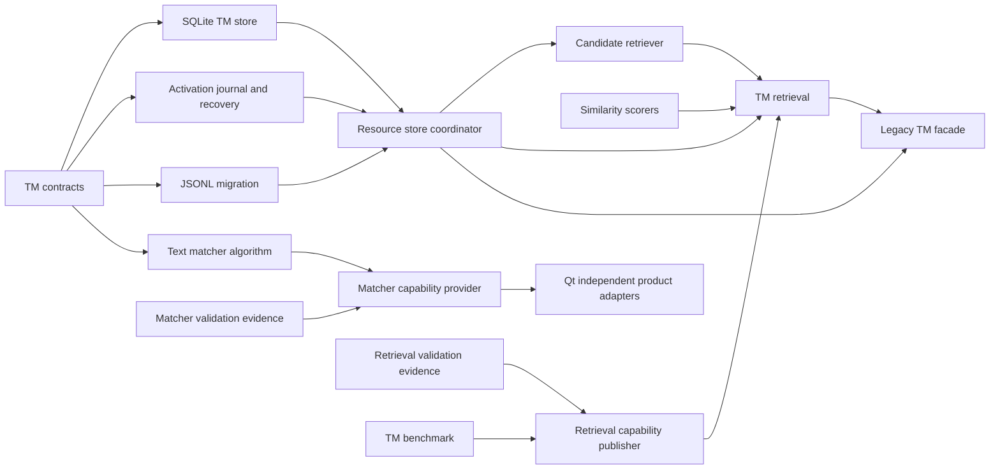
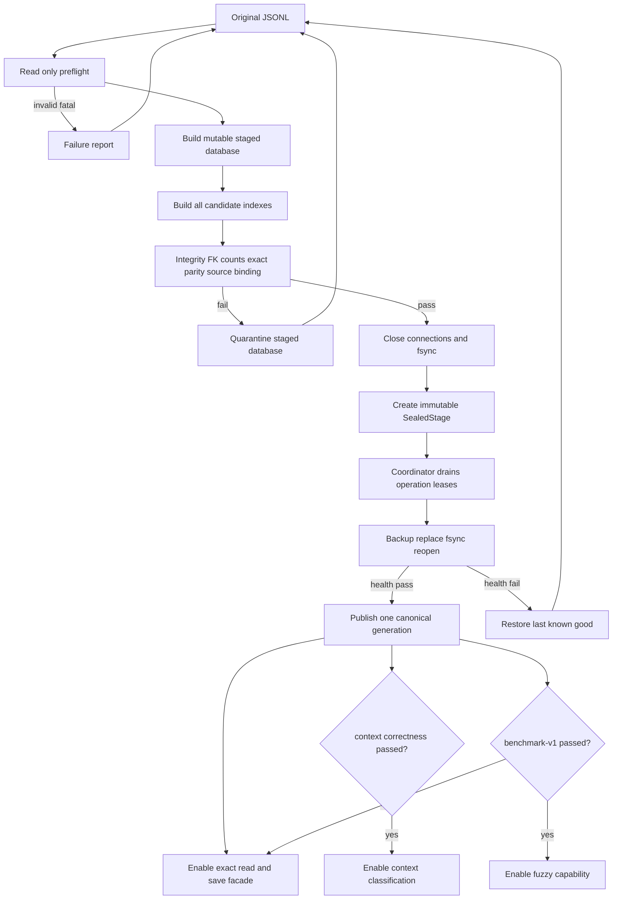
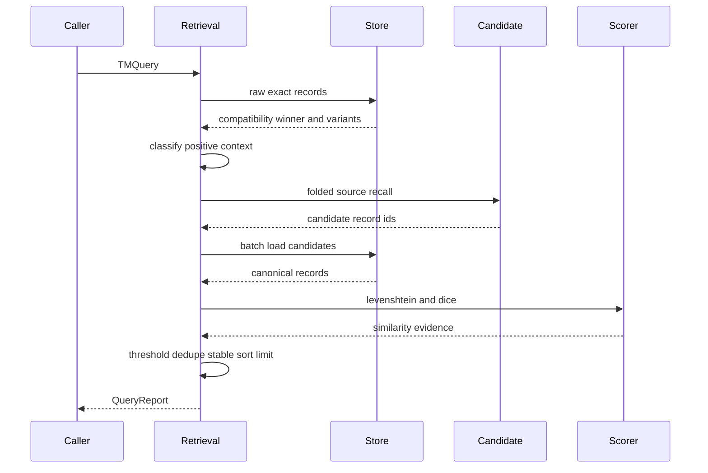

# 设计文档

## 概述

Feature 5 把当前内存 JSONL exact engine 演进为每资源隔离、可迁移、可解释的本地 TM 检索子系统。迁移并原子激活后，同目录 canonical SQLite sidecar 成为该资源唯一的运行时读写权威，保存多译文、raw context、provenance 和完整候选索引；原 JSONL 被登记为只读历史快照，只用于兜底恢复、显式导入/导出、外部互操作和审计，不再参与正常查询或保存。检索严格保持 raw exact 兼容 winner，再返回有明确证据的 context 和显式评分的 fuzzy 建议。

候选召回与最终 CAT 相似度完全分离。FTS5 trigram 或自有 n-gram postings 只缩小候选集合；每个 fuzzy 候选都运行 Levenshtein 与 multiset character-bigram Dice，`scorer-v1` 以二者等权平均作为 final similarity。Core 同时发布版本化 `TextMatcher`，供 Qt 项目搜索和术语产品消费，但不拥有任何 UI、工作区或 Parser 行为。

### 目标

- 证明旧 raw exact、last-valid winner、Active/Lookup/Update 与 Excel 三态等价。
- 安全迁移并保留多译文、context、provenance、原始 JSONL 字节和可核对的来源绑定。
- 提供确定性的 `EXACT → CONTEXT → FUZZY` query pipeline 和双 source evidence。
- 提供 Unicode/CJK 可版本化文本匹配，以及 100k TM 性能门。

### 非目标

- Qt 控件、导航、高亮、偏好或 suggestion card。
- Parser/Codec、项目文件、TMX vendor context mapping。
- 云端、账号、共享锁、向量/语义模型和机器翻译。
- 在旧 Excel 三态中暴露 context/fuzzy 第四状态。

## Boundary Commitments

### This Spec Owns

- `TMRecord`、query/result/evidence/migration/export/search frozen contracts。
- 每 TM 资源独立 SQLite schema、事务、索引、schema upgrade 与 backup。
- JSONL preflight、来源快照绑定、旁路迁移、idempotent retry、compatibility export。
- raw exact、positive-context classification、candidate recall、Levenshtein/Dice 与稳定排序。
- `TextMatcher text-v1` 的 case-fold projection、UAX #29 word boundary、pure CJK tailoring。
- `TextMatcher` 的三态 capability、验证证据解析、用途门控与同一快照结果信封。
- 旧 `TMEngine.query_exact/save_record` 的 compatibility facade 与非 Qt benchmark。

### Out of Boundary

- `EditorController` 的 Qt-facing suggestion adaptation 和 apply/navigation。
- Resource Settings UI、资源路径解释、Match Case/Whole Word 控件。
- 项目/格式 parser 与 TMX context interchange。
- speaker alias/avatar 和其他展示 profile。
- 网络、协作与跨端同步。

### Allowed Dependencies

- Python 3.14 标准库：`sqlite3`、`json`、`hashlib`、`unicodedata`、`multiprocessing`、`pathlib`。
- SQLite FTS5 是可探测 fast-path capability，不是正确性唯一依赖。
- Core 可以读取中立 raw records，不得依赖 PySide6、xlwings、Controller、workspace state 或 Parser 实现。
- Compatibility facade 可依赖新 Core ports；新 Core 不反向依赖旧 `TMEngine`。

### Windows Compatibility Amendment WA-06（current R4）

- **ADR mapping**：follow adopted ADR-020/021 as supplemented by ADR-023/024/025。WA-06 `R3`取代`R2`时保持V2 security profile、采用provider-agnostic current-primary-token与`WindowsDocumentedPublishV1`；`R4`补齐原W3输入与fresh worker消费。下述普通frozen增量遵循ADR-028；R4与source保留原验收范围。TM Core继续独占 SQLite authority、generation/reservation、activation/snapshot/schema journals、LKG、receipt与恢复状态机；platform adapter不解释这些业务事实。
- **Platform composition**：activation/snapshot/schema/attestation modules消费`ProcessFileLock`、`RootedFileSystem`、`ExistingFileDurability`、`BoundDirectoryAuthority.begin_publish()`产生的`PendingPublication`与`PrivateStorageProof`；不在Core复制`fcntl`/dirfd或裸Win32调用。未发布stage的POSIX实现保持file fsync与parent fsync；Windows实现通过同一retained synchronization handle完成`FlushFileBuffers`和exact content/live identity复证，并对parent/root执行live reproof，不把它表述为Windows directory fsync。任一同步或复证缺失/漂移都不得登记sealed registry，冷重开只能重建该stage或保持unavailable；canonical publication仍只走5.7a的`PendingPublication`协议。
- **Private proof**：owner envelope嵌套`WindowsPrivateProof`，以`security_profile_id=WindowsPrivateSecurityV2`及descriptor digest绑定exact TokenUser owner+DACL+medium/high MIC projection；handle-bound label读取使用`LABEL_SECURITY_INFORMATION`而非完整SACL权限。资格来自实际current process primary token，standard/elevated正向及same-SID low/restricted负向分别验证；local/domain/Entra等provider origin不进入proof。FileId只作live observation，recreate/reuse与security profile/token变化进入re-attestation或fail-stop，不改store id/generation；V1/unknown profile不兼容读取。
- **Publication/FTS5**：activation、snapshot与export在local fixed NTFS上按`WindowsDocumentedPublishV1`完成write-through/flush、handle-bound naming、retained exact readback；owner在`PendingPublication`存活时提交自身journal/receipt并复证业务state，再调用platform terminal reproof。不确定时platform返回`RECOVERY_REQUIRED`，owner在故障注入、two-process/process kill、app restart与正常OS reboot后只接受完整old、完整new或recovery-only；source/frozen均不加载硬件durability registry。普通frozen的程序来源按下节合同，不继承W3 strict closure；用户数据端口与FTS5/fallback create-query-reopen的保证不变，候选必测和未改变owner证据复用按平台Requirement 12与本Spec 9.6b执行。
- **Explicit replacement**：Windows显式import/rebuild从source rooted preflight取得同一resource-scoped reservation与caller-held root/lock，构建fresh portable stage并沿replacement activation envelope把prior `N`切换为candidate `N+1`；DB/manifest publication继续消费`PendingPublication`，只有terminal `READY`可以更新binding并清除divergence。replacement使用独立的版本化discriminator绑定prior store/generation、active attestation与backup proof、candidate store和next generation，并将私有namespace限制为current completed chain加至多一个pending replacement；不得放宽或重解释现有first-activation v3/generation-zero codec。schema upgrade保持其独立后续边界。

#### R4已完成范围与普通packaged消费修订

[Task 7前置修订](../windows-platform-enablement/task7-prebuild-consumption-amendment.md)与9.6c/9.6d保留原W3构建前接口、source回归和发布协调的完成事实。普通packaged的活动合同为下文；R4的native producer、retained-source、E10和原线程native调度不再是此路径的前置，也不被重新标为已通过。Core仍拥有Gate A/C approved roots grammar、fixture解析、relative-id集合、digest、Gate D fingerprint、benchmark contract及所有Gate判定。平台拥有候选构建/入口/传输，Feature5拥有Host组合和UI调度。

**输入与执行关联。** 平台受控构建记录提供owner输入清单、各输入摘要、对应产物位置/摘要、相关构建转换及固定依赖；入口与child检查其当前候选关联，实际候选必须消费这些owner模块与数据。该关联依靠受控构建加真实候选执行，不要求所有PYZ code object逐字段比较或运行时源码自证。Core不从`sys.frozen`、任意bytes字典、callback、自报digest或PASS JSON推导production资格，也不把普通输入伪装成source或native authority。

Core在现有`tm_gate_inputs`组合入口增加普通packaged的有限输入提供分支，复用`_GateInputOwner`、session、epoch及撤销/发布协议；不建立可扩展profile框架或第二套capability issuer。输入owner接收平台已核验的候选关联事实、Core审核的兼容信息及当前候选内的只读数据。JSON/TXT fixture、approved roots与benchmark contract由明确relative-id读取，检查缺失、重复、未声明id及摘要失配；取得的不可变快照仅在本owner epoch内复用。开始、结果构造、terminal与commit仍检查当前owner/session及撤销状态；terminal不因此要求重扫全包、重建AST或调用旧native reproof。fixture数据不从checkout、CWD或外部venv回补；业务临时资产继续走已有rooted数据端口。

输入用途在既有owner清单中区分，不另造`proof-inputs`必备目录：

| 实际消费者 | 普通packaged输入 | 限制 |
| --- | --- | --- |
| Matcher validation与`tm_retrieval_validation` | approved roots、黄金向量/Unicode数据及其内容；构建记录中的artifact/build/evaluator输入摘要 | 语义transcript必须由实际执行模块重算；输入摘要不能代替Matcher或Gate C执行 |
| `tm_benchmark`的fingerprint与contract读取 | Core审核的实现输入摘要、相关构建转换和runtime事实；`benchmark_tm_contract.json`原内容 | fingerprint表达检索兼容性，不是发行候选摘要或执行授权 |
| Gate D oracle、migration/query、publication | 当前session中的contract/fixture/兼容事实和真实运行证据 | 不恢复ambient checkout locator，不为旧bundle重签 |

普通路径默认不携带仅供源码重读的副本；现有源文件路径可作为构建输入id而非运行时文件位置。若首条真实调用链发现某个既有消费者确需只读源码字节且保留副本比改其窄接口更小，须先在本表与owner清单列明文件、消费者、用途和有限读取范围并评审该delta。副本只能是构建关联的兼容数据，不进入import、不充当执行authority，也不能重新启动完整AST/native证明；未经列明不得扩大收集整个checkout。

#### 检索兼容身份与单次运行身份

三种作用域通过现有字段与owner接口配合，不新增身份Spec、持久化run-attestation或平台资格发布者。

| 作用域 | 生成/核验与传播 | 失效行为 |
| --- | --- | --- |
| 发行候选关联事实 | 唯一定义见Windows Design的候选身份合同；平台入口和same-EXE transport核验，Core只接收当前候选关联用于本次session和worker结果配对 | 不匹配拒绝该次运行；不进入持久Fuzzy key，不因候选变动自动否认检索兼容性 |
| 检索兼容身份 | Core按下述输入生成现有`implementation_fingerprint`并组成ADR-013 compatibility key；parent/child各自从自己的候选输入与runtime取得，request/result与Gate发布交叉比对 | 任一依赖变化或缺失使旧资格不可恢复；Exact/Context按各自Gate继续，Fuzzy需显式重验 |
| 单次运行/session | Core创建当前owner/epoch/window；Host保留自己的generation，Core保留现有request protocol digest、独立child PID与process-pair绑定；一请求一组pipe的transport将候选关联与该请求绑定 | foreign、已完成重放、过期epoch、旧generation或撤销胜出的结果不可发布；不持久化为资格 |

检索兼容输入沿既有fingerprint与ADR-013资格owner收束：

- 实现依赖从`BENCHMARK_IMPLEMENTATION_SOURCE_PATHS`及Gate C的approved roots取出，使用受控构建所记录的规范input-id/摘要；纳入实际影响检索的构建转换、migration/query worker执行与测量机制。改为数据摘要消费只改变输入来源，不改变Gate算法、cohort或门限；普通组合的编码与依赖范围必须由Core审核，不能由平台随意删项。
- compatibility key仍覆盖device、implementation fingerprint、benchmark/proof、Gate C build/semantics/fixture/evaluator、Python/SQLite/Unicode/platform与intended path。运行时事实由当前进程观测并与构建声明核对。打包转换与transport机制有影响时通过其受影响输入/配方进入fingerprint，保持既有摘要形状和资格envelope；本轮不批准新持久schema或通用profile登记制度。
- 完整EXE/PYZ/发行manifest摘要仅作候选关联。纯UI、头像和无关资源变化不能无条件改变检索兼容身份；也不能借“缩小key”遗漏Core、索引、Gate、fixture、相关runtime或计量依赖。source/W3/普通packaged不因源码摘要相同就自动互认，只有Core能验证全部兼容字段与本机provenance；不能证明则保持Fuzzy关闭。
- 恢复继续使用现有私有SID/ACL/MIC、设备密钥/HMAC、strict bundle与Core receipt重铸；有效资格自动恢复，无资格或失配时启动不跑100k，只有用户显式请求才运行正式Gate D。数据/项目交换不携带本机资格。

**实际调用链贯通。** `tm_benchmark_gate`调用oracle suite与其`_build_recall_evidence`时显式传递本次`_input_session`，oracle真值计算开始到两条path证据构造结束均在同一有效epoch。query parent、child与Gate D在持有session的执行owner内核验当前fingerprint；`_adjudicate_evidence_against_process_evidence`只比较传入证据、request和process关联事实。`QueryProcessRunResult`等结果DTO不持有活authority，不在构造时读取ambient source fingerprint、路径或其他进程全局身份。构建记录仅提供输入关联，真实Matcher、oracle、migration/query与发布仍由原Core owner执行。

#### same-EXE worker与取消

Core继续拥有严格request/result codec、独立fresh migration/query child、从进程启动到完成的RSS、timeout、错误分类与原计量边界。source保留既有Python模块入口；普通packaged由同一候选EXE的两个固定模式进入既有`tm_benchmark_process`、`tm_benchmark_query_process`，每个child独立组合自己的输入session。平台拒绝未知/重复/多余模式和通用`-m`，提供显式定向继承的二进制pipes及候选一致性检查；不传父进程authority或capability，不依赖GUI标准流/`.buffer`，不回落venv或进程内worker。

现有request protocol digest、expected implementation/path/contract、独立PID与process-pair核验覆盖Core执行配对；平台候选关联在传输层附着于本次专属pipe，不能替代这些字段。无缺口不新增run-id；若实际并发/重试显示既有关联不足，只在现有request/result严格codec补齐最小关联并由Core评审，不产生持久格式或新authority。

取消沿Host当前generation→Core execution context→`tm_benchmark_worker`→平台parent transport传递。Core先依既有publication短锁决定撤销/提交胜负，transport负责只停止自己创建的未完成child、限时等待其退出并回收pipe/句柄；Qt只请求取消、消费异步结束通知，不阻塞join。输入owner撤销和child回收是两项独立义务；child未退出时不可报告清理完成。取消先赢则零安装，合法commit先赢则保留完整安装和完成事实，随后取消不追溯否定已完成提交。所有等待、I/O、terminate/close都在publication短锁外，详见[既有publication合同](trusted-input-publication.md)。

真实候选须覆盖windowed标准流不可用、缺失/错误pipe、截断或畸形result、超时、child异常退出、取消/关闭以及合法commit先赢的反例。首条小样本贯通只证明集成与生命周期，不签发正式100k资格；随后同候选的正式C/D与设备资格闭环归9.6b。9.6e与平台7.2同步交付首条生产链，不等待平台7.3/7.4的后置资格或产品验收。

#### 修订边界与验证分工

本节依据ADR-009/013/020/021及其已采纳修订、ADR-028定义普通packaged消费，使用既有public capability与持久schema。修订范围登记于平台 [cross-spec-amendments.md](../windows-platform-enablement/cross-spec-amendments.md)。相邻平台与Feature5须同步候选关联、Host组合和取消消费，但不能变成第二个Core owner。

尚未证明的是普通入口能否在无checkout的真实候选中完整消费上述有限输入，以及现有fingerprint/Gate C汇总能否仅靠构建输入摘要保持既定grammar。7.2/9.6e实验先跑实际Matcher、Gate C输入与小样本migration→query→oracle/结果消费，记录发生路径读取的具体消费者、子进程退出和各阶段成本；缺输入、ambient source读取、跨候选结果、取消后未回收或正式消费者被test seam替代均为失败。若需要超出本节的副本、字段或组合边界，先归属本owner并修订该delta，不扩大为全包证明。

### Revalidation Triggers

- Python/SQLite/UCD 版本、FTS5 capability 或 WAL 安全范围改变。
- JSONL source/target/metadata 字段、last-write 兼容语义或 ResourceConfig 路径语义改变。
- scorer weights、normalization、candidate index、threshold 默认值或 stable tie key 改变。
- `TextMatcher` semantics version、验证 cohort/fixture/evaluator/artifact digest、word-break data 或 offset contract 改变。
- JSONL snapshot binding schema、显式 import/rebuild/export 行为或 `SOURCE_DIVERGED` 状态转换改变。
- Qt adapter、Parser record adapter 或 TMX interchange 开始消费 canonical context。

## 架构

### 现有架构分析

- `TMEngine` eager-load JSONL，并用 raw source dict 实现 exact；重复 source 后写胜出。
- `LogicController` 只允许 exact TM → terms → no match 三态。
- `EditorController` 按 Active+Lookup 聚合资源，按 Active+Update 写入；单资源失败不得污染其他资源。
- 当前 importer 原子替换 JSONL，但会折叠同 source 且不保留 context。
- 现有 benchmark 只测三条默认 TM 的 Excel 路径，不足以证明 100k fuzzy。

### 架构模式与边界图



依赖方向为 Contracts → Store/Activation Durability/Migration/Matcher/Scorers → Coordinator/Retrieval/Capability Gates → Compatibility Facade。Activation Durability 通过窄 store-validation port 服务 coordinator，不反向依赖 `SQLiteTMStore` 具体实现；候选索引没有返回 final similarity 的权力。physical canonical activation、fuzzy benchmark 和 matcher capability 是三个独立状态机，任何一项都不得替另一项宣称就绪。

### 技术栈

| 层 | 选择 / 版本 | 作用 | 说明 |
|----|-------------|------|------|
| Runtime | Python 3.14 | 类型、迁移、评分、benchmark | 标准库 |
| Storage | SQLite 3.x via `sqlite3` | canonical per-resource TM | 首版 rollback journal |
| Candidate | FTS5 trigram + gram postings | recall-only | capability/fallback |
| Unicode | pinned UAX #29 / Unicode 16.0.0 data | text-v1 word boundary/script | 无运行时网络 |
| Compatibility | Python facade | 旧 exact/save 接缝 | Excel 三态不变 |

当前实测 SQLite 3.51.2 位于 WAL-reset advisory 影响范围，因此 `journal_mode=DELETE` 是设计要求而非性能建议。

## File Structure Plan

### Directory Structure

```text
/
├── tm_contracts.py                  # Core frozen contracts、Enums、Protocols
├── tm_sqlite_store.py               # per-resource coordinator facade、schema、CRUD、source binding
├── tm_activation_journal.py         # activation journal/terminal codec 与 durable file protocol
├── tm_activation_recovery.py        # phase recovery、成套 publication/rollback 与窄 store-validation port
├── tm_schema_upgrade.py             # schema upgrade copy 数据面与 pending/reported artifact 协议
├── tm_snapshot_artifacts.py         # snapshot artifact namespace/proof/handoff primitives
├── tm_candidate_index.py            # FTS5/gram candidate retrievers
├── tm_similarity.py                 # Levenshtein、Dice、scorer-v1
├── tm_retrieval.py                  # exact/context/fuzzy pipeline 与聚合
├── tm_retrieval_capability.py       # Gate C/D evidence evaluator、原子能力快照与发布
├── tm_retrieval_validation.py       # Gate C 固定向量执行、结果重算与 manifest 生成
├── tm_migration.py                  # JSONL preflight/migrate/export/upgrade
├── text_matcher.py                  # text-v1 纯算法、fold projection 与 hit logic
├── matcher_capability.py             # evidence evaluator、三态发布与 gated port
├── unicode_word_break_data.py       # generated pinned property tables
├── tm_engine.py                     # 激活 gate 后的 compatibility facade
├── resource_importer.py             # 已激活资源调用 canonical import port
├── tm_benchmark.py                  # benchmark-v1 确定性语料、cohort 与冻结输入契约
├── tm_benchmark_latency.py          # exact/fuzzy 逐查询延迟样本与 nearest-rank 统计
├── tm_benchmark_process.py          # 独立子进程迁移、reopen 与全生命周期 RSS 采样
├── tm_benchmark_oracle.py           # 固定 subset 全扫描 oracle 与 candidate recall 对账
├── tm_benchmark_query_process.py    # 按迁移 artifact identity 重开真实 store 的查询子进程
├── tm_benchmark_gate.py             # TMBenchmark 组合入口、双路径报告与 Gate D 发布
├── benchmark_tm_contract.json       # thresholds、corpus/scorer/index config
└── tests/
    ├── assets/
    │   ├── tm_migration_cases.jsonl
    │   ├── tm_similarity_vectors.json
    │   ├── text_matcher_vectors.json
    │   └── matcher_validation_manifest.json
    ├── test_tm_contracts.py
    ├── test_tm_sqlite_store.py
    ├── test_tm_candidate_index.py
    ├── test_tm_similarity.py
    ├── test_tm_retrieval.py
    ├── test_tm_retrieval_capability.py
    ├── test_tm_retrieval_validation.py
    ├── test_tm_migration.py
    ├── test_text_matcher.py
    ├── test_matcher_capability.py
    ├── test_tm_engine_compat.py
    └── test_tm_benchmark_contract.py
```

Activation 模块在 Task 5.9 闭合完整恢复矩阵后、Cluster D 统一复审前做行为保持型提取。`tm_sqlite_store.py` 在 Feature 5 内继续保持既有 `ResourceStoreCoordinator` 导入入口，但不再拥有 journal/terminal canonical codec、exclusive temporary/replace/fsync 原语或逐 phase 恢复/回滚实现；新模块不得反向导入 `SQLiteTMStore`，只能消费 frozen contracts 与显式窄端口。提取不得修改 journal phase、错误码、token/nonce 单次语义、fault-injection 顺序或 public lease/activation 行为；原 Cluster D characterization/failure matrix 必须在移动前后使用同一断言通过。`tm_contracts.py` 与 `tm_stage_sealer.py` 不属于本次提取范围，待 Feature 5 契约面稳定后另行评估。

Cluster E 行为闭合后、Cluster F 开始前增加 schema-upgrade 行为保持型边界提取。`tm_schema_upgrade.py` 仅拥有 v1→v2 copy 数据面、backup/locator 的 pending→reported 持久化协议、strict locator file proof 与纯候选事实校验；它不反向导入 `tm_sqlite_store.py` 或 `tm_migration.py`，只通过显式值、callback/窄端口消费 schema DDL 和 canonical ancestry 证明。`ResourceStoreCoordinator` 仍在 `tm_sqlite_store.py` 独占 ticket/locator snapshot 所有权、lease/drain/state transition、activation guard 与 cold-recovery root 选择；`TMMigrationService.upgrade_schema()` 的公开入口、成败编排和 report/failure 构造仍在 `tm_migration.py`。原模块对已有 private 导入与 fault-injection patch seam 保留 late-bound compatibility wrapper，不得藉移动改变分支顺序、异常码、cleanup 顺序或磁盘效果。`tm_contracts.py`、`tm_stage_sealer.py`、canonical ancestry 单一证明实现与通用 coordinator 状态机不纳入此次提取；`try/except/if/raise` 简化属于正交的后续治理，不与等价移动同一提交。提取前后必须用同一 Cluster E failure/interleaving matrix、公开 API 契约、import-boundary 守卫和 fresh 全量回归证明等价。

Cluster F 行为、命名空间与冷恢复矩阵闭合后增加 snapshot artifact 行为保持型边界提取。`tm_snapshot_artifacts.py` 只拥有 deterministic JSONL/manifest/temp/recovery family、root→parent no-follow directory descriptor 绑定、strict regular/single-link identity+digest proof、exclusive temporary/recovery copy、replace/cleanup 原语与 durable handoff 值编解码；它不反向导入 `tm_sqlite_store.py`、`tm_migration.py` 或 `tm_snapshot_recovery.py`。`TMMigrationService` 仍独占公开 export/refresh 编排、canonical snapshot 使用和 report/failure 构造；`tm_snapshot_recovery.py` 仍独占 receipt 分类、reconciliation、terminal replay 和 divergence 决策；`tm_sqlite_store.py` 仍独占 ledger/binding SQL、transaction、generation 与 coordinator 状态。已有 owner 导入和 fault-injection seam 通过 late-bound compatibility wrapper 保留，不得改变错误码、调用/清理顺序、durable handoff 生命周期、交易边界或磁盘效果。该门不设行数指标；只用 owner 责任减少、无反向导入、Cluster F 同一断言与 fresh 全量回归判定成功。异常分支简化、错误分类重新设计、`tm_contracts.py`/`tm_stage_sealer.py` 拆分与公开 API 调整全部排除。

### Modified Files

- `tm_engine.py` — 仅在 migration/exact parity gate 后适配新 facade；公共 exact/save 形状保持。
- `resource_importer.py` — 本规格内接入 canonical import port；已激活资源不再先改 JSONL 或自行折叠 canonical variants。
- `tests/test_excel_adapter_contract.py` — 增加 sidecar 激活后的三态 parity。
- `backend_throughput_harness.py` 不扩展为 fuzzy harness；保留旧路径基线。

## 系统流程

### JSONL migration



原 JSONL 在所有迁移路径中保持不变。重复相同 SHA-256 migration 通过 completed `tm_origin_batch(kind='migration')` 返回既有结果，不重复插入。只有 `ResourceStoreCoordinator.activate(sealed_stage)` 能替换 canonical sidecar；mutable path、裸 `Path` 或尚未闭合索引的工作副本都不是可激活参数。

physical/canonical gate 只决定运行时数据权威和 exact/save 可用性；Gate C correctness 决定同 source raw CONTEXT 分类是否开放；fuzzy benchmark gate 只决定 FUZZY 外部能力是否开放；matcher gate 只决定 `TextMatcher` 哪些用途已经通过验证。fuzzy benchmark 失败时 canonical SQLite 仍继续提供 exact、已经验证的 CONTEXT 和保存，不回退 JSONL。

### Query pipeline



单资源查询失败进入 `resource_failures`，其他资源结果继续。global limit 只在各资源结果聚合并稳定排序后应用。

## 需求追踪

以下映射覆盖 9 项需求的全部 86 条验收标准；Tasks 必须在此映射基础上生成逐条 coverage matrix，不得把范围行当作一个测试。

| 需求 | 摘要 | 组件 / 接口 |
|------|------|-------------|
| 1.1–1.8 | exact、资源状态、Excel 三态兼容 | Store raw index, LegacyTMFacade, parity tests |
| 1.9 | 迁移前后资源身份与 Active/Lookup/Update 不变 | ResourceIdentity, SnapshotBinding, Coordinator |
| 2.1–2.8 | preflight、迁移、重试、导出 | TMMigrationService, JSONLSnapshotExporter |
| 2.9–2.12 | 完整发布、切换原子可见、既有/首次激活失败恢复 | StageSealer, SealedStage, ResourceStoreCoordinator |
| 2.13 | 来源分歧不发生双向隐式覆盖 | SourceBindingMonitor, CanonicalAuthority |
| 3.1, 3.2, 3.3, 3.4, 3.5, 3.6, 3.7 | 多译文、context、provenance | TMRecord, Store, Retrieval |
| 4.1–4.7 | 类型顺序、阈值、limit、局部失败 | TMRetrievalService, CandidateStageMetadata |
| 5.1–5.7 | 双 source、分数、显式应用安全 | TMResult, SimilarityEvidence, facade adapter contract |
| 6.1–6.10 | Match Case、Whole Word、CJK、offset | TextMatcherV1 pure algorithm, gated matcher |
| 7.1–7.7 | 本地性、隔离、恢复 | per-resource Store, QueryReport, Coordinator |
| 7.8–7.13 | divergence 期间 canonical Lookup/Update 与显式消歧 | SourceBindingMonitor, CanonicalAuthority, explicit import/rebuild |
| 7.14 | 待激活版本资源身份和来源绑定校验 | StageValidationEvidence, SealedStage, Coordinator |
| 8.1–8.7 | 100k latency/migration/RSS/report 与超限失败 | TMBenchmark, FuzzyCapabilityGate |
| 9.1–9.6 | Core 三态、基础/完整证据与用途集合 | MatcherCapabilityEvaluator, MatcherCapabilitySnapshot |
| 9.7–9.12 | fail-closed、同次快照、摘要与单一权威 | CapabilityGatedTextMatcher, validation manifest |

## 组件与接口

| 组件 | 层 | 目的 | 需求覆盖 | 关键依赖 | 契约 |
|------|----|------|----------|----------|------|
| TMContracts | Shared | 中立、版本化数据形状 | 1–9 | 无 | State, Service |
| SQLiteTMStore | Storage | per-resource canonical records | 1, 3, 7 | sqlite3 | Service, State |
| ResourceStoreCoordinator | Storage runtime | lease、drain、唯一 activation 与恢复 | 1, 2, 7 | SQLiteTMStore, SealedStage | State, Service |
| StageSealer | Storage workflow | 闭合索引、校验、fsync 并生成不可变 artifact | 2, 7 | staged Store | Service |
| SourceBindingMonitor | Storage workflow | JSONL snapshot 同源性与 divergence 状态机 | 1, 2, 7 | Store metadata | State, Service |
| TMMigrationService | Storage workflow | JSONL migration/import/rebuild/export/upgrade | 2, 7, 8 | Store, Sealer | Batch |
| SnapshotArtifactProtocol | Storage mechanism | snapshot artifact namespace、identity proof、replace/cleanup 与 handoff codec | 2, 7 | frozen contracts, stdlib filesystem | Service |
| CandidateRetriever | Index | recall-only candidate ids | 4, 5, 8 | Store/FTS5 | Service |
| SimilarityScorerV1 | Domain | Levenshtein/Dice/final | 4, 5, 8 | 无 | Service |
| TMRetrievalService | Domain | exact/context/fuzzy order | 1, 3–5, 7 | Store/Index/Scorer | Service |
| RetrievalCapabilityEvaluator | Domain validation | Gate C correctness 与逐执行路径 Gate D evidence 的唯一判定 | 4, 5, 7, 8 | frozen contracts, validation evidence | State, Service |
| RetrievalCapabilityPublisher | Domain runtime | 原子发布 CONTEXT 与逐路径 FUZZY 不可变快照 | 4, 7, 8 | evaluator | State, Service |
| RetrievalValidation | Domain validation | 从固定输入重新执行 Gate C vectors 并生成 identity-closed manifest | 3–5, 7 | Retrieval pure functions, frozen contracts | Batch |
| TextMatcherV1 | Shared domain | Unicode/CJK stable hits 纯算法 | 6, 9 | pinned data | Service |
| MatcherCapabilityEvaluator | Shared domain | 校验证据到三态快照的唯一决策 | 9 | manifest, TextMatcherV1 | State, Service |
| CapabilityGatedTextMatcher | Shared domain | 用途/选项门控和结果信封 | 6, 9 | evaluator, TextMatcherV1 | Service |
| LegacyTMFacade | Compatibility | 旧 exact/save API | 1, 5, 7 | Retrieval/Store | Service |
| TMBenchmark | Validation | performance/recall/RSS gate | 8 | all Core | Batch |

### Core contracts

```python
class TMMatchType(str, Enum):
    EXACT = "EXACT"
    CONTEXT = "CONTEXT"
    FUZZY = "FUZZY"

@dataclass(frozen=True)
class TMRecord:
    record_id: int
    source_raw: str
    target_raw: str
    speaker_raw: str | None
    context_prev_raw: str | None
    context_next_raw: str | None
    file_source: str | None
    provenance: tuple[tuple[str, str], ...]
    legacy_line_no: int | None
    origin_batch_id: str
    origin_ordinal: int

@dataclass(frozen=True)
class TMQuery:
    query_source: str
    speaker_raw: str | None
    context_prev_raw: str | None
    context_next_raw: str | None
    minimum_similarity: float
    limit: int
    resource_order: tuple[str, ...]

@dataclass(frozen=True)
class SimilarityEvidence:
    levenshtein_ratio: float
    dice_bigram: float
    final_similarity: float
    scorer_version: str = "scorer-v1"

@dataclass(frozen=True)
class ContextEvidence:
    comparable_fields: tuple[str, ...]
    matched_fields: tuple[str, ...]
    mismatched_fields: tuple[str, ...]
    strength_v1: tuple[int, int, int, int, int]

@dataclass(frozen=True)
class TMResult:
    resource_id: str
    record_id: int
    query_source: str
    matched_source: str
    target: str
    match_type: TMMatchType
    similarity: float
    similarity_evidence: SimilarityEvidence | None
    context_evidence: ContextEvidence
    provenance: tuple[tuple[str, str], ...]
    stable_tie_key: tuple[int, int]

@dataclass(frozen=True)
class QueryReport:
    results: tuple[TMResult, ...]
    resource_failures: tuple[ResourceQueryFailure, ...]
    resource_metadata: tuple[ResourceQueryMetadata, ...]

class CandidateStage(str, Enum):
    FTS_TRIGRAM = "FTS_TRIGRAM"
    GRAM_3 = "GRAM_3"
    GRAM_2 = "GRAM_2"
    GRAM_1 = "GRAM_1"
    UNION = "UNION"
    DEDUPLICATE = "DEDUPLICATE"
    TRUNCATE = "TRUNCATE"

@dataclass(frozen=True)
class CandidateStageMetadata:
    stage: CandidateStage
    input_count: int
    added_unique_count: int
    output_unique_count: int
    dropped_count: int

@dataclass(frozen=True)
class CandidateRecallMetadata:
    resource_id: str
    index_kind: str
    fuzzy_available: bool
    fuzzy_unavailable_code: str | None
    stages: tuple[CandidateStageMetadata, ...]
    union_unique_count: int
    deduplicated_count: int
    candidate_budget: int
    truncated: bool

@dataclass(frozen=True)
class ResourceQueryMetadata:
    resource_id: str
    context_available: bool
    context_unavailable_code: str | None
    recall: CandidateRecallMetadata
    scored_count: int
    returned_count: int

@dataclass(frozen=True)
class TMRecordDraft:
    source_raw: str
    target_raw: str
    speaker_raw: str | None
    context_prev_raw: str | None
    context_next_raw: str | None
    file_source: str | None
    provenance: tuple[tuple[str, str], ...]

@dataclass(frozen=True)
class TMResourceHandle:
    resource_id: str
    store: TMStore
    active: bool
    lookup: bool
    update: bool
    order: int

@dataclass(frozen=True)
class ResourceQueryFailure:
    resource_id: str
    stage: str
    error_code: str
    retryable: bool

class SourceBindingState(str, Enum):
    VERIFIED_CURRENT = "VERIFIED_CURRENT"
    VERIFIED_HISTORY = "VERIFIED_HISTORY"
    SOURCE_DIVERGED = "SOURCE_DIVERGED"

@dataclass(frozen=True)
class StoreHealth:
    healthy: bool
    schema_version: int
    generation: int
    record_count: int
    index_kind: str
    snapshot_binding_digest: str | None
    source_binding_state: SourceBindingState | None
    exact_available: bool
    context_available: bool
    fuzzy_available: bool
    diagnostic_codes: tuple[str, ...]

@dataclass(frozen=True)
class CandidateEvidence:
    record_id: int
    recall_stages: tuple[CandidateStage, ...]
    matched_grams: int
    query_grams: int
    overlap_ratio: float
    pretruncate_rank: int | None

@dataclass(frozen=True)
class CandidateRetrievalReport:
    candidates: tuple[CandidateEvidence, ...]
    metadata: CandidateRecallMetadata

@dataclass(frozen=True)
class MigrationDiagnostic:
    code: str
    stage: str
    line_number: int | None
    record_id: int | None
    safe_summary: str

@dataclass(frozen=True)
class ExportDiagnostic:
    code: str
    record_id: int | None
    safe_summary: str

@dataclass(frozen=True)
class MigrationPreflight:
    source_digest: str
    valid_count: int
    invalid_count: int
    duplicate_source_count: int
    variant_count: int
    diagnostics: tuple[MigrationDiagnostic, ...]

@dataclass(frozen=True)
class MigrationReport:
    source_digest: str
    migrated_count: int
    variant_count: int
    skipped_count: int
    diagnostics: tuple[MigrationDiagnostic, ...]
    activated_generation: int
    canonical_exact_available: bool
    context_available: bool
    fuzzy_available: bool

@dataclass(frozen=True)
class MigrationFailure:
    stage: str
    error_code: str
    retryable: bool
    diagnostics: tuple[MigrationDiagnostic, ...]
    active_generation: int | None
    original_source_unchanged: bool
    active_store_unchanged: bool
    recovery_path: Path | None

@dataclass(frozen=True)
class ExportReport:
    exported_count: int
    skipped_count: int
    destination_digest: str
    canonical_generation: int
    exported_revision: int
    snapshot_id: str
    snapshot_receipt_digest: str
    diagnostics: tuple[ExportDiagnostic, ...]

@dataclass(frozen=True)
class ExportFailure:
    stage: str
    error_code: str
    retryable: bool
    diagnostics: tuple[ExportDiagnostic, ...]
    previous_destination_preservation: AssetPreservationEvidence
    recovery_locators: tuple[RecoveryLocator, ...]
    publication_committed: bool = False
    publication_commit_ambiguous: bool = False

type MigrationOutcome = MigrationReport | MigrationFailure
type ExportOutcome = ExportReport | ExportFailure

@dataclass(frozen=True)
class SchemaUpgradeReport:
    from_version: int
    to_version: int
    backup_path: Path
    activated_generation: int

@dataclass(frozen=True)
class SchemaUpgradeFailure:
    stage: str
    error_code: str
    retryable: bool
    active_generation: int
    active_store_unchanged: bool
    backup_path: Path | None

type SchemaUpgradeOutcome = SchemaUpgradeReport | SchemaUpgradeFailure

class SnapshotKind(str, Enum):
    MIGRATION_SOURCE = "MIGRATION_SOURCE"
    EXPLICIT_EXPORT = "EXPLICIT_EXPORT"

@dataclass(frozen=True)
class SnapshotReceipt:
    snapshot_id: str
    resource_id: str
    canonical_store_id: str
    exported_revision: int
    jsonl_digest: str
    record_count: int
    format_version: str

@dataclass(frozen=True)
class SnapshotBinding:
    configured_jsonl_path: Path
    manifest_path: Path
    snapshot_kind: SnapshotKind
    receipt: SnapshotReceipt
    binding_version: str

@dataclass(frozen=True)
class StageValidationEvidence:
    resource_id: str
    target_identity: str
    source_binding: SnapshotBinding
    snapshot_receipt_digest: str
    manifest_temp_digest: str
    schema_version: int
    fold_version: str
    index_version: str
    record_count: int
    origin_batch_count: int
    fts_count: int
    gram_counts: tuple[tuple[int, int], ...]
    exact_parity_digest: str
    integrity_ok: bool
    foreign_keys_ok: bool
    stage_file_digest: str

@dataclass(frozen=True)
class SealedArtifactRef:
    artifact_id: str
    staged_db_path: Path
    manifest_temp_path: Path
    stage_file_digest: str
    manifest_temp_digest: str

@dataclass(frozen=True)
class SealedStage:
    artifact: SealedArtifactRef
    evidence: StageValidationEvidence
    expected_prior_generation: int | None
    activation_nonce: str

@dataclass(frozen=True)
class ActivationToken:
    resource_id: str
    target_identity: str
    artifact_id: str
    sealed_stage_digest: str
    expected_prior_generation: int | None
    activation_nonce: str

@dataclass(frozen=True)
class BenchmarkContract:
    contract_version: str
    corpus_generator_version: str
    corpus_seed: int
    corpus_record_count: int
    corpus_digest: str
    exact_cohort_digest: str
    exact_min_samples: int
    fuzzy_cohort_digest: str
    fuzzy_min_samples: int
    oracle_subset_digest: str
    oracle_subset_record_count: int
    oracle_query_count: int
    top_k: int
    minimum_similarity: float
    warmup_queries_per_cohort: int
    measured_repeats: int
    percentile_method: str
    rss_scope: str
    candidate_budget_version: str
    exact_p95_gate_ms: float
    fuzzy_p95_gate_ms: float
    migration_gate_seconds: float
    peak_rss_gate_mib: float
    candidate_recall_gate: float

@dataclass(frozen=True)
class BenchmarkReport:
    contract_digest: str
    corpus_digest: str
    exact_sample_count: int
    fuzzy_sample_count: int
    percentile_method: str
    candidate_recall: float
    exact_p95_ms: float
    fuzzy_top10_p95_ms: float
    migration_seconds: float
    peak_rss_mib: float
    passed: bool
    failed_gates: tuple[str, ...]
    environment: tuple[tuple[str, str], ...]
```

所有相似度/overlap 在 `[0.0, 1.0]`，limit 为正整数，source/target/resource id 非空，handle order 唯一且非负。fuzzy 必须有 evidence；exact/context 不得伪造 scorer evidence。候选阶段计数均非负且按规定顺序出现；`UNION.output_unique_count == union_unique_count`，deduplicate/truncate 前后可对账，`scored_count <= recall.candidate_budget`，`truncated` 与 TRUNCATE dropped count 一致。fuzzy/context available 为 false 时对应 unavailable code 必须非空且不得返回该类型结果，true 时 code 必须为空。Success 必须有 digest/generation，Failure 必须有 stage/error/retryable 和资产保持标志；普通失败无法证明 unchanged 时必须给 recovery locator 并 fail-stop。若 receipt 与新 pair 已 durable commit、禁止回滚旧 destination，但 deterministic cleanup/handoff 尚未闭合，`ExportFailure.publication_committed` 为 true：结果仍 fail-stop，保留已知 before/observed digest，且不得给出会暗示恢复旧 destination 的 locator；若 completion probe 本身失败、ledger commit 状态不可判定且自动回滚同样不安全，则互斥地设置 `publication_commit_ambiguous`，以同样的 fail-stop/no-locator 规则保留真实证据但绝不宣称已经 commit。原 destination 不存在时才可使用 `NOT_APPLICABLE`。公开 diagnostics 只保存 code、stage、line/record id 和安全摘要，不包含正文。

### SQLiteTMStore

```python
class TMStore(Protocol):
    def exact_records(self, source_raw: str) -> tuple[TMRecord, ...]: ...
    def records_by_id(self, record_ids: tuple[int, ...]) -> tuple[TMRecord, ...]: ...
    def append(self, draft: TMRecordDraft) -> TMRecord: ...
    def export_records(self) -> Iterator[TMRecord]: ...
    def health(self) -> StoreHealth: ...
```

**连接配置**

- 每个公开 operation 先从 per-resource coordinator 获得 generation lease，再在所属线程建立短生命周期 connection；connection 不跨线程共享，也不泄露到 Store API 外。
- `TMRetrievalService` 的一次单资源查询是一个组合 operation：只取得一次 query lease，并在其生命周期内通过 module-private、只读的 generation view 完成 health、raw exact、candidate recall 与 candidate record 批量读取。view 不暴露 append/export/activation/update 端口，不得在内部重新取得 lease，退出后立即失效；进入 `DRAINING` 前已经签发的 view 可完成当前查询并阻塞 generation 发布，`DRAINING` 后不得签发新 view。该约束保证同一资源的查询事实来自一个完整 generation，但不要求跨多个短连接持有同一个 SQLite transaction。
- `journal_mode=DELETE`、`synchronous=FULL`、`foreign_keys=ON`、`busy_timeout=5000`。
- write 使用显式 transaction；失败 rollback；read cursor 尽快关闭。
- WAL capability 默认为 false；只有 SQLite fixed version、并发 recovery suite 与 writer serialization 同时满足才允许新 semantics version。

**激活协调**

- coordinator 状态为 `READY → DRAINING → ACTIVATING → READY/FAILED`，并维护 generation、active lease count 与 bounded wait；DRAINING 后不发新 lease。
- `StageBuilder` 只产出 mutable working stage。records、FTS/gram indexes、origin batches、snapshot receipt 与 manifest temporary file 全部构建后，`StageSealer` 才执行 integrity/FK/record-index count/exact parity/source binding/index version/receipt-manifest digest 校验，关闭全部连接并 fsync 文件和 parent，最后生成 `SealedStage`。
- `SealedArtifactRef` 是 module-private、由 StageSealer 工厂创建并登记到 coordinator-owned sealed registry 的 opaque 引用，绑定 staged DB path、manifest temporary path 及二者 digest；调用方不能自行构造或替换其 path。`SealedStage` 携带该引用并作为不可变、单次消费的 capability object。registry 的 reservation/commit/release 与 token lifecycle 只存在于 coordinator/StageSealer 私有 adapter；公开 surface 仅可取得 exact read-only readiness view。commit 只消费 StageSealer 在 post-fsync integrity/projection/closure/terminal-rehash 全部通过后铸造、绑定 exact registry+reservation 且单次消费的私有 verified capability，不接受调用方分别提供 mutable stage/evidence/generation/attestation；任何 sealed artifact 都必须经过同一 `StageSealer` 内容↔语义 epoch 闭合链。
- seal 后任何文件 digest 变化、registry/ref 不一致、token 重用、过期 expected generation、资源/目标路径不匹配都必须拒绝。禁止把裸 `Path`、working stage 或布尔 `validated=True` 传给 coordinator。
- `ResourceStoreCoordinator.activate(sealed_stage)` 是唯一 sidecar replace API。它只通过 registry 解析 artifact path，从 sealed evidence 生成并单次消费绑定同一 artifact id 的 `ActivationToken`，排空旧 leases，复核 resource、target identity、prior generation、DB/manifest digests 和 snapshot binding。
- coordinator 在 replace 前写同目录 durable activation journal，至少包含 activation nonce、artifact/sealed digest、expected generation、prior binding snapshot id、prior manifest digest/backup path、new receipt id、new manifest final digest，以及 `PREPARED / DB_REPLACED / MANIFEST_PUBLISHED / GENERATION_PUBLISHED` phase；成功发布后标记 consumed。重复 nonce、已 consumed token 或与 journal 不一致的 replay 均拒绝。
- 替换现有 store 前创建同目录 recovery backup；`os.replace(stage, canonical)` 后 fsync parent，重新 capture 并严格比对 post-fsync sealed attestation 的 inode+SHA，再 open 复核 schema 与 `SEALED` marker。完整 `integrity_check` / `foreign_key_check` 已绑定该精确不可变 sealed byte identity，不得在仅发生 rename 且 inode+SHA 未变时重复；后续 active receipt 仍完整重算 record/index candidate semantic 与 logical closure。任何 byte/inode/phase 漂移都不得复用 sealed 证明。
- reopen、receipt 与 manifest 发布/复核全部成功后才一次性发布新 generation、canonical exact/save capability 和来源绑定。crash recovery 若能复核新 DB、receipt、manifest 与同一 token，便幂等完成该 token；否则同时恢复 prior DB、prior manifest/binding，fsync parent 并重新验证，不能只恢复 DB。首次激活失败则删除/隔离未发布 manifest、保留原 JSONL 为 active legacy path，并隔离失败 sidecar。进程在 DB replace 后、generation 发布前崩溃时不得暴露半发布 generation。
- 查询/写入在 drain 超时后得到 resource-local busy failure；不得绕过 coordinator 打开 canonical path。
- physical activation 后，context correctness gate 与 fuzzy benchmark gate 分别发布；fuzzy 未通过只关闭 FUZZY，不改变 canonical exact/save 或已验证 CONTEXT。matcher capability 由另一套 evidence state machine 控制。

Activation recovery 固定为：

| Journal phase | 可复核新资产 | 恢复动作 |
|---------------|--------------|----------|
| `PREPARED` | 尚未 replace | 取消 token，prior DB/manifest/binding 不变 |
| `DB_REPLACED` | 新 DB + receipt + manifest temp 全部匹配 | 发布新 manifest，继续同一 token |
| `DB_REPLACED` | 任一新资产不匹配 | 恢复 prior DB + prior manifest/binding |
| `MANIFEST_PUBLISHED` | 新 DB/manifest/receipt 全部匹配 | 发布唯一新 generation |
| `MANIFEST_PUBLISHED` | 任一新资产不匹配 | 恢复 prior DB + prior manifest/binding |
| `GENERATION_PUBLISHED` | 新 generation 健康 | 幂等标记 token consumed |

每个恢复分支都 fsync 受影响文件及 parent directory；不得把新 manifest 留给旧 DB，也不得生成第二个 generation。

### 激活血缘标记（activated-lineage marker）

物理激活成功后的资源/目标必须留下一个最小的、确定性的、邻接的、只写一次的激活血缘标记，作为“该资源/目标已经成功跨越物理激活”的持久事实。它**不是**第二套可变的 canonical 权威，不保存任何用户正文，也不随 generation 变化；后续 generation、显式 import/rebuild、schema upgrade 都保留同一个标记事实。

**身份与路径**

- 标记路径确定且不可由调用方指定：`identity.canonical_sidecar_path` 同目录下的 `.{sidecar 名}.localcat-activated-lineage.json`，临时文件为 `<标记路径>.tmp`（同目录、确定性命名）。
- 标记**只**绑定稳定血缘事实：`lineage_version`、`resource_id`、`target_identity` 与 `record_digest`。它**不**绑定 `canonical_store_id` 或任何可变 coordinator 身份：显式 import/rebuild 可以创建新的 canonical store id，后续 generation 也不改变这一只写一次的标记事实。

**严格 codec（v1）**

- `lineage_version="activated-lineage-v1"`、`resource_id`、`target_identity`、`record_digest` 四个字段；`record_digest` 是其余三个字段经 `_stable_digest` 计算的 SHA-256。
- 文件必须是 canonical JSON（`sort_keys`、无重复键、禁止非有限数字、无多余字段），只读/重放时逐字节复核序列化与摘要。
- 标记文件必须是 regular 单链接文件；symlink、hardlink、目录或其他外来条目一律 fail-closed，绝不跟随、使用或覆盖。读取用 `O_NOFOLLOW` + open-time fstat + post-read lstat 复核同一 inode；发布握手期允许 final/temp 同 inode 的两链接中间态，仅由配对 inode 证明接受。

**发布与重放顺序**

- 首次物理激活的发布顺序固定为：完整 active set 复核通过且视图 withheld 在 `ACTIVATING` → `GENERATION_PUBLISHED` journal 落盘 durable → 同一 active set 再次复核 → token consumed → **最后**确保（写入或严格重校验）血缘标记 → `READY`。标记失败时 view 继续 withheld 在 `ACTIVATING`，完成的 journal 是冷恢复权威，fresh recovery 幂等补写标记后收尾；rollback 与取消绝不清除标记。
- 冷恢复发布（`MANIFEST_PUBLISHED` 推进 generation）同样先重新证明 active set、落盘 durable `GENERATION_PUBLISHED`、再次复核，之后才确保标记；失败时收回 view 停在 `ACTIVATING`。终态重放（`GENERATION_PUBLISHED`）先重放 view 并复核 active set，再确保标记，最后清理 journal-owned backups。已存在且合法的标记绝不重写。
- 标记发布是原子 no-clobber 协议：exclusive 确定性临时文件（`O_EXCL` + 全量写入 + fsync）→ `os.link` 发布 final（final 已存在时 `FileExistsError` 即外来 final，fail-stop 且绝不覆盖，仅身份绑定清理自有临时）→ parent fsync → 仅当 final/temp 仍是同一 inode 且 `st_nlink==2` 时 unlink 临时 → 再次 parent fsync → 最终单链接逐字节重校验。崩溃重放只接受配对握手态（final/temp 同 inode 且字节等于确定性 payload）并完成 unlink；其他 symlink/hardlink/外来 final 或 temp 一律 fail-closed；字节精确的 owned 单链接临时文件恢复发布流程。
- `DB_REPLACED → MANIFEST_PUBLISHED → GENERATION_PUBLISHED` 的恢复/终态重放路径在报告 COMPLETED 前幂等补写或严格重校验标记。
- rollback 与 PREPARED 取消**绝不**清除标记。PREPARED 取消的 lineage 一致性：取消回退到 prior canonical generation 仅当 durable 标记存在并通过稳定身份重校验；第一次激活（无 prior）取消时标记 final 与 temp 必须**都不存在**——任何外来、篡改、hardlink 或残留标记/temp 一律 fail-closed，防止把从未激活的 legacy 资源变成声称已激活。
- 无 journal、无 terminal 的冷发现：无论进程内是否已有 live view，都先对磁盘重新证明 canonical pair 与标记。无标记且无 canonical pair 是真正的从未激活 legacy（返回 `None`/READY，此时 live view 非空同样 fail-stop）；有标记但 pair 缺失/部分/篡改时 fail-stop 并报告恢复失败，绝不静默返回 `None`；有 pair 但无有效标记（无 transition record 的权威）绝不静默信任，同样 fail-stop。

**取消候选隔离（quarantine closure）**

- PREPARED 取消的候选 DB/manifest 退役进确定性隔离目录：路径缺失只在该 journal 记录的 inode 已作为 regular 单链接条目存在于该确定性隔离目录（候选或 canonical basename，扫描限定单目录）时才被接受；inode 缺失（外部删除/移动）一律 `ACTIVATION.QUARANTINE_MISSING` 非重试 fail-stop，不再有 authority-path 兜底。隔离条目必须 regular 单链接，任何外来条目 `ACTIVATION.QUARANTINE_FOREIGN` fail-stop；隔离目标绝不被覆盖。

### 物理 schema

```sql
CREATE TABLE tm_meta (
    key TEXT PRIMARY KEY,
    value TEXT NOT NULL
);

CREATE TABLE tm_origin_batch (
    batch_id TEXT PRIMARY KEY,
    kind TEXT NOT NULL CHECK(kind IN ('migration', 'local_write', 'import')),
    source_digest TEXT,
    source_path TEXT,
    status TEXT NOT NULL CHECK(status IN ('staged', 'completed', 'failed')),
    valid_count INTEGER NOT NULL,
    invalid_count INTEGER NOT NULL,
    duplicate_source_count INTEGER NOT NULL,
    created_at TEXT NOT NULL,
    UNIQUE(kind, source_digest)
);

CREATE TABLE tm_snapshot_receipt (
    snapshot_id TEXT PRIMARY KEY,
    resource_id TEXT NOT NULL,
    canonical_store_id TEXT NOT NULL,
    exported_revision INTEGER NOT NULL,
    jsonl_digest TEXT NOT NULL,
    record_count INTEGER NOT NULL,
    format_version TEXT NOT NULL,
    destination_jsonl_path TEXT NOT NULL,
    destination_manifest_path TEXT NOT NULL,
    status TEXT NOT NULL CHECK(
        status IN ('issued', 'completed', 'cancelled')
    ),
    created_at TEXT NOT NULL
);

CREATE TABLE tm_snapshot_binding (
    binding_id INTEGER PRIMARY KEY CHECK(binding_id = 1),
    configured_jsonl_path TEXT NOT NULL,
    manifest_path TEXT NOT NULL,
    snapshot_kind TEXT NOT NULL CHECK(
        snapshot_kind IN ('MIGRATION_SOURCE', 'EXPLICIT_EXPORT')
    ),
    snapshot_id TEXT NOT NULL,
    binding_version TEXT NOT NULL,
    FOREIGN KEY(snapshot_id) REFERENCES tm_snapshot_receipt(snapshot_id)
);

CREATE TABLE tm_record (
    record_id INTEGER PRIMARY KEY,
    source_raw TEXT NOT NULL,
    target_raw TEXT NOT NULL,
    source_fold_v1 TEXT NOT NULL,
    source_fold_length INTEGER NOT NULL CHECK(source_fold_length >= 0),
    speaker_raw TEXT,
    context_prev_raw TEXT,
    context_next_raw TEXT,
    file_source TEXT,
    provenance_json TEXT NOT NULL,
    legacy_line_no INTEGER,
    usage_count INTEGER NOT NULL DEFAULT 0,
    last_used TEXT,
    origin_batch_id TEXT NOT NULL,
    origin_ordinal INTEGER NOT NULL,
    UNIQUE(origin_batch_id, origin_ordinal),
    FOREIGN KEY(origin_batch_id) REFERENCES tm_origin_batch(batch_id)
);

CREATE INDEX idx_tm_exact
ON tm_record(source_raw, record_id DESC);

CREATE INDEX idx_tm_context_speaker
ON tm_record(source_raw, speaker_raw, record_id DESC);

CREATE TABLE tm_gram (
    gram_size INTEGER NOT NULL,
    gram TEXT NOT NULL,
    record_id INTEGER NOT NULL,
    term_frequency INTEGER NOT NULL CHECK(term_frequency > 0),
    PRIMARY KEY(gram_size, gram, record_id),
    FOREIGN KEY(record_id) REFERENCES tm_record(record_id) ON DELETE CASCADE
);

CREATE INDEX idx_tm_gram_lookup
ON tm_gram(gram_size, gram, record_id);

CREATE TABLE tm_candidate_block (
    block_id INTEGER PRIMARY KEY,
    first_record_id INTEGER NOT NULL,
    last_record_id INTEGER NOT NULL,
    record_count INTEGER NOT NULL CHECK(record_count > 0),
    min_source_fold_length INTEGER NOT NULL,
    max_source_fold_length INTEGER NOT NULL
);

CREATE TABLE tm_gram_block_max (
    gram_size INTEGER NOT NULL CHECK(gram_size IN (1, 2)),
    gram TEXT NOT NULL,
    block_id INTEGER NOT NULL,
    max_term_frequency INTEGER NOT NULL CHECK(max_term_frequency > 0),
    PRIMARY KEY(gram_size, gram, block_id),
    FOREIGN KEY(block_id) REFERENCES tm_candidate_block(block_id)
        ON DELETE CASCADE
);

CREATE INDEX idx_tm_gram_block_lookup
ON tm_gram_block_max(gram_size, gram, block_id);
```

`tm_origin_batch.kind` 是 `migration`、`local_write` 或 `import`；只有 migration/import 才需要 source digest/path，本地 append 在同一事务先建立单记录 write batch。`(kind, source_digest)` 的非空唯一约束保证同类批次幂等，`origin_ordinal` 保证批次内顺序。`tm_meta` 至少保存 schema version、resource id、canonical store id、head revision、fold/scorer/text semantics version、candidate index kind、SQLite runtime 与 activation digest；每个成功写事务推进 head revision。`tm_snapshot_receipt` 与相邻只读 manifest 保存同一规范化 ancestry receipt，证明 JSONL 快照来自 canonical 历史中的哪个 revision；ledger 额外保存本地 destination paths 以恢复任意路径 publication，这两个 path 不进入可移植 manifest 摘要。`tm_snapshot_binding` 只指向当前配置快照。issued receipt 只用于跨越 DB/JSONL/manifest 多文件崩溃窗口；completed receipt 一经发布永不修改，divergence 只作为当前 binding/file observation 派生的 `SourceBindingState`。

FTS5 fast path 使用 contentful `tm_fts(source_fold_v1, record_id UNINDEXED, tokenize='trigram case_sensitive 1')`；输入已由 fold-v1 规范化，不再叠加 SQLite tokenizer 自己的大小写语义，也不使用 external-content table。即使 FTS5 可用，`tm_gram` 仍保存带 multiset term frequency 的 1/2-gram；无 FTS5 时再保存 3-gram。`candidate-proof-block-v1` 以每 256 个连续 record-id slot 形成固定 block；`tm_candidate_block` 与 `tm_gram_block_max` 必须由同一 record/index 事务精确维护并可从 canonical rows 完整重算。summary 可以因跨 record maxima 而宽松，但不得低于块内任一真实 term frequency。

### TMMigrationService

```python
class TMMigrationService:
    def preflight(self, source: Path) -> MigrationPreflight: ...
    def migrate(self, source: Path, destination: Path) -> MigrationOutcome: ...
    def import_snapshot(self, source: Path, resource_id: str) -> MigrationOutcome: ...
    def rebuild_from_snapshot(self, source: Path, resource_id: str) -> MigrationOutcome: ...
    def export_jsonl(self, store: TMStore, destination: Path) -> ExportOutcome: ...
    def upgrade_schema(self, store_path: Path) -> SchemaUpgradeOutcome: ...
```

- preflight 流式读取 UTF-8 JSONL，计算 SHA-256、有效/无效/重复/变体统计和可定位 diagnostics；valid row 明确定义为 JSON object 且 source/target 是非空字符串，last-valid 只在 accepted rows 中计算。
- migration 在同目录 staged path 建库；accepted rows 按原 ordinal 全部保存。
- migration/import 建立一个 origin batch；facade `save_record()`/store append 为每次本地写入建立 `local_write` batch，batch 与 record/index 必须同事务提交或回滚。
- staged DB 只有在 records 与所有声明的 candidate indexes 完成后，才在 seal transaction 内执行 `foreign_key_check`、counts、exact parity probes、source binding、candidate semantic validator、全行 projection digest、logical closure 与 `SEALED` marker；commit、close、fsync 后在同一只读 snapshot 内对最终 sealed bytes 执行唯一完整 `integrity_check`，重算全行 projection digest 与 closure 并终端复证同一 inode+SHA 后才生成 attestation，再交给 per-resource coordinator 排空连接、备份、替换、reopen 验证与发布。
- destination 是 deterministic sidecar；原 JSONL 不修改。
- 同 digest completed batch 幂等；failed batch 不作为 completed activation。
- 首次迁移激活时为原 JSONL 建立 `MIGRATION_SOURCE` receipt，把 `resource id + canonical store id + exported revision + JSONL digest + record count + format version` 同时写入 canonical ledger 与相邻 `name.jsonl.localcat-snapshot.json` manifest，再由 `SnapshotBinding` 指向这对只读资产。
- 已激活 sidecar 遇到配置 JSONL/manifest 不能与 canonical ledger 中同一 completed receipt 核对时拒绝自动覆盖并标记 `SOURCE_DIVERGED`；继续保留 last-known-good canonical，必须走显式 canonical import/rebuild。
- `resource_importer.py` 的普通 merge import 在 sidecar 已激活时必须把按输入顺序保留、未按 source 折叠的 validated rows 作为 `import` origin batch 直接提交 canonical store；不得先改 JSONL 再让 facade 猜测哪份数据更新。merge import 不修改 snapshot binding，也不清除 divergence。未激活资源继续走 legacy JSONL last-write-wins 原子导入。
- `SOURCE_DIVERGED` 期间普通 `save_record()` 继续以 `local_write` 写 canonical，同步保持 divergence 和原 JSONL 字节。只有用户明确选择“以该快照消歧”的 `import_snapshot()` 或 `rebuild_from_snapshot()` 才走全量 stage、验证、seal 和 activate；成功后更新 binding 并清除状态，任何中途失败保持 prior canonical、divergence、JSONL 与 manifest 不变。
- schema upgrade 先 `Connection.backup()` 到 timestamped recovery file，再 transaction/copy-swap。
- export 按 `record_id ASC` 写出全部 canonical variants，使最新 compatibility winner 在同 source 的历史中最后出现；字段顺序/version 固定，temporary JSONL flush/fsync 后替换，失败不覆盖有效目标。

### Canonical authority 与 JSONL snapshot binding

激活前，配置 JSONL 可以继续作为 legacy runtime store；激活后，SQLite canonical 是唯一查询与写入权威。正常 canonical append、import batch 或 head revision 变化不修改 JSONL/manifest，也不因“快照落后于当前记录”触发 divergence。`SourceBindingMonitor` 核对 JSONL digest、相邻 manifest receipt、canonical ledger receipt、resource id 与 canonical store id；当 receipt 的 `exported_revision` 是该 store 的已知历史 revision 时，状态为 `VERIFIED_HISTORY`（若等于 head 则为 `VERIFIED_CURRENT`）。它不把 JSONL 内容与当前 SQLite 全量内容做等值比较。

显式 export 分两种：

1. 导出到任意其他路径：在稳定 SQLite read snapshot 上生成 JSONL 与相邻 manifest temporary files，flush/fsync 并验证 digest/count 后发布；对应 receipt 同样按 `issued → JSONL replace → manifest replace → completed/cancelled` 写入 canonical ledger 并复用下述崩溃恢复协议，`ExportReport` 返回 canonical generation/exported revision/snapshot id。它不修改活动 binding；其失败、删除或外部修改不影响活动资源的 `SourceBindingState`，也不能清除 `SOURCE_DIVERGED`。
2. 显式导出并刷新配置 JSONL 快照：只允许当前资源未 diverged。在稳定 read snapshot 上生成并验证两个 temporary files；先在 canonical ledger 提交 `issued` receipt，再 `os.replace(JSONL)`、fsync parent，最后 `os.replace(manifest)`、fsync parent，并把 receipt/binding 标为 completed。manifest 是该双文件快照的发布标记。

恢复矩阵固定如下：

| 可观察状态 | 恢复动作 | 结果 |
|------------|----------|------|
| issued receipt，JSONL/manifest 仍是旧 completed pair | cancel issued receipt | 旧快照继续有效 |
| issued receipt，JSONL 已是新 digest，manifest 仍旧/缺失 | 由 ledger receipt 重建并发布新 manifest，再完成 binding | 新快照有效，canonical 不变 |
| issued receipt，新 JSONL 与新 manifest/receipt 一致 | 完成 binding/receipt | 新快照有效 |
| JSONL 或 manifest 与 completed/issued ledger 均不一致 | 标记 `SOURCE_DIVERGED` | canonical 继续，禁止自动覆盖 |

该协议不回滚或替换 canonical records。在没有 configured recovery in-flight 的普通 binding observation 中，manifest 缺失或被外部改写、JSONL digest 被外部改写，均进入 `SOURCE_DIVERGED`；合法 local write 只推进 head revision，仍保持既有 receipt 为 `VERIFIED_HISTORY`。issued recovery 期间的 receipt/resource/canonical identity、revision ancestry、binding 或观测异常不由 monitor 抢先归类，按下述平台恢复合同保持 `BLOCKED`，直到唯一 owner 能证明 final pair 的确定终态。

issued receipt 的 versioned artifact handoff 同时记录排他 temp/recovery copy 身份、其真实直接父目录的 device/inode，以及发布前 final pair 的 identity/digest/明确缺席事实。handoff 必须跨越 completed/cancelled 终态事务继续存在；只有先验证 terminal receipt 的 resource/canonical identity、revision ancestry、配置/任意路径分类、authority alias、完整真实父目录链与 durable parent identity，再按 exact identity+digest 清理 owned artifact、通过绑定该 parent identity 的 no-follow directory descriptor 执行 fsync、严格复核父目录未替换且四个 deterministic artifact path 均缺席后，才可清除 handoff。任何外来同字节 inode、symlink、hardlink、目录、父目录替换或 fsync 失败都保持文件与 handoff、返回 `BLOCKED`/cleanup-pending failure；不得在 cleanup 未闭合时报告成功。预先锁存的配置 divergence 只阻止 configured terminal replay，不得永久阻塞与 binding/divergence 无关的任意路径 terminal cleanup。任意路径 export replay 始终不改变 active binding 或 divergence；配置 refresh replay 仍受资源级可重入 observation gate 串行化。

路径字符串和相同字节不是命名空间授权。每个 replace/rename/delete 必须遵循同一 mutation-proof 模型：从稳定 root 逐段 no-follow 绑定直接父目录，以 durable handoff/receipt 确定允许的 source、destination 和先前缺席/身份事实，在最后一个可观测 fault seam 返回后、紧邻 mutation 之前同时复证 source 与 destination，使用该 dirfd 执行变更，然后复核 final 就是已交接 source inode、fsync parent 并持久化状态转换。父目录 rename/ABA、source 或 destination 在复证窗口被替换、多链接、同字节外来 inode 或无法复核的 post-mutation 结果均不得继续完成/清理，必须保留 durable replay 证据并 fail-closed。

Windows 配置 refresh 在 issued receipt 的同一事务内写入 receipt-scoped portable handoff；该严格版本化值绑定 prior completed binding snapshot id、prior JSONL/manifest 摘要，以及由 receipt 确定的新 pair 摘要，不记录绝对路径、volume、FileId、device 或 inode，也不依赖 `created_at` 推断 predecessor。handoff 跨越 cancelled/completed 终态继续存在，直到对应 receipt 的 final pair、owner 状态和内部残留全部闭合后才可清除。fresh process 在同一 resource W1 下重新认证 W2 owner chain、sidecar mutation guard 与 configured rooted family；live handle 经稳定 size、全量 hash 与 terminal identity/size 复证且摘要匹配 handoff/receipt 后，才把本次观测到的 byte count 与 digest 组成 retirement content facts。四个允许角色及其 basename 只能从 configured pair 派生，并以 receipt digest 和角色派生唯一 retirement target；仅将满足证明的 regular/single-link/reparse-free 内部残留无覆盖移入同一 root 下的 `.localcat-snapshot-refresh-retirement-v1/<receipt-digest>/` 隔离闭集，source 缺失时只可重新绑定角色一致、内容完全匹配的既有 target，任何 unknown entry、source/target 并存或不匹配都保持 recovery-required。manifest 重建若发现 source-only exact candidate，则在同一 rooted authority 下重新同步并取得可发布能力；若只剩 receipt target，则先无覆盖恢复到确定 source basename 后取得同一能力；两处并存或内容不符仍保持 `BLOCKED`。该能力不接收 shared final path，最终 manifest 替换仍必须消费既有 `begin_publish(REPLACE_UNDER_LOCK)`、destination prior proof 与 `PendingPublication`。只有单一合法 issued receipt 且 final pair 可稳定观察时才进入旧 pair 取消、新 JSONL 重建 manifest、新 pair 完成或明确不匹配的 divergence 四态；ledger/binding 无效或歧义、不可安全观察及内部隔离冲突均返回 `BLOCKED` 且不得锁存 divergence。receipt/binding、final pair、canonical revision、W1/W2/root 复证及隔离闭集全部终态成立后才完成或取消业务状态；issued 前的候选仍是 unjournaled evidence，保留旧 completed pair 且不自动接管。POSIX/legacy 路径继续使用上一段的 versioned artifact handoff 与 dirfd identity；Windows 不持久化 FileId，也不以 content-only 证明授权 shared user pathname 的覆盖、删除或业务完成。

Windows 的 target-only 恢复仅在同一 W1 lease 与 sidecar mutation guard 持有期间，对已复证的 source parent、lease parent 和 guard parent 打开短暂 directory rename window，以允许无覆盖 target→source rename；随后立即恢复严格 directory handles 并复证 owner，既不改变受保护文件 handle 的 sharing，也不放宽全局目录打开策略。

显式 import/rebuild 与 export 不互相冒充：只有 import/rebuild 能在 divergence 后创建新 canonical generation、更新 source binding 并清除状态；export 永不把一个未知外部 JSONL 宣称为 canonical 来源。

### CandidateRetriever

```python
class CandidateRetriever:
    def candidates(
        self,
        resource_id: str,
        store: SQLiteTMStore,
        folded_query: str,
        *,
        result_limit: int,
    ) -> CandidateRetrievalReport: ...

    def candidates_from_view(
        self,
        resource_id: str,
        view: SQLiteTMQueryView,
        folded_query: str,
        *,
        result_limit: int,
    ) -> CandidateRetrievalReport: ...
```

- query 长度 ≥3 且 FTS5 capability 可用时，把 fold-v1 query 的 unique character trigrams 分别转义为 phrase，并以 OR union 形成 fast seed；无 FTS5 时按 GRAM_3/2/1 形成 fallback seed。fallback 每阶段对全部 unique query grams 执行真实 term-major posting range read，按确定性 divmod 分配既有 4096 posting cap，并仅在该有界实际集合内按 sampled overlap/record id 生成 seed。seed 只决定实际 execution path、有界初始提示与可诊断阶段，bound-proof 的 block/record 队列和完备性不读取 seed rank/identity；全库 `GROUP BY record_id` 不是 seed 合同，seed 也不能作为 scorer-v1 完备性的证明。
- canonical index 在 record/index 同一事务保存 `source_fold_length`、字符与 bigram 的 multiset term frequency，以及固定 record block 的长度范围和各 term 最大频次。block summary 只提供保守上界；缺行、重复、计数不守恒或 summary 低估都使该资源 fail-closed。
- 对 fold-v1 query 与一个 record，令长度为 `m/n`、字符 multiset 交集为 `C`、bigram multiset 交集为 `I`、bigram 总数为 `Bq/Br`。编辑距离安全下界为 `max(abs(m-n), max(m,n)-C, ceil((Bq+Br-2I)/4))`；由此得到 Levenshtein ratio 上界，再与精确 bigram Dice 平均得到 scorer-v1 上界。单字符 Dice 沿用 scorer-v1 特例。实现必须以穷举/随机对照证明上界从不低估真实分数。
- `proof-query-v3` 保留 256-slot block 作为完整性与稀疏遍历单元；CandidateRetriever 在同一 generation view 内优先按 `(score_upper_bound DESC, record_id DESC)` best-first 打开 block。若保守 block maxima 使大量 block 仍可越过阈值，则切换到 `proof-traversal-v3` 密集精化，而不是逐 block 建连或一次性计算 100k 条完整字符/bigram exact frontier。v2 只作为严格历史 codec 读取，不得在 production 授权新查询。
- 两阶段 phase 1 在一个只读事务内复核 resource/canonical store/generation、head revision、record count、query/index maxima binding，并以既有 `tm_record` 与 `(gram_size, gram, record_id)` 索引取得全部长度 `m/n` 与精确 bigram 交集 `I`。令 `Bq=max(m-1,0)`、`Br=max(n-1,0)`、`L=max(m,n)`、`C+=min(m,n)`、`d1=max(abs(m-n), L-C+, ceil((Bq+Br-2I)/4))`，据此得到保守 `U1`；单字符特例在字符相等尚未知时必须取 Dice 上界 1.0。phase 1 提交后只按 `U1` 前沿评分足以建立真实第 k 名元组 `K0` 的前缀，禁止用 exact bigram、字符/bigram 分项最小值或其他 component heuristic 提前排除 identity。
- session 自行定义唯一合法精化集 `R = {未计入 r | U1(r) >= threshold 或 (U1(r), record_id(r)) >= K0}`，其中 `K0` 只能来自已观察的 raw-distinct FUZZY ranking identity，raw-exact identity 不得占用 kth 槽位。phase 2 必须重新绑定同一 resource/store/generation/head/count/query/index facts，在一个短只读事务内仅为严格有序的 `R` 返回 store-owned `record_id/source_fold_v1/length` 私有投影，拒绝缺失、重复、乱序、越界或额外 identity；`request=returned=R`，事务成功提交后才可计算 folded Unicode code-point 序列的精确 LCS 长度 `ell`。令 `d3=max(abs(m-n), L-ell, ceil((Bq+Br-2I)/4))` 并为完整 `R` 形成 `U3`；任何 phase-2 后 scorer callback 都必须晚于这次完整 U3 pass。ASCII exact-LCS transition memo 每个 query 最多保留 4096 个 state；某 identity 触顶后仅对其余后缀走无状态 exact fallback，并在下一个 identity 前清空重建，既不跨 session 缓存也不授予 scorer reuse。随后 production 可按严格 `(U3 DESC, record_id DESC)` 取不超过 32 个 identity 的真实 scorer batch，并只把未评分 identity 在 `U3<threshold`，或已存在 `score>=threshold` 的真实 raw-distinct kth `Kt` 且 `(U3,record_id)<Kt` 时划入 `P2`；Oracle 的 `P2` 必须同时满足这两个条件，不能用单项闭合代替 threshold+top-k 全局义务。相等一律继续竞争。
- 只有当前 completion policy 仍不能以剩余 U3 frontier 闭合时，才对尚未评分且未进入 P2 的残余逐 identity 惰性计算 `U4`：query 以 query-length-only 规则固定分为 balanced ordered segments，`p(1)=1`，`m>1` 时 `p(m)=min(m-1,ceil(3m/5))`，永不使用逐 code-point 全分区；对固定 query 分区 `x_i` 与 candidate 非降边界 `0=b0<=...<=bp=n`，令 `g(s,t)=max(len(s),len(t))-LCS(s,t)`、`DΠ=min Σg(x_i,y[b_(i-1):b_i])`，再令 `d4=max(d3,DΠ)` 并形成 `U4`。任意真实 edit alignment 在固定 query 边界上诱导一组 candidate 边界，故 `ED>=DΠ`；必须以穷举/随机对照证明 `真实分数<=U4<=U3<=U2<=U1`。U4 只消费已提交的 ordered fold projection，不计算 exact Levenshtein/final score、不调用 scorer、不建立等价类；它可以在后续 scorer batches 之间推进，但每次 scorer batch 仍不超过 32。两个 store 事务均不得跨 scorer callback；phase 2 前、中/后及 scorer 期间的 append/head 漂移分别由 phase binding 或最终 generation/head 复核稳定 fail-closed。
- 密集证明以 `phase=DENSE_COMPLETE` 冻结 `A0`（精化前 all-accounted）、`P1`（U1 安全排除）、`R`、`P2`（未计算 U4、未评分且由当前 completion policy 仅凭 U3 严格排除）、`S=R-P2`、`P3`（计算 U4 后未评分且被 U4 严格排除）与 `A1`（phase 2 后实际 all-accounted，可由 U3 probe 或 U4 后评分产生），并强制 `total=A0+P1+R`、`R=P2+S`、`S=A1+P3`（等价 `R=A1+P2+P3`）、`accounted=A0+A1`、`unscored=P1+P2+P3`。`u4_evaluated_identity_count` 只计逐 identity 真正计算过 U4 的 S 成员，必须满足 `P3<=u4_evaluated<=S`；生产路径可以以 `u4_evaluated=0/P3=0` 仅凭 U3+真实 kth 闭合，Oracle 或较弱 kth 则继续 U4/scorer。全局未评分 frontier 必须精确等于 P1 最大 U1、P2 最大 U3 与 P3 最大 U4 元组中的最大值；threshold/top-k 支配均为严格比较，tie equality 仍未闭合。公开 metadata 只携带 ordered-bound/traversal/partition version、各分区计数/最大前沿、U4 实际计算计数、精化请求与返回计数及 `K0`，不得泄露 folded text、LCS、gram、等价键或正文。
- 对固定 query，只有完整 `fold-v1(source_raw)` 完全相等的 record 才构成 scorer 等价类。TMRetrievalService 必须从 health-validated record 自行重建等价类；每类首次出现运行一次真实 scorer-v1，后续 identity 复用同一不可变 evidence，但各自的 raw source、target、provenance、record id 与稳定 tie 仍独立保留。hash、长度、gram、seed、调用方分组或自报计数均不能建立等价；任意注入 scorer 也不能冒充可复用的 scorer-v1 owner。
- `candidate-budget-v1 = min(8192, max(2048, result_limit * 128))` 保持不变，并只限制单资源为闭合证明执行的真实 scorer-v1 调用次数。`proof-query-v3` 冻结三个不得混用的域：`accounted_identity_count` 包含全部已观察 identity，`ranked_eligible_count` 只包含由 Retrieval 从 health-validated raw snapshot 派生的 raw-distinct FUZZY identity，`scorer_invocation_count` 只计完整 exact-fold 等价类首次真实调用。`accounted+unscored=total`，同 fold fan-out 仍逐 identity 进入 ranking/tie，BOUND_PROOF/UNION/DEDUPLICATE/report candidates 仍按全部 accounted identity 对账。observe 必须先完整验证整批 ID/evidence/ranked subset 与 projected invocation budget，再一次性提交；第 2,049 次调用不得产生部分 session 变更。
- v3 的 `threshold_closed`、`top_k_closed` 与 `result_complete` 必须由计数、frontier 和 raw-distinct ranked kth 精确派生，不是可自报的布尔值。Production 完整性精确为 `threshold_closed OR (ranked_eligible_count>=k AND ranked_kth_score>=threshold AND top_k_closed)`；Oracle 执行目标仍为 `threshold_closed AND top_k_closed`。未评分 identity 一律按可能 raw-distinct 保守处理；raw exact、fold/hash/gram、caller bool、session 自报或 injected scorer 不得授权 eligibility/completeness。Retrieval 在 finish 后必须以本地 raw snapshots、score evidence 与已验证 proof frontier 独立重算三个闭合事实，不一致即资源级 fail-closed。
- CandidateRetriever 与 TMRetrievalService 通过私有 proof port 交替推进，公开 `CandidateRetrievalReport` 仍只暴露候选身份与 frozen `CandidateRecallMetadata`；评分 evidence 由 Retrieval 持有并直接用于 threshold、稳定排序和跨资源 global limit，不重复评分、不允许 candidate owner 授予 capability。
- query report 与 benchmark 复用同一 proof-aware recall metadata contract；阶段计数、union unique、dedupe、truncate、scorer invocation、accounted identity、returned 必须可对账，任何负数、顺序错乱、上界低估、`scorer_invocation_count > candidate_budget`、等价类/identity 守恒错误或未闭合证明都是 validation failure。fuzzy gate 未过时 recall metadata 明确返回 unavailable code 与空阶段/候选。
- tractable oracle corpus 上，所有高于批准 threshold 的结果与真实 top-10 必须 100% 被 candidate set 覆盖；recall gate 失败不得激活 fuzzy path。
- 返回顺序不等于最终顺序；Retrieval 必须运行 scorer。

### SimilarityScorerV1

```python
class SimilarityScorer(Protocol):
    def score(self, query: str, candidate: str) -> SimilarityEvidence: ...
```

- input 使用 `fold-v1 = NFC(raw).casefold()`；exact 查询不使用该值。
- Levenshtein ratio：`1 - distance / max(len(query), len(candidate))`；双空不作为有效 TM query。
- Dice：multiset character bigram，`2 * shared / (query_grams + candidate_grams)`；相同单字符为 1，否则 0。
- `final_similarity = (levenshtein_ratio + dice_bigram) / 2`。
- 所有运算确定性；rounding 只在展示 adapter，Core 保留 float evidence。

### TMRetrievalService

```python
class TMRetrievalService:
    def query(
        self,
        resources: tuple[TMResourceHandle, ...],
        query: TMQuery,
    ) -> QueryReport: ...
```

`resources` 可包含完整 ResourceConfig adapter 集合；Retrieval 只为 `active=true && lookup=true` 的 handle 获得 store lease。每个参与查询的资源只取得一次只读 query lease，`StoreHealth`、exact/context 分类、candidate recall 和 candidate record 批量读取全部消费同一个 generation view；任一步失败都丢弃该资源的局部结果并关闭 view，不能用新的 lease 拼接同一份资源报告。`TMQuery.resource_order` 必须与 handle ids 一一对应并决定跨资源 tie order。Legacy facade 的 save path 独立只写 `active=true && update=true` handles；Lookup 不授予写权限，Update 不授予查询权限。

**分类**

1. 对每个 Active+Lookup store 执行 raw exact。
2. `record_id` 最新的有效记录是 compatibility EXACT winner，similarity=1.0。
3. context-v1 中字段仅在 query 与 record 两侧均为非空字符串时 comparable，并按 raw、区分大小写/空白的完整字符串 equality 比较。
4. `strength_v1 = (matched_count, -mismatched_count, speaker_match, prev_match, next_match)`；其他同 source variant 只有 matched_count ≥1 时成为 CONTEXT。
5. 无 context evidence 的同源非 winner 保留/导出但默认不返回。
6. 非同源 records 通过 candidate + scorer 成为 FUZZY；context-v1 strength 只影响 tie evidence。

**稳定排序**

1. type rank：EXACT、CONTEXT、FUZZY。
2. final similarity 降序；EXACT/CONTEXT 为 1.0。
3. context-v1 strength tuple 降序。
4. caller resource order。
5. record id 降序。

threshold 只过滤 FUZZY；dedupe 使用 `(resource_id, record_id)`；global limit 最后应用。

### Retrieval capability publication

`tm_retrieval_capability.py` 是 retrieval gate 的唯一判定与发布边界。它只依赖 frozen contracts 和不可变 validation evidence，不导入 store、candidate、retrieval 或 benchmark runner；`tm_sqlite_store.py`、`tm_candidate_index.py` 和 `tm_benchmark.py` 也不得反向成为能力判定权威。`SQLiteTMStore.health()` 只报告同一 generation 的物理事实和 canonical exact 可用性，CONTEXT/FUZZY 的 query-effective availability 由 Retrieval 在内存中组合，不能写回 DB、coordinator、binding 或 migration report。

Gate C 的固定输入、expected/observed canonical digest 重算和 manifest 生成由 `tm_retrieval_validation.py` 独占；它是离线 validation leaf，可以消费 `tm_retrieval.py` 的纯分类/评分入口、公开 query/store 端口和 `tm_retrieval_capability.py` 的 frozen evidence values，以临时资源重放事务回滚、局部失败和 global-limit cohorts，但任何 production runtime 模块都不得反向导入它。该模块不接触 facade 或 Qt，也不得发布能力。`tm_retrieval_capability.py` 保持 evaluator/publisher 状态机边界，不继续吸收 fixture codec、向量 runner 或测试语料；避免把“如何产生证据”和“谁有权解释/发布证据”重新耦合。

批准 roots 可以覆盖 evaluator/build 文件本身，因此不得把这些文件的 observed digest 回填为被哈希生产模块中的默认常量，否则会形成自引用身份。无 evidence 的默认 publisher 始终保持 fail-closed；离线验证只返回从批准 roots 构造的不可变 expectation 与 manifest，外层 composition root 再用这两个值显式构造 `RetrievalCapabilityEvaluator`/`RetrievalCapabilityPublisher` 并注入 Retrieval。该装配不使 validation leaf 成为发布者，runtime 也不读取 roots；任何默认常量、调用方布尔值或未闭合 manifest 都不能替代批准 roots。

为重放 single-snapshot、局部失败和 global-limit 固定服务 cohort，validation leaf 可以在函数内部用批准 expectation 与已独立重算通过的 CONTEXT evidence 构造不返回、不持久化的 harness-scoped evaluator/publisher；该值只为本次固定输入提供执行视图，不成为 production composition root。harness 必须让 fuzzy-core 与 Gate D 保持关闭，完整 service transcript 产生后才计算 observed fuzzy-core digest；最终 digest 或 manifest 不得反向授权生成它的同一次执行，避免 evidence 自举。

`RetrievalCapabilitySnapshot` 至少冻结 retrieval semantics version、CONTEXT 子门决定、fuzzy-core correctness 决定、`FTS5_TRIGRAM` 与 `GRAM_FALLBACK` 两条 Gate D 决定，以及只含版本、digest、时间和稳定 unavailable code 的不透明 evidence summary。CONTEXT、fuzzy-core 和两条 benchmark path 可分别降级，任何一项不得替另一项宣称成功。FUZZY 对某次查询可用，当且仅当 fuzzy-core correctness 与该查询实际执行路径的 Gate D 都开放；Task 7.5 完成但 Task 8 尚未发布 benchmark evidence 时，FUZZY 必须继续关闭。

`RetrievalCapabilityEvaluator` 是 evidence 到决定的唯一函数；manifest 中的自报 `passed` 不能单独授予能力。evaluator 必须重新核对批准的 cohort/fixture/build/semantics/evaluator digest、有效期和可重算结果；Gate D 还要核对 frozen benchmark contract、execution path、environment/report digest 和 hard-gate 结果。`RetrievalCapabilityPublisher` 只接受精确 evaluator/manifest 值，构造时私有克隆 expectation，refresh 时在锁内重新求值并原子替换整个 snapshot；调用方不能注入返回任意 `available=True` 的 callback。缺失、过期、版本/digest 不符或重算失败都 fail-closed，且允许从 open 降级为 closed。

`TMRetrievalService.query()` 在读取任何资源前只取得一次 capability snapshot，并让同一不可变值服务整次多资源查询；发布者随后 refresh 不改变在途 query。每个资源仍只取得一次 generation view。Retrieval 先复核 physical health/exact/generation，再把 snapshot 与查询的 intended recall path 组合为 query-effective health：仅当 physical `index_kind` 是 `FTS5_TRIGRAM` 且 fold-v1 query 长度至少为 3 时选择 fast path，否则选择 `GRAM_FALLBACK`。对应 FUZZY 子门关闭时不得读取 CandidateRetriever、candidate records 或 scorer，而是返回带 intended path、空阶段和 evaluator stable unavailable code 的 recall metadata；开放后 CandidateRetriever 返回的 `index_kind` 必须与 intended path 一致，否则该资源 fail-closed。

CONTEXT 关闭时仍保留 exact winner，但不返回其他 same-source variants；FUZZY 关闭时不影响 exact、已开放 CONTEXT 或 save。能力开放但零命中时 availability 为 true 且 unavailable code 为空；门关闭时 availability 为 false、结果和阶段为空且 code 非空。稳定 code 由 evaluator 按“identity/version/digest 不符 → evidence 缺失 → evidence 重算失败 → evidence 过期”的固定优先级产生，分别使用 `RETRIEVAL.CONTEXT_*`、`RETRIEVAL.FUZZY_CORRECTNESS_*` 和 `RETRIEVAL.FUZZY_BENCHMARK_*` 命名空间，不再由 store 硬编码 `STORE.*_GATE_CLOSED`。

### TextMatcherV1

```python
class TextMatcherState(str, Enum):
    UNAVAILABLE = "UNAVAILABLE"
    BASIC_VALIDATED = "BASIC_VALIDATED"
    TEXT_V1_VALIDATED = "TEXT_V1_VALIDATED"

class TextMatchProfile(str, Enum):
    LEGACY_COMPAT = "LEGACY_COMPAT"
    BASIC_CONTIGUOUS = "BASIC_CONTIGUOUS"
    CONFIGURABLE_TEXT_V1 = "CONFIGURABLE_TEXT_V1"

@dataclass(frozen=True)
class SearchOptions:
    match_case: bool
    whole_word: bool

@dataclass(frozen=True)
class SearchHit:
    start_index: int
    end_index: int

@dataclass(frozen=True)
class TextMatcherCapability:
    state: TextMatcherState
    semantics_version: str | None
    supported_profiles: tuple[TextMatchProfile, ...]
    validation_summary: str | None
    unavailable_reason: str | None

@dataclass(frozen=True)
class TextMatchRequest:
    text: str
    query: str
    profile: TextMatchProfile
    options: SearchOptions

@dataclass(frozen=True)
class TextMatchSuccess:
    hits: tuple[SearchHit, ...]
    capability: TextMatcherCapability

class TextMatchRejectCode(str, Enum):
    CAPABILITY_UNAVAILABLE = "CAPABILITY_UNAVAILABLE"
    PROFILE_NOT_VALIDATED = "PROFILE_NOT_VALIDATED"
    OPTIONS_NOT_ALLOWED = "OPTIONS_NOT_ALLOWED"
    SEMANTICS_UNAVAILABLE = "SEMANTICS_UNAVAILABLE"

@dataclass(frozen=True)
class TextMatchRejected:
    code: TextMatchRejectCode
    safe_reason: str
    capability: TextMatcherCapability

type TextMatchOutcome = TextMatchSuccess | TextMatchRejected

class CapabilityGatedTextMatcher(Protocol):
    def capability(self) -> TextMatcherCapability: ...
    def match(self, request: TextMatchRequest) -> TextMatchOutcome: ...
```

`TextMatcherV1` 是 Core 内部纯算法和验证对象，不是对 Qt/术语/Legacy 暴露的裸 port。唯一公开执行端口是 `CapabilityGatedTextMatcher.match()`；`capability()` 只供透传/展示，真正授权仍在 `match()` 内完成，避免先查状态、后执行时状态变化的 TOCTOU。

**纯算法语义**

- `match_case=true` 直接在原文本匹配。
- false 时为 text/query 建立 casefold result；原 text 的每个 code point 产生的全部 folded code points 都映射回该原始 `[i, i+1)` span。
- folded hit 映射为覆盖其首尾 projection 的最小原始半开区间 `[start, end)`；多个 folded hit 映射到相同原 span 时去重。
- Whole Word 使用 pinned UAX #29 word-break property/evaluator；数字、下划线、combining mark、拉丁/CJK 混合由 golden vectors 固定。
- 非纯 CJK 的 Whole Word 在映射后的原文 start/end 位置执行 UAX #29 boundary 判定，不在 folded indices 上判定。
- `is_pure_cjk_v1` 要求 query 至少一个 base，所有 base 的 pinned Script 属性属于 Han、Hiragana、Katakana、Hangul；Extend、ZWJ 与 variation selector 仅可跟随这些 base。空白、标点、数字、Latin 或其他 Common/Inherited 字符使结果为 false。
- pure CJK query + Whole Word 跳过额外 boundary filter，等价连续 substring。
- overlap hit 允许；结果按原 start/end 稳定排序；空 query/零长度返回空。
- legacy preset 是 `match_case=true, whole_word=false`；basic continuous preset 是 `match_case=false, whole_word=false`。TM raw exact key 始终不调用这一 matcher。

**三态与用途矩阵**

| 状态 | LEGACY_COMPAT | BASIC_CONTIGUOUS | CONFIGURABLE_TEXT_V1 |
|------|---------------|------------------|----------------------|
| `UNAVAILABLE` | 拒绝 | 拒绝 | 拒绝 |
| `BASIC_VALIDATED` | 仅 `true/false` | 仅 `false/false` | 拒绝 |
| `TEXT_V1_VALIDATED` | 仅 `true/false` | 仅 `false/false` | 接受四种 options 组合 |

profile 是显式产品用途而非由两个 bool 猜测。空 query 在已授权 profile 下是成功的空 hits；能力或选项不受支持时 fail-closed，返回 `TextMatchRejected`，不得返回命中、静默 substring/regex/Trie fallback 或把旧兼容路径伪装为 Core success。

**证据与状态发布**

Core 内部的 `MatcherValidationEvidence` manifest 至少绑定 evidence schema、matcher artifact/build digest、semantics version、required cohort ids/digests、各 cohort pass/fail、fixture/evaluator digest、生成时间和有效期。`MatcherCapabilityEvaluator` 是唯一状态决策者：

- BASIC cohort 固定覆盖 legacy `true/false`、basic `false/false` Unicode case-fold 连续搜索、case-fold expansion 后的原文 offsets、稳定排序、空查询和对应 golden vectors。
- full cohort 在同一 semantics version 上覆盖 Match Case/Whole Word 四组合、Unicode case-fold/word boundary、数字、下划线、标点、mixed script 和 pure CJK golden vectors。
- BASIC 任一证据缺失、失败、过期，或与实现 artifact/semantics 不一致 → `UNAVAILABLE`。
- BASIC 有效但 full cohort 无效 → `BASIC_VALIDATED`，profiles 恰为 legacy + basic。
- BASIC 与 full cohort 在同一 semantics version 有效 → `TEXT_V1_VALIDATED`，profiles 恰为三者全集。
- evidence、fixture、evaluator、artifact 或 semantics version 变化会重新求值并允许升级/降级；不存在 caller `set_state()`、`validated=True` 或消费方 override。

可用状态的 `semantics_version` 与 `validation_summary` 必须非空；UNAVAILABLE 的 profiles 为空且 `unavailable_reason` 非空。公开 summary 只是规范化内部 evidence 的不透明安全 digest/token，不暴露正文或供消费方重新判定的 `basic_passed/text_passed` 字段。

每次 `match()` 开始只原子读取一次 immutable capability snapshot，用它校验 profile/options、选择对应 semantics 并贯穿执行；无论成功或拒绝，都把同一 snapshot 放入 outcome。运行中 publisher 可原子替换全局 snapshot，但在途调用完成于旧 snapshot，后续调用看到新 snapshot。

项目字段遍历、章节范围、speaker display 和导航属于 Controller；术语长词优先、非重叠仲裁和资源顺序属于 Glossary adapter。它们只把中立 profile/options 交给 Core，不得定义本地 readiness、解析 validation summary、读取 test fixture 或用 `hasattr()` 推断能力。

### LegacyTMFacade

- ResourceConfig 继续暴露旧 JSONL compatibility path 与既有资源身份；facade 通过内部 deterministic mapping 找到 `name.jsonl.sqlite3`，不得要求 UI 改写资源路径。
- sidecar 未完成首次 physical activation 时继续旧 engine 行为；一旦激活，exact/query/save 全部只获得 canonical generation lease，JSONL 永不再作为隐式 fallback。
- `SourceBindingMonitor` 核对配置 JSONL digest、相邻 manifest 与 canonical ledger receipt；不是同一 canonical 的 completed/可恢复 issued receipt 时保留 last-known-good canonical、报告 `SOURCE_DIVERGED`，不静默切换数据源或双向覆盖。
- `query_exact(source)` 只返回 compatibility EXACT winner，不暴露 context/fuzzy。
- `save_record()` 对 canonical store append，最新 record 成为之后的 exact winner。
- sidecar open/health 失败由 coordinator 恢复 prior generation 并报告；只有首次 physical activation 尚未成功时才可继续 legacy JSONL。
- fuzzy gate 失败只使 FUZZY unavailable；已通过 Gate C 的 CONTEXT、canonical exact/save 和 Excel 三态继续运行。matcher gate 与 facade exact/save 独立。
- Excel `LogicController` 不调用 full query，因此仍只有三态。

facade 每次进程级打开都必须重建同一权威判定，不得把“本进程内已经持有 canonical handle”当作唯一成功条件：

| 冷启动可观察状态 | facade 权威 | 必须保持的语义 |
|------------------|-------------|--------------------|
| 从未完成首次激活，或首次 `PREPARED` 已可证取消且无 canonical generation | legacy JSONL | 只有这两种状态可以使用 JSONL runtime |
| completed binding 指向当前 head | canonical / `VERIFIED_CURRENT` | 恢复唯一 generation，exact/save 不回退 JSONL |
| 合法 append 或 merge import 使 head 超过 completed binding | canonical / `VERIFIED_HISTORY` | 冷重开仍必须成功；历史 snapshot 不是激活损坏 |
| 配置 JSONL/manifest 与 ledger 不再一致 | canonical / `SOURCE_DIVERGED` | 冷重开后 Lookup/Update 继续，divergence 保持锁存，不修改 JSONL |
| activation 未闭合、canonical 资产损坏或身份歧义 | coordinator recovery 或 fail-stop | 不得因 canonical 不可用而猜测回退 JSONL |

冷打开先恢复 canonical generation/lineage，再由 `SourceBindingMonitor` 对 completed binding 派生 CURRENT、HISTORY 或 DIVERGED；不得反过来要求 binding revision 必须等于 head 才允许恢复 generation。

### 当前进程的 canonical 索引验证结果复用

合法append后的DB不再匹配历史active attestation，冷重开仍须完整验证当前DB，但不能因此在同一进程、同一generation、未变内容的后续health里反复执行相同索引语义扫描。Core coordinator私有地保留一份当前验证结果，绑定exact coordinator/view、resource/store/generation、当前DB完整size/SHA-256与本次rooted观察的文件身份，以及实际验证过的schema/index能力。它不是activation authority，不修改历史attestation、journal、receipt、generation或持久格式，不跨进程恢复，不由UI、caller布尔值或公开构造参数注入。

首次portable hydration仅在完整candidate validator、其后的DB/namespace终端复证与owned handle关闭全部成功后保存当前结果。health消费它之前仍以新rooted handle完整捕获DB，并独立证明当前文件authority；历史记录的FileId不得代替当前活句柄证明。exact view/generation不匹配时不复用，当前文件身份漂移拒绝，稳定内容变化回到完整validator。health的SQLite只读事务和retained DB读取窗口覆盖验证/复用与终端复证；失败或close异常不发行新结果。失败时撤销索引语义复用，但保留该exact view已验证的身份锚点，禁止把第一次拒绝的外来替换在第二次重试时重新接纳；锚点只用于否决漂移，不能代替新rooted proof或授予语义复用。后续合法写入造成的新内容只在重新全验并闭合相同窗口后替换旧结果。

该结果只决定是否重复调用candidate索引validator。meta、generation、当前ledger/binding检查与历史active attestation的独立命中条件保持原样；不能把当前record_count或receipt塞回历史attestation。JSONL/manifest分歧继续归SourceBindingMonitor。恢复namespace、W1/W2、publication及terminal证明均不因本项跳过或缓存；跨线程交接不携带SQLite连接或尚未结束的临时句柄。

### 同一次 Windows replacement 冷开的 retained inspection owner

Task 8.8c 的coordinator索引结果仍不授权复用恢复namespace。另由Task 8.8d把一次`open_completed_portable_runtime()`内原本前后两次重建的replacement `CURRENT`认证组织为单一retained-handle窗口：hydration首次仍完整打开并认证private directory、device key、base publication chain与replacement READY record，严格解析codec、outer digest、predecessor、private proof和device MAC，并执行有界闭集观察。只有状态为`CURRENT`、无pending/backups且canonical DB hydration成功时，才把该次已认证的child handles、`BoundContentFacts`、完整`LedgerEntryObservation`、private-proof token、base-generation record及exact backend/root/W1/borrow/thread绑定进process-private one-shot owner；其他状态立即关闭并继续既有恢复路径。

terminal不得只信任解析后的snapshot。owner先后复证同一W1 lease、root及private-directory basename→identity，使用同一private directory authority重做完整有界闭集观察并比较每个`LedgerEntryObservation`，再对每个retained child要求当前`content_facts`与初次事实相等、basename仍绑定同一live object并重新证明individual private profile。Windows child handle在窗口内保持read-only且不共享write/delete；后续`content_facts`即使复用已捕获SHA-256，也必须重新证明live handle、完整directory chain、named entry、size、LastWrite/ChangeTime/attributes均未漂移。最后逐一消费首次验证产生的`VerifiedPrivateProof`，重新证明private-directory DACL/MIC、exact device secret和record MAC，并再次复证borrow/root；任何identity、内容、闭集、DACL/MIC、secret/MAC或close异常均废弃owner、保持coordinator为`ACTIVATING`且不得公开view/generation。

retained inspection owner不写持久状态，不进入resource registry或公开API，不允许复制、序列化、跨线程转移，也不保存到service/coordinator供后续调用使用。terminal成功或失败都关闭全部owned child/proof/private-parent authorities；外层W1/root仍只由原reservation关闭。base generation 0冷开仍执行既有terminal private-owner认证；pending、`READY_CLEANUP`、显式replacement/schema-upgrade与fresh recovery仍重新取得并完整认证其所需namespace，历史activation/publication/retirement语义不变。

### TMBenchmark

```python
class TMBenchmark:
    def run(self, contract: BenchmarkContract) -> BenchmarkReport: ...
```

`TMBenchmark` 是最终组合入口，不是要求把全部 benchmark 逻辑堆入一个文件。Task 8.1 的确定性语料与 digest 权威保留在 `tm_benchmark.py`；Task 8.2、8.3、8.4 分别由 latency、process/RSS、oracle owner 产生不可变原始证据；Task 8.5 的 `tm_benchmark_query_process.py` 只把已验证的迁移 artifact 重开为真实查询进程并产生 latency/RSS 执行证据，`tm_benchmark_gate.py` 只组合这些证据、构造两个独立路径报告并发布 Gate D。前三个执行 owner 和 query-process bridge 不得构造最终 `BenchmarkReport` 或授予 capability，gate owner 不得重新选择 cohort、丢弃原始样本或重写 oracle 结果。这些 owner seam 只分隔独立故障模型，Cluster J 仍在 8.1–8.5 全部闭合后做一次累积复审和一次 fresh full suite。

Task 8.3 的迁移 child 在专用 run root 内完成激活、reopen 与健康验证后退出，不把进程内 `SQLiteTMStore` handle 伪装成可跨进程复用资产。Task 8.5 为每条路径保持该专用 root 到查询取证完成；query child 在首次查询前根据 process evidence 的 contract/corpus/fixture/resource/store/generation/path 事实重建 deterministic locator，对 canonical sidecar 执行 no-follow regular/single-link identity、digest、fresh coordinator rehydrate、health/index/count 成套复核，然后在同一子进程和同一 generation 上完成全部 warmup 与 measured query。查询前后 artifact identity/digest 必须一致；任一事实漂移都废弃该路径证据，不重新迁移、不改用另一路径。

Task 8.8 的性能修正不删除迁移口径中的任何阶段。fresh mutable stage 只在新建路径执行一次完整语义校验；既有 stage 的 reuse validator 不再重复校验刚构建的同一对象。StageSealer 在一个 `BEGIN IMMEDIATE` 边界内流式完成 exact parity、schema/index/fold/count 与 logical closure 校验并写入 `SEALED` marker，随后 close/fsync，生成 registry-owned `SealedContentAttestation`。coordinator 不公开 concrete registry；registry 的 reservation/commit/release 与 token lifecycle 仅存在于私有 adapter，Gate B 只消费 exact read-only readiness view。私有 commit 只能消费唯一 StageSealer 链在 post-fsync 验证后铸造、绑定 exact registry+reservation 且单次消费的 verified capability；普通 dataclass、跨 registry/reservation、replay 或调用方分别注入 evidence/generation/attestation 均拒绝。`tm-logical-closure-v2` 逐行闭合 metadata/ancestry/receipt/binding/record/schema 权威域；gram/block/FTS 由同一事务内唯一一次完整 `validate_candidate_proof_index` 验证，并在该 transaction snapshot 中另以 SQLite-native、有界 50,000-row chunks 生成覆盖每个实际 projection row 的私有 SHA-256。post-fsync snapshot 只按同一 rowid/canonical row order 重算该 projection digest，不重复执行 fold/gram/block/FTS 语义推导，也不新增 persistent schema/index；digest、pre-activation closure 与终端 database proof 必须同时匹配，故首次 content capture 前的同 inode、同表行数 projection 篡改不能借新 bytes proof 混入 attestation。attestation 绑定 DB/manifest/source 的 SHA-256、device/inode、schema/index/fold/closure version、counts、exact-parity 与 closure digest。

激活前和 lease drain 后的两次 Gate B 均保留；每次必须经 no-follow regular/single-link pre/post identity capture 重新计算完整文件 SHA-256 并与 sealed attestation 比较，但不重复展开 record/index 语义扫描。seal transaction 提交并 fsync 后，在同一只读 snapshot 中执行唯一完整 `integrity_check`、重算完整 candidate projection digest 与 pre-activation logical closure并核对事务内 facts，随后对同一 database proof 做终端完整 rehash；只有 page integrity 与 bytes↔semantic binding 全部闭合后才铸造 sealed attestation。replace 后只证明 canonical inode/digest 等于该 attestation 并 reopen 核对 schema/`SEALED` marker，不重复 integrity/FK 页级扫描。receipt owner 在获得写锁后再完整 rehash canonical DB，只有仍等于 sealed attestation 才写入封闭的 receipt/binding/meta 转换；写后执行一次 active-set 全语义校验并生成 `ActiveContentAttestation`。active 语义验证保留 exact parity、完整 candidate projection validator 和 v2 logical closure，并对刚以 exact sealed bytes 完成且仅由 owner SQL 转换的同一 live object复用 post-fsync sealed integrity/FK 结论，不再重扫整个 page tree。之后的 manifest/generation/final closure 只可在 exact bytes、当前live lineage与phase facts均匹配该attestation时复用。POSIX journal/terminal继续按其同一live epoch的device/inode、bytes与phase恢复；Windows v3 journal/terminal只持久化portable size/hash与phase，fresh process按下述Windows对抗恢复的当前rooted authority语义重新绑定。fresh hydration/health的索引语义复用只对canonical DB做完整rehash，并核对小型meta/binding/count；DB字节变化回到完整runtime validator，retained-handle窗口内的identity漂移fail-stop。配置JSONL/manifest的缺失、内容或可读性变化不单独触发未变DB的全量索引复验，由SourceBindingMonitor继续分类SOURCE_DIVERGED；publication、sealed/active journal之间的三文件phase证明不变。四个journal phase、两次Gate B、parent fsync、replace、reopen与last-known-good语义均不改变。

Windows portable seal 不另行创建进程锁。首次激活调用方的 `_InitialActivationResourceReservation` 唯一拥有 platform backend、retained sidecar-parent root 与 `LockLease`，只向 StageSealer 移交绑定同一 resource/backend 的 non-closing reproof borrow。DB 与 temporary manifest 必须经该 borrow 的既有 root 打开并同步；configured source 使用独立 rooted handle。borrow 随 registry-owned live artifact 贯穿 seal、两次 Gate B、token 与 consume/cancel terminal，每次只复证调用方仍持有原 lock/root；registry terminal 仅撤销 borrow并关闭 stage/source handles，不关闭调用方的 base root/lease，后者仍由最外层 reservation context 唯一释放。portable seal 缺少该 borrow、borrow 与 resource/backend 不匹配或 lock/root 漂移时，在 registry/`SEALED` mutation 前 fail closed；首轮 Gate B 或 token 发行前拒绝必须退休未发行 portable entry。显式 import/rebuild/schema upgrade 尚无对应调用方 reservation 时不得借此获得 Windows seal authority。

Windows 首次激活为 DB 与 temporary manifest 各取得一个 `CREATE_NEW` mutable-file reservation，并由 initial-stage attempt 在 pre-journal 生命周期内唯一持有。SQLite build writers（包括schema、batch与receipt）和manifest writer只能在attempt持续持有live reservation期间写入；它们不得 unlink、close 或转移 caller authority。StageSealer 的 stage-specific borrow必须携带同一对 live reservations，以既有 root 打开同步 handle 后逐一证明 opened identity 等于 creator reservation identity，再形成 portable content attestation。任一构建、seal、首次 Gate B 或 activation 前复证失败，都经 `OwnedNamespaceRetirement` 把已创建的 exact DB/manifest 无覆盖地转入该 attempt 的嵌套 quarantine；若registry live authority已经铸造，则必须先退休尚未发行的registry authority再开始namespace retirement。partial pair 只退休实际取得的 owner，retained retirement 保持live直到 legacy/source与两处namespace的terminal proof完成，最后由attempt唯一关闭。

Windows portable activation journal 使用独立的严格 v3 codec，只表达首次激活的 `PREPARED` 与可证 `CANCELLED` closure；它不拓宽既有 v2 phase machine、writer、parser 或 terminal bytes，任一 mixed-version envelope 均拒绝。v3 只持久化 owner phase/token/first-activation closure/content digest、portable sealed attestation 与受限 basename，不持久化绝对路径、volume、FileId、device 或 inode。owner 先对不含 nested proof 与 `record_digest` 的 unsigned projection 生成 context SHA-256，再用同一 resource private directory 的 `WindowsPrivateProof` 绑定该 context；最外层 `record_digest` 覆盖包含完整 proof 的 canonical record，从而避免 self-MAC。目录 proof 只证明 owner envelope 所属 private directory；journal 文件仍须以 `private=True` candidate 发布，并由 pending retained destination 独立完成 exact bytes、single-link、rooted identity 与 live private profile 复证。该 v3 PREPARED/CANCELLED 闭环不授权 canonical DB/manifest publication、import/rebuild 或 schema upgrade；完整 Windows activation仍依赖后续 portable canonical publication 能力。

Windows v3 PREPARED 取消必须由 fresh process 重新取得同一 resource 的 root/W1 lease，再逐对象重绑 private directory、exact 32-byte device key 与 journal，复验 private profile、portable attestation、owner context、outer digest 和真实 device-secret MAC。CANCELLED 使用重新构造的 unsigned closure、fresh directory proof 与覆盖完整 proof 的 outer digest，经 `private=True` terminal candidate、`PendingPublication` retained readback、owner durable commit及terminal reproof闭合；terminal 与PENDING main并存仅是可恢复中间态。owner commit后，PENDING main、stage DB、temporary manifest及已观察到的exact terminal-candidate residue分别通过`ExistingFileRetirement`以live exact-content authority或source-absent/target-exact fresh rebind无覆盖移入确定性quarantine；禁止unlink、replace、pathname adoption与历史物理身份授权。锁定后代闭集的普通observer只在B前后存活：初次A观察后关闭，再执行全部B retirement，随后fresh bind执行最终A观察，避免strict directory handle跨越rename窗口。owner commit后的private device key与CANCELLED terminal是terminal archival前的可恢复中间态；quarantine先精确包含本次PENDING main和sealed stage pair，并在确有terminal-candidate恢复时包含该candidate。进入相应retirement/rebind分支后source/target共存或两端缺失，以及wrong bytes/shape、hardlink/reparse、foreign或unknown residue均fail closed。

Windows canonical publication不扩展或重解释上述v3 PREPARED/CANCELLED codec。它使用独立的严格`activation-publication-v1` phase envelope，以v3 PENDING `record_digest`作为链根，并以三个确定性、write-once phase记录依次表达`DB_REPLACED`、`MANIFEST_PUBLISHED`和`GENERATION_PUBLISHED`；每条记录绑定同一resource/target/store、token/nonce、predecessor digest、generation 0、对应canonical basename与portable size/SHA-256、所需portable sealed/active attestation、同一private directory的`WindowsPrivateProof`及覆盖完整proof的outer digest。每个phase文件只能由private `CandidateFile → PendingPublication → owner durable phase/business reproof → terminal_reproof → close`产生；已存在记录只接受canonical bytes完全相同的幂等观察，错序、缺失前驱、mixed version或内容不一致均保持recovery-required。v3 PENDING与publication phase chain共同构成首次成功激活的持久事实；5.8a才负责fresh process重放，5.7a不以进程内对象替代这些记录。

物理DB/manifest发布不把`MutableFileReservation`转换为publish authority。initial-stage attempt继续唯一持有两个creator reservations；seal后从同一root下、仍由reservation与portable seal borrow复证的existing-file handle进行有界流式读取，复制到同父目录`CandidateFile`并flush，再以resource W1 lease对canonical basename执行`begin_publish`。DB的`PendingPublication`存活期间，TM owner完成exact retained readback、`DB_REPLACED` phase持久化与canonical SQLite业务复证后才terminal reproof/close；receipt/binding与active转换完成后，manifest以独立pending authority重复该握手，完整active set复证并持久化`MANIFEST_PUBLISHED`后才可构造generation 0。`GENERATION_PUBLISHED`持久化、active set再次复证、token consume、original stage pair按owner协议退役及portable activated-lineage marker全部闭合后，coordinator才进入READY并公开精确published store；任一失败保持ACTIVATING且不得公开generation/view，已发行token的process-only stage authority只关闭live handles，不伪造CANCELLED或删除、移动持久恢复事实。candidate复制不改变sealed attestation的portable内容事实；任何pending authority不得以pathname reopen、普通rename或提前close代答。

Windows fresh-process activation recovery由单一portable recovery owner重新取得同一resource的root、W1 lease、private proof与device secret，并在有界确定名称全集内读取v3 PENDING/CANCELLED及连续的`DB_REPLACED → MANIFEST_PUBLISHED → GENERATION_PUBLISHED`前缀。每个记录均以当前live handle验证regular/single-link、canonical bytes、严格codec、private proof、device MAC、predecessor digest以及同一resource/target/store/token字段；持久token字段与phase链本身是恢复资格，不重建进程内token、registry entry或preparation。仅PENDING且canonical pair尚未出现时进入既有CANCELLED闭环；已出现exact canonical DB或任一publication phase后只能按磁盘事实幂等向前。DB阶段从exact sealed DB与stage manifest重建receipt/binding：`SEALED+issued`执行一次ACTIVE事务，已匹配的`ACTIVE+completed`只复证；manifest仍经Candidate→Pending发布或以exact已存在对象补写对应phase。MANIFEST阶段复证完整active set后写唯一generation 0 phase；GENERATION阶段再次复证active set，接受stage pair同时exact存在或同时已退役，随后完成stage retirement、lineage marker与READY view。链断裂、声明领先于物理效果、partial stage residue或任何不确定publication均保持ACTIVATING并返回recovery-required；replacement、FileId、ACL/reparse/multilink与foreign攻击闭合仍归后续对抗矩阵。

Feature5恢复提示只消费同一portable recovery owner给出的body-free eligibility。分类在existing-only W1下认证完整publication链、当前source digest、canonical pair、stage在位或exact quarantine及lineage-marker状态；它不创建或升级W1、不推进phase、不退役stage，也不铸造runtime authority。只有可继续的post-generation tail返回`RECOVERABLE`；READY与其他状态分别返回`READY`或`NOT_APPLICABLE`，实际恢复仍唯一由`activate_initial()`执行。

Windows对抗恢复只以连续v3/phase链、当前rooted live regular/single-link handle、exact size/SHA-256、SQLite/receipt/manifest业务语义与fresh private proof/device MAC的成套事实授权动作。FileId只比较同时存活句柄的lineage，不持久也不单独裁决冷恢复；在retained-handle窗口内发生的entry/handle漂移无论字节是否相同都fail-stop。fresh bind前已完成的same-byte替换只能作为当前exact content authority继续已声明phase或进入确定性exact retirement，不得声称与历史物理对象相同；different-byte、reparse/multilink、private proof/ACL/MIC/MAC漂移、foreign或unknown residue一律保留原字节并返回`ACTIVATION.RECOVERY_REQUIRED`，禁止unlink、overwrite、adopt或回落legacy。只有完整且可证的首次CANCELLED closure可重新启用JSONL；已有prior generation时必须成套恢复DB、manifest与binding并重验LKG；`GENERATION_PUBLISHED`后只允许exact active set向前完成marker/READY。owner只允许物理效果较phase记录领先一步：若DB阶段已经出现exact canonical manifest，则在重验ACTIVE DB、manifest、stage/source及private事实后补写`MANIFEST_PUBLISHED`；声明phase领先于缺失或错误物理效果时不得倒退phase，只能fail-stop。

Windows completed-runtime cold open由TM Core公开入口消费调用方给定的`CanonicalResourceIdentity`，在同一W1 reservation内只读认证完整v3 PENDING与连续三段publication chain、已退休stage、既有lineage marker、current canonical DB和fresh private proof，再恢复同一generation 0 view。当前configured source/adjacent manifest pair不参与canonical授权；恢复成功后由`SourceBindingMonitor`观察，pair缺失、形态不安全或内容与completed receipt不同时，将canonical LKG投影为`SOURCE_DIVERGED`。Core对portable namespace给出completed、no portable facts或authority-present-unavailable的闭集分类，只有no portable facts进入既有v2/legacy判定；completed cold open结束前不推进phase、不执行retirement且不创建marker。

portable cancellation owner在PENDING、stage pair、terminal candidate与terminal publication全部闭合后，最后把exact CANCELLED terminal以同一attempt的确定性名称无覆盖退役到quarantine，并fresh复证private闭集仅为已验证的`device.key`；terminal archival后的key-only形态表示本次取消已完整结束。prepared owner在private root缺失时创建root与新key，在key-only形态存在时通过locked descendant bounded enumeration、private proof与device-secret binding复用同一root/key，并为新的preparation/token/nonce创建全新PENDING。completed generation的stage retirement使用同样的live exact-content或source-absent/target-exact rebind协议：stage pair必须同时exact存在或同时已在确定性quarantine，partial、coexist或错内容均保持recovery-required。

query child 中的 latency executor 必须调用生产 exact 和 `fold-v1 → bounded real seed + bound-proof batches ↔ scorer-v1 → threshold → stable top-k` 链路，并由实际 store health/candidate/proof metadata 回显 execution path；不得以 synthetic callback、仅候选身份、oracle identity 或调用方自报 path 代替。两条路径可以共享 proof closure 算法，但必须分别执行各自 seed/index path 并发布独立报告。迁移 child 与 query child 分别采样峰值 RSS，路径报告使用两个独立进程的较大值；迁移耗时仍只取 Task 8.3 已冻结的全生命周期口径。

最终machine-readable `tm-benchmark-bundle-v2`保留latency全部原始样本、process/query/oracle不可变事实与digest、当前proof-query version和Core拥有的implementation fingerprint。source既有路径继续对生产闭集逐文件no-follow稳定读取，candidate capture连续两遍比对完整source inventory；最终source Gate/matrix/release仍在原read-only、content-addressed epoch执行与发布，不能以可写checkout的pre/post扫描冒充writer serialization。普通packaged改用上文「检索兼容身份与单次运行身份」中的构建输入摘要、相关转换/runtime及当前候选session，不要求可访问外置`.py`或重复完整source capture；这只替换来源消费形式，不降低运行与证据要求。

两种组合均要求process request/result、query对process evidence重绑定与oracle真实执行，在各自窗口前后匹配同一兼容身份；oracle窗口从full-scan真值计算之前开始，贯穿两条candidate path的最终证据构造。Gate只从nested evidence派生顶层绑定并交叉核对两条path，禁止为旧evidence重新盖上当前常量或fingerprint。纯证据DTO只比较传入值；需要读取当前session的检查归执行owner。

Gate runner只有在locked real ports完成、bundle原子落盘且strict durable readback成功后，才可为该exact bundle object生成module-private、immutable、facts-bound run receipt；公开`BenchmarkGateDRunResult`字段、调用方`test_mode=False`或可重算SHA-256均不能铸造publication authority，test seam的receipt始终带test-mode且被发布边界拒绝。runner在重型运行前后与evidence严格回读后复核当前session的同一implementation fingerprint及存活状态；source沿原source终端复证，普通packaged沿当前候选关联和兼容输入快照复证，不能回读ambient checkout。漂移后的final处置继续服从既有平台数据发布/清理合同，无法证明自己发布的对象已安全清理时保留`GATE_D.CLEANUP_PENDING`；不借程序来源简化放宽用户数据保护。capability owner在manifest完整构造后、紧邻唯一一次`publisher.refresh`前完成同一session的terminal与publication准备，不一致或取消先赢时refresh调用次数为零；合法commit先赢仍按原竞态合同完整记录完成。

既有source release owner继续从自己的exact checkout重算benchmark fingerprint，闭合validator/registry/直接unittest inventory，运行原acceptance/fault与release direct test IDs；其evidence仍须在测试后、临时文件同步后且replace前、final exact readback后复核原完整source/input snapshot。该source矩阵的原完成事实不改签，也不成为普通packaged逐次重跑全部历史矩阵的隐含前置。普通候选的必测、未变owner证据复用及变更触发重验由Windows Requirement 12与Core 9.6b明确；source PASS、自洽matrix JSON或当前source hash不能代替实际候选的Core/worker/Gate运行。

任一当前执行窗口失配都不得打印成功结论。child protocol可用严格验证的绝对路径定位本次临时资产，但可移植bundle仍只发布implementation digest、contract/corpus/path/artifact/evidence构成的稳定artifact key与必要环境事实，不发布实现source path/bytes、run-root/fixture绝对路径、PID或跨机器句柄。候选/request/PID关联只服务本次本地传输和验收，不写入设备资格作为永久run身份。专用root在bundle原子落盘、严格回读且child退出后由owner在测量外按已有数据端口回收；Gate D只消费已回读bundle，不直接信任临时路径或运行中对象。

Windows Task 9.6a保留current-source产品发布证据范围：当前Windows/CPython 3.14 Gate D bundle、C3B source snapshot handoff与activation/recovery/private/schema/snapshot/retrieval清单。合法benchmark/C3B `NO_GO`仍是阻断而非运行器故障，不得跳过；它不重解释Windows v3 portable identity/recovery，也不要求Windows重放历史POSIX inode断言。普通packaged只在共享代码、依赖或消费合同变化时触发受影响source/macOS/Linux owner回归；不要求每个候选无条件在同提交重签全部跨平台矩阵，亦不借此将9.6a升格为frozen验收。

- machine-readable `benchmark_tm_contract.json` 必须与 `BenchmarkContract` 一致；`benchmark-v1` 固定 generator/seed/digests、100,000 records、exact ≥1,000 queries、fuzzy ≥200 queries。
- deterministic corpus 包括 multilingual/CJK/short/duplicate/multi-target/context/near-edit/miss cohorts；query cohort 由 digest 固定，不允许运行时挑选有利样本。
- oracle subset 固定 5,000 records/200 queries，minimum similarity=0.60、top-k=10；above-threshold 全集与真实 top-10 candidate recall 均须 100%。
- 每 cohort 先执行 100 个不计时 warmup，measured repeats=1；p95 使用 nearest-rank `ceil(0.95*n)`，不得用插值或先聚合 batch average。
- migration 计时包含 parse、insert、index build、validation、fsync 与 activation/reopen health。
- warm exact 与 fuzzy top-10 分开测 `perf_counter_ns`，报告 p50/p95/max/sample count。
- migration/query 在独立 child process 运行；RSS scope 从子进程启动到完成，包含 DB open/parse/index/query、排除预生成 fixture，报告各 run 峰值中的最大值。
- 报告 Python、SQLite、UCD、FTS5、CPU、RAM、OS、corpus digest、warmup、percentile definition、scorer/index config。
- 硬门：candidate oracle recall=100%；exact p95 ≤50 ms；fuzzy p95 ≤500 ms；migration ≤120 s；RSS ≤512 MiB。
- 样本数、digest、环境或 contract 字段不一致直接失败，不能只比较四个性能数字。
- FTS5 trigram fast path 与无 FTS5 的 1/2/3-gram fallback 必须分别执行和报告。fallback 在 100k 上超限时按 Requirement 8.7 把对应能力标记失败，不在 Design 阶段猜测、放宽门限或用 fast path 的成功掩盖失败。

## 数据一致性与迁移

### 一致性边界

- 一个 SQLite file 是一个 TM resource 的 transaction/故障边界。
- 多资源写入不伪造跨文件 transaction；调用者逐资源接收结果。
- record append 与 candidate index update 在同一 DB transaction。
- FTS5 contentful rows 和 record insert 同 transaction；health check 比较 counts。
- physical activation 后 sidecar 是唯一 canonical runtime；exact/read/write、import 和 index maintenance 都经 generation lease 进入 SQLite。
- canonical store id 标识一条逻辑血缘；普通写入和保持语义的 schema upgrade 保留该 id 并单调推进 head revision，显式从外部快照 import/rebuild 则创建新 store id 和新 binding。
- 原 JSONL 与相邻 receipt manifest 是绑定到某个 canonical revision 的 immutable recovery/import/audit evidence，不是同步 mirror；canonical 正常写入既不修改快照也不构成 divergence。
- 配置 JSONL/manifest 外部变化、删除，或与 canonical ledger identity/digest/ancestry 不一致才进入 `SOURCE_DIVERGED`；状态期间 canonical Lookup/Update 继续，只有显式 import/rebuild 成功才能清除。
- physical、fuzzy、matcher 三个 gate 分别进入 StoreHealth/QueryReport/Matcher outcome，禁止用单一 `ready` 混合表达。

### Schema version

- schema version 单调增加，拒绝打开高于当前支持的版本。
- fold/scorer/text/index version 独立保存；任一变化可触发 index rebuild，不改 raw records。
- upgrade 失败恢复 backup 或保持旧 DB 未激活。

## 错误处理

| 类别 | 示例 | 响应 |
|------|------|------|
| Input | 空 source/target、无效 threshold/limit | typed validation error |
| Migration | malformed JSONL、磁盘满、parity 失败 | `MigrationFailure` 保留 JSONL/active generation，报告 stage/retryable/diagnostics |
| Store | locked、corrupt、schema too new | resource-local failure，其他资源继续 |
| Activation | stale/used/mutated token、资源或 binding 不符 | 拒绝替换，保留 prior generation，隔离 stage |
| Snapshot | 配置 JSONL digest/binding 不符 | `SOURCE_DIVERGED`，canonical Lookup/Update 继续，禁止隐式覆盖 |
| Capability | FTS5 不可用 | gram fallback + candidate capability metadata |
| Context gate | raw context classification correctness 未过 | canonical exact/save 继续，CONTEXT 不对外开放 |
| Fuzzy gate | recall/benchmark 未过 | canonical exact/save 与已验证 CONTEXT 继续，仅 FUZZY 不对外开放 |
| Matcher gate | unavailable/profile/options 未验证 | fail-closed outcome + 同一 capability snapshot |
| Index | count mismatch、query error | 不使用该 index；health/report 明示 |
| Query | 单资源失败 | partial QueryReport + failure |
| Export | fsync/replace 失败 | `ExportFailure` 报告旧目标保持证据、recovery locators 与 committed/ambiguous 状态，无法证明时 fail-stop |
| Unicode | unsupported semantics version | 拒绝，不回退未版本化行为 |

公开错误不包含完整 source/target；默认日志记录 resource id/path、stage、counts、SQLite code 和 exception category。

## 安全考虑

- 所有数据和 benchmark corpus 保持本地，不调用网络、账号或 telemetry。
- SQL 仅使用 parameter binding；表/pragma 名来自封闭常量，不拼接用户输入。
- provenance JSON 在边界验证类型/长度；不执行其内容。
- migration/export path 由调用者明确提供并规范化，不跟随未知 sidecar marker。
- 原 JSONL、backup 和 DB 文件权限继承本地应用资源策略。
- SQLite extension loading 保持关闭；FTS5 只使用编译内置 capability。

## 性能与可扩展性

- exact B-tree raw index 是独立 fast path，不扫描 candidate index。
- candidate proof 对稀疏 frontier 以 block-level 保守上界 best-first 打开小批量 record；当保守 maxima 退化为近全量 block 或 top-k 低分前沿仍广泛竞争时，切换为确定性的两阶段 set-based refinement，禁止用每 block 一次连接/事务/count 复证实现同一密集扫描。phase 1 只取长度与精确 bigram，phase 2 只为 owner 派生的 `R` 读取 generation-bound ordered folded-source 投影并计算 LCS 上界；两个短事务之间和之后均复核同一 binding。query-view 的 candidate connection 可请求 `PRAGMA threads=1`，sealed/active 全量 proof-index validator 可请求 `PRAGMA threads=2`，分别允许 SQLite sorter 使用至多一个或两个辅助 worker；runtime 返回更低值时继续同一精确 SQL，这些设置不持久化且不得进入证明或 capability 事实。mode selector 与 sorter worker 都只影响性能路径，不能成为 completeness 事实；两种模式共享 scorer-v1、fold-equivalence、budget 与双闭合语义，上界只能多取，不能漏取。
- migration 的私有 fresh-stage builder 先在未暴露的 `UNPUBLISHED` stage 上暂缓可重建 secondary indexes，以有界 20,000-record chunk 完成 record/gram/FTS 与 chunk-local block/max 聚合，record 与 term-major gram 均经 generator-backed `executemany` 避免二次全 chunk row-list 物化，再用冻结的原 schema SQL 批量重建并重验 schema digest 后才暴露 stage；transaction 与 RSS 由 100k gate 约束。
- FTS5/gram seed 只控制 execution path 与有界路径诊断；gram seed 沿用 4096 条真实 postings 的确定性 cap，不要求全库 record-major 聚合。proof 队列与完备性由共同的 versioned bound proof 独立决定，默认 scorer budget 写入 versioned contract。
- sealed/active attestation 只消除同一 immutable byte identity 上的重复语义扫描；seal 事务内闭合 schema/FK/parity/proof-index、完整 projection digest、logical closure 与 `SEALED` marker，commit+fsync 后对最终 sealed bytes 执行唯一完整 `integrity_check`，并在同一 snapshot 重算 projection digest/closure 后写入 inode+SHA attestation。后续 DB rename/reopen 只在 exact sealed inode+SHA 不变时复用该 post-fsync integrity 事实，active receipt 写入后仍完整重算 candidate semantic/logical closure；任何字节、inode、phase 或 durable evidence 漂移都重新进入完整验证或 fail-stop，不能以 stat/mtime/size 或缓存布尔值代替。
- read connection 不长时间持有 transaction；rollback journal 下 write transaction 保持短小。
- WAL 不作为首版性能优化；升级前必须先解决当前 3.51.2 advisory。

## 测试策略

### 单元测试

- contracts：全部 invariants、tuple、Enums、range、双 source。
- store：schema、raw exact order、append、context fields、foreign keys、rollback。
- scorer：golden distance/bigram、empty/one-char/Unicode、final average、determinism。
- TextMatcher：casefold expansion、original offsets、Whole Word、CJK、数字、下划线、combining marks。
- matcher capability：三态 evidence matrix、过期/build/fixture/version mismatch 降级、profile×state×options、single-snapshot race、opaque/no-content summary。
- candidate：FTS5 ≥3、short gram、no-FTS fallback、recall evidence、阶段计数/union/dedupe/truncate 对账。

### 集成测试

- JSONL preflight/migrate/retry/export，原字节不变、`export → migrate` record/variant/exact-winner parity。
- mutable stage 建完全部索引后才能 seal；seal 后篡改、token 重用、stale generation、错资源/路径均拒绝。
- activation 在 DB replace/manifest publish/generation publish 各 phase 崩溃时，要么幂等完成同一 token，要么同时恢复 prior DB 与 prior manifest/binding。
- physical activation 成功而 fuzzy benchmark 失败时，SQLite exact/save 继续且 JSONL 不再成为 runtime。
- QueryReport 分别区分“CONTEXT/FUZZY 可用但本次无命中”与“对应 gate 未开放”，并在 global limit 后对账每资源 returned count。
- canonical 正常写入不触发/清除 divergence；外部 JSONL 变化触发，显式 import/rebuild 失败保持三方资产，成功才换 generation 并清除。
- 配置快照 refresh 的 issued receipt 在 crash 后按 digest 完成、取消或进入 divergence，不回滚 canonical。
- snapshot publication/recovery 的 mutation-proof 矩阵覆盖 ancestor/direct-parent rename/ABA、symlink/hardlink/multi-link、source/destination 在最后复证后被同字节或异字节 inode 替换、每个 fsync/replace/completion/cleanup 边界的进程死亡、durable temp/handoff 缺失或损坏、terminal replay 幂等和外来 inode 不删不覆盖。
- same-source variants：winner EXACT、positive context CONTEXT、no evidence retained-only。
- multi-resource query：stable global order、partial failure、resource provenance。
- facade 激活前后 `query_exact/save_record` 一致。
- corrupt/locked/schema upgrade/backup recovery 和 last-known-good。

### Compatibility regression

- `LogicController` 三态、TM priority、Excel formatter 不出现第四状态。
- Active+Lookup 与 Active+Update 资源集合保持。
- Qt 现有 exact suggestion journey 只在后续 adapter 任务重验，不由 Core 修改 Qt。
- 架构守卫禁止 Qt/术语/Legacy 定义 matcher readiness、解析 validation summary 或绕过 gated matcher。
- `tm_engine.py`、`logic_controller.py`、`stress_runner.py`、`translation_runner.py` 旧自检。

### Performance

- 100k deterministic contract 全部四项 hard gate。
- candidate recall 与 brute-force oracle；任何 above-threshold/top-10 miss 都是 hard failure。
- FTS5 与 fallback index 分别报告，不用一条成功结果掩盖另一 capability。
- rollback journal 下 exact/fuzzy/migration；未来 WAL 另立对比和 recovery suite。

## 实施与激活顺序

1. **Gate A — Contracts / algorithms**：冻结 1–9 公共契约、TextMatcher pure algorithm、capability evidence evaluator 和 scorers。
2. **Gate B — Canonical physical store**：完成 SQLite schema、snapshot binding、mutable stage、完整 candidate index、StageSealer、coordinator 和 exact parity；只接受 SealedStage 原子激活。
3. **Physical activation**：成功后立即把 exact/query/save compatibility facade 切到 canonical SQLite，并完成 Excel/core regression；只有首次激活失败且无 prior canonical 时才继续原 JSONL。
4. **Gate C — Retrieval correctness**：先以 raw same-source vectors 验证并开放 CONTEXT，再完成 phased candidate metadata、FUZZY pipeline、事务和局部失败矩阵；oracle recall 未过只关闭 FUZZY。
5. **Gate D — benchmark-v1**：FTS5 与 fallback 分别达到 100k hard gates 后，才发布相应 fuzzy capability；超限显式失败但不撤销 canonical authority。
6. **Matcher gate**：由独立 validation manifest 发布 UNAVAILABLE/BASIC/TEXT_V1；不从 sidecar、FTS5 或 benchmark 状态推断。
7. 后续独立 Qt integration commit 只消费 Core capability-gated matcher 和 full query，不创建第二权威。

任何 physical gate 失败都不得发布部分 sidecar；任何 fuzzy/matcher gate 失败都不得伪装能力或把已激活 canonical 回退为 JSONL。不得以已有 similarity 字段、可打开数据库、测试文件存在或 FTS5 可用冒充 Feature 5 完成。
