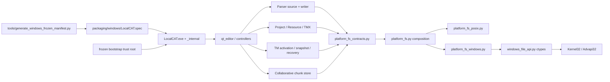
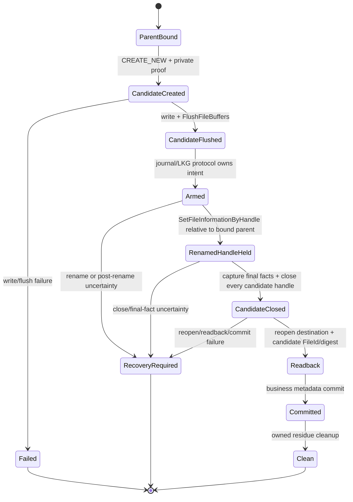
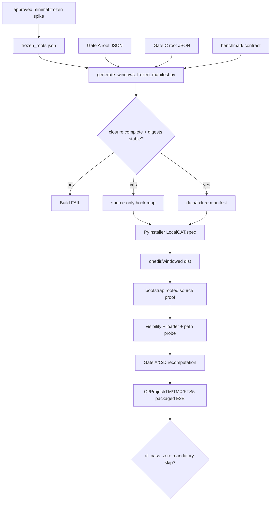

# Design Document

## Overview
本设计把 LocalCAT 现有 POSIX 文件 authority/lock/publish 语义提炼成一个共享平台能力边界，并新增 fail-closed Windows backend。Windows backend 使用文档化 Win32 handle API 固定 rooted ancestor、拒绝 reparse、比较 volume/file identity、执行跨进程锁和 handle-bound publish；上层 Parser、项目、资源、TM 和协作分工继续拥有各自业务状态机与稳定错误映射。

第二条交付线为 Windows frozen distribution：从能力 Gate roots 生成真实 `.py`/fixture closure，使用 PyInstaller `--onedir --windowed` 让安全关键模块从 bundle 内真实源码加载，显式收集 Qt/数据/资源，并在无仓库、非当前目录和干净用户配置下执行 packaged E2E。`research.md` 记录 API 证据与方案比较；本文固定拟议边界，但在三个 ADR 候选获人类批准前不授权实现。

### Goals
- 在 Windows 11 本地受支持文件系统上提供与现有 POSIX 合同等强的 rooted read/create、identity、lock、atomic publish、private storage proof 与 recovery 能力。
- 消除业务模块对 `fcntl`、`dir_fd`、`O_DIRECTORY`、`O_NOFOLLOW` 和 POSIX directory fsync 的直接依赖，同时保持 macOS/Linux 回归。
- 让 source 与 frozen LocalCAT 都能完成 Qt 启动、项目保存/重开、TM 激活/重启恢复、TMX 导入和 SQLite FTS5。
- 以可复现命令、完整日志和反例矩阵证明能力；禁止能力旁路、测试 skip 或现场修补。

### Non-Goals
- `--onefile`、安装器、自动更新、代码签名、商店分发或 Windows ARM64。
- 旧 Excel 交互适配器、`xlwings` 和 Microsoft Excel。
- 支持不能证明 FileId/reparse/ACL/durability 的 network share 或文件系统；首版对其 fail closed。
- 改变 TM 检索算法、项目业务 schema、Feature 5 UI 行为或既有 recovery state machine。
- 用 `Path.resolve()`、路径前缀、mock capability、Gate skip 或 frozen boolean 替代 handle/source proof。

## Boundary Commitments

### This Spec Owns
- `RootedFileSystem`、`BoundDirectoryPublisher`、`ProcessFileLock`、`PrivateStorageProof` 的跨平台合同和 composition factory。
- Windows 11 native handle implementation、支持 volume capability gate、Win32 error normalization 和平台专属反例 harness。
- 提供 POSIX adapter 参考实现和 parity contract；各 consumer 的现有 POSIX 原语迁移由其 owning Spec amendment 实施并提交可追踪 merge。
- 定义 Parser、collaborative chunk、项目/资源/TMX、TM activation/snapshot/attestation/recovery 的接入验收合同、amendment dispatch ledger 与最终合并证据，但不越权直接拥有相邻业务实现。
- Windows PyInstaller onedir/windowed build owner、generated frozen-source closure、bundle-root/resource contract 和 clean-machine release matrix。
- Windows `.ico` 与发行元数据。

### Out of Boundary
- Feature 5 matcher/retrieval/Gate A/C/D 的业务算法与 proof graph 内容；本 Spec 只保证其 source/fixture 在发行物中按既有合同可证明。
- Parser codec、ProjectPackage ZIP carrier、TM canonical SQLite authority、migration/recovery 业务决策；分别由相邻 Spec/ADR 拥有。
- macOS app bundle/launcher、Linux package format、Windows installer/signing/update。
- 扩大到 remote SMB、FAT/exFAT 或未经过完整反例矩阵的第三方文件系统。

### Allowed Dependencies
- Python 3.14 stdlib：`ctypes`、`os`、`pathlib`、`sqlite3`、`hashlib`、`json`、`tempfile`；Windows backend 不新增 runtime package。
- Windows desktop API：Kernel32/Advapi32 文档化函数；若反例迫使使用 `NtCreateFile`，必须返回 ADR 重新审批，不能在实现中临时切换。
- PySide6/Qt 与现有 `requirements-ui.txt`；PyInstaller 是独立 build dependency，不进入 UI runtime requirements。
- ADR-007/008/009/011/012/013/016/018/019 与相邻 Specs 的既有公共合同。
- 依赖方向固定为 `business modules -> platform_fs_contracts -> composed adapter -> OS API`；Windows API 模块不得被 Qt/业务模块直接导入。

### Revalidation Triggers
- `PlatformFileError` 稳定 code、identity tuple、handle profile、supported-volume 条件或 recovery success boundary 改变。
- ADR-013/016 的 private attestation representation、W3 建立的 frozen-source/bootstrap contract、ADR-011 的 Feature 5/UI composition contract 或 ADR-019 publish proof 改变。
- PyInstaller/PySide6/Qt/Python minor version升级，或 source closure/runtime layout 改变。
- 任一相邻模块重新引入直接 POSIX/Win32 primitive，或新增 capability-critical source/fixture。
- 从 onedir 改为 onefile、支持 remote share/其他文件系统、增加 installer/signing。

## Governance Impact
- **Applicable Steering**: `product.md`、`tech.md`、`structure.md`、`roadmap.md`、`spec-ownership.md`、`release-governance.md`、`project-principles.md`、`repository-safety.md`。
- **Applicable ADRs**: ADR-007、008、009、011、012、013、016、018、019。
- **ADR disposition**: **New candidates W1/W2/W3 — APPROVED_FOR_BASELINE_NAMING**；用户已批准临时标签作为本 Spec 基线引用，但尚未批准为正式 adopted ADR。详见 `research.md#governance-candidates`。W1/W2 改变实现边界与持久身份表示；W3 建立跨 Spec frozen distribution 长期所有权。
- **Scope amendment**: **Pending**；`windows-platform-enablement` 尚未记录于 `.kiro/steering/spec-ownership.md` 和 `.kiro/steering/roadmap.md`。
- **Steering sync**: Required；由 governance/steering owner 在获批后更新 `spec-ownership.md`、`roadmap.md`、必要时 `tech.md`/`structure.md`。本 feature branch 不自行修改 steering。
- **Downstream revalidation**: `feature5-ui-integration`、`qt-editor-json-mvp-increment`、`parser-subsystem-extraction`、`collaborative-job-chunks`、`multi-document-project-workspace`、`language-resource-portability`、`tmx-context-interchange`、`tm-storage-retrieval-index`，以及明确标为 revalidation-only 的 TM store/termbase/旧 Qt 基线。

### Implementation Authorization
**NO-GO**。设计文档和 provisional task schedule 可供审查，但以下证据全部记录前不得开始实现：
1. 已批准临时命名的 W1/W2/W3 由 Governance owner定型为正式 ADR，记录编号、批准 revision和相交/取代关系。
2. `windows-platform-enablement` owning scope 与相邻 Spec amendment 获批。
3. `cross-spec-amendments.md` 的 owner branch、R/D/T delta、合并顺序和 evidence gate 获批；缺少任一 required amendment merge 都阻塞对应实现簇。
4. design approval 写入 `spec.json`；生成文档本身不等于批准。

## Architecture

### Existing Architecture Analysis
- 业务层已经普遍使用“prepare → prove → publish → readback/commit → cleanup/recovery”，但 file primitives 被复制进多个超大模块。
- Parser 是所有 untrusted import 的 sealed-source owner，其 POSIX rooted contract 是最小可验证 vertical slice。
- `collaborative_chunk_store.py` 的顶层 `fcntl` 导入让任何 UI smoke 在 composition 前失败；需在第一 vertical slice 同时移除该 import dependency。
- TM activation reservation、device-local attestation 和 snapshot publish 将 lock、private access、identity 与 durability 组合在一起，必须在基础 primitive 通过后迁移。
- Capability host 对真实 source loader 的检查比普通 PyInstaller data inclusion 更强；打包需遵从而不是改弱。

### Architecture Pattern & Boundary Map



**Architecture Integration**:
- Selected pattern: Hexagonal ports/adapters around file authority, plus a separate build-time frozen manifest pipeline。
- Domain/feature boundaries: 平台层只拥有 handle/identity/lock/publish/private proof；业务层继续决定 state transitions、receipts 和 user errors。
- Existing patterns preserved: immutable dataclass contracts、stable code、fail-closed capability factory、candidate/journal/LKG、readback before commit、Gate recomputation。
- New components rationale: 集中 FFI、handle lifetime 与 proof；避免每个业务模块重复平台分支。
- Steering compliance: no hidden authority、no partial publish、platform-unavailable remains explicit、Windows source proof 不污染 macOS/Linux runtime。

### Technology Stack

| Layer | Choice / Version | Role in Feature | Notes |
|---|---|---|---|
| UI | PySide6/Qt 6.11.1 | Windows visible application and smoke | `qwindows.dll` at platform plugin path |
| Runtime | CPython 3.14 x64 | application/runtime FFI | Windows stdlib `ctypes` only |
| Platform I/O | Win32 Kernel32/Advapi32 | handle, FileId, lock, rename, flush, ACL | wrapper binds arg/restype and `use_last_error=True` |
| POSIX I/O | existing `os`/`fcntl` primitives | macOS/Linux adapter | `fcntl` import confined to POSIX module |
| Storage | stdlib SQLite + FTS5 | canonical TM authority/search | real create/query/reopen gate |
| Packaging | PyInstaller 6.22.x pinned build tool | onedir/windowed EXE | custom spec + generated hook/manifest |
| Verification | `unittest`, subprocess/PowerShell harness | contract, adversarial, crash, packaged E2E | no platform safety skips in Windows release lane |

## File Structure Plan

### Added Files

```text
platform_fs_contracts.py                 # opaque authority/identity/lock/publish contracts and stable low-level errors
platform_fs.py                           # adapter composition; returns only validated backend capability
platform_fs_posix.py                     # current dirfd/flock/fsync behavior, moved without semantic change
platform_fs_windows.py                   # Windows rooted walk, handle profiles, locks, publish and ACL proof
windows_file_api.py                      # ctypes declarations/constants/structures/error conversion only
frozen_source_manifest.py                # deterministic manifest schema/parser/runtime bundle-root checks
frozen_source_bootstrap.py               # sole embedded bootstrap; direct native bundle binding before external source import
packaging/windows/
├── LocalCAT.spec                        # onedir/windowed, icon/version, data/source collection
├── frozen_roots.json                    # owner roots/assets; Gate graphs are resolved transitively, not copied by hand
├── LocalCAT.ico                         # version-controlled Windows icon
├── version_info.txt                     # Windows product/version metadata
└── hooks/
    └── hook-capability_host.py           # generated source-only module_collection_mode map consumer
tools/generate_windows_frozen_manifest.py # validates and emits deterministic closure/build hook
tools/validate_windows_release.py          # packaged visibility, loader, Qt, FTS5 and business E2E orchestrator
tests/test_platform_fs_contracts.py
tests/test_platform_fs_windows.py
tests/test_platform_fs_windows_process.py
tests/test_windows_release_manifest.py
tests/test_windows_frozen_e2e.py
```

`frozen_roots.json` 只列长期 owner roots 与 data/assets；生成器解析 `feature5_gate_a_v1.json`、`retrieval_gate_c_roots_v1.json`、`benchmark_tm_contract.json` 及它们引用的 vectors/source closure。生成 output 位于 build work directory，不作为手写第二真相源提交。

### Modified Files by Migration Cluster
- **Amendment Cluster 1 — startup/rooted**: `parser_source.py`、`collaborative_chunk_store.py`、`qt_editor.py`；由 Parser/Chunk/Qt owners 接入 platform factory，删除业务顶层 POSIX import。
- **Amendment Cluster 2 — project/resource**: `project_package.py`、`project_workspace_intake.py`、`workspace_state.py`、`resource_artifact_save.py`、`resource_package.py`、`resource_importer.py`、`resource_portability.py`、`resource_receipt_ledger.py`、`resource_repository.py`、`termbase_store.py`、`tmx_artifact_save.py`；由 Project/Resource/TMX/Termbase owners 迁移本地 dirfd helper。
- **Amendment Cluster 3 — TM**: `tm_migration.py`、`tm_content_attestation.py`、`tm_snapshot_artifacts.py`、`tm_snapshot_recovery.py`、`tm_activation_journal.py`、`tm_activation_recovery.py`、`tm_stage_sealer.py`、`tm_schema_upgrade.py`、`tm_sqlite_store.py`、`tm_benchmark*.py` 及直接 identity/fsync consumers；由 Feature 5/Core/Integration owners 交付。
- **Amendment Cluster 4 — frozen resource paths**: `capability_host.py`（消费 `TrustedSourceAuthority`，不得再以 `Path.resolve/lstat/O_NOFOLLOW=0` 证明 Windows source）、`qt_editor.py`、`qt_speaker_avatar.py` 和直接以 checkout/CWD 解析数据的模块；由 Feature 5/Qt owners amendment，Windows Spec 拥有 bootstrap/build composition。
- **Tests**: owning amendments 移除仅因 POSIX implementation 的 skip并交付 fresh evidence；Windows release matrix 对 mandatory cases 将 skip 判为 failure。
- **Requirements/build docs**: 新增独立 `requirements-build-windows.txt` 或受治理的锁定 build command；不把 PyInstaller/xlwings 加入 `requirements-ui.txt`。

## Core Contracts

### Value Objects

```python
@dataclass(frozen=True, slots=True)
class FileObjectIdentity:
    platform: Literal["posix", "windows"]
    volume_id: bytes          # POSIX dev or Windows volume serial, canonical bytes
    file_id: bytes            # POSIX inode or Windows FILE_ID_128, canonical bytes
    kind: Literal["directory", "regular"]
    link_count: int

@dataclass(frozen=True, slots=True)
class EntrySnapshot:
    identity: FileObjectIdentity
    byte_count: int
    modified_token: bytes
    reparse_free: bool

@dataclass(frozen=True, slots=True)
class PersistentFileReceipt:
    schema: int
    content_sha256: bytes
    byte_count: int
    owner_phase: str
    generation: str
    private_proof_digest: bytes
    device_secret_mac: bytes

class PlatformFileError(RuntimeError):
    code: str
    retryable: bool
```

- `FileObjectIdentity` 只比较同时存活、已验证 handles 是否指向同一对象；它不是跨重启 receipt，也不是 globally permanent UUID。Windows FileId 在删除后可复用，持久状态不得单独保存/信任该 tuple。
- Windows `file_id` 必须来自 `FILE_ID_INFO`，不得从 pathname hash 或 64-bit `nFileIndex*` 降级。
- `modified_token` 仅用于 stale detection；authority 仍由 open handle + identity + content proof 组成。
- `PersistentFileReceipt` 的字段/编码由 W2 与 owning business Spec 固定；恢复时必须重新打开当前对象并同时验证 exact bytes/digest、phase/generation、private proof 与 device-secret MAC。历史 FileId 只能是诊断或反例输入，不能单独铸造 authority。

### Service Interfaces

```python
class RootedFileSystem(Protocol):
    def bind_root(self, root: Path) -> RootedDirectoryAuthority: ...
    def open_regular(self, root: RootedDirectoryAuthority, relative: PurePath) -> BoundRegularFile: ...
    def bind_parent(self, root: RootedDirectoryAuthority, relative: PurePath) -> BoundDirectoryAuthority: ...

class BoundDirectoryAuthority(Protocol):
    def reprove(self) -> None: ...
    def inspect_entry(self, name: str) -> EntrySnapshot | None: ...
    def create_candidate(self, name: str, *, private: bool) -> CandidateFile: ...
    def publish_candidate(self, candidate: CandidateFile, destination: str, *, mode: PublishMode, lease: LockLease | None) -> PublishFacts: ...
    def unlink_owned(self, name: str, expected: FileObjectIdentity) -> None: ...

class CandidateFile(Protocol):
    def write_all(self, payload: bytes) -> None: ...
    def flush_content(self) -> None: ...
    def identity(self) -> FileObjectIdentity: ...

class ProcessFileLock(Protocol):
    def acquire(self, parent: BoundDirectoryAuthority, name: str, payload: bytes, policy: LockPolicy) -> LockLease: ...

class PrivateStorageProof(Protocol):
    def create_private_directory(self, parent: BoundDirectoryAuthority, name: str) -> BoundDirectoryAuthority: ...
    def prove_private(self, authority: BoundDirectoryAuthority | BoundRegularFile) -> PrivateAccessEvidence: ...
```

**Invariants**:
- 所有 authority objects 都是 context-managed、不可序列化、关闭后不可复用。
- 上层不能取得 raw Windows HANDLE/dirfd；tests 通过专用 fault seam，而不是调用内部 API。
- factory 只在 backend self-probe/contract gate 成功后返回 capability object；不存在“布尔值为 true 即可信”。
- 所有 relative names 拒绝空值、`.`、`..`、separator、NUL；Windows 另拒绝 ADS/device namespace、ambiguous trailing dot/space 和 reserved device forms。
- `PublishMode` 只有 `CREATE_IF_ABSENT` 与 `REPLACE_UNDER_LOCK`。平台层提供 handle-bound naming facts，不提供 expected-target 原子 CAS；replace 的 stale/concurrency 语义由持有同一 resource-family 排他 lease 的 business journal/LKG owner 决定。

## Windows Native Adapter

### Supported Host Gate
首版 capability 仅在以下事实全部成立时 mint：Windows 11 desktop、CPython x64、local fixed **NTFS** volume、`FILE_ID_INFO`/reparse/ACL/handle-relative rename/LockFileEx 可用，且 W1 的真实 power-cut/reboot durability lane 已批准该主机/volume policy。ReFS 只有在取得独立同等矩阵和 ADR amendment 后进入支持范围。UNC、remote、ReFS（首版）、FAT/exFAT、缺少 security descriptor support 或 probe 失败均返回 `PLATFORM.FS.CAPABILITY_UNAVAILABLE`，由业务映射既有 safe code。

### Handle Profiles

| Profile | Desired access | Share mode | Flags | Lifetime / Purpose |
|---|---|---|---|---|
| ROOT / INTERMEDIATE | list/read attributes/synchronize | **仅 READ；无 WRITE/DELETE** | BACKUP_SEMANTICS + OPEN_REPARSE_POINT | 全 rooted operation；拒绝 writable/rename handle 并固定 ancestor |
| SOURCE | generic read + read attributes | READ，**无 WRITE/DELETE** | OPEN_REPARSE_POINT + SEQUENTIAL_SCAN | sealed copy；阻止并发 overwrite/rename |
| ENTRY_PROBE | read attributes/synchronize | READ + WRITE + DELETE | OPEN_REPARSE_POINT | 仅提供观察事实；commit 前关闭，不构成 CAS |
| CANDIDATE | read + write + delete + synchronize | none | CREATE_NEW + OPEN_REPARSE_POINT + WRITE_THROUGH | 写/flush/handle-relative rename 全程同一 handle |
| LOCK | read + write + synchronize | READ + WRITE，**无 DELETE** | OPEN_REPARSE_POINT | persistent lock file + `LockFileEx` |

具体 access mask 由 ADR W1 固定；实现不得以“修复 sharing violation”为由随意增加 share bits。

### Rooted Open Flow

```mermaid
sequenceDiagram
    participant C as Caller
    participant W as WindowsRootedFS
    participant K as Kernel32

    C->>W: bind_root(absolute local path)
    W->>K: CreateFileW(root, ROOT profile)
    K-->>W: root HANDLE
    W->>K: FileAttributeTagInfo + FileIdInfo + FinalPath
    W->>W: reject reparse / unsupported volume
    loop each intermediate component
        W->>K: CreateFileW(cumulative path, INTERMEDIATE profile)
        K-->>W: retained directory HANDLE
        W->>W: reject reparse; compare final path/volume; retain no-delete-share
    end
    W->>K: CreateFileW(final component, SOURCE profile)
    K-->>W: regular-file HANDLE
    W->>W: reject reparse/nonregular; capture FileId
    W-->>C: BoundRegularFile (handle only)
```

祖先 handle 关闭顺序从叶到根；任何检查失败先关闭全部 handles，再映射 safe code。content 只从 final file handle 读取；路径检查失败前不得读取正文。

### Atomic Publish Flow



- `publish_candidate` receives the still-open candidate handle and bound destination parent; source path is never reopened。
- `CREATE_IF_ABSENT` 使用 replace=false；`REPLACE_UNDER_LOCK` 要求 owner 已持有覆盖 destination family 的排他 `LockLease`，锁内 target snapshot 只是 stale/recovery 事实，不是 OS-level expected-ID CAS。未持 lease 的 replace 请求 fail closed。
- candidate share=none，因此 rename 后先 capture candidate/final facts，再关闭所有 candidate handles，之后才允许 reopen destination；close 前 reopen 必须在测试中得到 sharing violation，不能靠扩大 share mask 隐藏生命周期错误。
- 协作进程受同一 lease 协议排除；不合作的同用户进程仍可能在 snapshot 与 rename 间改写。需要抵抗此威胁的 owner 必须使用 immutable generation + journal/pointer commit；平台层不得宣称已执行 expected-target CAS。post-readback 不一致进入 `RECOVERY_REQUIRED`。
- Success requires content flush、handle-relative rename、candidate close、readback、owner state-machine commit，以及 W1 对本地 NTFS 定义并由 power-cut lane 证明的 naming success boundary。
- API ambiguous/failure states不由 platform adapter 擅自删除；adapter returns facts，现有 journal/LKG owner 分类 recovery。

### Lock Flow
- persistent lock file 使用 deterministic basename、private proof、single-link、identity payload；文件从不 unlink/replace。
- bootstrap serialization 与 long-lived resource lock 使用不同 byte ranges 或不同 lock objects，防止一个 active resource 阻塞同目录其他资源初始化。
- `LockFileEx` 默认阻塞/timeout policy 由 caller contract 给出；release 先 `UnlockFileEx` 后 close，进程终止依赖 OS eventual unlock。
- acquire/reprove 同时比较 open handle identity、entry identity、payload 和 parent authority。

### Private Storage Proof
- W2 的拟议主体是进程 primary token 的 `TokenUser` SID；以 SID bytes 比较，不以账户显示名比较。创建时显式把 owner 设为该 SID。standard 与 UAC elevated token 必须解析为同一用户 SID；domain/AzureAD 用户同样只按 SID 处理；service/AppContainer/impersonation token 首版 `CAPABILITY_UNAVAILABLE`。
- 拟议 DACL 为 protected、无继承、canonical order，只允许 TokenUser、SYSTEM 与 BUILTIN Administrators 的精确 allow ACE mask；TokenUser 对该对象拥有 required full control，SYSTEM/Administrators 仅保留 W2 列出的维护权限。任一未知 allow principal、额外 write/delete 权限、继承 ACE、未知 object-specific ACE 或 owner 不匹配均拒绝，不进行“看起来够私有”的宽松接受。
- reprove 使用 handle-bound `GetSecurityInfo` 并验证 owner SID、canonical/protected DACL、ACE type/order/mask、link count、reparse-free、live-handle identity 与 volume；需要 `AccessCheck` 的语义、generic-right mapping 和 token 类型由 W2 固定。
- standard、elevated、local、domain/AzureAD、继承/显式 ACE、未知 principal 和 ACL tamper 矩阵是 W2 approval/implementation gate。
- 该表示在 W2 ADR 批准前仅是候选；不得把 `os.chmod(0o600)` 结果作为 Windows pass。

## POSIX Adapter
- 把现有 `openat/dir_fd/O_NOFOLLOW/O_DIRECTORY/pread/flock/fsync(directory)` 迁入 adapter，不改 success/failure behavior。
- 先用 characterization tests 固定 Parser、chunk、project、TM 的 error/receipt/recovery 输出；迁移后运行相同 tests。
- 平台合同允许 POSIX `(st_dev, st_ino)` 与 Windows `(volume serial, FILE_ID_128)` 采用不同物理表示，但业务只比较 opaque `FileObjectIdentity`。

## Consumer Integration

| Consumer | Integration | Existing Contract Preserved | Windows Proof |
|---|---|---|---|
| Parser source | `open_rooted_regular_file` delegates to adapter | sealed copy、stale/error/body-safe | ancestor handles + source handle/FileId |
| Parser atomic writer | prepared write uses bound publisher | candidate/replace/readback | candidate handle rename + digest/FileId |
| Collaborative chunk | injected lock/publisher; no top-level fcntl | journal/LKG/recovery codes | LockFileEx + bound parent |
| Project/Resource/TMX | replace local `_bind_parent` helpers | deterministic carrier/receipt/atomic save | shared adapter + hostile path matrix |
| TM activation | reservation injected from lock service | single authority/bootstrap serialization | persistent private lock + crash release |
| TM attestation | platform private proof/identity | device-local fail-closed re-attest | SID/DACL + live Volume/FileId + digest/phase/device-secret receipt |
| TM snapshot/recovery | bound publisher and opaque identities | seal/generation/LKG/recovery | handle-bound publish/reprove |
| Qt composition | platform factory constructed before controller graph | exact-only/capability fail-closed | no unsupported import; diagnostic code |

## Frozen Distribution Design

### Bootstrap Trust Root
- frozen launcher 内只嵌入一个最小 `frozen_source_bootstrap` trust root；它使用直接绑定的 Win32 declarations 打开 bundle root/manifest/source/fixture handles，不导入待验证的 `platform_fs_windows.py`、`capability_host.py` 或外置关键源码，因此不存在“先信任 adapter 再用 adapter 证明自身”的循环。
- build 将 canonical manifest digest 和 bootstrap schema 固定进 executable-side bootstrap；runtime 先证明 bundle ancestor/final 均非 reparse、live-handle containment、manifest exact digest，再以 handle 读取/验证外置 `.py` 与 fixture，mint 不可序列化的 `TrustedSourceAuthority`。
- `capability_host` 只有收到该 authority 后才可导入/验证 `SourceFileLoader`、`spec.origin`、`co_filename` 与 Gate closure。Windows 路径不再把 `Path.resolve()`、`lstat()`、`st_dev/st_ino` 或 `O_NOFOLLOW=0` 当 source authority。
- bootstrap 本身是 W3 明示的发行 trust root，不宣称在运行时自证；其源、生成输入、executable hash 与 manifest digest 由 build/release evidence 绑定。改变 bootstrap、manifest schema 或 embedded digest composition 必须重新走 W3 trigger。

### Early Frozen Feasibility Spike
- W3 获批后的第一个实现证据是最小 onedir/windowed spike，版本固定为 CPython 3.14.x + PyInstaller 6.22.x；只验证 bootstrap、一个外置 critical module 和一个 fixture。
- spike 必须证明 `type(loader) is SourceFileLoader`、`__file__ == spec.origin == loader.path`、`co_filename` 指向同一 bundle `.py`、无 PYZ duplicate、非 repository CWD 启动以及 reparse/swap/manifest tamper fail closed。
- 任何断言失败立即返回 W3 重新设计；不得把该可行性风险拖到完整 UI/TM 打包后处理。

### Build Flow



### Manifest Contract
- Deterministic canonical JSON，记录 schema、repository commit、root reason、relative path、kind、SHA-256；排序按 UTF-8 relative path。
- Source closure至少包含 capability host、Gate validator/runtime graphs 和 manifest 所引用 modules；dynamic imports 由 owner roots 显式声明。
- 关键 modules 使用 PyInstaller documented `module_collection_mode='py'`，并从 PYZ collection 排除；post-build probe 断言 `type(loader) is SourceFileLoader`、`__file__ == spec.origin == loader.path` resolved path。
- data/resources 保持源码期望 relative layout；runtime bundle root 来自 bootstrap 持有的 `TrustedSourceAuthority`，不得仅由待验证 module `__file__`、CWD 或 repository absolute path 推断。
- build manifest 与 dist visibility report 写入 release evidence；dist 不允许未声明的 duplicate critical source。

### Packaged Assets
- Mandatory: `tm.jsonl`、`terms.csv`、`LocalCAT-logo-silver.png`、`benchmark_tm_contract.json`、Gate A/C JSON/TXT closure、critical `.py`、`qwindows.dll`、实际使用 Qt plugins、`.ico`、version metadata。
- EXE 从非仓库目录启动，环境清除 `PYTHONPATH`/Qt developer paths；运行时 evidence 断言未读取 source checkout。

## Error Handling

### Platform Error Family（W1 ADR 待批）

| Platform code | Meaning | Retryable | Example business mapping |
|---|---|---:|---|
| `PLATFORM.FS.CAPABILITY_UNAVAILABLE` | host/volume/backend proof absent | false | `PARSER.SOURCE.ROOT_BINDING_UNAVAILABLE` |
| `PLATFORM.FS.OUTSIDE_ROOT` | invalid relative path/final containment | false | existing outside-root/unsafe code |
| `PLATFORM.FS.REPARSE_REJECTED` | reparse component/final entry | false | NOT_REGULAR / SOURCE_UNSAFE |
| `PLATFORM.FS.IDENTITY_STALE` | FileId/final path/parent mismatch | true | destination/source stale |
| `PLATFORM.FS.LOCK_CONTENDED` | known other owner holds range | true | existing authority/busy result |
| `PLATFORM.FS.LOCK_UNAVAILABLE` | lock identity/API proof failure | false/true by fact | initial authority unavailable |
| `PLATFORM.FS.PRIVATE_STORAGE_UNPROVEN` | owner/DACL/link proof fails | false | attestation unavailable |
| `PLATFORM.FS.DURABILITY_UNAVAILABLE` | pre-arm volume/success-boundary proof absent | false | save/activation unavailable |
| `PLATFORM.FS.PUBLISH_FAILED` | failure before naming outcome is ambiguous | true | existing save/export failure |
| `PLATFORM.FS.RECOVERY_REQUIRED` | post-arm outcome needs owner recovery | true | existing recovery-required code |

- Low-level Win32 error numbers只进入 diagnostic log，不直接成为 public business code。
- path/content 不进入 body-safe errors；日志按既有 redaction rules 记录 operation id、profile、Win32 code 和 phase。
- 未识别的 FFI/API state 默认 `CAPABILITY_UNAVAILABLE` 或 `RECOVERY_REQUIRED`，不 fallback 普通路径 I/O。

## Requirements Traceability

| Requirement | Summary | Components | Interfaces | Flows |
|---|---|---|---|---|
| 1.1-1.5 | capability discovery/fail closed/parity | composition, both adapters, Qt | factory, PlatformFileError | startup gate |
| 2.1-2.6 | rooted identity/reparse/containment | Windows adapter, API wrapper, Parser | RootedFileSystem, FileObjectIdentity | Rooted Open |
| 3.1-3.5 | cross-process lock/reservation | lock adapter, chunk, TM migration | ProcessFileLock, LockLease | Lock Flow |
| 4.1-4.5 | atomic publish/durability/recovery | publisher, business journals/LKG | BoundDirectoryAuthority, CandidateFile | Atomic Publish |
| 5.1-5.4 | shared boundary/consumer parity | migration clusters | platform contracts | Consumer Integration |
| 6.1-6.5 | dependency/Qt startup/avatar regression | Qt composition, avatar catalog, release validator | build/runtime smoke | Build + E2E |
| 7.1-7.4 | project save/reopen | project package/workspace | publisher + project receipts | project vertical slice |
| 8.1-8.6 | TM activation/restart/unique authority | migration, lock, attestation, recovery | lock/private/identity | TM vertical slice |
| 9.1-9.5 | TMX/FTS5 | Parser, resource importer, SQLite store | rooted source + canonical store | packaged E2E |
| 10.1-10.6 | frozen-source proof | manifest generator, bootstrap, hook, capability host | TrustedSourceAuthority, FrozenSourceManifest | Build Flow |
| 11.1-11.5 | onedir/windowed/assets | PyInstaller spec, Qt/resources | bundle-root resolver | Build Flow |
| 12.1-12.5 | release matrix/evidence | release validator, CI lanes | evidence schema/commands | final release gate |

## Testing Strategy

### Contract / Unit Tests
- exact type/value validation、closed-handle behavior、name grammar、error normalization、adapter factory fail closed。
- Win32 structure sizes、function signatures、last-error capture、handle close on every failure path。
- deterministic frozen manifest ordering/digest、missing/dynamic root rejection、duplicate source rejection。
- business error mapping preserves Parser/Project/TM/Chunk public codes。

### Windows Adversarial Integration Tests
- symlink、junction、mount reparse、ancestor swap、final swap、hardlink/single-link、ADS/device path、case/trailing-dot/reserved-name。
- open handle share matrix：read/write/delete/rename；candidate handle publish不自阻塞。
- two-process LockFileEx contention、timeout、normal release、TerminateProcess 后 eventual release、payload/FileId tamper。
- fault injection at create/write/flush/arm/rename/candidate-close/reopen/readback/commit/cleanup；覆盖同进程 self-sharing block、协作 writer lease、instruction-boundary uncooperative target swap；只产生 old/new valid authority 或 recovery-required，且不宣称 expected-ID CAS。
- SID/DACL/owner/inheritance/link/volume/FileId reuse/recreation tamper 与 cross-restart digest/phase/private/device-secret re-attestation；覆盖 standard/elevated/local/domain/AzureAD token。
- 独立 disposable VM/VHD 或批准的物理 lab 在 content flush、rename、journal/metadata commit 各边界执行真实 forced power-off/reboot；重启后只能得到 old、new 或 recovery-only。仅 process kill/fault seam 不能把 durability 标为 VERIFIED；未运行或不支持的 volume 返回 `DURABILITY_UNAVAILABLE`。

### Consumer Integration Tests
- Parser read/write + body-safe failure；全部原 POSIX-only rooted matrix在 Windows backend 运行。
- collaborative controller import/startup、publish/recover；不得再有业务顶层 `fcntl`。
- project save/reopen、deterministic package export/import/recovery；resource/TMX import/export。
- TM initial activation、two-process race、kill boundary、restart recovery、device-local re-attest、snapshot/upgrade。
- SQLite FTS5/trigram create/query/order、close/reopen query、missing-capability failure。

### Frozen E2E / Release Gate
- 治理后先完成最小 frozen feasibility spike；失败立即回到 W3，不进入完整打包。
- clean CPython build venv 从锁定 build requirements构建 onedir/windowed。
- dist inventory、checksum、raw `.py` loader identity、fixture/data/Qt plugin/ico/version metadata。
- 从非 repository CWD 和 clean user data 启动真实 visible Windows Qt window。
- EXE 完成项目 save/reopen、TM activation/restart recovery、TMX import、FTS5、Gate A/C/D、concurrency/recovery。
- 同一 commit 的 macOS/Linux full regression；mandatory test 任一 skip、source-only pass 或缺日志 => NOT_VERIFIED。

### Release Evidence Schema
- commit/branch、OS build、Python/PySide6/Qt/PyInstaller/SQLite versions、filesystem/volume facts。
- exact PowerShell commands、exit codes、stdout/stderr/log paths、SHA-256 inventory；文件系统日志含 native handle profile、volume/file-system、live FileId comparison、final path、reparse verdict、share flags、LockFileEx range、flush/rename/close/reopen phase、recovery result与稳定 code，不记录正文或私有绝对路径。
- baseline-to-candidate PASS/FAIL matrix、Windows FS/lock checklist、frozen-source/packaging checklist。
- portable evidence 写入仓库相对 `artifacts/windows/<commit>/<run-id>/`（或获批 CI artifact key）并生成 manifest/checksum；本机绝对路径不是合同身份。power-cut lane 另记录 VM image/build、snapshot boundary、power action 和 reboot recovery facts。
- evidence output 是 artifact，不修改 capability result；任何现场 patch 令该 run 无效。
