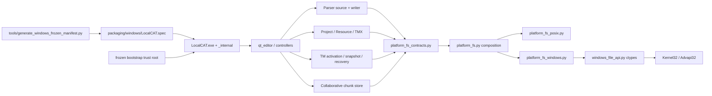
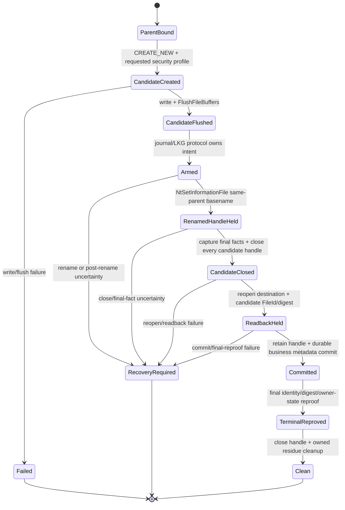
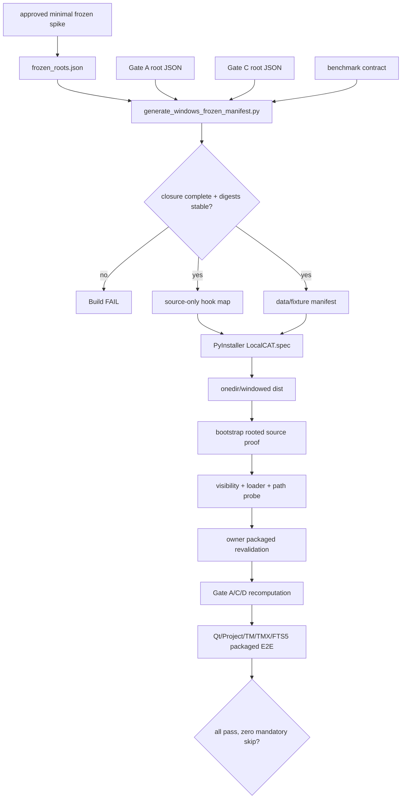

# Design Document

## Overview
本设计把 LocalCAT 现有 POSIX 文件 authority/lock/publish 语义提炼成一个共享平台能力边界，并新增 fail-closed Windows backend。Windows backend 使用文档化 Win32 handle API 固定 rooted ancestor、拒绝 reparse、比较 volume/file identity、执行跨进程锁和 handle-bound publish；上层 Parser、项目、资源、TM 和协作分工继续拥有各自业务状态机与稳定错误映射。

第二条交付线为 Windows frozen distribution：从能力 Gate roots 生成真实 `.py`/fixture closure，使用 PyInstaller `--onedir --windowed` 让安全关键模块从 bundle 内真实源码加载，显式收集 Qt/数据/资源，并在无仓库、非当前目录和干净用户配置下执行 packaged E2E。`research.md` 记录 API 证据与方案比较；本文按已采纳ADR-020～025固定活动边界，实施授权仍由Tasks依赖控制。

### Goals
- 在 Windows 11 本地受支持文件系统上提供与现有 POSIX 合同等强的 rooted read/create、identity、lock、atomic publish、private storage proof 与 recovery 能力。
- 消除业务模块对 `fcntl`、`dir_fd`、`O_DIRECTORY`、`O_NOFOLLOW` 和 POSIX directory fsync 的直接依赖，同时保持 macOS/Linux 回归。
- 让 source 与 frozen LocalCAT 都能完成 Qt 启动、项目保存/重开、TM 激活/重启恢复、TMX 导入和 SQLite FTS5。
- 在 frozen release闭合前提供明确标记的user-managed source runtime里程碑；轻量Windows入口只启动已验证的外部`pythonw.exe`与source bootstrap，不成为第二发行权威。
- 以可复现命令、完整日志和反例矩阵证明能力；禁止能力旁路、测试 skip 或现场修补。

### Non-Goals
- `--onefile`、安装器、自动更新、代码签名、商店分发或 Windows ARM64。
- 旧 Excel 交互适配器、`xlwings` 和 Microsoft Excel。
- 支持不能证明 FileId/reparse/ACL/`WindowsDocumentedPublishV1`前置的 network share 或文件系统；首版对其 fail closed。storage controller/cache/power-protection资格和突然断电硬件认证不属于当前产品声明。
- 改变 TM 检索算法、项目业务 schema、Feature 5 UI 行为或既有 recovery state machine。
- 用 `Path.resolve()`、路径前缀、mock capability、Gate skip 或 frozen boolean 替代 handle/source proof。

## Boundary Commitments

### This Spec Owns
- `RootedFileSystem`、`MutableFileReservationService`、`OwnedNamespaceRetirement`、`BoundDirectoryPublisher`、`ExistingFileDurability`、`ProcessFileLock`、`ExistingProcessFileLock`、`PrivateStorageProof` 的跨平台合同和 composition factory。
- ADR-027 的可选 `OutputArtifactLockRetirement` 合同及 Windows 实现；仅重新认证和回收获批输出族的闲置控制载体，不判断业务 receipt、journal 或恢复结果。
- Windows 11 native handle implementation、支持 volume capability gate、Win32 error normalization 和平台专属反例 harness。
- 提供 POSIX adapter 参考实现和 parity contract；各 consumer 的现有 POSIX 原语迁移由其 owning Spec amendment 实施并提交可追踪 merge。
- 定义 Parser、collaborative chunk、项目/资源/TMX、TM activation/snapshot/attestation/recovery 的接入验收合同、amendment dispatch ledger 与最终合并证据，但不越权直接拥有相邻业务实现。
- Windows PyInstaller onedir/windowed build owner、generated frozen-source closure、bundle-root/resource contract 和 clean-machine release matrix。
- user-managed source runtime 的轻量 Windows GUI入口、环境失效诊断与非发行状态标识；Python/venv/source仍由用户安装并管理。
- Windows `.ico` 与发行元数据。

### Out of Boundary
- Feature 5 matcher/retrieval/Gate A/C/D 的业务算法与 proof graph 内容；本 Spec 只保证其 source/fixture 在发行物中按既有合同可证明。
- Parser codec、ProjectPackage ZIP carrier、TM canonical SQLite authority、migration/recovery 业务决策；分别由相邻 Spec/ADR 拥有。
- macOS app bundle/launcher、Linux package format、Windows installer/signing/update。
- 扩大到 remote SMB、FAT/exFAT 或未经过完整反例矩阵的第三方文件系统。

### Allowed Dependencies
- frozen 应用按 ADR-022 的 KnownDLL/System32 信任使用经审计的系统 API 入口与解析策略。
- Python 3.14 stdlib：`ctypes`、`os`、`pathlib`、`sqlite3`、`hashlib`、`json`、`tempfile`；Windows backend 不新增 runtime package。
- Windows desktop API：Kernel32/Advapi32 文档化函数；若反例迫使使用 `NtCreateFile`，必须返回 ADR 重新审批，不能在实现中临时切换。
- PySide6/Qt 与现有 `requirements-ui.txt`；PyInstaller 是独立 build dependency，不进入 UI runtime requirements。
- ADR-007/008/009/011/012/013/016/018/019 与相邻 Specs 的既有公共合同。
- 依赖方向固定为 `business modules -> platform_fs_contracts -> composed adapter -> OS API`；Windows API 模块不得被 Qt/业务模块直接导入。

### Revalidation Triggers
- `PlatformFileError` 稳定 code、identity tuple、handle profile、supported-volume 条件或 recovery success boundary 改变。
- ADR-013/016 的 private attestation representation、W3 建立的 frozen-source/bootstrap contract、ADR-011 的 Feature 5/UI composition contract 或 ADR-019 publish proof 改变。
- PyInstaller/PySide6/Qt/Python minor version升级，或 source closure/runtime layout 改变。
- 任一相邻模块重新引入直接 POSIX/Win32 primitive，或新增 capability-critical source/fixture。
- 从 onedir 改为 onefile、支持 remote share/其他文件系统、增加 installer/signing。

## Governance Impact
- **Applicable Steering**: `product.md`、`tech.md`、`structure.md`、`roadmap.md`、`spec-ownership.md`、`release-governance.md`、`project-principles.md`、`repository-safety.md`。
- **Applicable ADRs**: ADR-007、008、009、011、012、013、016、018、019，以及已采纳的 ADR-020/W1、ADR-021/W2、ADR-022/W3、ADR-023 补充决策、ADR-024 provider-agnostic token profile、ADR-025 documented publish 分层、ADR-026 Parser 无状态发布与 ADR-027 输出锁收尾。
- **ADR disposition**: **ADR-020～027 adopted；implementation 按 task graph 授权**。ADR-023 的 LOCK-first、`PendingPublication`、MIC/security profile 与动态 native closure 继续有效。ADR-024 取代 local/domain/Entra mandatory 主体环境，ADR-025 取代 runtime durability registry/硬断电资格门，ADR-026 收窄 Parser journal/LKG，ADR-027 收窄输出锁收尾；native entry、source/fixture authority、clean build 与 packaged E2E 保留。
- **Scope amendment**: **Approved**；`windows-platform-enablement` 只拥有共享平台合同/backends、bootstrap/build、amendment merge ledger 与 Windows release evidence；consumer business invariants 继续归相邻 owning Specs。`tmx-context-interchange` 是唯一 owning Spec，`ui-mvp` 只记录其 amendment 提交血缘；Qt avatar 仅作 Windows 功能回归。
- **Steering sync**: Approved；Governance owner 同步 `spec-ownership.md`、`roadmap.md` 和长期技术边界；`structure.md` 等待真实 runtime/build 文件落地后再按实际结构更新。本 feature branch 不产生重复 Steering 提交。
- **Downstream revalidation**: `feature5-ui-integration`、`qt-editor-json-mvp-increment`、`parser-subsystem-extraction`、`collaborative-job-chunks`、`multi-document-project-workspace`、`language-resource-portability`、`tmx-context-interchange`、`tm-storage-retrieval-index`，以及明确标为 revalidation-only 的 TM store/termbase/旧 Qt 基线。

### ADR-027 输出锁收尾修订
- **Scope amendment**：已批准；仅取代 ADR-020 决策 7、ADR-023 决策 1 在 Windows ResourcePackage/TMX 输出 owner 已终结时的永久载体限制。普通持锁、初始化、安全 profile、业务发布/恢复、POSIX 和 frozen 信任启动不变。
- **Steering sync**：由 Governance owner 在治理分支闭合 ADR-027、ADR 索引及 ADR-020/023 取代关系元数据，再由本分支继承；不重复修改长期层级规则。
- **Downstream revalidation**：平台 Task 3.3a 交付可选能力；`language-resource-portability` Task 3.3a 与 `tmx-context-interchange` Task 3.4b 分别验证自身终结条件和原始异常语义。三项通过独立评审前不得标记该修订完成。

### Implementation Authorization
**GO for staged implementation**。ADR-020～026、Windows owning scope、WA-01～08 current R/D/T request、ledger/dependency authority与独立对抗性设计评审均已闭合；ADR-024/025活动合同同步由Task 0.6记录，ADR-026的Parser收窄由Task 0.7记录。本授权只允许按Tasks依赖逐簇实现；任一required amendment尚未形成commit/merge/evidence时，仍阻塞其对应consumer cluster和最终EXE gate，且任何新跨门槛事实必须返回ADR/Spec治理。

## Architecture

### Existing Architecture Analysis
- 业务层已经普遍使用“prepare → prove → publish → readback/commit → cleanup/recovery”，但 file primitives 被复制进多个超大模块。
- Parser 是所有 untrusted import 的 sealed-source owner，其 POSIX rooted contract 是最小可验证 vertical slice。
- `collaborative_chunk_store.py` 的顶层 `fcntl` 导入让任何 UI smoke 在 composition 前失败；需在第一 vertical slice 同时移除该 import dependency。
- TM activation reservation、device-local attestation 和 snapshot publish 将 lock、private access、identity 与 durability 组合在一起，必须在基础 primitive 通过后迁移。
- Capability host 对真实 source loader 的检查比普通 PyInstaller data inclusion 更强；打包需遵从而不是改弱。

### Architecture Pattern & Boundary Map



**Architecture Integration**:
- Selected pattern: Hexagonal ports/adapters around file authority, plus a separate build-time frozen manifest pipeline。
- Domain/feature boundaries: 平台层只拥有 handle/identity/lock/publish/private proof；业务层继续决定 state transitions、receipts 和 user errors。
- Existing patterns preserved: immutable dataclass contracts、stable code、fail-closed capability factory、candidate/journal/LKG、readback before commit、Gate recomputation。
- New components rationale: 集中 FFI、handle lifetime 与 proof；避免每个业务模块重复平台分支。
- Steering compliance: no hidden authority、no partial publish、platform-unavailable remains explicit、Windows source proof 不污染 macOS/Linux runtime。

### Technology Stack

| Layer | Choice / Version | Role in Feature | Notes |
|---|---|---|---|
| UI | PySide6/Qt 6.11.1 | Windows visible application and smoke | `qwindows.dll` at platform plugin path |
| Runtime | CPython 3.14 x64 | application/runtime FFI | Windows stdlib `ctypes` only |
| Platform I/O | Win32 Kernel32/Advapi32 + documented Ntdll naming port | handle, FileId, lock, same-parent rename, flush, ACL | Win32 wrapper binds arg/restype and `use_last_error=True`；native naming wrapper固定ABI与NTSTATUS映射 |
| POSIX I/O | existing `os`/`fcntl` primitives | macOS/Linux adapter | `fcntl` import confined to POSIX module |
| Storage | stdlib SQLite + FTS5 | canonical TM authority/search | real create/query/reopen gate |
| Packaging | PyInstaller 6.22.x pinned build tool | onedir/windowed EXE | custom spec + generated hook/manifest |
| Verification | `unittest`, subprocess/PowerShell harness | contract, adversarial, crash, packaged E2E | no platform safety skips in Windows release lane |

## File Structure Plan

### Added Files

```text
platform_fs_contracts.py                 # opaque authority/identity/lock/publish contracts and stable low-level errors
platform_fs.py                           # adapter composition; returns only validated backend capability
platform_fs_posix.py                     # current dirfd/flock/fsync behavior, moved without semantic change
platform_fs_windows.py                   # Windows rooted walk, handle profiles, locks, publish and ACL proof
windows_file_api.py                      # ctypes declarations/constants/structures/error conversion only
frozen_source_manifest.py                # deterministic manifest schema/parser/runtime bundle-root checks
frozen_source_bootstrap.py               # sole embedded bootstrap; direct native bundle binding before external source import
packaging/windows/
├── LocalCAT.spec                        # onedir/windowed, icon/version, data/source collection
├── frozen_roots.json                    # owner roots/assets; Gate graphs are resolved transitively, not copied by hand
├── evidence-scenarios/                  # platform-owned versioned release-lane scenario contracts
├── LocalCAT.ico                         # version-controlled Windows icon
├── version_info.txt                     # Windows product/version metadata
└── hooks/
    └── hook-capability_host.py           # generated source-only module_collection_mode map consumer
tools/generate_windows_frozen_manifest.py # validates and emits deterministic closure/build hook
tools/validate_windows_release.py          # packaged visibility, loader, Qt, FTS5 and business E2E orchestrator
tests/test_platform_fs_contracts.py
tests/test_platform_fs_windows.py
tests/test_platform_fs_windows_process.py
tests/test_windows_release_manifest.py
tests/test_windows_frozen_e2e.py
```

`frozen_roots.json` 只列长期 owner roots 与 data/assets；生成器解析 `feature5_gate_a_v1.json`、`retrieval_gate_c_roots_v1.json`、`benchmark_tm_contract.json`及它们引用的vectors/source closure。`durability_profiles.json`与forced-power-loss evidence不属于source runtime、W3 manifest、dist或release validator输入。生成output位于build work directory，不作为手写第二真相源提交。

### Modified Files by Migration Cluster
- **Amendment Cluster 1 — startup/rooted**: `parser_source.py`、`collaborative_chunk_store.py`、`qt_editor.py`；由 Parser/Chunk/Qt owners 接入 platform factory，删除业务顶层 POSIX import。
- **Amendment Cluster 2 — project/resource**: `project_package.py`、`project_workspace_intake.py`、`workspace_state.py`、`resource_artifact_save.py`、`resource_package.py`、`resource_importer.py`、`resource_portability.py`、`resource_receipt_ledger.py`、`resource_repository.py`、`termbase_store.py`、`tmx_artifact_save.py`；由 Project/Resource/TMX/Termbase owners 迁移本地 dirfd helper。
- **Amendment Cluster 3 — TM**: `tm_migration.py`、`tm_content_attestation.py`、`tm_snapshot_artifacts.py`、`tm_snapshot_recovery.py`、`tm_activation_journal.py`、`tm_activation_recovery.py`、`tm_stage_sealer.py`、`tm_schema_upgrade.py`、`tm_sqlite_store.py`、`tm_benchmark*.py` 及直接 identity/fsync consumers；由 Feature 5/Core/Integration owners 交付。
- **Amendment Cluster 4 — frozen resource paths**: `capability_host.py`（消费 `TrustedSourceAuthority`，不得再以 `Path.resolve/lstat/O_NOFOLLOW=0` 证明 Windows source）、`qt_editor.py`、`qt_speaker_avatar.py` 和直接以 checkout/CWD 解析数据的模块；由 Feature 5/Qt owners amendment，Windows Spec 拥有 bootstrap/build composition。
- **Tests**: owning amendments 移除仅因 POSIX implementation 的 skip并交付 fresh evidence；Windows release matrix 对 mandatory cases 将 skip 判为 failure。
- **Requirements/build docs**: 新增独立 `requirements-build-windows.txt` 或受治理的锁定 build command；不把 PyInstaller/xlwings 加入 `requirements-ui.txt`。

## Core Contracts

### Value Objects

```python
@dataclass(frozen=True, slots=True)
class FileObjectIdentity:
    platform: Literal["posix", "windows"]
    volume_id: bytes          # POSIX dev or Windows volume serial, canonical bytes
    file_id: bytes            # POSIX inode or Windows FILE_ID_128, canonical bytes
    kind: Literal["directory", "regular"]
    link_count: int

@dataclass(frozen=True, slots=True)
class EntrySnapshot:
    identity: FileObjectIdentity
    byte_count: int
    modified_token: bytes
    reparse_free: bool

@dataclass(frozen=True, slots=True)
class WindowsPrivateProof:
    schema: int
    object_role: PrivateProofObjectRole
    security_profile_id: str
    owner_sid_sha256: bytes
    authority_descriptor_sha256: bytes
    owner_context_sha256: bytes
    device_key_id: bytes
    device_secret_mac: bytes

class PlatformFileError(RuntimeError):
    code: str
    retryable: bool
```

- `FileObjectIdentity` 只比较同时存活、已验证 handles 是否指向同一对象；它不是跨重启 receipt，也不是 globally permanent UUID。Windows FileId 在删除后可复用，持久状态不得单独保存/信任该 tuple。
- Windows `file_id` 必须来自 `FILE_ID_INFO`，不得从 pathname hash 或 64-bit `nFileIndex*` 降级。
- `modified_token` 仅用于 stale detection；authority 仍由 open handle + identity + content proof 组成。
- `WindowsPrivateProof` 只证明 Windows 私有存储表示和 owner 提供的 opaque context digest，不解释 content、phase、generation 或 Gate compatibility；`security_profile_id` 与 `authority_descriptor_sha256` 必须绑定同一 canonical owner+DACL+MIC projection。owner先对不含本proof的canonical private-context bytes取SHA-256；W2以raw exact 32-byte device secret的SHA-256作为`device_key_id`，再对固定domain tag与proof中除MAC外七个字段的canonical JSON projection执行HMAC-SHA256，避免self-MAC。完整proof codec只接受闭集schema/profile/role、exact fields、lowercase digest hex与逐字节canonical encoding。Gate D envelope 继续归 ADR-013，canonical activation/re-attestation envelope 继续归 ADR-016 与 TM owner；各 owner 把完整proof作为子记录嵌入自己的版本化receipt，并在恢复时同时重验业务字段、exact bytes与本proof。历史FileId只能是诊断或反例输入，不能单独铸造authority。

### Service Interfaces

```python
class RootedFileSystem(Protocol):
    def bind_root(self, root: Path) -> RootedDirectoryAuthority: ...
    def open_regular(self, root: RootedDirectoryAuthority, relative: PurePath) -> BoundRegularFile: ...
    def bind_parent(self, root: RootedDirectoryAuthority, relative: PurePath) -> BoundDirectoryAuthority: ...

class MutableFileReservation(Protocol):
    def identity(self) -> FileObjectIdentity: ...
    def close(self) -> None: ...

class MutableFileReservationService(Protocol):
    def reserve_mutable_file(self, parent: BoundDirectoryAuthority, name: str) -> MutableFileReservation: ...

class RetirementDirectoryAuthority(Protocol):
    def reprove(self) -> None: ...
    def inspect_entry(self, name: str) -> EntrySnapshot | None: ...
    def close(self) -> None: ...

class RetainedRetirement(Protocol):
    def reprove(self) -> EntrySnapshot: ...
    def close(self) -> None: ...

class OwnedNamespaceRetirement(Protocol):
    def bind_or_create_child_directory(self, parent: BoundDirectoryAuthority | RetirementDirectoryAuthority, name: str) -> RetirementDirectoryAuthority: ...
    def retire_owned_exclusive(self, source_parent: BoundDirectoryAuthority, source_name: str, reservation: MutableFileReservation, target_parent: RetirementDirectoryAuthority, target_name: str) -> RetainedRetirement: ...

class ExistingFileDurability(Protocol):
    def open_existing_for_synchronization(self, root: RootedDirectoryAuthority, relative: PurePath) -> BoundSynchronizedRegularFile: ...

class BoundSynchronizedRegularFile(BoundRegularFile, Protocol):
    def content_facts(self) -> BoundContentFacts: ...
    def synchronize_content(self, expected: BoundContentFacts) -> BoundContentFacts: ...

class ExistingFileMutationGuard(Protocol):
    def guard_existing_for_mutation(self, root: RootedDirectoryAuthority, relative: PurePath) -> BoundExistingFileMutationGuard: ...

class BoundExistingFileMutationGuard(Protocol):
    def reprove(self) -> FileObjectIdentity: ...

class BoundDirectoryAuthority(Protocol):
    def reprove(self) -> None: ...
    def inspect_entry(self, name: str) -> EntrySnapshot | None: ...
    def observe_ledger_entries(self, lease: LockLease, limits: LedgerEnumerationLimits) -> tuple[LedgerEntryObservation, ...]: ...
    def create_candidate(self, name: str, *, private: bool) -> CandidateFile: ...
    def begin_publish(self, candidate: CandidateFile, destination: str, *, mode: PublishMode, lease: LockLease | None) -> PendingPublication: ...
    def unlink_owned(self, name: str, expected: FileObjectIdentity) -> None: ...

class CandidateFile(Protocol):
    def write_all(self, payload: bytes) -> None: ...
    def write_chunks(self, chunks: Iterable[bytes], *, maximum_bytes: int) -> CandidateContentFacts: ...
    def flush_content(self) -> None: ...
    def identity(self) -> FileObjectIdentity: ...

class PendingPublication(Protocol):
    def preliminary_facts(self) -> PublishFacts: ...
    def retained_destination(self) -> BoundRegularFile: ...
    def terminal_reproof(self) -> PublishFacts: ...
    def close(self) -> None: ...

class LockLease(Protocol):
    def reprove_binding(self, parent: BoundDirectoryAuthority, name: str, payload: bytes) -> None: ...

class ProcessFileLock(Protocol):
    def acquire(self, parent: BoundDirectoryAuthority, name: str, payload: bytes, policy: LockPolicy) -> LockLease: ...

class ExistingProcessFileLock(Protocol):
    def acquire_existing(self, parent: BoundDirectoryAuthority, name: str, payload: bytes, policy: LockPolicy) -> LockLease: ...

class OutputArtifactLockRetirement(Protocol):
    def finish_output_lock(self, parent: BoundDirectoryAuthority, lease: LockLease) -> OutputLockFinishResult: ...

class PrivateStorageProof(Protocol):
    def create_private_directory(self, parent: BoundDirectoryAuthority, name: str) -> BoundDirectoryAuthority: ...
    def prove_private(self, authority: BoundDirectoryAuthority | BoundRegularFile) -> PrivateAccessEvidence: ...

class PersistentPrivateProof(Protocol):
    def bind_device_secret(self, secret_file: BoundRegularFile) -> DeviceSecretAuthority: ...
    def mint(self, target: PrivateAccessEvidence, secret: DeviceSecretAuthority, context: PrivateProofContext) -> WindowsPrivateProof: ...
    def verify(self, target: PrivateAccessEvidence, secret: DeviceSecretAuthority, proof: WindowsPrivateProof, expected_context: PrivateProofContext) -> VerifiedPrivateProof: ...
    def consume_verified(self, verified: VerifiedPrivateProof, expected_context: PrivateProofContext) -> None: ...
```

**Invariants**:
- 所有 authority objects 都是 context-managed、不可序列化、关闭后不可复用。
- `MutableFileReservationService`只通过bound parent下的`CREATE_NEW`铸造owner authority，不提供对既有文件的bind/adopt入口。reservation保留origin parent chain、basename与创建时identity；每次`identity()`同时复证retained file仍live/regular/single-link且origin name仍指向同一对象。它只允许SQLite或普通external writer通过pathname修改同一文件，不提供write/publish/journal/rename/unlink；关闭只释放reservation持有的handles，不删除文件或关闭调用方parent。创建后、authority返回前若平台操作性复证失败，映射`RECOVERY_REQUIRED`并保留待owner显式恢复的命名残留，禁止按pathname删除可能已被替换的entry；`TypeError`、`AssertionError`、`AttributeError`等programmer fault仍原样穿透。
- `CandidateFile.write_chunks`是one-shot、每块至多64 KiB且受调用方总字节上限约束的流式写入口；`write_all`只是兼容委托。`observe_ledger_entries`只在同父目录live lease下返回有界、排序的namespace observations；这些observations不是authority或CAS，owner必须逐项rooted reopen并复证后才能读取或提交业务状态。
- `PendingPublication` 是跨越业务 owner durable commit 的opaque、context-managed低层authority，不是业务receipt。`begin_publish`不得返回success；owner必须使用其retained destination完成readback，自行提交并复证业务state，再调用platform `terminal_reproof`，最后关闭。平台不解释或持久化owner phase/generation/compatibility。
- `ExistingFileDurability`只同步已由owner写成的既有regular file：同一retained authority先后复证exact identity/content并执行平台文件持久化，不得rename/unlink或改变namespace。POSIX实现执行file fsync后parent directory fsync；Windows实现执行同一file handle的`FlushFileBuffers`并复证parent/root live authority，parent reproof不冒充directory fsync。
- `ExistingFileMutationGuard`只为必须按pathname打开既有文件的外部writer保留live identity窗口：Windows guard允许READ/WRITE sharing但不允许DELETE sharing，从writer事务前一直存活到owner终端业务复证后，每次都复证root/name仍指向同一regular single-link object。它不读写、flush、publish或解释SQLite状态；平台不能提供该窗口时显式fail closed，不以历史FileId或pathname重开代答。
- `PrivateStorageProof`只产生当次physical ACL/MIC evidence；独立的`PersistentPrivateProof`拥有device-secret binding、持久proof mint/verify与terminal consume。具体backend只接受由同一composition issuer签发的exact private evidence/secret/verified类型；公开`WindowsPrivateProof`始终是不可信持久值。device-secret authority独立持有binding handle，调用方关闭原`BoundRegularFile`不撤销它；verified authority只能在backend完成exact issuer/context检查后锁内消费一次，terminal reproof成功或失败都关闭其retained authorities。`PersistentPrivateProof`不并入既有`PlatformFileBackend` aggregate。
- 上层不能取得 raw Windows HANDLE/dirfd；tests 通过专用 fault seam，而不是调用内部 API。
- factory 只在 backend self-probe/contract gate 成功后返回 capability object；不存在“布尔值为 true 即可信”。
- 所有 relative names 拒绝空值、`.`、`..`、separator、NUL；Windows 另拒绝 ADS/device namespace、ambiguous trailing dot/space 和 reserved device forms。
- `PublishMode` 只有 `CREATE_IF_ABSENT` 与 `REPLACE_UNDER_LOCK`。平台层提供 handle-bound naming facts，不提供 expected-target 原子 CAS；replace 的 stale/concurrency 语义由持有同一 resource-family 排他 lease 的 business journal/LKG owner 决定。

## Windows Native Adapter

### Supported Host Gate
Task 3.1 的host probe只返回诊断性的`WindowsHostFacts`，不提前铸造最终backend或吞并publication失败语义。基础rooted/lock/private能力按Windows 11 desktop、CPython x64、local fixed **NTFS** volume、`FILE_ID_INFO`/reparse/ACL及各自所需API逐端口证明；源码composition从显式rooted authority加载，frozen composition从bootstrap移交的bundle authority加载，不得由CWD/checkout/path-only fallback。`handle-relative rename`、`WRITE_THROUGH`与`FlushFileBuffers`属于publish专属资格，由publisher在arm前探测；缺失时映射`DURABILITY_UNAVAILABLE`并保持零命名mutation，不得在host/backend mint阶段折叠成`CAPABILITY_UNAVAILABLE`。generic rooted请求对UNC、remote、ReFS（首版）、FAT/exFAT或缺少security descriptor support仍fail closed；publish入口须把同一volume/API事实按ADR-025映射为publish错误。Windows build/patch、storage bus/controller、cache枚举值、设备自报power protection与forced-power-loss evidence不参与runtime capability mint。ReFS只有在取得独立同等矩阵和ADR amendment后进入支持范围。

### Handle Profiles

| Profile | Desired access | Share mode | Flags | Lifetime / Purpose |
|---|---|---|---|---|
| ROOT / INTERMEDIATE | list/read attributes/synchronize | **仅 READ；无 WRITE/DELETE** | BACKUP_SEMANTICS + OPEN_REPARSE_POINT | 全 rooted operation；拒绝 writable/rename handle 并固定 ancestor |
| SOURCE | generic read + read attributes | READ，**无 WRITE/DELETE** | OPEN_REPARSE_POINT + SEQUENTIAL_SCAN | sealed copy；阻止并发 overwrite/rename |
| ENTRY_PROBE | read attributes/synchronize | READ + WRITE + DELETE | OPEN_REPARSE_POINT | 仅提供观察事实；commit 前关闭，不构成 CAS |
| MUTABLE_RESERVATION | read attributes + synchronize，**无 DELETE/write** | READ + WRITE + DELETE | CREATE_NEW + OPEN_REPARSE_POINT | 保留创建identity与origin parent/name；允许SQLite/普通writer并存，swap后拒绝采纳，不负责publish/retirement |
| EXISTING_MUTATION_GUARD | read attributes + synchronize，**无 DELETE/write** | READ + WRITE，**无 DELETE** | OPEN_EXISTING + OPEN_REPARSE_POINT | 仅在外部pathname writer期间保留live existing-file lineage；不授权内容或业务提交 |
| RETIREMENT_TARGET | traverse + read attributes + synchronize | READ + WRITE + DELETE | BACKUP_SEMANTICS + OPEN_REPARSE_POINT | 仅专用target leaf；nested child mutation期间另持share-READ strict pin；不能作为publish/private parent |
| RETIREMENT_SOURCE_DIRECTORY | traverse + read attributes + synchronize | READ + WRITE + DELETE | BACKUP_SEMANTICS + OPEN_REPARSE_POINT | `ExistingFileRetirement`专用source-parent leaf；root与更高ancestor保持strict，root-level source复用strict root；不能枚举、创建、publish或铸造private proof |
| RETIREMENT_MOVE | delete + read attributes + synchronize | READ + WRITE，**无 DELETE** | OPEN_REPARSE_POINT | 短生命周期no-clobber move；命名后立即关闭，reservation主handle继续固定creator |
| RETAINED_READ | generic read + read attributes + synchronize | READ，**无 WRITE/DELETE** | OPEN_REPARSE_POINT + SEQUENTIAL_SCAN | target最终read-only reproof；与live reservation creator handle完成三方identity handoff |
| CANDIDATE | read + write + delete + synchronize | none | CREATE_NEW + OPEN_REPARSE_POINT + WRITE_THROUGH | 写/flush/handle-relative rename 全程同一 handle |
| LOCK | read + write + synchronize | READ + WRITE，**无 DELETE** | OPEN_REPARSE_POINT | persistent lock file + `LockFileEx` |
| OUTPUT_LOCK_RETIRE | read + write + delete + read attributes + read control + synchronize | none | OPEN_EXISTING + OPEN_REPARSE_POINT | 普通 lease 关闭后，只重新认证当前输出族闲置载体并按句柄删除 |

具体 access mask 由 ADR W1 固定；实现不得以“修复 sharing violation”为由随意增加 share bits。

### Rooted Open Flow

```mermaid
sequenceDiagram
    participant C as Caller
    participant W as WindowsRootedFS
    participant K as Kernel32

    C->>W: bind_root(absolute local path)
    W->>K: CreateFileW(root, ROOT profile)
    K-->>W: root HANDLE
    W->>K: FileAttributeTagInfo + FileIdInfo + FinalPath
    W->>W: reject reparse / unsupported volume
    loop each intermediate component
        W->>K: CreateFileW(cumulative path, INTERMEDIATE profile)
        K-->>W: retained directory HANDLE
        W->>W: reject reparse; compare final path/volume; retain no-delete-share
    end
    W->>K: CreateFileW(final component, SOURCE profile)
    K-->>W: regular-file HANDLE
    W->>W: reject reparse/nonregular; capture FileId
    W-->>C: BoundRegularFile (handle only)
```

祖先 handle 关闭顺序从叶到根；任何检查失败先关闭全部 handles，再映射 safe code。content 只从 final file handle 读取；路径检查失败前不得读取正文。

### Atomic Publish Flow



- `begin_publish` receives the still-open candidate handle and bound destination parent; source path is never reopened，并返回仍持有destination readback authority的`PendingPublication`，不能在该调用返回时报告success。
- Windows同父目录命名使用`NtSetInformationFile(FileRenameInformation)`，`RootDirectory=NULL`且`FileName`只接受已验证的单组件basename；内核以candidate open的`Open.Link.ParentFile`作为destination directory。调用前必须证明candidate记录的parent chain与retained bound parent为同一live实例；不得回退到CWD、完整路径、`SetFileInformationByHandle`或跨父目录rename。
- `CREATE_IF_ABSENT` 使用 replace=false；`REPLACE_UNDER_LOCK` 要求 owner 已持有覆盖 destination family 的排他 `LockLease`，锁内 target snapshot 只是 stale/recovery 事实，不是 OS-level expected-ID CAS。未持 lease 的 replace 请求 fail closed。
- candidate share=none，因此 rename 后先 capture candidate/final facts，再关闭所有 candidate handles，之后才允许 reopen destination；close 前 reopen 必须在测试中得到 sharing violation，不能靠扩大 share mask 隐藏生命周期错误。
- reopen/readback 后的 destination handle 由`PendingPublication`保持 no-write/no-delete share；owner先通过该authority重验内容，完成自己的durable metadata commit与business-state reproof，再调用platform terminal identity/digest reproof，之后才关闭pending authority并清理owned residue。该显式handshake跨越readback→commit窗口，但平台不接收generic business receipt，也不宣称 expected-target CAS。
- 协作进程受同一 lease 协议排除；不合作的同用户进程仍可能在 pre-snapshot 与 rename 前竞态。需要 stronger-than-lease 语义的 owner 必须使用 immutable generation + journal/pointer commit；任一 terminal reproof 不一致进入 `RECOVERY_REQUIRED`。
- `WindowsDocumentedPublishV1` success requires local fixed NTFS、content `WRITE_THROUGH`/`FlushFileBuffers`、handle-relative rename、candidate close、retained readback、owner durable state-machine commit与terminal reproof。arm前任一必要能力缺失返回`DURABILITY_UNAVAILABLE`且零命名mutation；arm后任一失败或不确定返回`RECOVERY_REQUIRED`。
- API ambiguous/failure states不由 platform adapter 擅自删除；adapter returns facts，现有 journal/LKG owner 分类 recovery。

### Creator-Owned and Authenticated Existing-File Namespace Retirement

- `OwnedNamespaceRetirement`是独立于publish/private的窄能力：调用方先以`MutableFileReservation`的CREATE_NEW live handle证明文件所有权，再将同一对象原子、no-clobber地移入专用retirement namespace。目标目录由独立`RetirementDirectoryAuthority`表示，只公开`reprove/inspect_entry/close`；它不能创建candidate、publish、枚举ledger或铸造private proof。
- `bind_or_create_child_directory`可逐层建立/绑定retirement目录。POSIX使用retained dirfd和`mkdirat/openat`，仅在真实创建后fsync exact parent并终端复证；Windows不宣称目录fsync。Windows只有目标叶HANDLE使用`FILE_TRAVERSE | FILE_READ_ATTRIBUTES | SYNCHRONIZE`及share read/write/delete；root、普通ancestor与publish parent profile不放宽。若在专用目标叶下继续创建子目录，操作期间另持share-read strict directory HANDLE并核对同一FileId，阻止reprove与`CreateDirectoryW`之间父目录被rename/swap。
- POSIX move仅使用Darwin `renameatx_np(RENAME_EXCL)`或Linux `renameat2(RENAME_NOREPLACE)`的两个retained dirfd；无普通rename/check-then-rename fallback。Windows仅使用`NtSetInformationFile(FileRenameInformation)` class 10，`RootDirectory`为retained target-leaf HANDLE、`FileName`为已验证单basename且`ReplaceIfExists=false`；不得使用NULL root、absolute path、`MoveFileEx`或replace模式代答。
- Windows reservation主HANDLE在整个handoff保持live。DELETE handle只用于move并在命名后关闭；随后以最终read-only profile重开target，将target handle identity、reservation主handle的再次live capture与creator identity三方精确比较并要求single-link，再执行source absent/target exact/source absent+target exact/双parent terminal sandwich。成功时`RetainedRetirement`原子接管reservation的close ownership；失败时arm前reservation仍可用，arm后返回`RECOVERY_REQUIRED`并可凭同一live reservation在source/target两个位置幂等reconcile。
- 该能力不持久化FileId、不接收裸historical identity授权、不产生business receipt、不替代`PublishMode/PendingPublication`，也不声明directory durability。创建后、move arm后或两位置不确定的operational失败均为`RECOVERY_REQUIRED`；`TypeError/AssertionError/AttributeError`等程序错误保持穿透。

#### Existing-File Fresh Recovery

- Windows fresh recovery另使用两个不并入`PlatformFileBackend`的runtime-checkable窄能力。`LockedDescendantNamespaceInspection`只接受同一个Windows backend铸造的ancestor rooted authority、精确绑定该ancestor的live W1 lease与严格位于其下的普通`BoundDirectoryAuthority`；它以retained directory handle执行bounded双遍闭集观察，并在返回前重验ancestor、descendant与lease。未知项必须出现在闭集中或稳定拒绝；`RetirementDirectoryAuthority`继续不具备枚举能力，existing exact-parent `observe_ledger_entries`语义不放宽。
- `ExistingFileRetirement`与creator-owned retirement严格分离：调用方先从完整source relative file绑定opaque `RetirementSourceDirectoryAuthority`，由同一rooted backend封存exact basename与完整parent chain；root和更高ancestor继续使用strict profile，仅immediate source-parent leaf使用rename-compatible profile，root-level source则复用strict root。该authority不继承普通`BoundDirectoryAuthority`，不公开枚举、创建candidate、publish或private proof能力。随后以该专用parent打开既有regular single-link文件的live source authority，持续持有rename所需的`DELETE` access，但该port不公开或执行delete，并以portable exact size+SHA-256对照当前handle内容；portable输入不携带Volume/FileId/modified token，物理身份只在live authority内比较。same issuer指铸造这些authority的同一个`WindowsPlatformAdapter`实例所持opaque issuer token，而不是可由两个adapter共享的Win32 API wrapper；source、source parent与deterministic quarantine target必须绑定同一exact root及issuer，target预先存在时绝不覆盖。no-clobber rename成功后source authority的close ownership一次性转交`RetainedRetirement`，后者持续保持source/target chain、target handle、exact content与terminal reproof。
- fresh process只在source absent且deterministic target可由新rooted handle证明为regular single-link、exact size+SHA-256并通过双parent terminal sandwich时重绑retirement authority。source+target并存、两者皆缺、target内容或安全shape不匹配、issuer漂移，以及前项`LockedDescendantNamespaceInspection`的ancestor/lease漂移均fail closed；同字节对象只在fresh live proof存续期间获得authority，不依据历史FileId声称它与先前物理对象相同。不按basename、历史FileId或pathname推断所有权，也不执行unlink、replace或自动收养。rename arm前programmer/capability失败保持零命名mutation；arm后任一operational不确定统一为`RECOVERY_REQUIRED`，程序错误保持穿透。

### Lock Flow
- persistent lock file 使用 W1 自有的 protocol-control integrity ACL profile、显式medium mandatory-integrity label/`NO_WRITE_UP`、deterministic basename、single-link与identity payload；普通初始化/加锁/释放不unlink/replace，唯一输出收尾例外见下节 ADR-027。DACL与mandatory-label SACL projection分别handle-bound重验；audit ACE不参与discretionary或MIC授权，额外/漂移mandatory label fail closed。该profile只保护锁协议完整性，不铸造W2 attestation private proof，因此W1不反向依赖W2。
- `LockLease.reprove_binding`只对调用方给出的live rooted parent、exact basename与exact payload复证当前lease绑定；它不转移lease或parent ownership，也不代替owner的业务reservation生命周期。
- `ExistingProcessFileLock`只为read-only recovery classification取得已存在且payload完整相等的W1；锁文件缺失、为空、strict-prefix或foreign时直接拒绝，不创建、补写、升级或替换protocol-control文件。
- payload固定为可重算的`ProtocolControlLockPayloadV1`（magic/schema/resource-family digest/range-map digest），不保存随机token或跨重启FileId。首次creator以`CREATE_NEW`+`INIT` share-none handle一次写入、flush、handle-readback后关闭。并发loser得到规范化`ERROR_FILE_EXISTS`后先以普通`LOCK` profile执行`OPEN_EXISTING`：若sharing violation，才把INIT creator/recoverer视为初始化进行中并bounded retry；若open成功，则在该handle上复证root/entry/exact DACL/MIC/single-link并读取payload，完整expected bytes直接进入普通flush/readback与`LockFileEx`路径。空或expected strict-prefix必须先关闭普通handle，再争抢`OPEN_EXISTING`+`INIT` share-none handle；取得后重新复证全部安全事实与bytes，只有仍为空/strict-prefix才确定性rewrite/flush/readback，若已完整则只补flush/readback，unknown/超长/非前缀则`LOCK_UNAVAILABLE`。两名recoverer由INIT share-none open互斥；完成后关闭INIT并重新用普通LOCK profile打开。任何未识别create/open状态fail closed，载体从不unlink/replace。
- bootstrap serialization 与 long-lived resource lock 使用不同 byte ranges 或不同 lock objects，防止一个 active resource 阻塞同目录其他资源初始化。
- `LockFileEx` 默认阻塞/timeout policy 由 caller contract 给出；release 先 `UnlockFileEx` 后 close，进程终止依赖 OS eventual unlock。
- acquire/reprove 同时比较 open handle identity、entry identity、payload 和 parent authority。

### 输出锁闲置回收（ADR-027）

`OutputArtifactLockRetirement` 是可选 Windows capability，不加入 `PlatformFileBackend` 的强制组合、不改变 `LockLease.close()`、不为 POSIX 实现空壳能力。调用方只在自身成功终结后探测并调用它；未实现时仍普通 close。平台不接收“导出成功”布尔凭据，不导入 Resource/TMX 业务模块，不探测其他进程的 receipt/pending inventory。

- **输入和所有权**：`finish_output_lock(parent, lease)` 接收同一 adapter issuer、同一 exact rooted parent 的仍存活输出 lease；仅消费 lease 的 close ownership，parent 仍归调用方。精确类型、issuer、parent 或生命周期误用在 mutation 前拒绝。目标名字和完整 expected payload 只取自已签发 lease，不接收任意待删路径、历史 identity 或可序列化删除 token。
- **获批控制族**：只接受既有 `.resource-artifact-<digest-prefix>.lock` / `localcat.resource-artifact.lock.v1` 和 `.localcat-tmx-<digest-prefix>.lock` / `localcat.tmx-direct.lock.v1` 的 canonical name/payload 配对；完整 payload 内 digest 与名字后缀必须一致。这里只识别平台控制载体，不解析 payload 正文或业务恢复状态；Resource 的调用范围仍由 owner 限于 ResourcePackage，不包含 direct CSV/JSONL。
- **两段生命周期**：先按原合同复证、unlock 并 close 旧 lease，只有正常完成才对同一 rooted parent 的 exact name 作一次已有文件独占打开。不得等待 holder/waiter 退出、创建缺失载体、修复空/prefix、扩大普通 share mask、改名迁址或使用 DeleteOnClose。活 holder/已打开 waiter 的无 DELETE share 会阻止新的 DELETE 独占访问。
- **新授权证明**：fresh exclusive handle 全程保留；重新复证 parent/root、regular/single-link、named/live identity、当前 primary TokenUser 与 exact `ProtocolControlLockSecurityV2`、完整 expected payload，并在删除前作 terminal sandwich。只有这些当前事实成立才按同一 handle 标记删除并关闭。旧 lease 关闭后的 FileId 不参与授予权力，也不声称 current carrier 与旧 creator 文件连续同一；符合当前合同的同族闲置控制载体可以重新认证。未知内容、安全事实或 namespace 漂移不能被“同字节”或历史 identity 绕过。
- **结果合同**：`OutputLockFinishResult` 是无路径、无原始 OS 文本的稳定枚举：`RETIRED` 仅表示删除与 close 均已确认；`ABSENT` 表示 rooted exact name 当前不存在且未创建；`IN_USE` 表示独占打开被冲突共享阻止；`NOT_PROVEN` 覆盖正常 lease 关闭失败、证明失败或删除/close 不确定，不表示已删除，也不保证文件仍存在。收尾的 operational 故障转换为该结果，不推翻 caller 已闭合 receipt；程序错误不伪装为成功。所有分支释放新取得的句柄，不能吞掉原发布错误。
- **混合版本边界**：保持原 name/payload/security/byte range。旧进程处在 init-close→ordinary-open 间隙时允许明确 `LOCK_UNAVAILABLE` 后重试完整 acquire；已打开的 waiter 不能被绕过。进程被终止后只按既有 acquire 初始化规则重新进入，不扫描目录回收其他锁。

**文件边界与验证**：`platform_fs_contracts.py` 增加可选 port/result；`platform_fs_windows.py` 实现 profile、proof 与 lifecycle，复用 `windows_file_api.py` 既有 handle disposition ABI。平台回归放在 `tests/test_platform_fs_windows_output_lock_retirement.py`，覆盖真实 holder/opened waiter、旧初始化间隙、缺失/有效同族重认证、未知/空/prefix payload、ACL/MIC/link/reparse/parent 漂移、terminal/delete/close 故障与进程终止。普通 acquire/close 和 POSIX shape 必须保持原行为；consumer 的 receipt/recovery 判定不进入这些平台测试。对应 3.7–3.9。

### Private Storage Proof
- W2主体是进程primary token的canonical `TokenUser` SID；以SID bytes比较，不查询或按local/domain/Entra provider、账户显示名、UPN或domain join状态分流。首版支持profile要求`TokenPrimary`、有效SID、medium/high integrity、非AppContainer及必要session/access facts；standard与UAC elevated token若SID相同必须访问同一私有对象，thread impersonation不得改变process-primary主体。service/非交互、AppContainer、impersonation-only或无法取得必要token/session事实时返回`CAPABILITY_UNAVAILABLE`。
- ADR-023以 `WindowsPrivateSecurityV2` 接管ADR-021的`WindowsPrivateAclV1`/`windows-private-v1`。V2 对 private directory、device key、attestation 与其 candidate逐对象显式设置同一个exact security profile：owner为TokenUser；revision=`ACL_REVISION`；authority control bits精确要求DACL present/protected并清除defaulted/auto-inherited/auto-inherit-request（`SELF_RELATIVE`归一化掉）；恰有按TokenUser canonical SID、`WinLocalSystemSid`=`S-1-5-18`、`WinBuiltinAdministratorsSid`=`S-1-5-32-544`排列的三个`ACCESS_ALLOWED_ACE_TYPE`，每个`AceFlags == 0`且mask=`FILE_ALL_ACCESS`。同一profile另显式设置并重验authority-relevant label projection：恰有一个`SYSTEM_MANDATORY_LABEL_ACE_TYPE`、`AceFlags == 0`、SID=`S-1-16-8192`（medium）、mask=`SYSTEM_MANDATORY_LABEL_NO_WRITE_UP`；audit ACE与mandatory label分开解析，不影响该exact projection，但额外/未知/漂移mandatory-label ACE均拒绝。well-known principal只用canonical SID bytes，不做localized name lookup；null/defaulted DACL及其他control/ACE flags、deny/object/callback/inherited/unknown ACE/principal均拒绝。首版不读取或迁移V1/unknown profile。W1 protocol-control lock file使用同一MIC projection但不属于W2 private profile。
- reprove 使用 handle-bound `GetSecurityInfo(..., OWNER_SECURITY_INFORMATION | DACL_SECURITY_INFORMATION | LABEL_SECURITY_INFORMATION, ...)` 验证 owner/DACL/mandatory-label projection，并复证link/reparse/live identity；handle以`READ_CONTROL`取得label，不请求需要`ACCESS_SYSTEM_SECURITY`的完整`SACL_SECURITY_INFORMATION`。`AccessCheck` 使用从当前 primary token复制的 `SecurityImpersonation` token；requested access固定为`GENERIC_ALL`，按file/directory `GENERIC_MAPPING`执行`MapGenericMask`后必须精确为`FILE_ALL_ACCESS`且全部获准。standard/elevated TokenUser必须通过；同SID low-integrity/restricted token不能获得write/delete，并由真实子进程negative open/write/delete矩阵验证OS行为。账户显示名、普通writable probe、DACL-only AccessCheck或inherited access均不能代答MIC/授权；label projection无法读取或不匹配时能力unavailable。
- mandatory矩阵包含standard/elevated正向、同SID low-integrity/restricted负向、thread impersonation不改变process-primary主体、service/AppContainer/impersonation fail-closed，以及继承/显式ACE、未知principal和ACL tamper；domain/Entra环境仅为optional非阻断兼容性覆盖，缺少该环境不构成skip或NO-GO。
- 该表示由已采纳的ADR-021、ADR-023与ADR-024共同约束；不得把`os.chmod(0o600)`结果作为Windows pass。

## POSIX Adapter
- 把现有 `openat/dir_fd/O_NOFOLLOW/O_DIRECTORY/pread/flock/fsync(directory)` 迁入 adapter，不改 success/failure behavior。
- 先用 characterization tests 固定 Parser、chunk、project、TM 的 error/receipt/recovery 输出；迁移后运行相同 tests。
- 平台合同允许 POSIX `(st_dev, st_ino)` 与 Windows `(volume serial, FILE_ID_128)` 采用不同物理表示，但业务只比较 opaque `FileObjectIdentity`。

## Consumer Integration

| Consumer | Integration | Existing Contract Preserved | Windows Proof |
|---|---|---|---|
| Parser source | `open_rooted_regular_file` delegates to adapter | sealed copy、stale/error/body-safe | ancestor handles + source handle/FileId |
| Parser atomic writer | prepared write uses bound publisher | candidate/replace/readback | candidate handle rename + digest/FileId |
| Collaborative chunk | injected lock/publisher; no top-level fcntl | journal/LKG/recovery codes | LockFileEx + bound parent |
| Project/Resource/TMX | replace local `_bind_parent` helpers | deterministic carrier/receipt/atomic save | shared adapter + hostile path matrix |
| TM activation | reservation injected from lock service | single authority/bootstrap serialization | W1 integrity-bound persistent lock + crash release |
| TM attestation | platform private proof/identity | device-local fail-closed re-attest | owner envelope + nested `WindowsPrivateProof`; live FileId只作当次证明 |
| TM snapshot/recovery | bound publisher and opaque identities | seal/generation/LKG/recovery | handle-bound publish/reprove |
| Qt composition | platform factory constructed before controller graph | exact-only/capability fail-closed | no unsupported import; diagnostic code |

## Staged Delivery Routes

### Source Compatibility Lane
- Source lane只依赖ADR-020/021平台合同、Windows backend与各owner的source阶段：`Task 2 → Task 3 → Task 4S → Task 5S → Task 6S`。这里的箭头是硬rendezvous：Task 5只在4.4真实Qt source启动后进入，Task 6再汇合persistence结果。它必须完成真实Qt、Project、Resource、TMX、TM activation/restart和FTS5业务验收，但不等待W3 native entry。
- source authority来自受审source tree的rooted/loader合同；不得把W3 `TrustedSourceAuthority`、bundle manifest或`sys.frozen`前置到source composition。
- 完成source consumer阶段后先由Task 6.6a交付轻量Windows GUI入口：它只用受验证的绝对路径启动专用venv中的`pythonw.exe`和source bootstrap，并固定non-repository CWD、环境清理、图标/版本与失败诊断。WA-08 5.4a随后经该入口运行完整source产品journey，Task 6.6b才汇总`WINDOWS_USER_MANAGED_RUNTIME_VERIFIED`。入口不携带Python/PySide6/Qt/source，也不是Requirement 11发行物。

### Diagnostic Onedir Lane
- stock PyInstaller onedir/windowed可在source lane后用于hook、Qt plugin、资源布局和业务journey诊断，但产物必须标记`NO_AUTHORITY/NOT_FOR_RELEASE`；CapabilityHost与release validator不得消费它铸造capability，WA ledger也不得据此进入terminal `MERGED_PASS`。
- diagnostic source/data列表只能由同一owner roots/closure生成，不能维护第二份手写发行清单。它不是是否执行W3的替代决策门。

### Frozen Release Lane
- W3 custom in-process entry的toolchain、ABI、Boot TCB、PE/system allowlist、native→Python handoff和升级维护边界在source实现期间并行规划；父wrapper启动stock `runw.exe`不能保护child process entry，不属于候选方案。
- Task 1.5的provisional draft见`w3-custom-entry-plan.md`：首选release-owned PyInstaller 6.22.2 `runw`下游patch，在同一GUI进程真实entry执行；native runtime manifest是pre-link input manifest的digest-bound派生物，compiled-in handoff只暴露one-shot opaque authority而不向Python泄露raw HANDLE。编译环境长期合同允许本机或CI上受支持且兼容的MSVC x64与Windows SDK；Task 1.5以构建前materialized的candidate-input lock批准toolchain、patch合同、目标API/closure与TCB边界，Task 1.6在W1冻结后实现完整patch并以applied source、resulting PE和realized closure生成绑定该输入digest的realized-build lock。
- gate-quality native spike等待W1 rooted contract与Windows rooted handle invariants冻结后执行，并必须在任何frozen WA consumer merge和Task 7.1前全PASS。失败保持frozen lane NO-GO，但不撤销已经独立验证的source compatibility。
- pre-E10 的 RNG 调用和系统 API 入口按 `w3-custom-entry-plan.md` §5.2 验证。
- frozen lane分成pre-build与post-build两次汇合：1.6 PASS后先完成WA-06 R4的Core 9.6c受信输入、9.6d fresh worker消费，再合并manifest/build必需的consumer roots与WA-07 3.6a；随后生成manifest、handoff与发行候选。7.4验证同一dist后，WA-01/02/04/05/06与WA-07才运行packaged revalidation，最后由WA-08汇合Qt产品journey。pre-build只记录消费实现；source milestone、diagnostic onedir、最小spike与frozen release四者名称、证据和状态不得互相冒充。

## Frozen Distribution Design

### Bootstrap Trust Base
- W3 governance可与W1并行，但实现必须等待正式 W1 语义；bootstrap不导入待验证的 `platform_fs_windows.py`，却必须满足 W1 的 rooted/reparse/live-identity/threat invariants。
- `frozen_source_bootstrap` 是唯一项目级 Python bootstrap authority，不是全部 TCB。应用 Boot TCB 至少包含 release-owned/customized native bootloader/executable、Python DLL、pre-authority runtime hooks、bootstrap 及必要 stdlib/`ctypes`/hash/manifest/import-loader 代码和随包 native extension/DLL，构建与 release evidence 逐项内容寻址。Windows system DLL/API-set allowlist 绑定应用系统入口与解析策略。
- native bootloader 审计应用 PE static/delay imports，保证 process entry 前只有获批 KnownDLL/System32 trust；首次加载 Python DLL 或其他非系统 DLL 前排除 CWD/PATH 并逐组件绑定 bundle/native 目录。递归枚举应用及随包非系统 native static/delay 闭包，owner manifest 声明其 pre-authority 动态 roots 与系统 API 入口。在非系统成员首次可执行 load 前逐项 retained-handle rooted/reparse/live-identity/digest 预证明并固定依赖搜索，不能假设顶层 flags 自动约束传递依赖。受限绝对路径 load 后复核实际非系统 module 与预证明 handle，再移交 bundle/DLL attestation；未声明应用 load、未闭合应用依赖或时序不符使 spike 失败。
- critical module 由bootstrap-owned `TrustedSourceLoader` 从 retained verified handle读取exact source bytes，校验digest后直接 `source_to_code`/compile并执行；critical module禁止`.pyc`、`__pycache__`和PYZ duplicate。`capability_host`验证loader attestation、source digest、`spec.origin`/`co_filename`和Gate closure，而不把metadata相等当作executed-byte proof。
- build先生成排除resulting PE的canonical pre-link input manifest，并把其digest与bootstrap schema固定进executable-side TCB；链接/组装后再由post-build release manifest绑定executable hash、pre-link digest、derived runtime manifest与dist inventory，避免manifest/executable摘要自引用。runtime闭合后才mint不可序列化的 `TrustedSourceAuthority`。TCB不在runtime声称自证，其source/binary、生成输入与两阶段manifest关系由clean-build/release evidence绑定。

### 受信输入、fresh worker与线程生命周期

2026-09-19批准的[Task 7前置修订](task7-prebuild-consumption-amendment.md)将Core受信字节session及fresh worker消费列为WA-06 R4 pre-build任务。Core继续拥有roots grammar、fixture/contract parsing、digest/fingerprint、Gate判定与worker request/result codec；平台只提供manifest-bound retained reads、复证与固定启动模式，Feature5验证并组合consumer。source公开Path入口保留；frozen禁止pathname reopen、复制fixture、checkout fallback或调用方bytes/digest铸造authority。

同一候选EXE中的每个child独立经过W3 native entry、Boot TCB、E10 handoff及本进程一次take。E10后固定trusted bootstrap只将两个内部模式映射到`tm_benchmark_process`、`tm_benchmark_query_process`，默认模式进入产品；未知/重复/多余选择与任意`-m`拒绝。工作模式参数、pipe或父进程自报digest均不提供authority；选择worker前不导入Core、platform factory、Qt或SQLite。E10后才将父进程创建、定向继承的request/result pipes接到Core严格codec，错误/缺失句柄、畸形/截断数据、非零退出和timeout服从Core失败合同。fresh PID、独立测量与启动至完成RSS范围不变，不回落venv或进程内执行。

native take/read/reproof/close保留原owner thread/interpreter并串行执行。平台内部调度向后台Gate交付有效proof window内的bytes/attestation；WA-07在Boot TCB闭合后注入Qt调度，平台authority和Core不反向依赖Qt。headless worker在自己的初始线程执行owner合同。关闭先撤销新window，使未完成请求失败并唤醒等待者；取消、异常和重入不能遗留可发布session，也不能让主线程等待一个反向等待它的worker。开始、执行、结果构造和发布前fresh terminal reproof绑定同一implementation epoch；旧排队证明、缓存、内容/身份漂移、loader/code anchor错误与close后复用全部fail closed。

以上producer在Task 7.2实现，pre-build consumer tests不得生成生产authority或frozen PASS。任何既有W3维护触发器命中都重建candidate inputs并至少重跑Task 1.6完整mandatory矩阵；full candidate仍须通过Task 7～10。

### Early Frozen Feasibility Spike
- W3 获批后的第一个实现证据是最小 onedir/windowed spike，版本固定为 CPython 3.14.x + PyInstaller 6.22.x；只验证 bootstrap、一个外置 critical module 和一个 fixture。
- spike 必须证明 native entry 在首次 Python DLL/其他非系统 DLL load 前闭合搜索策略，递归枚举应用及随包非系统 static/delay 依赖并逐项完成 pre-load retained-handle/digest proof；应用 pre-authority 可达代码除唯一受审 dispatcher 外不得包含非系统 loader/native-extension import，声明、预加载、notification 或事后 inventory 不能追认。bootstrap/critical source/fixture handles 在 Python 初始化和 handoff 前闭合，实际非系统 module 依受固定 parent 约束的 rooted reopen 与 live FileId/final-path 链复核。`TrustedSourceLoader` 从 retained handle 读取 exact `.py` bytes 并直接编译，attestation/digest 与 metadata 一致，无 bytecode/PYZ duplicate；覆盖非 repository CWD、未声明应用 load、顶层/传递 DLL 注入及 reparse/swap/manifest tamper。
- 任何断言失败立即返回 W3 重新设计；不得把该可行性风险拖到完整 UI/TM 打包后处理。

### Build Flow



### Manifest Contract
- Production build只接受clean tracked tree；deterministic pre-link canonical JSON记录schema、repository commit、root reason、relative path、kind与SHA-256，排序按UTF-8 relative path，并明确排除resulting PE。spec/hooks/generator/bootstrap/owner roots、manifest-declared dynamic native roots、locked wheels、bootloader/Python/native runtime inputs全部内容寻址；dirty/untracked build input或摘要缺失直接失败。post-build release manifest再绑定resulting PE SHA-256、pre-link/runtime manifest digests和完整dist inventory。ADR-025移除的durability registry与power evidence不得重新作为manifest输入。
- Source closure至少包含 capability host、Gate validator/runtime graphs 和 manifest 所引用 modules；dynamic imports 由 owner roots 显式声明。
- 关键 modules 使用 PyInstaller documented `module_collection_mode='py'`，并从 PYZ/bytecode collection排除；post-build probe验证`TrustedSourceLoader`的retained-handle source digest、direct-compile attestation与origin/co_filename绑定。
- data/resources 保持源码期望 relative layout；runtime bundle root 来自 bootstrap 持有的 `TrustedSourceAuthority`，不得仅由待验证 module `__file__`、CWD 或 repository absolute path 推断。
- build manifest 与 dist visibility report 写入 release evidence；dist 不允许未声明的 duplicate critical source。

### Packaged Assets
- Mandatory: `tm.jsonl`、`terms.csv`、`LocalCAT-logo-silver.png`、`benchmark_tm_contract.json`、Gate A/C JSON/TXT closure、critical `.py`、`qwindows.dll`、实际使用 Qt plugins、`.ico`、version metadata。
- EXE 从非仓库目录启动，环境清除 `PYTHONPATH`/Qt developer paths；运行时 evidence 断言未读取 source checkout。

## Error Handling

### Platform Error Family（ADR-020/W1 已采纳）

| Platform code | Meaning | Retryable | Example business mapping |
|---|---|---:|---|
| `PLATFORM.FS.CAPABILITY_UNAVAILABLE` | host/volume/backend proof absent | false | `PARSER.SOURCE.ROOT_BINDING_UNAVAILABLE` |
| `PLATFORM.FS.OUTSIDE_ROOT` | invalid relative path/final containment | false | existing outside-root/unsafe code |
| `PLATFORM.FS.REPARSE_REJECTED` | reparse component/final entry | false | NOT_REGULAR / SOURCE_UNSAFE |
| `PLATFORM.FS.IDENTITY_STALE` | FileId/final path/parent mismatch | true | destination/source stale |
| `PLATFORM.FS.LOCK_CONTENDED` | known other owner holds range | true | existing authority/busy result |
| `PLATFORM.FS.LOCK_UNAVAILABLE` | lock identity/API proof failure | false/true by fact | initial authority unavailable |
| `PLATFORM.FS.PRIVATE_STORAGE_UNPROVEN` | owner/DACL/link proof fails | false | attestation unavailable |
| `PLATFORM.FS.DURABILITY_UNAVAILABLE` | pre-arm local fixed NTFS/API/flush/naming proof absent | false | save/activation unavailable |
| `PLATFORM.FS.PUBLISH_FAILED` | failure before naming outcome is ambiguous | true | existing save/export failure |
| `PLATFORM.FS.RECOVERY_REQUIRED` | post-arm outcome needs owner recovery | true | existing recovery-required code |

- Low-level Win32 error numbers只进入 diagnostic log，不直接成为 public business code。
- path/content 不进入 body-safe errors；日志按既有 redaction rules 记录 operation id、profile、Win32 code 和 phase。
- 未识别的 FFI/API state 默认 `CAPABILITY_UNAVAILABLE` 或 `RECOVERY_REQUIRED`，不 fallback 普通路径 I/O。

## Requirements Traceability

| Requirement | Summary | Components | Interfaces | Flows |
|---|---|---|---|---|
| 1.1-1.5 | capability discovery/fail closed/parity | composition, both adapters, Qt | factory, PlatformFileError | startup gate |
| 2.1-2.6 | rooted identity/reparse/containment | Windows adapter, API wrapper, Parser | RootedFileSystem, FileObjectIdentity | Rooted Open |
| 3.1-3.6 | cross-process lock/reservation | lock adapter, chunk, TM migration | ProcessFileLock, LockLease | Lock Flow |
| 3.7-3.9 | 已终结导出的安全输出收尾 | Windows lock adapter、Resource/TMX owners | OutputArtifactLockRetirement、OutputLockFinishResult | ADR-027 输出锁闲置回收 |
| 4.1-4.5 | atomic publish/durability/recovery | publisher, business journals/LKG | BoundDirectoryAuthority, CandidateFile | Atomic Publish |
| 5.1-5.4 | shared boundary/consumer parity | migration clusters | platform contracts | Consumer Integration |
| 6.1-6.6 | dependency/Qt startup/avatar regression、user-managed source entry | Qt composition, avatar catalog, source launcher, release validator | source/runtime smoke | Source + Build + E2E |
| 7.1-7.4 | project save/reopen | project package/workspace | publisher + project receipts | project vertical slice |
| 8.1-8.6 | TM activation/restart/unique authority | migration, lock, attestation, recovery | lock/private/identity | TM vertical slice |
| 9.1-9.5 | TMX/FTS5 | Parser, resource importer, SQLite store | rooted source + canonical store | packaged E2E |
| 10.1-10.6 | frozen-source proof | manifest generator, bootstrap, hook, capability host | TrustedSourceAuthority, FrozenSourceManifest | Build Flow |
| 11.1-11.5 | onedir/windowed/assets | PyInstaller spec, Qt/resources | bundle-root resolver | Build Flow |
| 12.1-12.7 | release matrix/evidence | release validator, CI lanes | evidence schema/commands | final release gate |

## Testing Strategy

### Contract / Unit Tests
- exact type/value validation、closed-handle behavior、name grammar、error normalization、adapter factory fail closed。
- Win32 structure sizes、function signatures、last-error capture、handle close on every failure path。
- deterministic frozen manifest ordering/digest、missing/dynamic root rejection、duplicate source rejection。
- business error mapping preserves Parser/Project/TM/Chunk public codes。

### Windows Adversarial Integration Tests
- symlink、junction、mount reparse、ancestor swap、final swap、hardlink/single-link、ADS/device path、case/trailing-dot/reserved-name。
- open handle share matrix：read/write/delete/rename；candidate handle publish不自阻塞。
- two-process LockFileEx contention、timeout、normal release、TerminateProcess后eventual release；首次two-creator竞争、creator在create/write/flush/readback/close各边界退出、空/strict-prefix接管、unknown payload/FileId tamper。
- fault injection at create/write/flush/arm/rename/candidate-close/reopen/readback/commit/cleanup；覆盖同进程 self-sharing block、协作 writer lease、instruction-boundary uncooperative target swap；只产生 old/new valid authority 或 recovery-required，且不宣称 expected-ID CAS。
- SID/DACL/medium mandatory-label/owner/inheritance/link/volume/FileId reuse/recreation tamper与cross-restart digest/phase/private/device-secret re-attestation；mandatory覆盖standard/elevated、真实同SID low-integrity/restricted负向、thread impersonation与service/AppContainer/impersonation fail-closed，domain/Entra只作optional兼容性覆盖。
- 在create/write/flush/arm/rename/close/readback/commit各边界覆盖instruction fault、process termination、应用重启与正常OS reboot；每次只接受完整old、完整new或owner recovery-only。forced-power-off/power-cut、storage controller/cache/power-protection资格不属于当前blocking矩阵，也不由这些测试宣称硬件掉电认证。

### Consumer Integration Tests
- Parser read/write + body-safe failure；全部原 POSIX-only rooted matrix在 Windows backend 运行。
- collaborative controller import/startup、publish/recover；不得再有业务顶层 `fcntl`。
- project save/reopen、deterministic package export/import/recovery；resource/TMX import/export。
- TM initial activation、two-process race、kill boundary、restart recovery、device-local re-attest、snapshot/upgrade。
- SQLite FTS5/trigram create/query/order、close/reopen query、missing-capability failure。

### Frozen E2E / Release Gate
- 治理后先完成最小 frozen feasibility spike；失败立即回到 W3，不进入完整打包。
- clean CPython build venv 从锁定 build requirements构建 onedir/windowed。
- dist inventory、checksum、raw `.py` loader identity、fixture/data/Qt plugin/ico/version metadata。
- 从非 repository CWD 和 clean user data 启动真实 visible Windows Qt window。
- EXE 完成项目 save/reopen、TM activation/restart recovery、TMX import、FTS5、Gate A/C/D、concurrency/recovery。
- 同一 commit 的 macOS/Linux full regression；mandatory test 任一 skip、source-only pass 或缺日志 => NOT_VERIFIED。

### Release Evidence Schema
- commit/branch、OS build、Python/PySide6/Qt/PyInstaller/SQLite versions、filesystem/volume facts。
- exact PowerShell commands、实际PowerShell flavor/version、由可信repository root推导的CWD role、版本化effective-environment profile及每条command的exact non-secret environment projection、exit codes、stdout/stderr/log paths、SHA-256 inventory；release harness固定使用Win32 `GetWindowsDirectoryW`定位的system Windows PowerShell，identity probe与实际command使用同一binary和clean profile，不从ambient `PATH`选择shell。evidence/contract schema v1 + `CLEAN_WINDOWS_V1`保留历史只读复核与逐Build/Revision精确匹配；新run使用schema v2 + `CLEAN_WINDOWS_V2`，固定`Desktop` edition、5.1 major/minor、`RuntimeInformation.ProcessArchitecture=X64`与system32绝对选择，并记录实际PowerShell binary SHA-256；完整四段Build/Revision继续写入command evidence但不作为scenario阻断oracle。两版registry都构造完整环境而不继承调用进程环境，仅允许scenario contract逐command显式批准的`LOCALCAT_*` probe输入，并固定清除Python/Qt开发路径。文件系统日志含 native handle profile、volume/file-system、live FileId comparison、final path、reparse verdict、share flags、LockFileEx range、flush/rename/close/reopen phase、recovery result与稳定 code，不记录正文或私有绝对路径。
- baseline-to-candidate PASS/FAIL matrix、Windows FS/lock checklist、frozen-source/packaging checklist。
- Windows platform Spec拥有`packaging/windows/evidence-scenarios/<lane>.json`中的版本化scenario contract；合同逐项固定mandatory/optional、精确command/event expectation与稳定ID。harness和独立validator都只接受该目录下的单一lane相对key，以可信repository root解析并拒绝reparse/escape；同内容的任意其他repo路径、外部路径或artifact内副本均无authority。独立validator还要求release orchestrator从clean tracked checkout提供外部expected repository commit与scenario-contract SHA-256，逐项匹配manifest和实际合同bytes；外部manifest摘要缺失的`INTERNAL_CONSISTENCY_ONLY`结果只用于schema自检，不构成release evidence。更改scenario contract会改变release oracle，必须作为本Spec受审变更，不得在现场artifact中改写。
- matrix与run status只由合同和实际facts派生；任何实际launch/containment failure或interruption必须降低全局run status，即使它落在不完整或optional scenario中，也不得被另一mandatory PASS掩盖。
- portable evidence 写入仓库相对 `artifacts/windows/<commit>/<run-id>/`（或获批 CI artifact key）并生成 manifest/checksum；本机绝对路径不是合同身份。publish lane分别记录instruction fault、process termination、应用重启与正常OS reboot recovery facts，不把它们命名或解释为forced-power-loss证据。
- evidence output 是 artifact，不修改 capability result；任何现场 patch 令该 run 无效。
