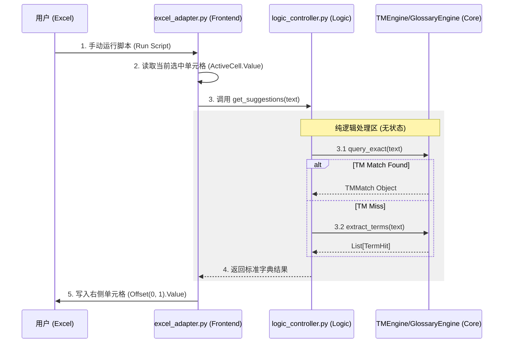

# LocalCAT Phase 3 Spec: Logic Forwarder & Excel Adapter

## 1. 架构目标 (Architecture Goals)
建立一个纯粹的、无状态的“请求-响应”通道，连接 Excel 前端与 Python 后端引擎。
- **Logic Layer**: 仅做数据搬运，不持有状态，不进行业务判断。
- **Frontend Layer (Excel)**: 仅做触发与展示，不处理逻辑。

## 2. 数据流图 (Data Flow)



## 3. API 定义 (API Definition)

### 3.1 LogicController
- **文件**: `logic_controller.py`
- **类**: `LogicController`
- **方法**: `get_suggestions(text: str) -> Dict`
- **输入**: 原始文本字符串。
- **输出**: 一个标准字典，严格镜像 `stress_runner.py` 的输出结构。

```python
# Output Schema
{
    "status": "TM_HIT" | "TERMS_FOUND" | "NO_MATCH",
    "tm_match": {  # Only present if status == "TM_HIT"
        "source": str,
        "target": str,
        "similarity": float
    },
    "terms": [     # Only present if status == "TERMS_FOUND"
        {
            "source": str,
            "target": str,
            "glossary": str,
            "span": [start, end]
        },
        ...
    ]
}
```

### 3.2 ExcelAdapter
- **文件**: `excel_adapter.py`
- **依赖**: `xlwings` (仅此文件允许引入)
- **职责**: 
  1. 获取 Excel 当前活跃应用的选中区域。
  2. 提取文本。
  3. 实例化 `LogicController`。
  4. 获取结果并格式化为字符串。
  5. 将结果写入当前单元格的**右侧一格**。

## 4. 操作规程 (Operation Protocol)

1.  **准备环境**: 打开任意 Excel 文件，在 A 列输入待测文本 (例如 "Glossary Engine")。
2.  **选中**: 鼠标点击选中该单元格。
3.  **触发**: 在终端运行 `python excel_adapter.py`。
4.  **验证**: 观察 B 列是否出现预期的翻译建议或术语提示。

## 5. 约束检查 (Constraints Checklist)
- [ ] `logic_controller.py` 不包含 `import xlwings`。
- [ ] `LogicController` 内部不保存任何 `last_query` 或 `history` 变量。
- [ ] 仅在 `excel_adapter.py` 中处理 Excel 读写异常。
